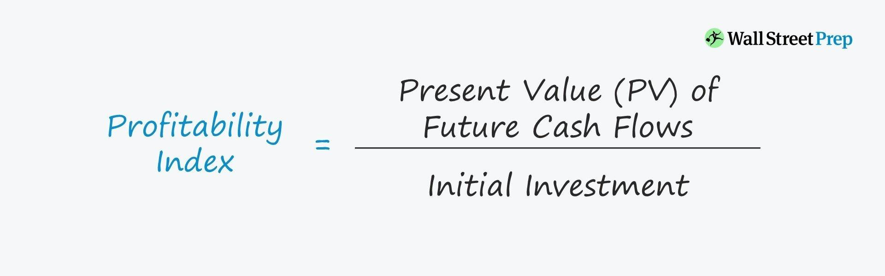

## Table of Contents

## What is the Profitability Index (PI)?

The Profitability Index (PI) is a tool used to measure the attractiveness of an investment. It does this by comparing the present value of future cash flows from an investment to the initial cost of the investment. If the PI is greater than 1, it means the investment is expected to be profitable because the future cash flows are worth more than the initial cost. If the PI is less than 1, the investment is not expected to be profitable.

In simple terms, the PI helps investors decide if a project is worth the money. For example, if you are thinking about starting a new business, you would calculate the PI to see if the money you expect to make in the future is enough to justify the money you need to spend now. This way, you can compare different investment options and choose the one that gives you the best return for your money.

## How is the Profitability Index calculated?

The Profitability Index is calculated by dividing the present value of future cash flows by the initial investment cost. To do this, you first need to figure out how much money the investment will bring in over time. This means adding up all the cash you expect to receive in the future, but you have to adjust these amounts to their present value. That's because money you get in the future is worth less than money you have now, due to things like inflation and the time value of money.

Once you have the present value of all future cash flows, you divide this number by the amount of money you need to spend to start the project. For example, if the present value of future cash flows is $120,000 and the initial investment is $100,000, the PI would be 120,000 divided by 100,000, which equals 1.2. A PI of 1.2 means the investment is expected to be profitable because for every dollar you spend, you get $1.20 back in present value terms.

## Why is the Profitability Index important for investment decisions?

The Profitability Index is important for investment decisions because it helps you figure out if an investment will make you money. When you're thinking about spending money on a new project or business, you want to know if the money you'll get back in the future is worth more than what you're spending now. The PI tells you this by comparing the money you'll get (adjusted for time) to the money you need to spend. If the PI is more than 1, it means the investment should make you money, which is good news.

Using the PI also helps you compare different investment options. Imagine you have two projects you're thinking about. One needs a lot of money upfront but will bring in a lot of money later, and the other needs less money upfront but will bring in less money later. The PI can help you see which one gives you a better return for your money. This way, you can choose the investment that will make you the most profit, making your decision-making process easier and more informed.

## What does a Profitability Index greater than 1 indicate?

A Profitability Index greater than 1 means that the investment is expected to be profitable. It tells you that the money you will get back from the investment, when adjusted for time, is more than what you need to spend to start the project. For example, if the PI is 1.2, for every dollar you spend, you get $1.20 back in present value terms.

This is important because it helps you decide if an investment is worth making. When the PI is over 1, it means the future benefits of the investment are worth more than the initial cost. This makes it a good choice compared to other investments with a PI less than 1, where the future benefits do not outweigh the initial cost.

## How does the Profitability Index compare to other investment appraisal techniques like NPV?

The Profitability Index (PI) and Net Present Value (NPV) are both tools used to decide if an investment is good or not, but they look at the investment in slightly different ways. The PI compares the present value of the money you expect to get from an investment to the money you need to spend to start it. If the PI is more than 1, it means the investment should make you money. On the other hand, NPV calculates the difference between the present value of the cash inflows and the cash outflows. If the NPV is positive, the investment is expected to be profitable.

While both PI and NPV help you see if an investment is worth it, they give you different kinds of information. The PI is really useful when you need to compare different projects that need different amounts of money. It tells you how much bang you get for your buck. NPV, however, tells you the total amount of money you can expect to make or lose from an investment. So, if you want to know the overall profit or loss, you would use NPV, but if you want to compare how efficiently different projects use your money, you would use PI.

## Can the Profitability Index be used for mutually exclusive projects? If so, how?

Yes, the Profitability Index can be used for mutually exclusive projects, which means you can only choose one project out of a few options. When you have to pick one project, you look at the PI of each project. The PI tells you how much money you will get back for every dollar you spend. If you have two projects, and one has a PI of 1.2 and the other has a PI of 1.5, you would pick the one with the PI of 1.5 because it gives you more money back for the same amount of spending.

However, there's something important to remember when using the PI for mutually exclusive projects. The PI might not always tell the whole story. For example, if one project needs a lot more money to start than the other, the one with the higher PI might not be the best choice. So, it's a good idea to also look at other things, like the total amount of money you will make (Net Present Value) and how long it will take to get your money back. By looking at all these things together, you can make a smarter choice about which project to pick.

## What are the limitations of using the Profitability Index?

Using the Profitability Index can help you decide if an investment is good, but it has some problems. One big problem is that the PI doesn't tell you how much total money you will make from the investment. It just tells you how much money you get back for every dollar you spend. This means that if you have two projects, one might have a higher PI but still make less total money than the other project. So, you need to look at other things, like the Net Present Value, to see the whole picture.

Another issue with the PI is that it can be tricky when you're comparing projects that need different amounts of money to start. A project that needs a lot of money might have a lower PI than a smaller project, but it could still be a better choice because it makes more money overall. Also, the PI doesn't take into account how long it will take to get your money back. Sometimes, you might want to get your money back faster, and the PI doesn't help you decide that. So, while the PI is useful, you should use it with other tools to make the best investment choices.

## How does the time value of money affect the Profitability Index?

The time value of money is super important when figuring out the Profitability Index. It means that money you get in the future is worth less than money you have now. So, when you calculate the PI, you need to change all the money you expect to get in the future into what it's worth right now. This is called the present value. If you didn't do this, you might think an investment is better than it really is because you wouldn't be taking into account that money loses value over time.

When you use the time value of money to find the present value of future cash flows, you get a better idea of whether an investment will make you money. If the present value of all the money you'll get is more than what you need to spend to start the project, the PI will be over 1, and the investment looks good. But if you don't adjust for the time value of money, you might end up with a PI that's too high, and you could make a bad choice. So, always remember to think about the time value of money when using the PI to decide on an investment.

## In what scenarios might the Profitability Index give misleading results?

The Profitability Index might give misleading results when you're comparing projects that need different amounts of money to start. Imagine you have two projects. One needs a lot of money but will bring in a lot more money later, and the other needs less money but will bring in less money later. The PI might make the smaller project look better because it shows a higher return for each dollar spent. But, the bigger project might actually make you more money overall. So, if you only look at the PI, you might pick the wrong project.

Another scenario where the PI can be misleading is when you don't take into account how long it will take to get your money back. The PI doesn't care about time; it just tells you how much money you get back for each dollar you spend. But sometimes, you might want to get your money back faster. If you're choosing between two projects and one gives you your money back in a year and the other in five years, the PI might not show that difference. You need to think about how long you're willing to wait for your money, which the PI doesn't help with.

## How can sensitivity analysis be applied to the Profitability Index?

Sensitivity analysis helps you see how changes in different things can affect the Profitability Index. When you do a sensitivity analysis on the PI, you change one thing at a time, like the amount of money you expect to get back from the investment, or the cost of starting the project, or even the [interest rate](/wiki/interest-rate-trading-strategies) used to find the present value. By doing this, you can see how these changes make the PI go up or down. This helps you understand which parts of your investment plan are most important and where you need to be careful.

For example, if you change the expected cash flows a little bit and the PI changes a lot, it means your investment is sensitive to how much money you expect to make. If the PI stays the same when you change the interest rate, then the interest rate isn't that important for your decision. By doing a sensitivity analysis, you can see if your investment plan is strong or if small changes could make it not worth doing. This way, you can make better choices about whether to go ahead with the investment or not.

## What role does the discount rate play in the Profitability Index calculation?

The discount rate is really important when you're figuring out the Profitability Index. It's the number you use to change the money you expect to get in the future into what it's worth right now. This is called the present value. When you're calculating the PI, you take all the money you'll get in the future and use the discount rate to find out how much that money is worth today. If the discount rate is high, the present value of future money goes down, which can make the PI lower. If the discount rate is low, the present value goes up, which can make the PI higher.

So, the discount rate can change how good an investment looks. If you think the investment is risky, you might use a higher discount rate to be careful. This means you're expecting less money back in today's terms, so the PI might not look as good. But if you think the investment is safe, you might use a lower discount rate, making the PI look better. It's important to choose the right discount rate because it can make a big difference in whether you think the investment is worth it or not.

## How can the Profitability Index be adapted for use in capital rationing situations?

In capital rationing situations, you have a limited amount of money to spend on investments, so you need to pick the ones that will give you the most bang for your buck. The Profitability Index can help with this because it tells you how much money you get back for every dollar you spend. When you're choosing which projects to go with, you look at the PI of each one. You pick the projects with the highest PI until you run out of money. This way, you make sure you're using your limited money as efficiently as possible.

But remember, even though the PI is helpful, you need to be careful. Sometimes, a project with a high PI might need a lot of money to start, so you might not be able to do other good projects if you choose it. Also, the PI doesn't tell you the total amount of money you'll make, so you should look at other things like the Net Present Value too. By using the PI along with other tools, you can make smarter choices about which projects to pick when you don't have enough money to do them all.

## What is the Profitability Index and how can it be understood?

The profitability index (PI) serves as a critical evaluative tool in investment analysis by quantifying the relationship between the benefits of an investment project and its initial cost. To ascertain the PI, one divides the present value of anticipated future cash flows by the initial investment. The formula for computing PI can be mathematically represented as:

$$

PI = \frac{\text{Present Value of Future Cash Flows}}{\text{Initial Investment}}
$$

The present value (PV) of future cash flows is calculated using a specific discount rate to determine their value at the current time. This is essential because it accounts for the time value of money—future cash flows are worth less today than in the future. A PI greater than 1.0 signifies a promising investment opportunity, indicating that the project's expected returns surpass the costs involved.

The PI may also be referred to as the value investment ratio (VIR) or profit investment ratio (PIR). Its primary utility lies in its ability to rank and prioritize investment projects, particularly when resource constraints necessitate the selection of specific ventures over others. By using PI, investors can effectively compare disparate projects and make informed decisions based on projected value addition.

## How do you calculate the Profitability Index?

The calculation of the Profitability Index (PI) is fundamental in assessing the relative profitability of investment projects. The PI is derived by evaluating the present value (PV) of expected future cash flows in relation to the initial cost required to embark on the project. Mathematically, the present value can be calculated using the formula:

$$

PV = \frac{CF_1}{(1 + r)^1} + \frac{CF_2}{(1 + r)^2} + ... + \frac{CF_n}{(1 + r)^n} 
$$

where $CF$ denotes the cash flows anticipated in future periods and $r$ represents the discount rate applied to reflect the time value of money. The choice of an appropriate discount rate is crucial as it impacts the present value calculation, influencing the overall assessment of the investment's viability.

The PI is then determined by dividing the present value of these cash flows by the initial investment cost. The formula for the Profitability Index is given by:

$$

PI = \frac{PV}{\text{Initial Investment}} 
$$

A PI greater than 1.0 typically indicates that the project is likely to generate returns exceeding the original cost, thus signaling an attractive investment opportunity. Conversely, a PI less than 1.0 suggests that the project's returns do not justify the initial expenditure, advising caution for potential investors.

In practical applications, the calculation of PI can be implemented using computational tools to facilitate efficient evaluation of multiple investment scenarios. For instance, using Python, one might calculate the PI through the following code snippet:

```python
def calculate_PI(cash_flows, discount_rate, initial_investment):
    present_value = sum(cf / (1 + discount_rate) ** i for i, cf in enumerate(cash_flows, start=1))
    profitability_index = present_value / initial_investment
    return profitability_index

# Example Usage
cash_flows = [1000, 1500, 2000]  # Example cash flows for different periods
discount_rate = 0.10  # Example discount rate of 10%
initial_investment = 3000  # Example initial cost

pi = calculate_PI(cash_flows, discount_rate, initial_investment)
print("Profitability Index (PI):", pi)
```

This code calculates the PI by iterating over a list of projected cash flows, applying the chosen discount rate, and comparing the present value to the initial investment. Such computational approaches enhance precision and expedite the decision-making process in financial analysis.

## What is the interpretation of the Profitability Index?

The profitability index (PI) serves as a crucial metric for investors to quantify the value of an investment, providing a clear and straightforward means to compare a range of projects. PI is calculated as the ratio of the present value of future cash flows to the initial investment, represented mathematically as:

$$
PI = \frac{\text{Present Value of Future Cash Flows}}{\text{Initial Investment}}
$$

A PI equal to or greater than 1.0 indicates that a project is expected to generate value exceeding its costs, understanding which is essential for deciding resource allocation. Projects that meet or exceed this threshold are typically deemed worthwhile, as they promise returns over and above the original stake.

Conversely, projects with a PI of less than 1.0 should generally be avoided, as they signify expected returns that do not suffice to cover the initial investment, thereby posing a risk to financial resources.

While the profitability index is invaluable for assessing investment potential, it is important to recognize its limitations, particularly its lack of consideration for project size. For example, a project with a high PI but small absolute cash flows could be less beneficial than a larger project with a lower PI. Hence, reliance solely on PI might result in suboptimal decision-making.

To incorporate a broader financial perspective, it is advisable to use the profitability index alongside other metrics such as net present value (NPV), internal rate of return (IRR), and the payback period. By doing so, investors gain a comprehensive insight and are better positioned to make informed decisions regarding which projects to undertake. This comprehensive approach ensures a nuanced understanding of potential investments, factoring in scale and other critical financial dimensions.

## References & Further Reading

[1]: ["Financial Modeling and Valuation: A Practical Guide to Investment Banking and Private Equity"](https://books.google.com/books/about/Financial_Modeling_and_Valuation.html?id=lf7WAgAAQBAJ) by Paul Pignataro

[2]: Sharpe, W. F. (1966). ["Mutual Fund Performance."](https://www.jstor.org/stable/pdf/2351448.pdf) Journal of Business, Vol. 39, No. 1, pp. 119-138

[3]: Chan, E. P. (2009). ["Quantitative Trading: How to Build Your Own Algorithmic Trading Business."](https://github.com/ftvision/quant_trading_echan_book) Wiley Trading.

[4]: Bodie, Z., Kane, A., & Marcus, A. J. (2017). ["Investments"](https://www.mheducation.com/highered/product/investments-bodie-kane/M9781264412662.html) (11th ed.). McGraw-Hill Education.

[5]: Narang, R. K. (2013). ["Inside the Black Box: A Simple Guide to Quantitative and High Frequency Trading."](https://onlinelibrary.wiley.com/doi/book/10.1002/9781118662717) Wiley.