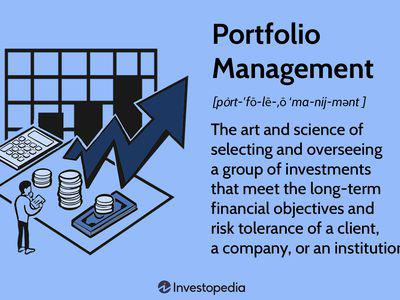

The world of investing offers various strategies to cater to different types of investors. For those looking for simplicity and minimal maintenance, the couch-potato portfolio is an attractive option. This passive investing strategy is designed to require minimal oversight, making it ideal for individuals who prefer not to constantly monitor the market. Unlike active investment strategies, which rely on frequent buy and sell decisions in an attempt to outperform the market, the couch-potato approach focuses on long-term growth and stability through low-cost index funds. By emphasizing a balanced asset allocation and routine rebalancing, it simplifies wealth management for people with limited time or interest in financial markets. This article examines the couch-potato portfolio strategy, compares it to other passive investments, and explores the role of algorithmic trading in enhancing returns. Through understanding the benefits and limitations of this strategy, investors can determine if it aligns with their financial goals and risk tolerance.

## Table of Contents



## What is a Couch-Potato Portfolio?

A couch-potato portfolio is an indexing investment strategy focused on efficiency and minimal maintenance, catering to investors who prefer a straightforward approach. This strategy was conceptualized by financial columnist Scott Burns as a means to simplify investment decisions and minimize the time commitment required for managing a portfolio. The primary method involves constructing a balanced portfolio with an equal split between equities and bonds.

The core of a couch-potato portfolio is the 50/50 allocation between stocks and bonds. This allocation is designed to combine the potential for growth provided by equities with the relative stability offered by bonds. Equities, such as stocks, generally offer higher long-term returns but come with increased volatility. Conversely, bonds tend to be more stable and can provide a buffer against market fluctuations. By maintaining this balance, the portfolio aims to reduce overall volatility while still achieving satisfactory growth.

This investing strategy is particularly well-suited to those who favor a 'set-it-and-forget-it' approach. Once the initial setup is complete, the portfolio requires minimal oversight, typically only needing adjustments during an annual rebalancing to maintain the intended 50/50 allocation. This rebalancing ensures that the portfolio remains aligned with the investor's risk tolerance and financial goals over time. The couch-potato portfolio thus represents a practical solution for individuals seeking a low-maintenance, cost-effective investment strategy.

## Building a Couch-Potato Portfolio

A couch-potato portfolio is characterized by its straightforward approach to asset allocation, typically involving an equal distribution between stock and bond indices. The basic structure of such a portfolio aims to achieve a balance between growth and stability, effectively managing risk while minimizing the need for active oversight.

To construct a couch-potato portfolio, investors often start by allocating 50% of their investment funds to a broad stock index, such as the S&P 500. This choice provides exposure to the largest publicly traded companies in the United States, offering a robust potential for capital appreciation. The other 50% of the portfolio is typically invested in a bond index, such as the Bloomberg US Aggregate Bond Index, which offers income generation and helps mitigate the [volatility](/wiki/volatility-trading-strategies) of equities.

For those looking to implement this strategy, mutual funds or exchange-traded funds (ETFs) that track these indices are popular options. For instance, the Vanguard 500 Index Fund or its [ETF](/wiki/etf-trading-strategies) equivalent, the Vanguard S&P 500 ETF (VOO), can be used for the equity portion. Similarly, the Vanguard Total Bond Market Index Fund or the Vanguard Total Bond Market ETF (BND) can serve the fixed-income allocation. These funds provide diversified exposure at a low cost, aligning well with the principles of the couch-potato portfolio.

Annual rebalancing is a crucial aspect of maintaining the intended allocation ratio in a couch-potato portfolio. Over time, disparities in the performance of stocks and bonds might cause the portfolio to deviate from the initial 50/50 split. Rebalancing involves readjusting the proportions, often by selling a portion of the asset class that has grown disproportionately and using the proceeds to buy more of the underperforming asset class. This process not only realigns the portfolio but also enforces a disciplined approach to 'buy low, sell high.'

In summary, building a couch-potato portfolio involves choosing appropriate stock and bond indices and maintaining the set allocation through periodic rebalancing. This methodical framework offers investors a stable foundation for pursuing long-term financial goals with minimal intervention.

## Couch-Potato Portfolio Performance

The Couch-Potato Portfolio, characterized by its equal allocation between stocks and bonds, has proven itself to be a robust investment strategy, particularly during periods of market instability. This strategy's historical performance underscores its ability to weather economic downturns while offering a reliable long-term return profile.

One of the most compelling demonstrations of the Couch-Potato Portfolio's resilience occurred during the bear market from 2000 to 2002. During this period, the technology bubble burst, leading to significant losses in equity markets. However, the balanced nature of the Couch-Potato Portfolio—which typically involves allocating 50% to equities, such as a broad market index like the S&P 500, and 50% to bonds, such as the Bloomberg US Aggregate Bond Index—offered a cushion against these market shocks. The bond component provided stability, mitigating the more substantial losses experienced by an all-equity portfolio like the S&P 500. This protective feature illustrates the risk-reducing benefits of diversification inherent in the Couch-Potato strategy.

Despite its conservative construction, the Couch-Potato Portfolio generally provides steady returns over the long term, often outperforming many actively managed portfolios that incur higher costs and require constant oversight. The simplicity of the strategy aligns with the efficient market hypothesis, where the lower costs associated with passive management play a crucial role in enhancing net returns over time.

However, a trade-off exists; during bull markets when equities experience rapid growth, the more conservative Couch-Potato Portfolio may underperform compared to portfolios with a higher equity concentration. This lag is an expected consequence of the strategy's half bond allocation, which emphasizes risk reduction and capital preservation over maximizing gains during bullish phases.

Overall, the Couch-Potato Portfolio offers a strategic balance between risk and return, making it an appealing choice for investors favoring a disciplined, stable investment approach over the pursuit of higher yet more volatile returns. This strategy's consistent performance, especially during challenging market conditions, provides peace of mind with its focus on minimizing volatility.

## Passive Investing and Algorithmic Trading

Passive investing is a strategy characterized by its focus on achieving long-term growth through minimal market intervention. One prominent example of a passive investing approach is the couch-potato portfolio, which is designed to maintain a balanced allocation between equities and bonds with minimal oversight. The goal is to capture the overall market's growth while minimizing the effort and complexities associated with managing investments.

Algorithmic trading offers enhancements for passive investing strategies by automating various portfolio management tasks, such as rebalancing. Rebalancing is crucial for maintaining the desired asset allocation in a portfolio as market conditions fluctuate. By implementing algorithmic solutions, investors can ensure their portfolios are consistently aligned with their target allocations without the need for manual adjustment. 

An algorithmically-driven rebalancing process can be implemented using mathematical models and predefined rules. These systems monitor the portfolio’s performance and reallocate assets accordingly. For example, consider a Python script that uses NumPy for mathematical operations and pandas for handling data to automate the rebalancing process.

```python
import numpy as np
import pandas as pd

# Assume we have a DataFrame with the current portfolio weights and desired weights
# Example DataFrame structure:
# Portfolio: [50, 50] representing 50% stocks, 50% bonds
# Desired: [50, 50] representing the desired target allocation

def rebalance_portfolio(current_values, desired_weights):
    total_value = np.sum(current_values)

    desired_values = total_value * np.array(desired_weights) / 100
    difference = desired_values - current_values

    transactions = -difference / 2  # Divide by 2 assuming equal transaction to meet target
    return transactions

current_portfolio = pd.Series([50000, 50000], index=['stocks', 'bonds'])
desired_allocation = [50, 50]
transactions = rebalance_portfolio(current_portfolio, desired_allocation)

print("Rebalance transactions (buy/sell):")
print(transactions)
```

Through automation, [algorithmic trading](/wiki/algorithmic-trading) can improve the efficiency of the couch-potato portfolio while adhering to its core principle of passive management. This integration minimizes the time and effort required by investors and removes emotional biases from decision-making, ensuring a consistent investment strategy. Algorithmic solutions support the underlying philosophy of passive investing by enhancing the ability to maintain a stable portfolio allocation over time.

## Advantages and Disadvantages

The primary advantage of the couch-potato portfolio is its inherent simplicity and low cost. By relying on a passive investment strategy, investors avoid the active management fees associated with traditional portfolio management, leading to significant cost savings over time. This simplicity is not only attractive to novice investors but also appeals to those with limited time to focus on adjusting their investments frequently. 

A potential drawback of the couch-potato portfolio is its tendency to underperform during strong market upswings. Portfolios with a higher allocation to equities can capitalize more effectively on bullish markets, capturing greater returns than the more conservative couch-potato strategy. This disparity is particularly evident when the proportion of equities in a portfolio exceeds the balanced 50/50 allocation between stocks and bonds typical of the couch-potato approach. 

Despite these limitations, the couch-potato portfolio remains appealing for investors prioritizing stability and ease of management. Its balanced allocation between equities and bonds reduces volatility, providing a smoother investment experience over economic cycles. For individuals wary of the emotional and financial turbulence that can accompany more aggressive strategies, the couch-potato portfolio offers a reliable and cost-effective investment path.

## Conclusion

The couch-potato portfolio remains a popular choice among investors seeking a hands-off, cost-effective approach to investing. Its appeal lies in its simplicity and minimal maintenance requirements, offering an accessible strategy for both novice and experienced investors. While it may not deliver market-beating returns every year, its ability to minimize volatility and provide consistent growth over time makes it a reliable choice for those prioritizing stability.

The approach's passive nature aligns well with modern trends in investing, where reducing emotional decision-making and management costs are key considerations. Its structure, typically involving a balanced allocation between equities and bonds, harnesses the growth potential of equities while using bonds to stabilize the portfolio's value during volatile market conditions.

Furthermore, the potential for algorithmic enhancements offers an exciting avenue for those interested in maintaining or refining their couch-potato strategy. Through algorithmic trading, portfolio rebalancing can be automated, ensuring the asset allocation stays on target with minimal manual involvement, maintaining the strategy's essence of simplicity.

Overall, for investors valuing a passive strategy with potential technological enhancements, the couch-potato portfolio offers a practical and time-tested method to achieve investment goals with reduced risk and effort.

## References & Further Reading

[1]: Burns, S. (2003). ["Couch Potato Portfolio Annual Update."](https://www.lazyportfolioetf.com/allocation/scott-burns-couch/) 

[2]: Bogle, J. C. (1999). ["Common Sense on Mutual Funds: New Imperatives for the Intelligent Investor."](https://archive.org/details/commonsenseonmut0000bogl) John Wiley & Sons.

[3]: ["The Little Book of Common Sense Investing: The Only Way to Guarantee Your Fair Share of Stock Market Returns"](https://www.amazon.com/Little-Book-Common-Sense-Investing/dp/1119404509) by John C. Bogle

[4]: Swedroe, L. E., & Grogan, J. (2008). ["The Only Guide to a Winning Investment Strategy You'll Ever Need: The Way Smart Money Invests Today."](https://www.barnesandnoble.com/w/the-only-guide-to-a-winning-investment-strategy-youll-ever-need-larry-e-swedroe/1100626261) St. Martin's Griffin.

[5]: Housel, M. (2020). ["The Psychology of Money: Timeless Lessons on Wealth, Greed, and Happiness."](https://www.amazon.com/Psychology-Money-Timeless-lessons-happiness/dp/0857197681) Harriman House.