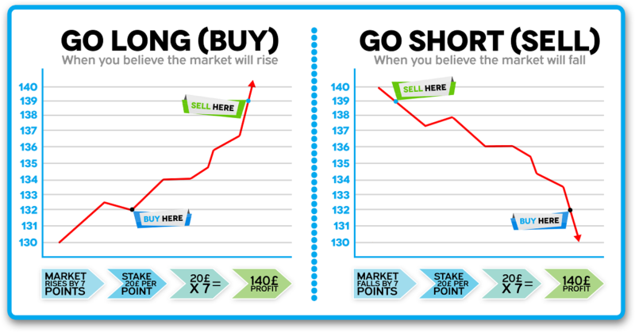

## Table of Contents

## What is spread betting and how does it work?

Spread betting is a way to bet on whether the price of something, like a stock or a sports team's score, will go up or down. Instead of betting a fixed amount on a win or loss, you bet on how much the price will change. For example, if you think a football team's score will be higher than what the bookmaker predicts, you bet on the 'buy' side. If you think it will be lower, you bet on the 'sell' side.

When you place a spread bet, you decide how much money you want to bet per point of movement in the price. If the price moves in your favor, you make money. If it moves against you, you lose money. The amount you win or lose depends on how much the price changes and how much you bet per point. It's important to be careful because losses can be bigger than your initial bet if the price moves a lot against you.

## What are the basic principles of profitability in spread betting?

The basic principle of profitability in spread betting is to correctly predict the movement of the price of the asset you are betting on. If you think the price will go up, you bet on the 'buy' side. If you think it will go down, you bet on the 'sell' side. The more the price moves in the direction you predicted, the more money you can make. However, if the price moves the opposite way, you will lose money. The key is to have a good understanding of the market or event you are betting on, so you can make smart predictions.

Another important principle is managing your risk. Spread betting can be risky because your potential losses can be bigger than your initial bet if the price moves a lot against you. To manage this risk, you need to set limits on how much you are willing to lose and use tools like stop-loss orders. A stop-loss order automatically closes your bet if the price reaches a certain level, helping to limit your losses. By balancing your potential profits with the risks, you can aim to be profitable in spread betting over time.

## How can a beginner start spread betting and manage risks effectively?

To start spread betting as a beginner, first choose a reputable spread betting provider. These companies offer platforms where you can place bets on different markets like stocks, [forex](/wiki/forex-system), or sports. Once you've picked a provider, open an account and deposit some money. It's a good idea to start with a small amount until you get comfortable. Next, learn about the markets you want to bet on. For example, if you're interested in football, study the teams and their performance. Then, decide if you think the price will go up or down and place your bet accordingly. Remember, you can bet on the 'buy' side if you think the price will rise, or the 'sell' side if you think it will fall.

Managing risks effectively is crucial in spread betting because losses can be bigger than your initial bet. One way to manage risk is by setting a stop-loss order, which automatically closes your bet if the price reaches a level you set, helping to limit your losses. Another important strategy is to only bet with money you can afford to lose. Don't bet with money you need for bills or other important things. Also, consider betting smaller amounts until you gain more experience. It's helpful to keep learning about the markets and improving your strategies over time. By being careful and managing your risks well, you can enjoy spread betting while protecting your money.

## What are the common financial instruments used in spread betting?

Spread betting often involves betting on the price movements of stocks. When you bet on stocks, you are guessing if the price of a company's stock will go up or down. For example, if you think a tech company's stock will rise because they just released a popular new product, you might bet on the 'buy' side. If you think the stock will fall because the company is facing problems, you might bet on the 'sell' side. Stocks are popular in spread betting because there are so many companies to choose from, and their prices can change a lot.

Another common financial instrument in spread betting is forex, which stands for foreign exchange. Forex betting involves guessing how the value of one country's currency will change compared to another country's currency. For example, if you think the US dollar will get stronger against the British pound, you might bet on the 'buy' side for the dollar. If you think the dollar will get weaker, you might bet on the 'sell' side. Forex is popular because currencies are always changing in value, and there's a lot of trading happening all the time.

Other instruments used in spread betting include commodities like gold or oil, and indices like the FTSE 100 or the S&P 500. Commodities are things you can touch, like gold, which people often bet on because their prices can change a lot due to things like supply and demand. Indices are collections of stocks, like the FTSE 100, which is made up of the 100 biggest companies in the UK. Betting on an index means you're betting on the overall performance of a group of stocks. These different instruments give spread bettors many options to choose from, depending on what they think will happen in the markets.

## How do leverage and margin affect profitability in spread betting?

Leverage and margin can make spread betting more profitable but also riskier. Leverage means you can bet with more money than you actually have in your account. For example, if you have $100 and use 10 times leverage, you can bet as if you have $1,000. This can lead to bigger profits if the price moves the way you predicted. But it also means bigger losses if the price goes the other way. So, leverage can make your money grow faster, but it can also make it disappear faster if you're wrong.

Margin is the money you need to put down to open a leveraged bet. It's like a deposit. If you want to bet with leverage, you only need to have a small part of the total bet amount in your account as margin. This makes it easier to start betting with more money, but it also means you need to keep an eye on your bets. If the price moves against you too much, you might get a margin call, where you need to add more money to your account to keep the bet open. If you can't add more money, your bet might be closed automatically, leading to a loss. So, managing leverage and margin carefully is important for staying profitable in spread betting.

## What are the key strategies for maximizing profits in spread betting?

To maximize profits in spread betting, it's important to do a lot of research and understand the markets you are betting on. Look at things like company news for stocks, economic reports for forex, or team performance for sports. The more you know, the better your guesses will be about where prices are going. Also, try to spread your bets across different markets. This way, if one bet loses money, another might make money, helping to balance things out. It's like not putting all your eggs in one basket.

Another key strategy is to use stop-loss and take-profit orders. A stop-loss order automatically closes your bet if the price goes against you too much, helping to limit your losses. A take-profit order closes your bet when you've made a certain amount of profit, so you don't miss out on gains if the price suddenly changes. Managing your money well is also crucial. Only bet with money you can afford to lose, and think about betting smaller amounts at first until you get the hang of it. By combining good research, spreading your bets, and using smart orders, you can aim to make more money in spread betting.

## How does market volatility impact spread betting outcomes?

Market [volatility](/wiki/volatility-trading-strategies) means how much and how quickly prices change. When the market is very volatile, prices can go up and down a lot in a short time. This can be good for spread betting because if you guess right, you can make more money quickly. But it's also riskier because if you guess wrong, you can lose money faster too. So, when the market is volatile, you need to be careful and watch your bets closely.

Volatility can also make it harder to predict what will happen next. If prices are moving a lot, it can be tough to know if they will keep going up or down. This means you need to do more research and maybe use stop-loss orders to protect your money. By understanding how much the market might move, you can adjust your bets to try and make the most profit while keeping your risks under control.

## What are the tax implications of profits from spread betting?

In the UK, one of the big advantages of spread betting is that you don't have to pay tax on your profits. This means if you make money from spread betting, you keep all of it without having to give any to the tax office. This is different from other types of investing or gambling where you might have to pay capital gains tax or income tax on your winnings.

However, tax rules can change and might be different in other countries. If you live outside the UK, it's a good idea to check the tax laws in your country. Even in the UK, it's smart to keep records of your spread betting activities just in case the tax rules change or if you need to show where your money came from.

## How can advanced technical analysis improve spread betting performance?

Advanced technical analysis can help you make better spread betting choices by looking at past price data to spot patterns and trends. By studying things like charts and using tools like moving averages or the Relative Strength Index (RSI), you can guess where prices might go next. For example, if you see a pattern that usually means prices will go up, you might decide to bet on the 'buy' side. This kind of analysis helps you make more informed guesses, which can lead to more winning bets and bigger profits.

However, it's important to remember that technical analysis isn't perfect. Markets can be unpredictable, and even the best patterns don't always work. That's why it's good to use technical analysis along with other strategies, like keeping an eye on news or using stop-loss orders to manage your risks. By combining different methods, you can make smarter bets and improve your chances of making money in spread betting.

## What role does fundamental analysis play in profitable spread betting?

Fundamental analysis is all about looking at the basic factors that can affect the price of something you're betting on. For spread betting, this means studying things like a company's earnings, the health of the economy, or even news events that could change how people see a stock or a currency. If you think a company will do well because it's making more money or launching a new product, you might bet that its stock price will go up. By understanding these fundamentals, you can make better guesses about where prices are headed, which can help you make more profitable bets.

Using [fundamental analysis](/wiki/fundamental-analysis) can also help you spot opportunities that others might miss. For example, if you see that a company's stock is going down but their earnings are still strong, you might think the price will go back up soon. This can give you a chance to bet on the 'buy' side before the price starts to rise again. Combining fundamental analysis with other strategies, like technical analysis or keeping an eye on market news, can make your spread betting more successful by giving you a fuller picture of what's happening in the markets.

## How can one use algorithmic trading to enhance spread betting profitability?

Algorithmic trading can help you make more money from spread betting by using computer programs to find and place bets automatically. These programs can look at lots of data really quickly, much faster than a person can. They can spot patterns or trends in the market and make bets based on these patterns. This means you can take advantage of small price movements that might be hard to catch if you were betting by hand. Plus, algorithms can keep betting 24/7, so you don't miss out on opportunities when you're not watching the market.

Using [algorithmic trading](/wiki/algorithmic-trading) also helps you stick to your betting plan without letting feelings get in the way. Sometimes, people might make bad bets because they're feeling too excited or too worried. But an algorithm follows the rules you set up, so it won't make bets based on emotions. This can lead to more consistent betting and better results over time. Just remember, while algorithms can be a big help, they're not perfect. You still need to keep an eye on them and make sure they're working well with the market conditions.

## What are the psychological factors that influence decision-making in spread betting?

When you're spread betting, your feelings can really affect the choices you make. If you're feeling too excited or too sure about a bet, you might take bigger risks than you should. This can lead to big losses if things don't go your way. On the other hand, if you're feeling scared or worried, you might not take good opportunities because you're too afraid of losing money. It's important to keep your emotions in check and stick to your betting plan, even when the market is moving a lot.

Another thing that can mess with your spread betting is something called FOMO, or the fear of missing out. If you see prices going up quickly, you might jump into a bet without thinking it through, just because you don't want to miss out on the gains. But this can lead to bad decisions and losses if the price suddenly changes direction. To do well in spread betting, it's helpful to stay calm, do your research, and not let your feelings push you into making bets you might regret later.

## References & Further Reading

[1]: Bergstra, J., Bardenet, R., Bengio, Y., & Kégl, B. (2011). ["Algorithms for Hyper-Parameter Optimization."](https://papers.nips.cc/paper/4443-algorithms-for-hyper-parameter-optimization) Advances in Neural Information Processing Systems 24.

[2]: ["Advances in Financial Machine Learning"](https://www.amazon.com/Advances-Financial-Machine-Learning-Marcos/dp/1119482089) by Marcos Lopez de Prado

[3]: ["Evidence-Based Technical Analysis: Applying the Scientific Method and Statistical Inference to Trading Signals"](https://www.amazon.com/Evidence-Based-Technical-Analysis-Scientific-Statistical/dp/0470008741) by David Aronson

[4]: ["Machine Learning for Algorithmic Trading"](https://github.com/stefan-jansen/machine-learning-for-trading) by Stefan Jansen

[5]: ["Quantitative Trading: How to Build Your Own Algorithmic Trading Business"](https://www.amazon.com/Quantitative-Trading-Build-Algorithmic-Business/dp/1119800064) by Ernest P. Chan