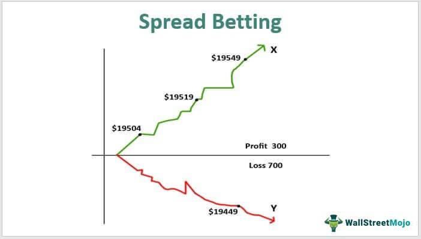

Spread betting involves speculating on the price movements of financial instruments, allowing traders to profit from both rising and falling markets without actually owning the underlying assets. This method appeals to many traders due to its potential for high returns, tax efficiencies, and the ability to leverage positions. By predicting the direction of price movements accurately, traders can take either a long or a short position, thus enhancing potential profitability through precise market analysis and risk management.

On the other hand, algorithmic trading (algo trading) is a technology-driven approach that utilizes complex algorithms to execute trades automatically based on pre-established criteria. This method leverages advanced algorithms to analyze vast amounts of market data, identify patterns, and execute trades with speed and precision that humans cannot achieve manually. Popular algo trading strategies, such as trend-following and statistical arbitrage, offer distinct advantages by minimizing human bias and optimizing trade execution.



This article aims to explore the convergence of trading strategies as they pertain to spread betting and algo trading. The interplay of these methods can lead to enhanced trading performance and increased potential profitability. By comprehensively understanding these concepts, traders can develop sophisticated strategies that capitalize on market opportunities effectively. This knowledge is crucial for traders seeking to improve their trading outcomes through innovative approaches that integrate both traditional and technological elements.

## Table of Contents

## Understanding Spread Betting

Spread betting is a trading strategy that involves speculating on the price movement of financial instruments, such as stocks, indices, commodities, or currencies, without the trader actually owning the underlying asset. This method allows individuals to take advantage of both rising and falling markets by entering either a long (buy) or short (sell) position based on their prediction of future market movements.

In spread betting, traders are concerned with the bid-ask spread, which is the difference between the buy price and the sell price quoted. The magnitude of the position taken determines the size of the bet. For instance, a trader might bet $10 per point on a stock index that starts at 5000 points. If the index moves to 5020, the trader nets $200 (20 points movement × $10 per point).

The profitability of spread betting is contingent upon the accuracy of the trader's price predictions and their ability to manage associated risks. Accurate predictions depend on a thorough analysis of market trends, indicators, and news events that could affect price movements. This necessitates the use of technical analysis tools and chart patterns to evaluate market data and forecast likely price directions. 

Moreover, effective risk management is crucial in spread betting due to the inherently leveraged nature of this trading approach. Leverage amplifies both potential gains and possible losses, making it vital for traders to employ strategies like stop-loss orders to limit potential downturns. A stop-loss order sets a predetermined price level at which a position is automatically closed to prevent further losses. For example, if a trader sets a stop-loss order at 4980 for the earlier example, the position would be closed automatically if the index falls to this level, minimizing potential losses.

Besides potential profitability, spread betting offers tax efficiencies in certain jurisdictions. In the UK, for example, profits from spread betting are typically exempt from capital gains tax, making it an attractive option for investors seeking tax optimization. However, tax rules may vary, and traders should consult with tax experts to understand the implications in their respective regions.

To engage in successful spread betting, traders need a well-structured plan that encompasses market analysis, capital management, and risk mitigation. This involves identifying favorable market conditions, understanding the influence of geopolitical and economic factors on price movements, and adapting strategies accordingly. As market dynamics are continuously evolving, traders must remain vigilant and informed to make sound decisions and capitalize on market opportunities.

## Concept of Algo Trading

Algorithmic trading, commonly known as algo trading, involves the use of computer algorithms to execute trades based on predefined rules and conditions. This approach significantly enhances trading efficiency by minimizing human intervention and leveraging computational power to assess large quantities of market data. The core of algo trading lies in its ability to make rapid decisions by analyzing real-time data, identifying trends, and executing trades automatically when certain conditions are met.

One of the primary strategies employed in [algorithmic trading](/wiki/algorithmic-trading) is trend-following. This strategy involves algorithms that monitor market trends and execute trades aligned with the prevailing direction, whether bullish or bearish. Trend-following can be formulated using simple or exponential moving averages, which help in identifying [momentum](/wiki/momentum) and thus making informed trading decisions.

Statistical [arbitrage](/wiki/arbitrage) is another popular strategy in algorithmic trading. It involves identifying price discrepancies in correlated securities and executing trades to exploit these inefficiencies. By using statistical models, algorithms can detect temporary mispricing between related financial instruments, leading to opportunities for profit through simultaneous buying and selling actions.

Market-making is a strategy where the algorithm places buy and sell orders simultaneously to capitalize on the bid-ask spread. Market-making algorithms are programmed to respond to market conditions quickly, ensuring [liquidity](/wiki/liquidity-risk-premium) and narrowing spreads while making profits on small price differences.

Algo trading brings several advantages to traders, including speed, accuracy, and the ability to backtest strategies. Speed is crucial in financial markets, where the rapid execution of trades can make the difference between profit and loss. Algorithms can execute orders in fractions of a second, far faster than a human trader. This speed ensures that trading opportunities are capitalized upon as soon as they arise.

Backtesting, another advantage, allows traders to test their strategies on historical data before deploying them in live markets. This practice helps in refining strategies and minimizing potential risks by analyzing how they would have performed in the past.

Moreover, algo trading reduces emotional bias, a common issue in manual trading. Emotions such as fear and greed can negatively impact trading decisions. Algorithms, on the other hand, operate based on logic and predefined rules, ensuring consistency and objectivity in executing strategies.

In conclusion, algorithmic trading is a powerful tool in the modern financial landscape, allowing traders to execute efficient, data-driven strategies that can adapt to diverse market conditions. By automating trading decisions and enhancing execution speed, algo trading offers significant advantages, making it an essential component of contemporary financial markets.

## Profitability in Trading Strategies

Trading strategies are designed to take advantage of market inefficiencies to generate profits. The profitability of these strategies is influenced by various factors, including market conditions, strategy selection, risk management, and execution timing.

Market conditions play a critical role in determining the success of a trading strategy. For instance, volatile markets may present more opportunities for profit, but they also come with increased risks. In contrast, stable markets might require more conservative strategies but offer consistent, albeit smaller, profits.

The selection of a trading strategy is another essential component. Strategies can be broadly categorized into technical analysis, where traders use historical price and [volume](/wiki/volume-trading-strategy) data to predict future movements, and [fundamental analysis](/wiki/fundamental-analysis), which involves evaluating a security's intrinsic value through economic data and financial statements. The choice of strategy should align with the trader's risk tolerance and market understanding. For example, trend-following strategies, which attempt to capitalize on market momentum, might work well during strong market trends but can fail in choppy markets.

Risk management is vital to ensure long-term sustainability and profitability. Effective risk management involves setting appropriate stop-loss levels, using position sizing to control exposure, and diversifying across different markets or instruments. The goal is to minimize losses while maximizing gains, ensuring that a small number of unsuccessful trades do not wipe out profits from successful ones.

Execution timing can significantly impact the outcome of a trade. In fast-moving markets, even a slight delay in execution can lead to adverse outcomes. Algorithmic trading can improve execution timing by automatically placing trades at predetermined conditions, thus reducing the delay between signal generation and trade execution. Algorithms like the following can be used to optimize timing by ensuring trades are executed at the most favorable moments:

```python
import datetime

def execute_trade(trade_signal, market_data):
    """ Execute a trade based on a signal and market data. """
    current_time = datetime.datetime.now()
    # Check if the trade signal is valid and execute
    if trade_signal and market_data['price'] < market_data['target']:
        # Execute trade here
        print(f"Trade executed at {current_time}")
    else:
        print("No trade executed")

# Example usage
trade_signal = True
market_data = {'price': 100, 'target': 105}
execute_trade(trade_signal, market_data)
```

Spread betting and algorithmic trading (algo trading) can both be utilized individually or together to refine trading strategies and enhance profitability. Spread betting allows traders to profit from both rising and falling markets without owning the actual securities, benefiting from potential tax efficiencies in certain jurisdictions. On the other hand, algo trading, with its speed and precision, helps in [backtesting](/wiki/backtesting) strategies and reducing the emotional bias that often plagues human traders.

When combined, spread betting and algo trading provide a comprehensive toolkit for traders. Automated algorithms can identify optimal entry and [exit](/wiki/exit-strategy) points, while spread betting provides flexibility in market exposure without additional transaction costs. Together, they enable a strategic approach that can improve the balance between risk and reward, leveraging market trends and data analysis for better trading outcomes.

## Integrating Spread Betting and Algo Trading

Integrating spread betting with algorithmic trading creates a cutting-edge trading framework that capitalizes on the strengths of both approaches. Algorithmic trading enhances the execution of spread betting strategies by automating trades based on predefined conditions, thereby improving accuracy and response times. This integration enables traders to refine their strategies by optimizing entry and exit points, which are crucial for maximizing profits and minimizing potential losses.

Automation through algorithms allows traders to respond swiftly to market movements, reducing the likelihood of human error and emotional bias. By setting specific parameters for triggering trades, algorithms ensure that trading strategies are executed consistently, maintaining discipline even in volatile market conditions.

Furthermore, this combination helps in managing risks more effectively. Algo trading can incorporate risk management techniques such as stop-loss orders and position sizing, ensuring that trades are executed only under favorable conditions. This automated approach to managing risks aligns well with the leveraged nature of spread betting, offering a comprehensive risk mitigation framework.

The synergy between spread betting and algo trading not only optimizes trading performance but also increases the potential for profitability. When coupled, these methods allow for continuous market monitoring and rapid execution, ensuring that traders can capitalize on fleeting market opportunities. By leveraging the technological advantages of algorithmic trading, spread bettors can systematically analyze large datasets, identify patterns, and execute strategies with unparalleled speed and precision.

In conclusion, the integration of spread betting and algorithmic trading systems empowers traders to create a dynamic trading strategy that adapts to both predicted and unforeseen market conditions. This strategic fusion embodies the evolution of modern trading, where automation meets market speculation, driving increased accuracy, efficiency, and ultimately, profitability.

## Challenges and Risks

Both spread betting and algorithmic trading (algo trading) present significant challenges and risks that traders need to manage to maintain profitability. These risks stem primarily from market [volatility](/wiki/volatility-trading-strategies), unpredictable price movements, and technical issues that can arise during trade execution.

**Market Volatility and Prediction Errors**: Market volatility is a double-edged sword for traders. While it provides opportunities for profit, it also increases the risk of incorrect predictions. Spread betting is particularly sensitive to these predictions as it involves speculating on price movements without owning the asset. A misjudgment in the direction or extent of a price move can lead to significant financial losses. Algo trading also faces risks when algorithms, which are designed based on historical data, fail to adapt to sudden market disruptions or unanticipated market events.

**Technical Failures**: Algo trading relies heavily on technology, making it susceptible to technical failures that can result in incorrect trades or missed trading opportunities. Issues such as server downtimes, network lags, or software bugs can disrupt trading activities. In spread betting, while less reliant on complex technology, technical issues like platform outages can still affect traders' ability to execute timely trades.

**Risk Management Strategies**: Effective risk management is crucial for mitigating these challenges. Diversification, or spreading bets across different assets, can reduce exposure to the adverse movement of any single asset. Stop-loss orders, which automatically close a position when it reaches a certain level of loss, help limit losses. In both trading methods, leverage control is vital to avoid overexposing one's account to market movements. Excessive leverage can amplify losses, making its management crucial to maintain long-term trading viability.

**Continuous Monitoring and Adjustment**: Markets are inherently dynamic, requiring traders to continuously monitor market conditions and adjust their strategies accordingly. For algo traders, this might involve tweaking algorithm parameters or integrating new market indicators to capture emerging trends. Spread betting traders must stay updated with macroeconomic indicators, earning reports, or any event that might impact market sentiment. Adapting strategies promptly ensures alignment with current market conditions and enhances the potential for profitability.

In conclusion, while both spread betting and algo trading offer lucrative opportunities, they come with inherent risks. A disciplined approach to risk management, along with robust monitoring systems, is essential for maintaining profitability in these trading environments.

## Conclusion

Trading strategies that incorporate spread betting and algorithmic trading (algo trading) offer diverse avenues for profitability due to their unique and complementary strengths. By understanding the distinct advantages and limitations of each approach, traders can devise robust trading plans that leverage the best of both worlds. Spread betting, with its speculative nature on price movements, allows traders to capitalize on market opportunities without the need for asset ownership. Conversely, algo trading provides speed, precision, and the ability to execute complex strategies through automation.

The key to optimizing trading outcomes lies in continuous learning, thorough backtesting, and strategic adjustments based on market dynamics. Backtesting enables traders to evaluate the performance of their strategies using historical data, ensuring that their approaches are both effective and resilient under various market conditions. This iterative process of refinement allows the identification and calibration of the variables that influence trading decisions, such as entry and exit points or risk tolerance levels.

Moreover, strategic adjustments are essential for maintaining the relevance and effectiveness of a trading plan. As market conditions evolve, so too must the strategies that traders employ. This adaptability ensures that trading practices remain aligned with current market realities and potential disruptions.

Ultimately, with careful planning and execution, traders can harness the combined power of spread betting and algo trading for sustained success. By integrating these methods, traders can optimize risk management, maintain discipline, and achieve a balanced approach to capturing market opportunities. The synergy between speculative engagement and automated execution provides a comprehensive framework to enhance trading performance and profitability over the long term.

## References & Further Reading

[1]: Bergstra, J., Bardenet, R., Bengio, Y., & Kégl, B. (2011). ["Algorithms for Hyper-Parameter Optimization."](https://papers.nips.cc/paper/4443-algorithms-for-hyper-parameter-optimization) Advances in Neural Information Processing Systems 24.

[2]: ["Advances in Financial Machine Learning"](https://www.amazon.com/Advances-Financial-Machine-Learning-Marcos/dp/1119482089) by Marcos Lopez de Prado

[3]: ["Evidence-Based Technical Analysis: Applying the Scientific Method and Statistical Inference to Trading Signals"](https://www.amazon.com/Evidence-Based-Technical-Analysis-Scientific-Statistical/dp/0470008741) by David Aronson

[4]: ["Machine Learning for Algorithmic Trading"](https://github.com/stefan-jansen/machine-learning-for-trading) by Stefan Jansen

[5]: ["Quantitative Trading: How to Build Your Own Algorithmic Trading Business"](https://www.amazon.com/Quantitative-Trading-Build-Algorithmic-Business/dp/1119800064) by Ernest P. Chan