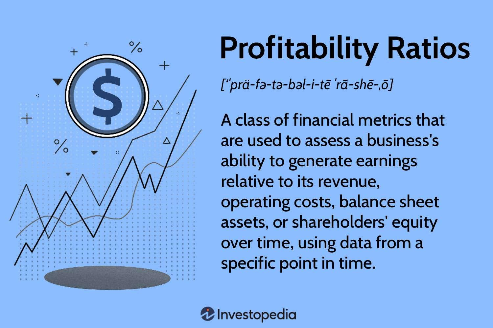

Profitability ratios and financial metrics are vital instruments in both business analysis and algorithmic trading. These tools are crucial for evaluating the financial health of a business, helping investors and analysts determine how efficiently a company generates profit relative to its revenue, assets, and equity. For instance, a higher return on assets (ROA) indicates that a company is more efficient at managing its assets to produce earnings.

Algorithmic trading employs these metrics to assess and refine trading strategies. In this type of trading, buy and sell orders are automatically executed based on pre-defined criteria, often leveraging advanced quantitative models. The implementation of profitability and financial metrics allows traders to gain insights into expected returns, associated risks, and the overall performance of trading strategies. This data-driven approach helps in optimizing trading algorithms to maximize returns and manage risk effectively.



This article examines various profitability ratios, illustrating their significance in understanding a company's financial standing and their utility in the context of algorithmic trading. By offering a comprehensive overview, this discussion aims to equip investors and business analysts with the necessary knowledge to make informed decisions and enhance strategy development.

## Table of Contents

## Understanding Profitability Ratios

Profitability ratios are essential financial metrics that evaluate a company's efficiency in generating profits relative to various aspects of its financial structure, such as revenue, assets, equity, and operating costs. These ratios serve as indicators of a company's financial performance and competitive position, offering insights into how effectively a business is managing its resources compared to its peers.

### Margin Ratios

Margin ratios are a subset of profitability ratios focusing on the proportion of revenue converted into profit. They highlight the efficiency with which a company controls its expenditures relative to revenue. Key margin ratios include:

1. **Gross Margin**: This ratio represents the percentage of revenue that exceeds the cost of goods sold (COGS). It is calculated as:
$$
   \text{Gross Margin} = \left( \frac{\text{Revenue} - \text{COGS}}{\text{Revenue}} \right) \times 100

$$

   A higher gross margin indicates better control over production costs and the ability to maintain pricing power.

2. **Operating Margin**: Reflecting operational efficiency, the operating margin shows the percentage of revenue remaining after covering variable production costs. It is given by:
$$
   \text{Operating Margin} = \left( \frac{\text{Operating Income}}{\text{Revenue}} \right) \times 100

$$

   This ratio provides insights into how effectively a company is managed and its ability to generate profit from core business activities.

3. **Net Profit Margin**: This metric illustrates a company's ability to convert revenue into net profit after accounting for all expenses, including taxes and interest. It is expressed as:
$$
   \text{Net Profit Margin} = \left( \frac{\text{Net Income}}{\text{Revenue}} \right) \times 100

$$

   A robust net profit margin indicates strong overall financial health and effective expense management.

### Return Ratios

Return ratios assess how well a company utilizes its assets and equity to produce profit, focusing on value generation for shareholders and efficient resource use.

1. **Return on Assets (ROA)**: This ratio measures the effectiveness of a company's use of its assets to generate profit, calculated as:
$$
   \text{ROA} = \left( \frac{\text{Net Income}}{\text{Total Assets}} \right) \times 100

$$

   Higher ROA values suggest more efficient use of assets in generating earnings.

2. **Return on Equity (ROE)**: Indicating financial leverage efficiency, ROE measures the profitability generated from shareholders' equity. It is defined by:
$$
   \text{ROE} = \left( \frac{\text{Net Income}}{\text{Shareholder's Equity}} \right) \times 100

$$

   High ROE values are typically indicative of effective equity utilization to drive profits.

Profitability ratios collectively offer a comprehensive view of a company's financial health, operational efficiency, and competitive position in the market. For investors, these ratios assist in making informed investment decisions by evaluating a company's capability to generate sustainable profits and create value over the long term.

## Importance of Profitability Ratios in Business Analysis

Profitability ratios are essential tools in business analysis as they provide critical insights into a business’s financial health and operational efficiency. These ratios help analysts identify areas of strength and weakness within a company, enabling more informed decision-making regarding investments and strategic initiatives. By examining profitability ratios, stakeholders can assess whether a company effectively utilizes its resources to generate profit, ensuring its long-term viability and growth potential.

One of the primary benefits of profitability ratios is their ability to guide investment decisions. Analysts use these ratios to evaluate a company’s performance over time, comparing it against previous financial periods to identify trends and patterns. This historical analysis helps in assessing the trajectory of a company’s profitability, offering clues about the success or failure of past business strategies. For example, if a company’s net profit margin is consistently increasing, it may indicate improvements in cost management or pricing strategies, making it an attractive investment opportunity.

Profitability ratios also allow for comparison against industry benchmarks, providing a measure of a company’s competitive standing. By benchmarking ratios like gross margin, operating margin, and net profit margin against industry averages, companies can determine how well they fare compared to their peers. A higher-than-average gross margin, for instance, might suggest superior control over production costs, while a low operating margin could highlight inefficiencies in managing operational expenses.

Furthermore, profitability ratios aid in identifying internal weaknesses that may otherwise go unnoticed. For instance, a declining return on equity (ROE) can signal issues in effectively leveraging shareholder funds. By pinpointing such weaknesses, managers can implement corrective measures, such as restructuring debt or optimizing operational processes, to enhance overall profitability.

In summary, profitability ratios serve as crucial indicators of a company's financial and operational performance. By facilitating both historical analysis and industry comparison, these metrics empower businesses to make strategic decisions aimed at improving profitability and maintaining a competitive edge in the marketplace.

## Key Profitability Ratios in Focus

Profitability ratios are vital indicators of a company's financial performance and provide insights into various operational factors. Here we will focus on key profitability ratios: Gross Margin, Operating Margin, Net Profit Margin, Return on Assets (ROA), and Return on Equity (ROE).

### Gross Margin

Gross Margin is a measure of the percentage of revenue that exceeds the cost of goods sold (COGS). It is calculated as:

$$
\text{Gross Margin} = \left( \frac{\text{Revenue} - \text{COGS}}{\text{Revenue}} \right) \times 100
$$

This ratio reveals how efficiently a company controls its production costs and can be used to assess how well it converts sales into gross profit. A higher gross margin indicates better control over production expenses, which suggests a competitive advantage or pricing power in the market.

### Operating Margin

Operating Margin reflects the percentage of revenue remaining after covering variable production costs. This indicator is crucial for evaluating a company's operational efficiency. It is calculated as:

$$
\text{Operating Margin} = \left( \frac{\text{Operating Income}}{\text{Revenue}} \right) \times 100
$$

Operating income includes revenues after subtracting operating expenses—such as wages, depreciation, and cost of goods sold. A higher operating margin suggests better operational efficiency and cost management, often translating to higher profitability potential.

### Net Profit Margin

Net Profit Margin is indicative of a company's ability to convert revenue into actual net profit. This metric accounts for all expenses, taxes, and costs involved in the business. It is computed as follows:

$$
\text{Net Profit Margin} = \left( \frac{\text{Net Income}}{\text{Revenue}} \right) \times 100
$$

The metric provides a comprehensive view of a company's financial health by indicating how much profit is generated from each dollar of revenue. A higher net profit margin suggests a company is more efficient at converting sales into real profit.

### Return on Assets (ROA)

Return on Assets measures how efficiently a company uses its assets to generate profit. It is an essential metric for understanding asset efficiency and operational proficiency. The formula for ROA is:

$$
\text{ROA} = \frac{\text{Net Income}}{\text{Total Assets}}
$$

ROA provides insights into how well a company's management is utilizing resources for profitability. A higher ROA indicates more efficient management of assets to produce income.

### Return on Equity (ROE)

Return on Equity evaluates how effectively a company uses shareholders' equity to produce profit. It is a critical measure of financial performance from the equity holder's perspective. The formula for ROE is:

$$
\text{ROE} = \frac{\text{Net Income}}{\text{Shareholder's Equity}}
$$

ROE is instrumental for investors as it reflects the efficiency of equity usage in generating net income. A higher ROE suggests a firm is effective at converting the invested capitals into profits, appealing more to potential investors.

These profitability ratios are not only fundamental for analyzing a company's financial health but also for comparing performance with industry peers. Each ratio provides unique insights into various aspects of financial operations, aiding investors and analysts in making informed decisions.

## Profitability Ratios in Algorithmic Trading

In [algorithmic trading](/wiki/algorithmic-trading), evaluating the performance of trading algorithms is critical to ensure profitability and sustainability. Profitability ratios serve as key indicators to assess the efficacy of these algorithms in generating returns. A primary metric used is the Profit Factor, defined as the ratio of gross profits to gross losses. It provides a direct measure of the profitability of a trading strategy. A Profit Factor greater than 1.0 indicates that the strategy is profitable, with higher values signifying better performance.

Another essential metric is the Sharpe Ratio, which evaluates the risk-adjusted return of an investment. It is calculated using the formula:

$$
\text{Sharpe Ratio} = \frac{R - R_f}{\sigma}
$$

where $R$ represents the expected return of the algorithm, $R_f$ is the risk-free rate of return, and $\sigma$ denotes the standard deviation of the algorithm's excess return. A higher Sharpe Ratio suggests that the strategy yields greater returns per unit of risk, making it a critical metric for risk management.

Maximum Drawdown is another significant metric, quantifying the largest peak-to-trough decline in a trading account's equity curve over a specific period. It offers insights into the strategy's risk profile by highlighting potential losses an investor might face. Managing drawdown is vital for maintaining the sustainability of a trading strategy, as extensive drawdowns can deter investors and erode confidence in an algorithm's viability.

These profitability ratios and metrics aid traders and investors in comprehending the trade-offs between risk and return. Through these metrics, strategies can be fine-tuned to optimize returns while minimizing exposure to risks. By evaluating these metrics continually, traders can adapt and improve their algorithms to remain competitive and profitable in dynamic market conditions.

## Key Metrics for Evaluating Algorithmic Trading

The evaluation of algorithmic trading strategies necessitates a precise understanding of key performance metrics to optimize risk and returns. Among these metrics, the Sharpe Ratio, Maximum Drawdown, Win Rate, and Profit Factor are pivotal in assessing the effectiveness and risk profile of a trading strategy.

The **Sharpe Ratio** quantifies the risk-adjusted return of a trading strategy. It is calculated as:

$$
\text{Sharpe Ratio} = \frac{\text{Average Return} - \text{Risk-Free Rate}}{\text{Standard Deviation of Return}}
$$

This metric indicates how much excess return is achieved per unit of [volatility](/wiki/volatility-trading-strategies). A higher Sharpe Ratio is desirable as it implies better risk-adjusted performance. For example, if a trading strategy has an average return of 15% with a risk-free rate of 3% and a standard deviation of 10%, the Sharpe Ratio would be 1.2. This suggests the strategy provides 1.2 units of return for each unit of risk taken.

The **Maximum Drawdown** measures the greatest peak-to-trough decline over a specific period for a strategy. It reflects the potential downside risk and is essential for understanding the risk profile. A substantial drawdown might indicate vulnerability during market downturns. It is calculated by finding the largest difference between a portfolio's peak value and its lowest point:

$$
\text{Maximum Drawdown} = \frac{\text{Trough Value} - \text{Peak Value}}{\text{Peak Value}}
$$

For instance, if a strategy's portfolio value falls from \$100,000 to \$70,000, the maximum drawdown is 30%. This metric helps traders understand the amount of potential loss during distress periods.

**Win Rate** is the ratio of profitable trades to the total number of trades and is given by:

$$
\text{Win Rate} = \frac{\text{Number of Winning Trades}}{\text{Total Number of Trades}}
$$

A higher win rate suggests a strategy that frequently produces profit. However, it should be considered with other metrics like Profit Factor. A strategy with a high win rate but low profit per successful trade might not be desirable.

The **Profit Factor** evaluates the relationship between gross profits and gross losses. It is calculated as:

$$
\text{Profit Factor} = \frac{\text{Total Gross Profit}}{\text{Total Gross Loss}}
$$

A Profit Factor greater than 1 indicates that the strategy is profitable on balance. For example, a profit [factor](/wiki/factor-investing) of 1.5 suggests that the gross profits are 1.5 times the gross losses.

In summary, the integration of Sharpe Ratio, Maximum Drawdown, Win Rate, and Profit Factor enables an in-depth evaluation of algorithmic trading strategies, ensuring that decisions are based on comprehensive risk-return profiles. These metrics together guide traders in refining strategies to achieve optimal performance while managing risk effectively.

## Integrating Profitability Ratios with Algorithmic Trading Strategies

Integrating profitability ratios into the evaluation of algorithmic trading strategies is crucial for ensuring that these strategies remain both profitable and sustainable under different market conditions. These financial metrics provide valuable insights that inform traders of the performance and risk profile of their trading algorithms. 

Backtesting, a fundamental process in the development of algorithmic trading strategies, involves simulating a trading strategy using historical data to evaluate its performance. By incorporating profitability ratios into [backtesting](/wiki/backtesting), traders can assess the potential effectiveness of their strategies. The continuous monitoring of these ratios during live trading allows for real-time adjustments, ensuring the strategy remains adaptable to current market dynamics. For example, a trading algorithm with a consistently declining Return on Assets (ROA) during live operations might suggest inefficient capital utilization, prompting the trader to revise asset allocation or stop-loss mechanisms.

The use of profitability ratios is also essential for risk management. Metrics such as the Sharpe Ratio help in understanding the risk-adjusted returns of a strategy. By analyzing the Sharpe Ratio alongside other profitability metrics, traders can better estimate whether the returns justify the risk undertaken by the algorithm. This becomes particularly important in volatile markets where the risk of large drawdowns can threaten the overall viability of a strategy.

### Python Example: Backtesting and Integrating Profitability Ratios

Consider a simple Python script that performs a backtest on a given strategy and computes basic profitability metrics:

```python
import pandas as pd
import numpy as np

# Hypothetical backtest results
data = {'returns': np.random.normal(0.001, 0.02, 252)}  # daily returns
df = pd.DataFrame(data)

# Calculate profitability metrics
def calculate_annualized_return(returns):
    return np.prod(1 + returns) ** (252 / len(returns)) - 1

def calculate_sharpe_ratio(returns, risk_free_rate=0.01):
    excess_returns = returns - risk_free_rate / 252
    return (np.mean(excess_returns) / np.std(excess_returns)) * np.sqrt(252)

annualized_return = calculate_annualized_return(df['returns'])
sharpe_ratio = calculate_sharpe_ratio(df['returns'])

print(f"Annualized Return: {annualized_return:.2%}")
print(f"Sharpe Ratio: {sharpe_ratio:.2f}")
```

In this script, a backtest generates random daily returns, simulating the performance of an algorithmic strategy. The annualized return and Sharpe Ratio are computed to assess the strategy’s profitability and risk-adjusted performance. These metrics provide a reference point for evaluating whether adjustments are needed to optimize the strategy or reduce risk exposure.

By continuously assessing profitability ratios, traders can fine-tune their algorithms, enhancing their performance while simultaneously minimizing risk. This ongoing process allows for the development of robust and resilient trading strategies that continue to perform optimally across varying market environments.

## Conclusion

Profitability ratios and financial metrics are fundamental in assessing both business performance and the effectiveness of algorithmic trading strategies. These tools provide insights that are invaluable for making informed investment decisions, enabling investors and traders to identify opportunities and mitigate risks effectively. By evaluating profitability ratios such as gross margin, operating margin, and return on assets, businesses and investors gain a clearer picture of financial health and operational efficiency.

In the context of algorithmic trading, metrics such as the Sharpe Ratio, Profit Factor, and Maximum Drawdown offer a quantitative basis for assessing the risk-return profile of trading strategies. These metrics are essential for developing strategies that not only pursue profitability but also ensure sustainability across varying market conditions.

As the financial landscape continues to evolve with technological advancements and market complexities, the integration of profitability metrics with business and trading strategies will become increasingly important. These metrics provide a data-driven approach to adapt and optimize strategies, ensuring that they remain robust and resilient. The ongoing incorporation of financial performance metrics is crucial for thriving in both traditional business environments and cutting-edge trading ecosystems, highlighting their enduring relevance in strategic decision-making.

## References & Further Reading

[1]: ["Valuation: Measuring and Managing the Value of Companies"](https://www.amazon.com/Valuation-Measuring-Managing-Companies-Finance/dp/1119610885) by McKinsey & Company Inc. and Tim Koller

[2]: Fama, E. F., & French, K. R. (1992). ["The Cross-Section of Expected Stock Returns."](https://onlinelibrary.wiley.com/doi/full/10.1111/j.1540-6261.1992.tb04398.x) The Journal of Finance, 47(2), 427-465.

[3]: Basu, S. (1977). ["Investment Performance of Common Stocks in Relation to Their Price-Earnings Ratios: A Test of the Efficient Market Hypothesis."](https://www.jstor.org/stable/2326304) The Journal of Finance, 32(3), 663-682.

[4]: Jegadeesh, N., & Titman, S. (1993). ["Returns to Buying Winners and Selling Losers: Implications for Stock Market Efficiency."](https://www.jstor.org/stable/2328882) The Journal of Finance, 48(1), 65-91.

[5]: ["The Intelligent Investor: The Definitive Book on Value Investing"](https://www.amazon.com/Intelligent-Investor-Definitive-Investing-Essentials/dp/0060555661) by Benjamin Graham

[6]: ["Financial Analytics with R: Building a Laptop Laboratory for Data Science"](https://assets.cambridge.org/97811071/50751/frontmatter/9781107150751_frontmatter.pdf) by Mark J. Bennett and Dirk L. Hugen

[7]: Morris, C. (2013). ["Algorithmic Trading in Practice with MATLAB"](https://www.reddit.com/r/algotrading/comments/jye0bj/literature/) John Wiley & Sons.