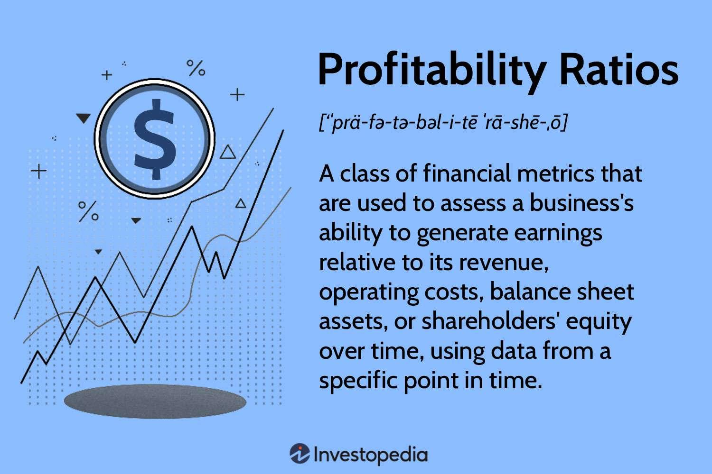

The world of finance is complex, but one of the key aspects that investors and analysts focus on is the financial health of companies. Profitability ratios provide a critical lens through which to evaluate how well a business is generating profits in relation to its revenue, assets, equity, or other financial metrics. These ratios serve as essential tools in assessing a company's operational efficiency and financial strength, offering insights that are valuable for multiple stakeholders, including investors, analysts, and corporate management.

In this article, we will explore how profitability ratios contribute to company evaluation, impact corporate valuation, and are utilized in algorithmic trading strategies. By examining these ratios, investors can glean essential information needed to make well-informed decisions about potential investments, enabling them to better assess the risk and return associated with a particular company. The insights offered by profitability ratios can spell the difference between choosing a rewarding investment and overlooking critical financial red flags.



Understanding these ratios is vital. They encompass key metrics such as the Gross Profit Margin, Operating Profit Margin, Net Profit Margin, Return on Assets (ROA), and Return on Equity (ROE). Each ratio provides a unique perspective on the financial state and performance of a business. For instance, the Gross Profit Margin illuminates the cost efficiency in producing goods, while ROE presents insights into how effectively a company is utilizing shareholders' equity to generate profits.

As we navigate through this article, we will discuss the main types of profitability ratios, their significance, and their relevance in various financial scenarios. By doing so, we aim to equip readers with the knowledge to assess corporate performance, thereby enhancing their ability to pursue profitable outcomes through well-grounded financial strategies.

## Table of Contents

## Understanding Profitability Ratios

Profitability ratios are essential financial metrics that evaluate a company's ability to generate profit relative to its revenue, operating costs, or balance sheet metrics. These ratios provide valuable insights into different facets of financial performance, helping stakeholders understand how effectively a company employs its resources to produce earnings.

### Key Profitability Ratios

1. **Gross Profit Margin**: This ratio indicates the proportion of revenue that exceeds the cost of goods sold (COGS). It is calculated as:
$$
   \text{Gross Profit Margin} = \left( \frac{\text{Revenue} - \text{COGS}}{\text{Revenue}} \right) \times 100

$$

   A higher gross profit margin suggests that the company efficiently manages its production or procurement processes.

2. **Operating Profit Margin**: Also known as the operating margin, it measures the percentage of revenue left after covering operating expenses. The formula is:
$$
   \text{Operating Profit Margin} = \left( \frac{\text{Operating Income}}{\text{Revenue}} \right) \times 100

$$

   This ratio reflects the company’s operational efficiency and cost management effectiveness.

3. **Net Profit Margin**: This ratio demonstrates the percentage of revenue that remains as net income after all expenses, including taxes and interest, are deducted. It is calculated as:
$$
   \text{Net Profit Margin} = \left( \frac{\text{Net Income}}{\text{Revenue}} \right) \times 100

$$

   It offers a comprehensive look at profitability, taking into account all facets of operations, financing, and fiscal discipline.

4. **Return on Assets (ROA)**: ROA evaluates how profitable a company is relative to its total assets. It is expressed as:
$$
   \text{ROA} = \left( \frac{\text{Net Income}}{\text{Total Assets}} \right) \times 100

$$

   This ratio is indicative of how efficiently management utilizes its assets to generate earnings.

5. **Return on Equity (ROE)**: This ratio measures a company’s ability to generate profits from shareholders' equity. The formula is:
$$
   \text{ROE} = \left( \frac{\text{Net Income}}{\text{Shareholders' Equity}} \right) \times 100

$$

   ROE provides insight into how well a company uses investments to grow earnings.

### Significance of Analyzing Profitability Ratios

By analyzing profitability ratios, investors and analysts can gauge a company's financial health and performance efficiency. These ratios enable comparisons with industry norms and competitors, highlighting areas of strength and potential weaknesses. They also help in understanding the effectiveness of management strategies and operational practices in generating sustainable profits.

Understanding these ratios equips investors with the knowledge to make informed decisions regarding potential investments, assessing not just current financial performance but also the company's ability to maintain profitability in the future.

## Profitability Ratios in Company Evaluation

Company evaluation involves a comprehensive analysis of its financial health and growth potential. Profitability ratios provide a quantitative measure of financial efficiency, serving as a key indicator of a company's capability to sustain operations profitably over time. These ratios reflect various dimensions of a business's financial performance, such as its ability to convert sales into actual profit, manage expenses in relation to revenue, and utilize assets effectively.

Key profitability ratios often used in company evaluations include the gross profit margin, operating profit margin, net profit margin, return on assets (ROA), and return on equity (ROE). Each of these ratios offers a unique insight:

1. **Gross Profit Margin**: This ratio measures the percentage of revenue that exceeds the cost of goods sold (COGS). It is calculated as:
$$
   \text{Gross Profit Margin} = \left( \frac{\text{Revenue} - \text{COGS}}{\text{Revenue}} \right) \times 100

$$
   A higher gross profit margin suggests a company is efficiently producing its goods or services relative to its sales.

2. **Operating Profit Margin**: This reflects the percentage of revenue left after covering operating expenses, excluding interest and taxes. It is computed as:
$$
   \text{Operating Profit Margin} = \left( \frac{\text{Operating Income}}{\text{Revenue}} \right) \times 100

$$
   This ratio indicates how well a company manages its operating expenses.

3. **Net Profit Margin**: This ratio calculates the percentage of profit remaining from total revenues after all expenses, including taxes and interest, have been subtracted. It is given by:
$$
   \text{Net Profit Margin} = \left( \frac{\text{Net Income}}{\text{Revenue}} \right) \times 100

$$
   A high net profit margin denotes effective cost management and strong operational performance.

4. **Return on Assets (ROA)**: This metric assesses how effectively a company uses its assets to generate earnings. It is calculated as:
$$
   \text{ROA} = \frac{\text{Net Income}}{\text{Total Assets}} \times 100

$$
   Higher ROA values are indicative of efficient asset utilization.

5. **Return on Equity (ROE)**: This ratio measures a company's ability to generate profits from shareholders' equity. It is expressed as:
$$
   \text{ROE} = \frac{\text{Net Income}}{\text{Shareholders' Equity}} \times 100

$$
   A higher ROE indicates robust financial performance and effective management in generating returns on investment.

Comparing these profitability ratios against industry benchmarks or competitors can highlight a company's competitive position, spotlighting strengths and vulnerabilities. For instance, a company with a higher than industry average net profit margin may indicate superior business operations or pricing strategies. Conversely, a low ROA compared to peers might suggest inefficiencies in asset management, prompting deeper investigation into asset turnover or operational bottlenecks.

In addition to assessing financial metrics, profitability ratios also reveal insights into management effectiveness and operational excellence. Consistently high profitability ratios often reflect strategic decision-making, efficient resource allocation, and overall economic resilience. Conversely, low profitability might prompt investigations into potential areas for improvement, such as cost reduction or revenue enhancement strategies.

In conclusion, integrating profitability ratios into company evaluation not only facilitates a nuanced understanding of a business's financial conditions but also aids in strategic planning and competitive benchmarking, ultimately driving informed investment decisions.

## Impact on Corporate Valuation

Corporate valuation often relies on a detailed analysis of a company's financial statements, with profitability ratios serving as key indicators of its financial health and future potential. These ratios, such as the Gross Profit Margin, Operating Profit Margin, Net Profit Margin, Return on Assets (ROA), and Return on Equity (ROE), provide crucial insights into how effectively a company can convert revenues into profits. 

Investors and analysts primarily use profitability ratios to estimate a company's market value and its potential for future earnings. A company with high profitability ratios generally suggests robust management and operational efficiency, which may translate into a stronger market position. For instance, the Net Profit Margin, calculated as:

$$
\text{Net Profit Margin} = \frac{\text{Net Income}}{\text{Revenue}} \times 100
$$

indicates the percentage of revenue that remains as profit after all expenses are deducted. A higher Net Profit Margin suggests superior cost management and pricing strategy, often leading to increased investor confidence and potentially higher valuation multiples. 

Similarly, the Return on Equity (ROE), which measures a company's ability to generate profit from its shareholders' equity, is calculated as follows:

$$
\text{ROE} = \frac{\text{Net Income}}{\text{Shareholder's Equity}} \times 100
$$

A high ROE can serve as an indicator of effective resource management, enhancing a company's attractiveness to investors.

Conversely, low profitability ratios may signal inefficiencies or potential operational risks, prompting investors to reassess the company's growth prospects. These insights are critical when comparing a company against its industry peers or evaluating acquisition and investment opportunities.

Profitability ratios also play an integral role in valuation methods such as the Discounted Cash Flow (DCF) and Comparables Analysis. In DCF analysis, future cash flows are projected and discounted back to their present value, with profitability ratios influencing these projections and discount rates:

$$
\text{DCF} = \sum \left( \frac{CF_t}{(1 + r)^t} \right)
$$

where $CF_t$ is the expected cash flow at time $t$, and $r$ is the discount rate. A company exhibiting high profitability ratios may project healthier cash flows, thus enhancing its DCF valuation.

During Comparables Analysis, profitability ratios help establish valuation multiples like the Price-to-Earnings (P/E) ratio, facilitating direct comparison with similar entities in the market:

$$
\text{P/E Ratio} = \frac{\text{Market Value per Share}}{\text{Earnings per Share (EPS)}}
$$

Higher profitability often results in superior market valuations as investors are willing to pay a premium for companies with consistent earnings performance. Therefore, profitability ratios are indispensable in determining a company's valuation and assessing its competitive position within the industry.

## Role in Algorithmic Trading

Algorithmic trading utilizes technology to automate the execution of trading strategies, often based on data-driven analysis. Profitability ratios, such as the Net Profit Margin, Return on Assets (ROA), and Return on Equity (ROE), are integral to these strategies. These ratios provide essential insights into a company's financial health, enabling algorithmic traders to identify potential investment opportunities or market anomalies.

The implementation of profitability ratios in quantitative models allows traders to analyze vast quantities of financial data efficiently. For instance, the Return on Equity (ROE) can be calculated as:

$$
\text{ROE} = \frac{\text{Net Income}}{\text{Shareholder's Equity}}
$$

Ratios like ROE are significant indicators of profitability, shedding light on how well a company generates profits from its shareholders' investments. High ROE values may indicate that a company efficiently uses its equity base to enhance earnings, suggesting a lucrative investment opportunity.

In [algorithmic trading](/wiki/algorithmic-trading), these financial ratios become critical components of predictive models. Using programming languages like Python, traders can integrate profitability ratios into trading algorithms. For example, a simplified Python code snippet utilizing profitability ratios for stock evaluation could be:

```python
import pandas as pd

def evaluate_stock(stock_data):
    stock_data['ROE'] = stock_data['Net Income'] / stock_data['Shareholders Equity']
    potential_stocks = stock_data[stock_data['ROE'] > threshold]
    return potential_stocks

# stock_data is a DataFrame containing financial metrics
# threshold is a predefined value for ROE
```

In this example, a dataset containing financial metrics is processed to compute the ROE for various stocks. The algorithm filters stocks surpassing a certain ROE threshold, identifying potential investments. This automation significantly enhances decision-making speed and accuracy, aligning trading actions with market conditions and profitability expectations.

Algorithmic traders may also use these financial ratios to detect market inefficiencies. By continuously monitoring and incorporating these ratios, algorithms can spot discrepancies between current stock prices and expected valuations. This continuous analysis across multiple stocks and financial metrics ensures that algorithmic trading strategies are not just reactive but anticipative of market trends.

In conclusion, the integration of profitability ratios within algorithmic trading systems transforms raw financial data into actionable investment decisions. These ratios streamline the decision-making process, allowing traders to act rapidly on profitable opportunities while mitigating risks associated with market imperfections.

## Conclusion

Profitability ratios are essential tools for investors and analysts seeking to understand and evaluate a company's financial health. These ratios provide insight into how efficiently a company is operating and its ability to generate profits from its assets, equity, and revenue. By leveraging profitability ratios, stakeholders can assess a company's operational success, offering a snapshot of its financial performance.

In addition to assessing operational efficiency, profitability ratios play a significant role in determining corporate valuation. High profitability ratios often correlate with strong valuations as they signal robust earnings potential and efficient management practices. These ratios are integral components of valuation methodologies such as Discounted Cash Flow (DCF) analysis and Comparables Analysis, providing a quantitative basis for estimating a company’s market value and future earnings potential.

Moreover, in the sphere of algorithmic trading, profitability ratios are invaluable. Algorithms integrated with these financial metrics enable automated trading decisions, reacting swiftly to market conditions. By serving as indicators of investment opportunities or market anomalies, profitability ratios contribute to the development of quantitative models aimed at predicting stock movements or identifying undervalued stocks.

As the business environment and financial markets continue to evolve, profitability ratios remain crucial for investors, analysts, and traders. Mastery of these metrics enables stakeholders to make informed financial decisions, ultimately guiding them towards more profitable investment outcomes. Understanding profitability ratios equips one with the knowledge to navigate the complexities of financial analysis and corporate valuation successfully, ensuring robust financial decision-making processes.

## References & Further Reading

[1]: Penman, S. H. (2009). ["Financial Statement Analysis and Security Valuation."](https://www.amazon.com/Financial-Statement-Analysis-Security-Valuation/dp/0073379662) McGraw-Hill Education.

[2]: Damodaran, A. (2012). ["Investment Valuation: Tools and Techniques for Determining the Value of Any Asset."](https://books.google.com/books/about/Investment_Valuation.html?id=5SRHAAAAQBAJ) Wiley Finance.

[3]: Graham, B., & Dodd, D. (1934). ["Security Analysis: The Classic 1934 Edition."](https://www.mhprofessional.com/security-analysis-the-classic-1934-edition-9780070244962-usa) McGraw-Hill Education.

[4]: Farrell, J. L. (1985). ["Analyzing Profitability."](https://www.tandfonline.com/doi/full/10.1080/23311975.2024.2399747) Financial Analysts Journal, 41(6), 65-73.

[5]: Easton, P., McAnally, M. L., Sommers, G. A., Zhang, X. J., & Fairfield, P. M. (2018). ["Financial & Managerial Accounting for MBAs."](https://www.amazon.com/Financial-Statement-Analysis-Valuation-Easton/dp/1618533606) 6th edition, Cambridge Business Publishers.