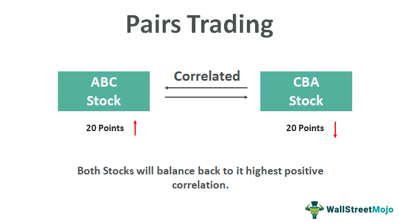

In the fast-paced world of finance, investors are constantly seeking out strategies that combine high returns with low risk. Pairs trading has risen as a prominent strategy that appeals to investors due to its market-neutral position, a quality which ensures that it remains unaffected by broader market fluctuations. This approach capitalizes on temporary price deviations between similar securities, typically assets that are highly correlated, betting on the notion that such divergences are temporary and will revert to their mean. The strategy involves taking a long position on one asset while simultaneously shorting another within the same industry, thus effectively hedging against market volatility.

The increasing sophistication of algorithmic trading has significantly impacted the potential of pairs trading. Automated trading systems can analyze and execute trades much faster than human traders, thereby optimizing the timing and accuracy of trade entries and exits. These systems can swiftly identify opportunities based on real-time data and historical price movements, allowing investors to capitalize on fleeting discrepancies in asset prices. By minimizing the emotional decision-making inherent in human trading and relying on predetermined algorithms, the risk of making impulsive or irrational decisions is substantially reduced. As such, algorithmic trading has not only streamlined the execution of pairs trading strategies but has also increased their profitability and appeal to a broader investor base.



This article examines the profitability of pairs trading and explores how the integration of algorithmic trading serves as a transformative tool for investors. By remaining neutral to the market direction and leveraging price inefficiencies, investors are better positioned to achieve steady returns.

## Table of Contents

## What Is Pairs Trading?

Pairs trading is a straightforward trading strategy wherein an investor goes long on one asset while simultaneously shorting another, usually within the same industry or sector. The underlying principle hinges on the assumption that both assets have a highly correlated price movement, and any temporary deviation in their price relationship will revert to the mean over time. This approach aims to exploit short-term discrepancies in relative pricing which eventually correct themselves.

A key characteristic of pairs trading is its market-neutral stance. This means that the strategy is not significantly affected by broader market movements, making it particularly appealing in volatile market environments. Instead of relying on the direction of the overall market, pairs trading focuses on the relative performance between the two selected assets. 

The efficiency of this strategy lies in its reliance on statistical arbitrage and mean reversion. Let’s consider two stocks, Stock A and Stock B, which generally move together due to their high correlation. If Stock A begins to outperform Stock B beyond historical norms, a pairs trader may interpret this as a temporary mispricing. The trade would involve shorting Stock A (betting that its price will decrease) and going long on Stock B (betting that its price will increase), anticipating a return to the historical price pattern. 

Mathematically, the strategy often employs statistical models to quantify the relationship between the two assets, using indicators such as the spread (difference in their price) and standard deviations to identify trading opportunities. The Z-score, a statistical measure that describes a value's relation to the mean of a group of values, can be calculated to determine entry and [exit](/wiki/exit-strategy) points:

$$
Z = \frac{(\text{Spread} - \text{Mean of Spread})}{\text{Standard Deviation of Spread}}
$$

A Z-score of zero indicates that the assets are trading at their mean spread, while extreme positive or negative Z-scores signal potential opportunities for mean reversion.

Pairs trading is celebrated for its capacity to generate returns that are not contingent on the direction of the market itself, thus providing a diversifying strategy in an investor's portfolio. However, successful implementation requires careful statistical analysis to select robust pairs and monitor correlations, as market conditions and asset relationships can evolve over time.

## Why Pairs Trading Is Profitable

Pairs trading presents a profitable strategy by leveraging temporary price discrepancies between correlated assets. Central to this approach is the idea that such discrepancies are transient and, more often than not, the relative prices of these assets will eventually mean-revert. By going long on an undervalued asset and short on an overvalued one, traders capitalize on the anticipated price convergence, thus securing potential profits when equilibrium is restored.

Numerous academic and market studies underscore the reliability of pairs trading. Research indicates that pairs trading can deliver consistent risk-adjusted returns. For instance, Gatev, Goetzmann, and Rouwenhorst (2006) demonstrated that such strategies could generate substantial returns, primarily because they are largely unaffected by general market conditions due to their market-neutral nature. This insulation from systemic market [volatility](/wiki/volatility-trading-strategies) can appeal to investors seeking steady returns with minimized exposure to broad market movements.

Algorithmic trading platforms greatly enhance the profitability of pairs trading by streamlining the process of identifying, analyzing, and trading suitable pairs. These platforms deploy complex algorithms capable of sifting through vast datasets of historical asset prices to locate pairs with historical correlation and predict future convergences. The scientific rigor embedded in [algorithmic trading](/wiki/algorithmic-trading) can be epitomized by its use of statistical methods like cointegration and correlation analysis to select trading pairs. For instance, pairs with a high Pearson correlation coefficient or those that pass the Engle-Granger cointegration test are typically considered promising candidates for trading.

Moreover, algorithmic trading minimizes human intervention, thus eradicating emotional biases that can cloud judgment. It ensures that trading decisions are predicated purely on data, statistical significance, and predefined criteria. When a model detects a divergence or convergence that meets specific thresholds, an algorithm can instantaneously execute trades, allowing traders to capitalize quickly on fleeting [arbitrage](/wiki/arbitrage) opportunities. Python is often employed for such algorithmic strategies due to its powerful libraries like NumPy, pandas, and SciPy, which facilitate robust data analysis. 

The combination of pairs trading with algorithmic systems, thus, not only increases the precision and efficiency of trades but also enhances the overall profitability of the strategy by enabling the execution of trades at the most opportune times with minimal delay. The fusion of historical data analysis, statistical rigor, and automated execution positions algorithmic pairs trading as a potent tool for investors aiming to harness price inefficiencies in correlated asset pairs.

## Algorithmic Trading and Its Role

Algorithmic trading markedly enhances pairs trading by automating the complex processes involved, from identifying potential trading pairs to executing and managing trades in real-time. By leveraging sophisticated algorithms, these systems can swiftly process vast quantities of historical data, allowing for the continual optimization of trading strategies. This heightened capability means that the algorithms can uncover correlations and divergences between asset pairs with far greater speed and accuracy than manual analysis could achieve.

A primary advantage of algorithmic pairs trading is the ability to handle large datasets efficiently, using advanced statistical and [machine learning](/wiki/machine-learning) techniques. For instance, algorithms can employ methods such as cointegration tests to determine whether a stable, long-term relationship exists between two time series, a common requirement in selecting pairs for trading. The Johansen cointegration test is often used for this purpose, determining the number of cointegrating vectors in a non-stationary multivariate time series, thus enhancing the probability of a successful trade.

Moreover, these systems are adept at timing the market. Armed with data on historical correlations and mean reversion tendencies of asset pairs, algorithms can execute trades at the most opportune moments, optimizing entry and exit points to maximize potential returns. This capability is especially critical in fast-moving markets where price inefficiencies may only exist for brief periods.

Another profound impact of algorithmic trading is the minimization of emotional bias. By standardizing decision-making processes, algorithmic systems operate purely on quantitative analysis and pre-established rules, thereby removing the psychological effects that often cloud judgment. Trading decisions are based on data-derived insights rather than subjective assessments, ensuring consistency and objectivity.

For instance, consider a simple algorithm in Python designed to execute pairs trades based on z-scores of price movements:

```python
import numpy as np

def calculate_z_score(series):
    return (series[-1] - np.mean(series)) / np.std(series)

def execute_trade(stock1_prices, stock2_prices, threshold=2):
    z_score = calculate_z_score(stock1_prices - stock2_prices)
    if z_score > threshold:
        print("Open short position on Stock1 and long on Stock2")
    elif z_score < -threshold:
        print("Open long position on Stock1 and short on Stock2")
    else:
        print("Hold position")

# Example usage
stock1_prices = np.array([100, 102, 101, 105, 110])
stock2_prices = np.array([99, 101, 100, 104, 108])
execute_trade(stock1_prices, stock2_prices)
```

This script calculates the z-score of the price difference between two stocks. If the z-score exceeds a predefined threshold, signaling a divergence from the historical mean, it triggers a trade. Such simple yet effective algorithms illustrate the efficiency and precision that algorithmic trading introduces to pairs trading, enabling traders to exploit transient market inefficiencies with reduced risk of human error.

## Examples of Pairs Trading Strategies

Pairs trading strategies can be effectively applied in different markets such as stocks, futures, and options. This section discusses specific examples, providing insights into how these instruments can be leveraged for pairs trading.

### Stocks

In the stock market, pairs trading often involves identifying two highly correlated stocks and taking opposite positions in them. Consider the example of General Motors (GM) and Ford (F). Both companies operate within the automotive industry and often exhibit similar price movements due to shared industry factors. 

#### Example Analysis

To analyze the pairs trading opportunity between GM and Ford, investors can examine historical price data and calculate the correlation coefficient. A high positive correlation suggests a strong relationship between the two stock prices.

**Python Example:** Below is a simple Python snippet to calculate the correlation between GM and Ford using historical data.

```python
import pandas as pd

# Load historical stock data for GM and Ford
gm_data = pd.read_csv('GM_stock_data.csv')
ford_data = pd.read_csv('Ford_stock_data.csv')

# Calculate daily returns
gm_returns = gm_data['Close'].pct_change().dropna()
ford_returns = ford_data['Close'].pct_change().dropna()

# Calculate the correlation
correlation = gm_returns.corr(ford_returns)
print(f'Correlation between GM and Ford: {correlation}')
```

If a temporary disparity in price alignment occurs, a trader might go long on the undervalued stock and short on the overvalued one, betting on the prices to converge.

### Futures

Futures markets offer another venue for pairs trading, where traders can focus on different contracts within the same commodity, such as Brent Crude and West Texas Intermediate (WTI) [crude oil](/wiki/crude-oil) futures. These contracts are generally driven by similar market forces and hence present a viable pairs trading strategy.

#### Example: Arbitrage Between Futures Contracts

Pairs trading in futures may involve betting on the spread between two contract prices. For instance:

- If Brent is significantly higher than its historical norm relative to WTI, a trader might sell the Brent futures contract and buy the WTI, expecting the spread to return to its historical average.

By analyzing the historical spread data, traders can identify when the spread deviates from the norm and strategize accordingly.

### Options

Options trading allows for pairs trading by exploiting volatility and price movements between two options of similar assets or within the same asset at different expiration dates or strike prices.

#### Example Strategy: Calendar Spread

A calendar spread involves buying a longer-term option and selling a shorter-term option of the same asset with the same strike price. This takes advantage of differences in time decay between the options.

Traders can also consider pairs trading through options on correlated stocks like GM and Ford. By constructing option pairs, they can capitalize on volatility discrepancies while maintaining market-neutral positions.

In summary, pairs trading strategies can be effectively utilized across different financial instruments—stocks, futures, and options. Each market offers unique opportunities and challenges, and sophisticated analysis, often supported by algorithmic trading, is essential for identifying and executing profitable trades.

## Challenges in Pairs Trading

Pairs trading is an intriguing strategy, but it does have its set of challenges that traders must navigate to maintain profitability. Even though this strategy aims to capitalize on price convergence between two correlated assets, several factors can complicate its execution.

One of the primary challenges is the dynamic nature of market conditions. Financial markets are influenced by a multitude of factors, including economic indicators, geopolitical events, and changes in market sentiment. These factors can rapidly alter the correlation between asset pairs, increasing the risk of divergence. For example, if two typically correlated companies within the same industry suddenly experience differing impacts from a regulatory change, their price relationship may disintegrate, rendering the pairs trade less effective.

Algorithmic solutions offer a way to tackle some of these challenges, yet they are not foolproof. Algorithmic trading systems can analyze vast amounts of data and swiftly execute trades, but they require constant refinement to remain effective. Market conditions are not static, and an algorithm that performs well in one environment may falter as conditions change. Traders must regularly update these algorithms to capture evolving market dynamics accurately.

Adapting to new market conditions often necessitates recalibrating the mean-reversion models used in pairs trading. For example, if the historical mean and standard deviation of a price spread change, the thresholds for identifying profitable trades must be adjusted:

$$
\text{New Threshold} = \text{Mean of Spread} \pm \alpha \times \text{Standard Deviation of Spread}
$$

where $\alpha$ is a constant representing the confidence level for trade execution.

Moreover, the assumption that asset pairs will revert to a historical relationship is inherently risky. Historical data might not always be a reliable predictor of future behavior, especially in cases where fundamental economic changes affect the industry norms or where one of the companies in the pair undergoes significant strategic shifts.

In conclusion, while algorithmic trading enhances the ability to manage and execute pairs trading strategies, traders must be vigilant. They need to continuously test and optimize their models, keeping abreast of any factors that might impact asset correlations, ensuring their strategy remains profitable in an environment prone to unexpected shifts.

## Conclusion

Pairs trading maintains its status as a robust and reliable trading strategy, significantly amplified by the integration of algorithmic trading. Its core advantage lies in its market-neutral stance, allowing investors to focus on price inefficiencies rather than overall market directions. This neutrality provides a cushion against broad market volatility, offering a strategic edge in turbulent economic times.

The strategy's reliability stems from its emphasis on [statistical arbitrage](/wiki/statistical-arbitrage), which is grounded in the historical correlation between asset pairs. By effectively identifying and exploiting these temporary price discrepancies, traders can secure profits when prices revert to their mean values. The mathematical foundation of this strategy involves leveraging statistical techniques, such as cointegration tests and mean reversion models, to assess the likelihood of convergence.

However, the true potential of pairs trading is unlocked with the incorporation of algorithmic trading systems. These sophisticated platforms enhance the strategy's profitability by automating the identification and execution processes, ensuring precision and speed that manual trading cannot match. Algorithms can process massive datasets, applying complex criteria to swiftly identify optimal trading opportunities. Moreover, automation reduces emotional bias, ensuring decisions are data-driven and consistent.

For continuous success in pairs trading, investors must exercise diligence. This involves meticulous selection of trading pairs, taking into account both historical and real-time data to forecast potential price movements accurately. Additionally, optimizing strategies to adapt to changing market conditions is paramount. This may involve periodically recalibrating models and incorporating machine learning techniques to enhance predictive accuracy.

Technology is a vital ally in this endeavor, enabling traders to stay competitive in dynamic markets. By leveraging advanced computational tools and continuously refining their models, investors can maintain an edge. Success in pairs trading is a blend of strategic foresight, rigorous data analysis, and the adept use of technology to navigate the complexities of financial markets.

## References & Further Reading

[1]: Gatev, E., Goetzmann, W. N., & Rouwenhorst, K. G. (2006). ["Pairs Trading: Performance of a Relative-Value Arbitrage Rule."](https://www.nber.org/papers/w7032) The Review of Financial Studies, 19(3), 797-827.

[2]: Nathan, S. (2016). ["Algorithmic Trading & DMA: An Introduction to Direct Access Trading Strategies."](https://www.semanticscholar.org/paper/Algorithmic-trading-%26-DMA-%3A-an-introduction-to-Johnson/aa5de1ab883d5e23b6651faa7c1807586d688e4b) 4Myeloma Press.

[3]: Vidyamurthy, G. (2004). ["Pairs Trading: Quantitative Methods and Analysis."](https://archive.org/details/pairstradingquan0000vidy) John Wiley & Sons.

[4]: Dunis, C., Giorgioni, G., Laws, J., & Rudy, J. (2010). ["Statistical Arbitrage and Algorithmic Trading – Financial Approaches."](https://papers.ssrn.com/sol3/papers.cfm?abstract_id=2272605) Handbook of Trading: Strategies for Navigating and Profiting from Currency, Bond, and Stock Markets.

[5]: Khandani, A. E., & Lo, A. W. (2007). ["What Happened to the Quants in August 2007?"](https://web.mit.edu/Alo/www/Papers/august07.pdf) Journal of Investment Management, 5(4), 5-54.

[6]: Avellaneda, M., & Lee, J. H. (2010). ["Statistical Arbitrage in the US Equities Market."](https://papers.ssrn.com/sol3/papers.cfm?abstract_id=1153505) Quantitative Finance, 10(7), 761-755.

[7]: Narang, R. K. (2013). ["Inside the Black Box: A Simple Guide to Quantitative and High-Frequency Trading."](https://onlinelibrary.wiley.com/doi/book/10.1002/9781118662717) John Wiley & Sons. 

[8]: Hasbrouck, J. (2003). ["Intraday Price Formation in U.S. Equity Index Markets."](https://onlinelibrary.wiley.com/doi/10.1046/j.1540-6261.2003.00609.x) The Journal of Finance, 58(6), 2375-2400.