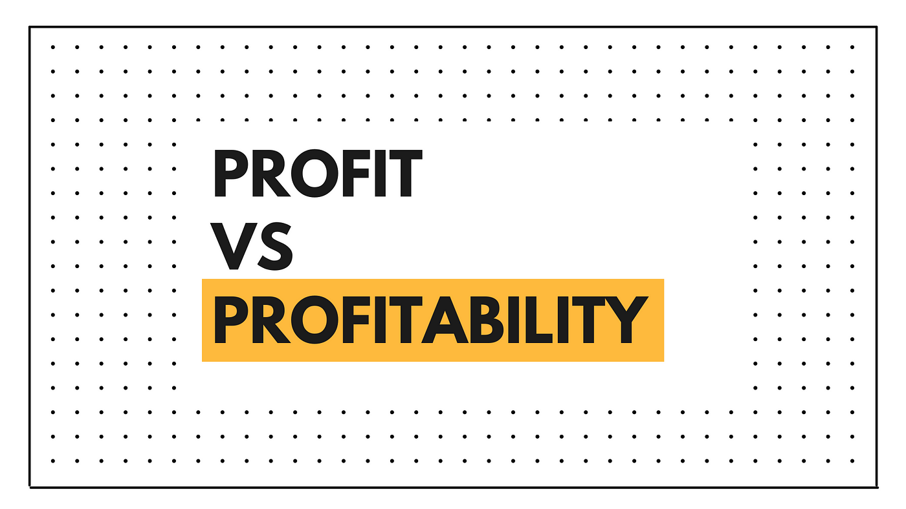

## Table of Contents

## What is profit?

Profit is the money a business makes after it pays for all its costs. When a company sells its products or services, it earns money. This money is called revenue. But to make the products or provide the services, the company has to spend money on things like materials, workers, and rent. These are the costs. If the revenue is more than the costs, the extra money is the profit.

Profit is important because it shows if a business is doing well. If a company keeps making a profit, it can grow and do more things. It can also pay its workers more or give money back to the people who own the company. If a company keeps losing money instead of making a profit, it might have to close down. So, profit is a key part of running a successful business.

## What is profitability?

Profitability is how good a business is at making money. It's not just about having profit, but about how much profit a business makes compared to the money it spends. If a business is profitable, it means it's doing well because it's making more money than it's spending.

People use different ways to measure profitability. One common way is to look at the profit margin, which is the profit divided by the revenue. A higher profit margin means the business is more profitable. Another way is to compare the profit to the amount of money the business has invested. This helps to see if the business is using its money well to make more money.

## How is profit calculated?

Profit is calculated by taking the total revenue a business makes and subtracting all the costs. Revenue is the money earned from selling products or services. Costs include everything the business has to pay for, like materials, employee salaries, rent, and other expenses. When you subtract the total costs from the total revenue, the result is the profit. If the number is positive, the business made a profit. If it's negative, the business had a loss.

Sometimes, businesses look at different types of profit. Gross profit is what's left after subtracting only the costs of making or buying the products sold, called the cost of goods sold. Net profit, or simply profit, is what's left after subtracting all costs, including operating expenses, taxes, and interest. By understanding these different kinds of profit, a business can see where it's doing well and where it might need to save money or make changes.

## How is profitability measured?

Profitability is measured by looking at how much money a business makes compared to the money it spends. One common way to measure profitability is by calculating the profit margin. The profit margin is found by dividing the profit by the revenue and then turning that number into a percentage. A higher profit margin means the business is more profitable because it shows that the business is keeping a bigger part of the money it earns.

Another way to measure profitability is by looking at the return on investment (ROI). This is done by dividing the profit by the amount of money the business has invested and then turning that into a percentage. A higher ROI means the business is using its money well to make more money. Both the profit margin and ROI help business owners and investors see if the business is doing well and making good use of its resources.

## Why is understanding the difference between profit and profitability important for a business?

Understanding the difference between profit and profitability is important for a business because it helps them see how well they are doing. Profit is just the money left after paying all the costs. It tells a business if they made more money than they spent. But profitability is about how good the business is at making that profit. It looks at the profit compared to the money the business makes or the money it has invested. Knowing this difference helps a business see if they are doing better or worse than other businesses.

Profitability also helps a business make smart choices. If a business knows its profit margin or return on investment, it can decide where to spend money or how to grow. For example, if one part of the business has a high profit margin, the business might want to focus more on that part. Or if the return on investment is low, the business might need to find new ways to use its money better. By understanding both profit and profitability, a business can plan for the future and keep making money.

## Can a business be profitable but not making a profit?

It might sound strange, but yes, a business can be profitable but not making a profit. Profitability is about how good a business is at making money compared to what it spends. If a business has a high profit margin, it means it's good at keeping a big part of the money it earns. But if the business is growing fast or spending a lot on new things, it might not have any profit left after paying for everything.

For example, a business might be putting a lot of money into new stores or new products. These costs can be high, so even though the business is good at making money, it might not have any profit yet. Over time, if these new things start making money, the business can start to make a profit. So, a business can be profitable but still not making a profit if it's spending a lot on growing or changing.

## What are the key financial ratios used to assess profitability?

There are several key financial ratios that businesses use to assess profitability. One important ratio is the gross profit margin. This ratio shows how much money a business keeps from sales after paying for the costs of making or buying the products it sells. To find the gross profit margin, you subtract the cost of goods sold from the revenue and then divide that by the revenue. A higher gross profit margin means the business is good at keeping money from sales.

Another key ratio is the net profit margin. This ratio tells you how much money a business keeps after paying for all its costs, including operating expenses, taxes, and interest. You calculate the net profit margin by dividing the net profit by the revenue. A higher net profit margin means the business is very good at turning sales into profit. Both the gross profit margin and the net profit margin help businesses see how well they are doing at making money.

A third important ratio is the return on assets (ROA). This ratio shows how well a business is using its assets to make a profit. To find the ROA, you divide the net profit by the total assets. A higher ROA means the business is using its assets well to make money. By looking at these ratios, a business can understand its profitability and make better decisions about how to grow and spend its money.

## How do short-term profits impact long-term profitability?

Short-term profits can affect long-term profitability in different ways. If a business focuses too much on making money right now, it might not spend enough on things that help it grow in the future. For example, if a company cuts back on research and development to save money, it might make more profit this year, but it won't have new products to sell later. This can hurt the business's ability to keep making money over time.

On the other hand, if a business uses its short-term profits wisely, it can help its long-term profitability. By investing in new technology, training employees, or opening new stores, a business can grow and make more money in the future. It's like planting seeds now so you can have a bigger harvest later. Balancing short-term profits with long-term investments is key to keeping a business profitable over time.

## What strategies can a business employ to improve its profitability?

A business can improve its profitability by looking at its costs and finding ways to spend less money. For example, the business can talk to its suppliers to get better prices on materials or find cheaper ways to make its products. It can also save money by using less energy or by making its workers more efficient. By cutting costs, the business can keep more of the money it earns as profit.

Another way to improve profitability is by making more money from sales. The business can do this by raising prices if customers are willing to pay more, or by selling more products or services. It can also find new customers or sell to different markets. Sometimes, a business can offer special deals or bundles to get people to buy more. By increasing revenue, the business can make more profit.

It's also important for a business to keep an eye on its financial health. This means looking at things like the profit margin and return on investment to see where the business is doing well and where it needs to improve. By understanding these numbers, the business can make smart choices about where to spend money and how to grow. This helps the business stay profitable over time.

## How do external economic factors influence a company's profit and profitability?

External economic factors can have a big impact on a company's profit and profitability. Things like inflation, interest rates, and economic growth can all affect how much money a business makes and how much it has to spend. For example, if inflation goes up, the cost of materials and labor might go up too. This means the business has to spend more money to make its products, which can lower its profit. Also, if interest rates are high, it can be more expensive for a business to borrow money, which can make it harder to grow or invest in new things.

Another important factor is the overall health of the economy. When the economy is doing well, people have more money to spend, and they are more likely to buy things. This can help a business make more sales and increase its profit. But if the economy is doing badly, like during a recession, people might not have as much money to spend, and the business might see its sales go down. This can hurt the business's profit and make it harder to stay profitable. So, a company needs to keep an eye on these external factors and be ready to change its plans to keep making money.

## What are the industry-specific considerations when evaluating profit versus profitability?

Different industries have their own special things to think about when looking at profit and profitability. For example, in the tech industry, a company might spend a lot of money on research and development to make new products. This can make their profit low at first, but if the new products do well, it can make them more profitable in the long run. In the restaurant industry, the cost of food and labor can change a lot, so a restaurant needs to keep a close eye on these costs to stay profitable. Each industry has its own challenges and ways to make money, so what works in one industry might not work in another.

In the retail industry, how much a store can charge for its products and how much it has to pay for them can really affect its profit. Retailers often have to deal with a lot of competition, so they need to find ways to keep their prices low while still making a profit. In the manufacturing industry, how well a company uses its machines and workers can make a big difference in its profitability. If a manufacturer can make things faster and cheaper, it can make more profit. So, when looking at profit and profitability, it's important to think about what's special about each industry and how those things can help or hurt a business.

## How can advanced analytics and forecasting models enhance the understanding of profit and profitability trends?

Advanced analytics and forecasting models can help businesses see patterns and predict what might happen with their profit and profitability. These tools can look at a lot of data from the past and find things that people might not see just by looking at numbers. For example, they can show how different things like the price of materials, how much people want to buy, and even the weather can affect how much money a business makes. By understanding these patterns, a business can make better plans and be ready for changes.

Using these models also helps businesses guess what might happen in the future. They can use the data to make predictions about how much money they will make and spend, and how profitable they will be. This can help them decide if they should change their prices, spend money on new things, or find ways to save money. By knowing what might happen, a business can make smart choices to keep making money and stay profitable over time.

## What is Understanding Profitability in Finance?

Profitability serves as a crucial metric for evaluating a business's operational efficiency and its ability to generate profit relative to its overall size. Determining profitability involves a comprehensive assessment of both revenue streams and expenses to gauge the sustainability of a business's financial practices. Key metrics used in this evaluation—such as profit margins, return on assets (ROA), and return on equity (ROE)—offer vital insights into financial health, informing both current performance and future growth potential.

Profit margins, calculated by dividing net income by revenue, indicate the percentage of revenue that translates into profit. The formula is expressed as:

$$
\text{Profit Margin} = \frac{\text{Net Income}}{\text{Revenue}} \times 100
$$

This metric allows stakeholders to understand how effectively a company converts sales into actual profit, highlighting efficiency in cost management and pricing strategies.

Return on assets (ROA) assesses the effectiveness with which a company utilizes its assets to produce profit. The calculation is given by:

$$
\text{ROA} = \frac{\text{Net Income}}{\text{Total Assets}}
$$

A higher ROA indicates more efficient use of assets. This metric is particularly useful for comparing companies within the same industry, as it normalizes the profit relative to the company's asset base.

Return on equity (ROE) measures the profitability generated from shareholders' investments, given by:

$$
\text{ROE} = \frac{\text{Net Income}}{\text{Shareholders' Equity}}
$$

This ratio provides insights into how well a company uses investments to generate earnings growth. High ROE values typically signal strong financial performance and effective management strategies aimed at maximizing shareholder returns.

Understanding and focusing on these profitability metrics allow businesses to align their strategic decisions with the enhancement of their financial health and the satisfaction of investor expectations. These measures offer a quantitative basis for evaluating business sustainability, facilitating informed decision-making processes for financial stakeholders, and guiding investments toward sustainable growth and management practices.

## What are the key profitability ratios?

Profitability ratios are fundamental tools in finance used to evaluate a company's ability to generate profits relative to its revenue, assets, or equity. These ratios serve as crucial indicators for investors and stakeholders to assess a company's financial health and performance compared to industry standards.

### Profit Margin
The profit margin is a straightforward and critical profitability ratio. It measures the percentage of revenue that exceeds the cost of goods sold, operating expenses, and taxes. There are several types of profit margins, including gross profit margin, operating profit margin, and net profit margin. The formula for net profit margin is:

$$
\text{Net Profit Margin} = \left( \frac{\text{Net Income}}{\text{Revenue}} \right) \times 100
$$

This ratio provides insight into how efficiently a company is being managed and its growth potential.

### Return on Assets (ROA)
Return on Assets (ROA) measures a company's ability to generate earnings from its assets. It is a vital ratio indicating how well a company utilizes its resources to produce profits. The formula for ROA is:

$$
\text{ROA} = \frac{\text{Net Income}}{\text{Total Assets}}
$$

A higher ROA indicates a more efficient use of company assets.

### Return on Equity (ROE)
Return on Equity (ROE) assesses a corporation's profitability by revealing how much profit a company generates with the money shareholders have invested. The formula is:

$$
\text{ROE} = \frac{\text{Net Income}}{\text{Shareholder's Equity}}
$$

This ratio is instrumental for shareholders to evaluate the potential return on their investment.

### EBITDA
EBITDA stands for earnings before interest, taxes, depreciation, and amortization, and is also used to measure a company's financial performance. It helps in comparing profitability between companies as it eliminates the effects of financing and accounting decisions:

$$
\text{EBITDA} = \text{Net Income} + \text{Interest} + \text{Taxes} + \text{Depreciation} + \text{Amortization}
$$

EBITDA serves investors and stakeholders by providing a clearer view of a company's operational efficiency.

These profitability ratios aid stakeholders in comparing financial efficiency to industry benchmarks, facilitating informed investment decisions. Analyzing these metrics provides a comprehensive understanding of a company's performance and aids in forecasting growth potential.

 to Algorithmic Trading

Algorithmic trading, often referred to as algo trading, utilizes computer software to execute financial trades automatically, based on preset criteria and complex algorithms. This method of trading capitalizes on the speed and precision of computers, which can analyze variables and execute buy or sell orders more rapidly than a human trader ever could. The rise of algo trading is particularly pronounced in market environments where swift trade execution and [volume](/wiki/volume-trading-strategy) handling are crucial.

One of the primary benefits of algo trading is its ability to execute trades at speeds unattainable by human traders. This speed not only enhances trading efficiency but also significantly diminishes emotional biases that often cloud human judgment. Human traders may make decisions based on emotions such as fear or greed, whereas algorithms follow exact rules without deviation, thereby ensuring consistent execution of strategies.

Algo trading's prevalence in financial markets is based on its ability to automate a vast array of trading tasks. This automation allows both financial institutions and individual traders to optimize trade timing and execute trades at the most cost-effective prices. For instance, algorithms can be programmed to monitor multiple markets simultaneously and exploit [arbitrage](/wiki/arbitrage) opportunities where discrepancies in price exist across different platforms.

The growth of [algorithmic trading](/wiki/algorithmic-trading) has been fueled by its capacity to handle large volumes of trading orders efficiently and seamlessly across global markets. Markets operate at a fast pace, and algorithmic trading provides a means to place large order volumes without causing significant market impact, thus maintaining the trader’s strategic advantage. It also ensures that trades are executed as quickly and efficiently as possible, minimizing potential losses due to market [volatility](/wiki/volatility-trading-strategies).

Overall, algorithmic trading offers a robust solution for those looking to enhance their trading strategies with precision and efficiency, combining technical prowess with strategic financial insights. As the financial markets continue to evolve, the role of algorithmic trading grows increasingly indispensable, reshaping the dynamics of modern trading practices.

## References & Further Reading

[1]: ["Advances in Financial Machine Learning"](https://www.amazon.com/Advances-Financial-Machine-Learning-Marcos/dp/1119482089) by Marcos Lopez de Prado

[2]: ["Evidence-Based Technical Analysis: Applying the Scientific Method and Statistical Inference to Trading Signals"](https://www.amazon.com/Evidence-Based-Technical-Analysis-Scientific-Statistical/dp/0470008741) by David Aronson

[3]: ["Machine Learning for Algorithmic Trading"](https://github.com/PacktPublishing/Machine-Learning-for-Algorithmic-Trading-Second-Edition) by Stefan Jansen

[4]: ["Quantitative Trading: How to Build Your Own Algorithmic Trading Business"](https://www.amazon.com/Quantitative-Trading-Build-Algorithmic-Business/dp/1119800064) by Ernest P. Chan

[5]: Menkveld, A. J. (2013). ["High frequency trading and the new market makers."](https://www.sciencedirect.com/science/article/pii/S1386418113000281) Review of Financial Studies, 27(8), 2108-2154.

[6]: Hasbrouck, J. & Saar, G. (2013). ["Low-latency trading."](https://papers.ssrn.com/sol3/papers.cfm?abstract_id=1695460) Review of Financial Studies, 26(9), 2095-2136.