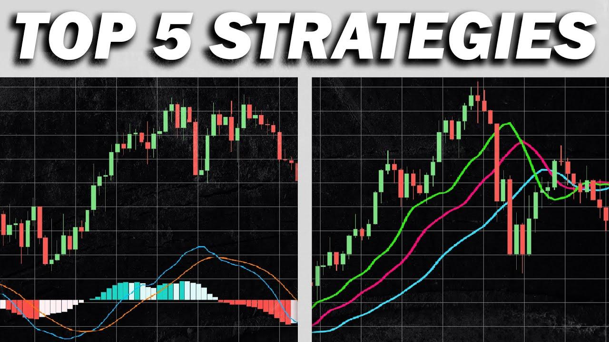

## Table of Contents

## What is a trading strategy and why is it important for profitable trading?

A trading strategy is a set of rules and guidelines that a trader follows to make decisions about buying and selling financial instruments like stocks, currencies, or commodities. It helps traders decide when to enter and exit trades, how much money to risk on each trade, and how to manage their overall portfolio. A good trading strategy is based on a clear understanding of the market and the trader's goals, and it often involves using technical analysis, fundamental analysis, or a combination of both to make informed decisions.

Having a trading strategy is important for profitable trading because it helps traders stay disciplined and avoid making emotional decisions. Without a strategy, traders might buy or sell based on fear, greed, or other emotions, which can lead to big losses. A well-defined strategy helps traders stick to a plan, manage risk, and increase their chances of making consistent profits over time. By following a strategy, traders can also learn from their successes and failures, and make adjustments to improve their performance in the future.

## How can beginners start developing a basic trading strategy?

Beginners can start developing a basic trading strategy by first understanding what they want to achieve. They should set clear goals, like making a certain amount of money or learning about the market. Once they know their goals, they can choose what to trade, like stocks or currencies, and decide how much time they can spend on trading. It's important to start small and not risk too much money at the beginning.

Next, beginners should learn about different trading methods. They can use technical analysis, which looks at charts and patterns, or fundamental analysis, which looks at a company's financial health. Many beginners find it helpful to start with a simple strategy, like buying a stock when its price goes above a certain level and selling it when it goes below another level. They should also set rules for how much money they are willing to lose on each trade. Practicing with a demo account can help them test their strategy without risking real money. As they gain experience, they can adjust their strategy to make it better.

## What are the key elements of a profitable trading strategy?

A profitable trading strategy has a few key elements that help traders make money. One important element is a clear entry and exit plan. This means knowing when to buy and when to sell. Traders use things like price levels, chart patterns, or news events to decide when to enter and exit trades. Another key element is risk management. This means deciding how much money to risk on each trade and setting stop-loss orders to limit losses. Good risk management helps traders protect their money and stay in the game longer.

Another important part of a profitable trading strategy is having a trading edge. This means finding a way to make more money than you lose over time. Traders might use technical analysis, fundamental analysis, or a mix of both to find this edge. It's also important to keep a trading journal to track what works and what doesn't. By reviewing their trades, traders can learn from their mistakes and improve their strategy. Finally, discipline is crucial. Sticking to the plan and not letting emotions like fear or greed take over can make a big difference in whether a trading strategy is profitable or not.

## How do technical analysis and fundamental analysis contribute to trading strategies?

Technical analysis helps traders by looking at charts and patterns to predict what might happen next in the market. It uses things like moving averages, support and resistance levels, and other tools to find good times to buy and sell. Traders who use technical analysis believe that past price movements can give clues about future price movements. By studying these patterns, they can make better decisions about when to enter and exit trades. This can be a big part of a trading strategy because it helps traders find the right moments to act.

Fundamental analysis, on the other hand, looks at the basic health of a company or the economy. It involves studying things like earnings reports, economic data, and news events to understand if a stock or currency is a good buy. Traders who use fundamental analysis want to know if a company is making money, growing, and has a strong future. By understanding these fundamentals, they can decide if a stock is undervalued or overvalued. This information can guide their trading strategy by helping them choose which stocks to buy and when to buy them based on the company's real value.

## What are common entry and exit signals used in trading strategies?

Common entry signals in trading strategies include moving average crossovers, where a short-term moving average crosses above a long-term moving average, suggesting it's a good time to buy. Another entry signal is when the price breaks above a resistance level, showing that the stock might keep going up. Traders also look for chart patterns like the "cup and handle" or "head and shoulders," which can signal a good time to enter a trade. They might use indicators like the Relative Strength Index (RSI) too. If the RSI goes below 30, it means the stock might be oversold and could be a good time to buy.

Exit signals are also important for a trading strategy. One common exit signal is when a stock's price falls below a support level, which might mean it's time to sell. Another exit signal is when a short-term moving average crosses below a long-term moving average, suggesting the stock might go down. Traders often use stop-loss orders to automatically sell a stock if it drops to a certain price, helping them limit their losses. They might also look at the RSI again; if it goes above 70, it could mean the stock is overbought and it might be time to sell.

## How can risk management be integrated into a trading strategy to enhance profitability?

Risk management is a key part of making a trading strategy work better and help you make more money. One way to do this is by setting stop-loss orders. A stop-loss order is like a safety net that tells your broker to sell a stock if it drops to a certain price. This helps you limit how much money you could lose on one trade. Another important part of risk management is deciding how much of your money you want to risk on each trade. A common rule is not to risk more than 1-2% of your total money on any single trade. This way, even if you have a few losing trades, you won't lose too much of your money.

Another way to use risk management in your trading strategy is by using position sizing. This means figuring out how many shares or contracts to buy based on how much you're willing to risk. For example, if you're okay with losing $100 on a trade and the stock might drop $2 per share, you would buy 50 shares. This keeps your risk at $100, which is a small part of your total money. By using these risk management techniques, you can protect your money and have a better chance of making profits over time. It helps you stay in the game longer and learn from your trades without big losses.

## What are the differences between short-term and long-term trading strategies?

Short-term trading strategies focus on making quick profits by buying and selling stocks or other financial instruments within a short period, often within a day or a few days. These strategies often use technical analysis to find entry and exit points based on price movements and chart patterns. Traders who use short-term strategies might make many trades in a day, trying to take advantage of small price changes. This type of trading can be exciting but also risky because it requires quick decisions and constant attention to the market. It's important for short-term traders to have a good risk management plan to protect their money from big losses.

Long-term trading strategies, on the other hand, are about holding onto investments for a longer time, often months or years. These strategies usually rely more on fundamental analysis, looking at a company's financial health and future growth potential. Long-term traders buy stocks they believe will increase in value over time and are less concerned with short-term price swings. This type of trading requires patience and a belief in the long-term value of the investment. While it can be less stressful than short-term trading, long-term traders still need to keep an eye on their investments and be ready to adjust their strategy if the market changes or if the company's situation changes.

## How can traders backtest their trading strategies to assess potential profitability?

Backtesting is a way for traders to check if their trading strategy would have worked well in the past. They use old market data to see how their strategy would have done if they had used it before. Traders can use special software or tools to do this. They put in their rules for buying and selling, and the software runs through the old data to see how many times the strategy would have made money and how many times it would have lost money. This helps traders see if their strategy is good or if they need to change it.

By backtesting, traders can find out things like how much money they might make or lose, and how often their strategy works. It's important to use a lot of data from different times to make sure the results are good. Backtesting can show if a strategy is too risky or if it needs to be adjusted. But traders should remember that past results don't always mean the strategy will work the same way in the future. The market can change, so it's a good idea to keep testing and updating the strategy as they go.

## What role does psychological discipline play in executing a trading strategy successfully?

Psychological discipline is very important when you're trying to follow a trading strategy. It means sticking to your plan even when things get tough. When you're trading, it's easy to let feelings like fear or greed take over. If you're scared, you might sell too soon and miss out on profits. If you're greedy, you might hold onto a stock for too long and lose money. By staying disciplined, you can make decisions based on your strategy instead of your feelings. This helps you make more money over time because you're following a plan that you know works.

Discipline also helps you keep a clear head and learn from your trades. When you follow your strategy, you can look back at your trades and see what worked and what didn't. This helps you get better at trading. If you let your emotions control your trades, it's hard to learn because you're not following a set plan. Staying disciplined means you can keep a trading journal and use it to improve your strategy. Over time, this can make a big difference in how much money you make from trading.

## How can advanced traders use algorithmic trading to refine their strategies?

Advanced traders can use algorithmic trading to make their strategies better by using computer programs to automatically buy and sell based on their rules. These programs can look at lots of data really fast and make trades without letting emotions get in the way. Traders can set up their algorithms to follow their trading plan exactly, which helps them stay disciplined. They can also test different ideas quickly and see which ones work best. This can save a lot of time and help them find small advantages in the market that they might miss if they were trading by hand.

Using algorithmic trading also lets advanced traders handle more trades at the same time. They can trade in different markets or with different strategies all at once. This can help them spread out their risk and maybe make more money. But it's important for traders to keep an eye on their algorithms and make sure they're working right. Markets can change, so traders need to keep updating their algorithms to make sure they stay profitable. By using these tools, advanced traders can make their strategies sharper and keep improving over time.

## What are some advanced trading strategies used by expert traders to maximize profits?

Expert traders often use a strategy called "pairs trading" to make money. This means they find two stocks that usually move together, like two companies in the same industry. When one stock goes up more than the other, they might sell the one that went up and buy the one that didn't. They're betting that the prices will come back together. This can be a smart way to make money because it doesn't depend on the whole market going up or down. It's about the relationship between the two stocks.

Another advanced strategy is "mean reversion." This is when traders look for stocks that have moved a lot from their usual price and bet that they'll go back to normal. For example, if a stock usually trades at $50 but suddenly jumps to $60, a trader might sell it, thinking it will come back down. On the other hand, if it drops to $40, they might buy it, thinking it will go back up. This strategy can work well in markets that are calm and not moving too much. But traders need to be careful because sometimes prices can keep moving away from the average instead of coming back.

## How can traders adapt their strategies to different market conditions and economic cycles?

Traders need to change their strategies based on what's happening in the market and the economy. When the market is going up and the economy is doing well, traders might use strategies that take advantage of this growth. They could buy stocks that they think will keep going up, or use strategies like momentum trading, where they buy stocks that are already going up fast. But they need to be ready for changes. If the market starts to slow down or the economy starts to struggle, traders might switch to safer strategies. They might sell some of their stocks and hold onto more cash, or they might use strategies like mean reversion, betting that prices will come back to normal after big moves.

It's also important for traders to watch for signs that the market or the economy is changing. They can look at things like interest rates, employment numbers, and company earnings to get a sense of where things are headed. If they see that the economy might be getting worse, they might start using strategies that protect their money, like buying stocks that pay dividends or investing in bonds. On the other hand, if they think the economy is getting better, they might start buying more stocks again. By keeping an eye on these signs and being ready to change their strategies, traders can do better no matter what's happening in the market or the economy.

## What are the key aspects of understanding algorithmic trading strategies?

Algorithmic trading strategies automate the decision-making process in trading by employing sophisticated algorithms to decipher market signals and execute trades based on predetermined guidelines. These strategies leverage computer algorithms to process vast amounts of market data, identify opportunities, and execute trades with minimal human intervention. Key components integral to these strategies are market data analysis, trade execution, and risk management, each contributing to rapid and informed decision-making.

Market data analysis is fundamental to algorithmic trading strategies. It involves scrutinizing real-time and historical market data to recognize trading signals and patterns. An algorithm might use statistical techniques such as moving averages or more complex methods like machine learning models to detect trends or anomalies in the data. For instance, a moving average crossover strategy might signal a trade when a short-term moving average crosses above a long-term moving average. This mathematical model can be represented as follows:

$$
\text{Signal} = \begin{cases} 
1, & \text{if } MA_{\text{short}} > MA_{\text{long}} \\
-1, & \text{if } MA_{\text{short}} < MA_{\text{long}} 
\end{cases}
$$

where $MA_{\text{short}}$ and $MA_{\text{long}}$ are the short-term and long-term moving averages, respectively.

Trade execution is another critical component, focusing on the algorithm's ability to accurately and efficiently execute the trades derived from the analysis. Algorithms are designed to optimize execution by selecting the best possible price, minimizing market impact, and reducing transaction costs. High-frequency trading ([HFT](/wiki/high-frequency-trading-strategies)) exemplifies the capability of algorithmic systems to execute orders in fractions of a second across multiple markets and instruments.

Risk management within [algorithmic trading](/wiki/algorithmic-trading) involves strategies to mitigate financial exposure and preserve capital. Algorithms incorporate rules to manage risk, such as stop-loss orders, limit orders, and position sizing methodologies. These rules ensure that trading activities are aligned with the trader's risk appetite and financial goals. For example, a stop-loss order can automatically sell a position if its price drops below a certain level, thus limiting potential losses. 

Understanding these components is essential for developing an effective algorithmic trading strategy that can successfully navigate complex financial markets. The combination of accurate market data analysis, efficient trade execution, and stringent risk management creates a robust framework for maximizing profitability while minimizing exposure to market uncertainties. As financial markets continue to evolve, the adaptability and precision of algorithmic trading strategies provide traders with a substantial edge in achieving successful outcomes.

## How can one design and implement trading strategies?

Successful strategy design in algorithmic trading hinges on setting clear objectives, including well-defined profit targets and acceptable risk levels. These parameters form the foundation upon which trading strategies are built and evaluated.

One fundamental aspect of developing these strategies is backtesting, which involves evaluating a trading strategy using historical data. This step is crucial to gauge how a strategy might perform in the live market. It requires traders to simulate a strategy over a relevant dataset to ensure it is both profitable and robust. Backtesting allows for the refinement and optimization of the strategy before it is deployed in live trading environments. The mathematical backbone of backtesting involves calculating key performance metrics such as the Sharpe Ratio, maximum drawdown, and cumulative returns. The formula for the Sharpe Ratio, which measures risk-adjusted return, is:

$$
\text{Sharpe Ratio} = \frac{E[R_p] - R_f}{\sigma_p}
$$

where $E[R_p]$ is the expected portfolio return, $R_f$ is the risk-free rate, and $\sigma_p$ is the standard deviation of the portfolio's excess return. Traders often use Python libraries like `pandas` and `numpy` for data manipulation and performance calculations, as well as `backtrader` for simulating trades.

Once a strategy is backtested and seems promising, implementing robust risk management techniques is essential to minimize potential losses and ensure account stability. This includes the use of stop-loss orders and position sizing. A stop-loss order is designed to limit an investor's loss on a security position by automatically selling the asset when it reaches a certain price. For example, if a stock is purchased at $100, a stop-loss order might be placed at $90, ensuring the maximum loss per share is capped at $10.

Position sizing determines the amount of capital to allocate to a particular trade, which can be calculated using the Kelly Criterion, a popular formula for managing risk:

$$
f^* = \frac{bp - q}{b}
$$

where $f^*$ is the fraction of the portfolio to bet, $b$ is the decimal odds of the bet (net odds), $p$ is the probability of winning, and $q$ is the probability of losing ($q = 1 - p$).

Incorporating these strategies requires continuous monitoring and adaptation to ensure ongoing effectiveness as market conditions evolve. Successful implementation in algorithmic trading integrates these components cohesively, allowing traders to execute strategies with precision and control losses, thus maintaining portfolio growth and stability over time.

## References & Further Reading

[1]: Bergstra, J., Bardenet, R., Bengio, Y., & Kégl, B. (2011). ["Algorithms for Hyper-Parameter Optimization."](https://proceedings.neurips.cc/paper/2011/file/86e8f7ab32cfd12577bc2619bc635690-Paper.pdf) Advances in Neural Information Processing Systems 24.

[2]: ["Advances in Financial Machine Learning"](https://www.amazon.com/Advances-Financial-Machine-Learning-Marcos/dp/1119482089) by Marcos Lopez de Prado

[3]: ["Evidence-Based Technical Analysis: Applying the Scientific Method and Statistical Inference to Trading Signals"](https://www.amazon.com/Evidence-Based-Technical-Analysis-Scientific-Statistical/dp/0470008741) by David Aronson

[4]: ["Machine Learning for Algorithmic Trading"](https://github.com/stefan-jansen/machine-learning-for-trading) by Stefan Jansen

[5]: ["Quantitative Trading: How to Build Your Own Algorithmic Trading Business"](https://books.google.com/books/about/Quantitative_Trading.html?id=j70yEAAAQBAJ) by Ernest P. Chan