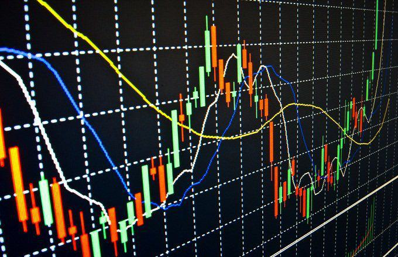

Bollinger Bands, a concept introduced by John Bollinger, have become integral to the practice of technical analysis in financial markets. This methodology involves three lines plotted on a chart: a simple moving average (SMA) and two standard deviation bands—one above and one below the SMA. The distance between these bands varies with market volatility; they expand during periods of high volatility and contract during periods of low volatility.

A specific pattern known as the 'Bollinger Squeeze' occurs when these bands come exceptionally close together, signaling low volatility in the market. This constriction often precedes significant price movements, offering traders a potential setup for capturing a breakout move. The Squeeze does not provide directional bias; it merely flags an impending market shift. Thus, it becomes essential for traders to employ additional indicators, such as the Relative Strength Index (RSI) or Moving Average Convergence Divergence (MACD), to interpret the likely direction of the breakout.



Understanding the Bollinger Squeeze is crucial for traders, particularly those who rely on algorithmic strategies to execute trades. This article focuses on the mechanics behind the Bollinger Squeeze, its interpretation, and the ways it can be harnessed within algorithmic trading systems. By examining the pattern’s strengths and limitations, we will uncover how traders predict market movements and capitalize on significant shifts to achieve profitable outcomes.

## Table of Contents

## Understanding Bollinger Bands

Bollinger Bands are a widely used tool in technical analysis, consisting of three key components: a simple moving average (SMA) and two bands that define standard deviation levels above and below this SMA. The standard deviation measures the amount of variation or dispersion in a set of values, providing insight into the volatility of the asset's price.

The middle line, or the SMA, is calculated by averaging the closing prices of an asset over a specific time period, often set to 20 days. The formula for the SMA is:

$$
\text{SMA} = \frac{P_1 + P_2 + \ldots + P_n}{n}
$$

where $P_1, P_2, \ldots, P_n$ are the daily closing prices, and $n$ is the number of days.

The upper and lower bands are then calculated by adding and subtracting a multiple of the standard deviation to the SMA:

$$
\text{Upper Band} = \text{SMA} + (k \times \text{Standard Deviation})
$$

$$
\text{Lower Band} = \text{SMA} - (k \times \text{Standard Deviation})
$$

Here, $k$ is typically set to 2, capturing approximately 95% of price movements when prices are normally distributed.

These bands dynamically adjust to market conditions; they expand during periods of high [volatility](/wiki/volatility-trading-strategies) and contract during periods of low volatility, reflecting price stability. This dynamic nature allows traders to assess market conditions effectively. When the bands are closely constricted around the SMA, a phase known as the Bollinger Squeeze, it suggests a period of low market volatility. This state is often scrutinized by traders for potential breakouts, as historically, periods of low volatility are followed by periods of high volatility.

Understanding Bollinger Bands' structure is crucial for developing robust market analysis and trading strategies. They not only help identify potential price breakouts and reversals but also aid in determining the relative pricing of assets. Traders often incorporate Bollinger Bands into their strategies to make informed decisions and maximize trading opportunities.

## The Bollinger Band Squeeze

A Bollinger Band Squeeze is a critical setup employed by traders to anticipate substantial market movements following phases of low volatility. This setup is characterized by the narrowing of the Bollinger Bands around the simple moving average (SMA), signifying a reduction in price fluctuation. When volatility decreases, it often presages a significant [breakout](/wiki/breakout-trading)—either upward or downward. However, the Squeeze itself does not provide information on the likely direction of the breakout.

The essence of the Bollinger Band Squeeze strategy is to monitor these constricted bands closely, preparing to capitalize on the anticipated breakout. It is crucial to understand that the Squeeze serves primarily as a signal for an impending move rather than a directional indicator. Consequently, traders commonly enhance their analyses with additional technical indicators to forecast the likely trajectory of the market. Two widely-used indicators in this context are the Relative Strength Index (RSI) and the Moving Average Convergence Divergence (MACD).

The RSI, which indicates overbought or oversold conditions, provides insights that can suggest a potential reversal point coinciding with the Squeeze. If the RSI is approaching an overbought level, there might be a higher probability of a downward breakout, and conversely, an oversold level could indicate an upward breakout. The MACD, on the other hand, helps traders assess the strength, direction, [momentum](/wiki/momentum), and duration of a trend. When used alongside Bollinger Bands, the MACD can confirm breakout directions and help refine timing for entry points.

In a practical sense, implementing the Bollinger Band Squeeze strategy requires vigilance and adaptive strategies. Traders need to set precise criteria for entering and exiting trades to mitigate risks associated with false breakouts. For instance, waiting for the price to close outside of the bands or combining signals from other indicators can enhance reliability. Furthermore, dynamic market conditions may necessitate adjustments to trading rules to maintain the efficacy of the Squeeze strategy. Overall, the Bollinger Band Squeeze presents a valuable opportunity for traders, but its effective use hinges on a comprehensive understanding and the strategic application of supplementary analytical tools.

## Implementing Bollinger Band Squeeze in Algo Trading

The implementation of the Bollinger Band Squeeze in [algorithmic trading](/wiki/algorithmic-trading) involves automating the identification of low volatility periods and preparing for potential breakout trades. Traders typically use this setup to signal impending market movement by observing the constriction of Bollinger Bands around the simple moving average (SMA). This can be executed through a systematic process using programming and data analysis tools.

To begin, the automation of trade signals requires a proper coding framework. Python, a popular language for algorithmic trading, provides robust libraries like pandas and matplotlib to manage data and visualize signals. The pandas library is useful for handling time series data and calculating the Bollinger Bands and the Squeeze condition, while matplotlib can be used to plot these for enhanced understanding.

Here is a basic outline of how one might code a Bollinger Band Squeeze strategy:

```python
import pandas as pd
import numpy as np
import matplotlib.pyplot as plt

# Load your data
data = pd.read_csv('market_data.csv')  # ensure your data includes 'Close' prices
data['SMA'] = data['Close'].rolling(window=20).mean()
data['StdDev'] = data['Close'].rolling(window=20).std()
# Calculate Bollinger Bands
data['Upper'] = data['SMA'] + (data['StdDev'] * 2)
data['Lower'] = data['SMA'] - (data['StdDev'] * 2)

# Identify the Squeeze
data['BandWidth'] = (data['Upper'] - data['Lower']) / data['SMA']
squeeze_threshold = 0.05  # adjust this threshold based on asset behavior
data['Squeeze'] = data['BandWidth'] < squeeze_threshold

# Plotting
plt.figure(figsize=(12, 6))
plt.plot(data['Close'], label='Close Price')
plt.plot(data['Upper'], label='Upper Band', linestyle='--')
plt.plot(data['Lower'], label='Lower Band', linestyle='--')
plt.fill_between(data.index, data['Lower'], data['Upper'], color='gray', alpha=0.1)
plt.title('Bollinger Bands with Squeeze')
plt.legend(loc='best')
plt.show()
```

This script illustrates computing the Bollinger Bands with a 20-period moving average, a common default. The Squeeze is detected by the BandWidth being less than a set threshold (e.g., 0.05), indicating reduced volatility. Adjust this threshold to optimize for different securities.

Once the Squeeze signal is programmed, traders implement logic to execute trades on breakout confirmation. It's vital to determine whether a breakout has sustainable momentum. Utilizing additional technical indicators, such as the Relative Strength Index (RSI) or Moving Average Convergence Divergence (MACD), can help predict breakout direction.

Backtesting is an essential step, ensuring the strategy performs well under historical conditions. Careful [backtesting](/wiki/backtesting) allows traders to adjust and refine their strategies, taking into account varying asset volatilities and scenarios.

To sum up, the integration of the Bollinger Band Squeeze into an algorithmic trading system involves the setup of a detection mechanism for volatility signals, complementing this with other indicators to place trades accurately. This method, when properly implemented and tested, can form a vital part of a trader's strategy toolbox.

## Backtesting the Strategy

Backtesting is a crucial step in validating the Bollinger Band Squeeze strategy. By applying this strategy to historical price data, traders can assess its potential performance and refine their decision-making criteria. This retrospective analysis enables an understanding of how the strategy would have performed under various market conditions.

To begin backtesting, traders gather historical data of the asset under consideration. This data typically includes open, high, low, and close prices, often supplemented by [volume](/wiki/volume-trading-strategy), stretching over a significant time period to ensure comprehensiveness. Using this data, traders then simulate the Bollinger Band Squeeze strategy by identifying past instances of band constriction.

The mathematical foundation involves calculating the Bollinger Bands themselves, which consist of a Simple Moving Average (SMA) and two standard deviation bands. The formula for the SMA is:

$$
\text{SMA}_n = \frac{P_1 + P_2 + ... + P_n}{n}
$$

where $P$ represents the asset's historical price and $n$ is the number of periods.

The upper and lower Bollinger Bands are calculated as follows:

$$
\text{Upper Band} = \text{SMA}_n + (k \times \sigma)
$$

$$
\text{Lower Band} = \text{SMA}_n - (k \times \sigma)
$$

where $\sigma$ is the standard deviation of the asset's price over $n$ periods, and $k$ is the number of standard deviations, typically set to 2. A Squeeze is identified when these bands are closer than usual, often linked with the Bollinger Band Width, calculated as:

$$
\text{Bandwidth} = \frac{\text{Upper Band} - \text{Lower Band}}{\text{SMA}}
$$

In backtesting, traders examine instances where the Bandwidth falls below a certain threshold, indicating potential low volatility.

To evaluate the strategy's adaptability, traders apply it across a variety of asset classes, such as equities, commodities, or [forex](/wiki/forex-system). This diversification helps identify how different volatility patterns impact the strategy's performance. Python is particularly useful for executing these backtests. Libraries like `pandas` can manage data manipulation, while `matplotlib` aids in visualizing results. A basic Python script might involve:

```python
import pandas as pd
import numpy as np
import matplotlib.pyplot as plt

# Load historical price data into a DataFrame
data = pd.read_csv('historical_data.csv')

# Calculate SMA and standard deviation
data['SMA'] = data['Close'].rolling(window=20).mean()
data['stddev'] = data['Close'].rolling(window=20).std()

# Calculate Bollinger Bands
data['Upper Band'] = data['SMA'] + (data['stddev'] * 2)
data['Lower Band'] = data['SMA'] - (data['stddev'] * 2)

# Calculate Bandwidth
data['Bandwidth'] = (data['Upper Band'] - data['Lower Band']) / data['SMA']

# Plot to visualize Squeeze conditions
plt.figure(figsize=(12, 6))
plt.plot(data['Close'], label='Close Price')
plt.plot(data['Upper Band'], label='Upper Band')
plt.plot(data['Lower Band'], label='Lower Band')
plt.fill_between(data.index, data['Upper Band'], data['Lower Band'], color='grey', alpha=0.1)
plt.legend()
plt.show()
```

Finally, customizing trading rules to align with asset-specific volatility patterns enhances the backtest's reliability. By adjusting parameters like the number of SMA periods or the standard deviation multiplier, traders can optimize the strategy to their chosen asset class, improving predictive accuracy and potential profitability. Additionally, measuring performance through metrics such as win rate, profit [factor](/wiki/factor-investing), and maximum drawdown provides quantitative insights into the backtested strategy's efficiency.

## Common Mistakes and Limitations

Traders employing the Bollinger Band Squeeze strategy need to be cautious of certain pitfalls and limitations that can affect its effectiveness. One major concern is the occurrence of false breakouts during a Squeeze phase. While the constriction of the Bollinger Bands suggests an impending breakout, the actual price movement may not be as significant or could reverse shortly after the breakout signal. This can lead to erroneous trade decisions if not carefully managed.

It is crucial to mitigate the risk of premature trade entries by incorporating confirming indicators. Complementary technical indicators, such as the Relative Strength Index (RSI) or the Moving Average Convergence Divergence (MACD), can provide additional insights into the momentum and direction of the market. For instance, if a breakout is accompanied by a rising RSI, it may confirm a more substantial price move, thus reducing the likelihood of a false signal.

Another limitation of the Bollinger Squeeze strategy is its variable success across different market conditions. The effectiveness of the strategy largely depends on the volatility and [liquidity](/wiki/liquidity-risk-premium) of the asset being traded. In highly volatile markets, the bands may frequently contract and expand, leading to numerous false signals. Conversely, in markets with low liquidity, the strategy may not produce sufficient signals, or the signals may not lead to significant price movements.

Therefore, traders should conduct thorough due diligence and regularly optimize their strategy through backtesting. Backtesting involves applying the strategy to historical data to evaluate its performance and refine the decision-making process. It allows traders to identify the limitations and strengths of the Bollinger Squeeze across various market environments and asset classes. By continuously optimizing the strategy based on backtest results, traders can enhance its reliability and potential profitability. This process may include adjustments to the standard deviation parameters, moving average period, and the integration of additional technical indicators to better suit the specific characteristics of the asset and market conditions.

## Conclusion

The Bollinger Band Squeeze offers a strategic approach to understanding market dynamics during periods of low volatility, signaling the potential for significant price movements. Traders who effectively leverage this technique can gain valuable insights, leading to actionable trading opportunities. Implementing a successful Squeeze strategy requires a comprehensive understanding of additional indicators, such as the Relative Strength Index (RSI) or Moving Average Convergence Divergence (MACD), to accurately predict the direction of breakouts. 

Moreover, continuous backtesting and strategy refinement are crucial to ensure the strategy’s robustness and adaptability to varying market conditions. By applying the Squeeze to historical data, traders can assess the strategy's performance, identify potential weaknesses, and optimize their trading approach. This iterative process helps in fine-tuning the parameters that govern entry and [exit](/wiki/exit-strategy) points, making the strategy more reliable over time.

While the Bollinger Band Squeeze holds significant potential, it is not without its challenges. False breakouts and ineffective signal interpretation can lead to unprofitable trades. As such, traders must exercise diligence in confirming signals and be prepared to adjust their strategies in response to changing market conditions. 

In essence, the Bollinger Band Squeeze is a powerful tool for traders adept at navigating its complexities and limitations. Those who thoroughly understand its mechanics and continuously refine their approach are well-positioned to exploit its potential for profitable trading endeavors.

## References & Further Reading

[1]: Bollinger, J. (2002). ["Bollinger on Bollinger Bands."](https://archive.org/download/BollingerOnBollingerBands/Bollinger%20On%20Bollinger%20Bands.pdf) McGraw-Hill.

[2]: Pring, M. J. (2002). ["Technical Analysis Explained."](https://www.amazon.com/Technical-Analysis-Explained-Fifth-Successful/dp/0071825177) McGraw-Hill.

[3]: Elder, A. (1993). ["Trading for a Living: Psychology, Trading Tactics, and Money Management."](https://www.amazon.com/Trading-Living-Psychology-Tactics-Management/dp/0471592242) John Wiley & Sons.

[4]: Murphy, J. J. (1999). ["Technical Analysis of the Financial Markets."](https://archive.org/details/technicalanalysi0000murp) New York Institute of Finance.

[5]: Achelis, S. B. (2001). ["Technical Analysis from A to Z."](https://archive.org/details/technicalanalysi00ache) McGraw-Hill.