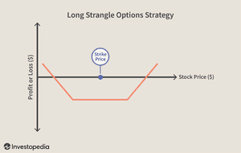

In trading, options strategies known as straddles and strangles are pivotal for managing earnings surprises and enhancing algorithmic trades. These strategies are designed to profit from substantial price movements in the stock market, whether the movement is upward or downward. Straddles and strangles are particularly advantageous in periods of high volatility, such as during company earnings announcements that deviate from analysts' expectations. 

Straddles consist of purchasing both a call and put option with the same strike price and expiration date. This setup benefits from significant price shifts in either direction, reflecting the strategy's reliance on market volatility. Similarly, strangles involve buying call and put options with differing strike prices, potentially offering higher profit margins if a stock experiences substantial movement. However, strangles often come with lower initial costs but necessitate more significant price movements to achieve profitability.



The incorporation of straddles and strangles in algorithmic trading leverages technology to enhance the execution and management of these trades. Algorithms can automatically conduct trades based on set criteria, swiftly responding to fluctuations caused by earnings reports or other market events. This automation reduces the influence of human error, optimally managing entry and exit points to mitigate risks like time decay in options pricing.

Understanding and applying straddles and strangles can equip traders with essential tools to exploit opportunities surrounding earnings announcements, potentially leading to profitable outcomes. As market dynamics and trading technologies evolve, mastering these strategies can significantly benefit traders seeking to capitalize on drastic stock movements associated with earnings surprises.

## Table of Contents

## Understanding Straddles and Strangles

Straddles and strangles are options strategies that traders commonly use to profit from substantial stock price movements, particularly in highly volatile market conditions such as during earnings announcements. Each approach involves purchasing a call option and a put option, but they differ in terms of the strike prices chosen, leading to variations in cost, risk, and potential profitability.

A straddle involves purchasing both a call option and a put option with the same strike price and the same expiration date. This strategy is typically used when a trader expects high volatility in the stock price but is uncertain about the direction of the movement. The logic behind this approach is that a significant price change will lead one of the options to become profitable, potentially covering the loss of the other option and making a net profit. The profitability of a straddle depends on the magnitude of the stock's price movement relative to the total premium paid for both options.

Mathematically, the payoff for a straddle can be expressed as:

$$
\text{Payoff} = \max(0, S - K) + \max(0, K - S) - C - P
$$

where $S$ is the stock price at expiration, $K$ is the strike price, $C$ is the premium paid for the call option, and $P$ is the premium paid for the put option.

Conversely, a strangle involves buying a call option and a put option that have different strike prices but the same expiration date. Typically, the call option is purchased with a higher strike price than the current stock price, and the put option is purchased with a lower strike price. This setup usually costs less in terms of premiums compared to a straddle because both options are out-of-the-money (OTM) at the time of purchase.

A strangle tends to require a more substantial movement in the stock price to achieve profitability since the stock has to move beyond the strike prices of either option to generate substantial returns. Nonetheless, the potential for higher profitability exists if the stock undergoes a significant movement, as the purchase of cheaper options allows for larger gains if those options become in-the-money (ITM).

The payoff for a strangle is represented by:

$$
\text{Payoff} = \max(0, S - K_2) + \max(0, K_1 - S) - C - P
$$

where $S$ is the stock price at expiration, $K_1$ and $K_2$ are the strike prices for the put and call options respectively (with $K_1 < S < K_2$ at the outset), and $C$ and $P$ are the premiums for the call and put options correspondingly.

Both strategies bank on the potential for [volatility](/wiki/volatility-trading-strategies), particularly during events such as earnings announcements, which are known to cause sudden and sharp movements in stock prices. However, the selection between a straddle and a strangle often hinges on the trader's forecast for potential price movement, willingness to bear risk, and cost considerations.

## Earnings Surprises and Their Impact

Earnings surprises occur when a company's financial results deviate significantly from what analysts had anticipated. This discrepancy can lead to dramatic movements in stock prices. Such surprises can be categorized into positive and negative earnings surprises. A positive earnings surprise, where reported earnings exceed market expectations, can lead to a surge in the company's stock price as investors reassess their valuations based on improved financial outlooks. Conversely, a negative earnings surprise, in which earnings fall short of predictions, can cause sharp declines as investors adjust for lower performance levels.

Incorporating straddle and strangle strategies during earnings season provides traders with the tools to capitalize on potential volatility triggered by earnings surprises. Both strategies involve options trading, a financial derivative allowing the purchase or sale of stock at a predetermined price. A straddle involves buying both a call and a put option for the same strike price and expiration date. A strangle also involves purchasing a call and a put but at different strike prices, broader than the current stock price range, permitting greater flexibility and potential profit if significant price moves occur.

The success of these strategies, however, is highly dependent on timing. Entering and exiting these options plays with precision is vital. For instance, purchasing options too early might lead to unnecessary time decay, which erodes the value of the options as they approach expiration. Likewise, closing positions prematurely may result in missed profit opportunities if stock prices continue to move significantly after an initial reaction to earnings announcements. Effective straddle and strangle positioning requires careful analysis of market sentiment, potential earnings impacts, and timing relative to upcoming earnings reports.

Being adept at identifying potential earnings surprises and timing options trades effectively can lead to significant profit opportunities. By leveraging these options strategies, traders can hedge against volatility and exploit stock price movements irrespective of direction. Understanding the nuances of entering and exiting positions at opportune moments is crucial in mitigating potential losses while maximizing returns.

## Algorithmic Trading: Enhancing Straddles and Strangles

Algorithmic trading leverages technology to automate and enhance trading strategies such as straddles and strangles. This technological advancement enables traders to execute these complex options strategies with increased speed and precision. By programming algorithms to follow pre-set criteria, traders can respond instantly to financial events such as earnings announcements, where stock price volatility is often heightened.

The integration of [algorithmic trading](/wiki/algorithmic-trading) allows for the optimization of entry and [exit](/wiki/exit-strategy) points in straddles and strangles, effectively reducing the detrimental impacts of time decay and enhancing the potential for returns. Time decay, also known as theta, represents the decline in the value of an options contract as it approaches expiration. By using algorithms to determine optimal trading times, traders can minimize exposure to time decay, thereby preserving option value.

Moreover, algorithms can systematically adjust trading strategies in real time, reacting to sudden volatility spikes that are typical around earnings reports. The speed and accuracy of algorithmic systems enable traders to capitalize on these rapid price movements without the delays associated with manual trading processes.

Incorporating algorithmic trading into the execution of straddles and strangles also reduces human error, which can be prevalent due to the complex nature of these trades. Algorithms can be designed to adhere strictly to predefined trading rules, ensuring consistency and discipline in trading actions. Efficiency is substantially improved, as algorithms can simultaneously monitor multiple markets and securities, processing vast amounts of data to identify profitable opportunities that might be overlooked in manual analyses.

Python, a popular language in algorithmic trading, offers libraries such as QuantLib and Pandas, which provide functionalities for handling complex financial computations and data manipulation necessary for implementing straddles and strangles. For instance, using Python, a trader could implement a simple algorithm to execute a straddle strategy:

```python
import numpy as np

# Hypothetical function to calculate option metrics
def calculate_option_metrics(current_price, volatility, days_to_expiry):
    # Simple Black-Scholes formula to determine option prices
    call_price = max(0, current_price * np.exp(-0.5 * volatility**2 * days_to_expiry))
    put_price = max(0, call_price - current_price)
    return call_price, put_price

# Hypothetical pre-set criteria for execution
CURRENT_PRICE = 100
VOLATILITY = 0.30
DAYS_TO_EXPIRY = 30

# Calls the function with market data
call_price, put_price = calculate_option_metrics(CURRENT_PRICE, VOLATILITY, DAYS_TO_EXPIRY)
print("Call Price:", call_price)
print("Put Price:", put_price)

# Conditions to execute straddle strategy
if call_price > 10 and put_price > 10:
    print("Execute Straddle Strategy")
```

In summary, algorithmic trading can significantly enhance the execution of straddles and strangles by providing tools to carefully manage entry and exit positions in response to market volatility, ultimately reducing risks and maximizing returns.

## Real-World Examples

Several traders have leveraged straddles and strangles effectively during earnings announcements to realize considerable profits. These options strategies are particularly potent during such periods due to the increased volatility, which often accompanies earnings surprises. Here, we outline some real-world case studies that highlight the successful application of these strategies.

### Case Study 1: Apple Inc. (AAPL) Earnings Announcement
A trader implemented a strangle strategy on Apple Inc. in anticipation of its quarterly earnings announcement. Given the historical volatility of Apple's stock during earnings, the trader predicted significant price movement. By purchasing out-of-the-money call and put options with different strike prices, the trader positioned themselves to benefit from either a bullish or bearish surprise. After Apple reported higher-than-expected earnings, the stock price surged. The increase in the call option's value outweighed the decline in the put option, resulting in a profitable trade. This demonstrates the potential of strangles to profit from unexpected earnings announcements, even if the stock moves predominantly in one direction.

### Case Study 2: Tesla Inc. (TSLA) and High Volatility
Tesla Inc. is known for its volatile earnings reports, making it an ideal candidate for straddle strategies. In this instance, a trader opted for a straddle in anticipation of Tesla's earnings, purchasing at-the-money call and put options with the same strike price and expiration date. The strategy was based on the assumption that Tesla’s stock would experience significant volatility post-earnings, irrespective of whether the stock would rise or fall. Upon the release of unexpected earnings results, Tesla's stock experienced a sharp movement that was sufficient to make the straddle strategy profitable, as the gains from the call option were significant enough to cover the cost and loss from the put option.

### Lessons Learned
These examples underscore the effectiveness of straddles and strangles in capturing profits from earnings surprises. Critical to their success is the timing of entry and exit and the selection of companies likely to exhibit significant stock movement during earnings announcements. The examples also reveal that while these strategies can be lucrative, they come with inherent risks, including potential losses if the stock does not move as anticipated or if volatility is mispriced.

In summary, traders have successfully applied straddles and strangles during earnings reports by accurately predicting stock movements and timing their trades to capitalize on volatility. These strategies have proven effective in various market conditions, showcasing their versatility in options trading. For traders seeking to exploit significant stock swings during earnings seasons, mastering these strategies could be instrumental in achieving consistent success.

## Advantages and Risks

Straddles and strangles are robust options strategies providing traders with avenues for both protection and profit during periods of heightened volatility. These strategies capitalize on significant price movements, regardless of direction, but their execution comes with inherent complexities and risks.

A major advantage of straddles and strangles is their ability to profit from large stock movements, whether up or down. By holding both call and put options, traders can hedge against losses and potentially reap rewards from any significant market shift. This dual profit potential is especially beneficial during earnings announcements when stocks often experience high volatility. However, to maximize this potential, traders need to carefully consider the timing of their trades since the option premiums increase with volatility.

Key risks include time decay and volatility costs. Options are time-sensitive financial derivatives; as their expiration date nears, their time value diminishes, a phenomenon known as time decay or theta decay. For straddles and strangles, time decay can erode potential profits if the underlying stock does not move substantially in either direction. Volatility costs are also considerable since these strategies are predicated on market turmoil. In periods of low volatility, options might not gain sufficient value to cover their premium costs, leading to losses.

Managing risks effectively requires strategic selection of both the timing of the trade and the underlying stocks. Timing should align with events likely to trigger substantial market movements, such as earnings reports or macroeconomic announcements. Selecting appropriate stocks involves analyzing historical volatility patterns and evaluating current market conditions to identify securities likely to experience significant price shifts.

To mitigate downsides and maximize strategy potential, traders can adopt the following guidelines:
1. **Employ Risk Management Techniques**: Use stop-loss orders or position sizing to limit potential losses.
2. **Monitor Implied Volatility**: Select options with favorable implied volatility, indicating the market's expectations of future volatility.
3. **Select the Appropriate Expiration Date**: Balance time decay risk by choosing expiration dates that provide adequate time for a significant price move to occur.
4. **Diversify**: Spread risk by using straddles and strangles on multiple securities, which can help minimize the impact of an adverse move in one stock.

While straddles and strangles can offer substantial opportunities during volatile times, they require meticulous planning and risk management to be executed effectively. With careful strategy execution, traders can better navigate the uncertainties inherent in options trading.

## Conclusion

Straddles and strangles are crucial options strategies that capitalize on the volatility of stock movements, particularly during earnings surprises. These strategies can offer significant profit opportunities when accurately timed and applied. With a straddle, traders buy both a call and a put option with the same strike price and expiration date, benefiting from any significant price movement. Conversely, strangles involve purchasing options at different strike prices, potentially increasing profit margins if substantial price shifts occur.

Incorporating algorithmic trading techniques presents a compelling enhancement to straddles and strangles. Algorithms can automate and optimize these strategies, improving accuracy in timing and execution. This automated approach allows traders to minimize human error, optimize entry and exit points, and swiftly react to earnings announcements—an essential [factor](/wiki/factor-investing) in capturing profits in a volatile market environment. Algorithms can be programmed to monitor key indicators and execute trades when specific conditions are met, thus enhancing the efficiency of options trading.

For traders aiming to leverage significant stock price movements during earnings seasons, a thorough understanding and skilled application of straddles and strangles are essential. These strategies require an awareness of market conditions, potential risks, and timing to exploit the price volatility effectively. Traders must also remain adaptive, continuously learning and refining their approaches to accommodate evolving market dynamics and technological advancements.

Achieving long-term success in options trading entails not only mastering the technical aspects of these strategies but also embracing the benefits of technological innovations like algorithmic trading. By consistently enhancing their knowledge and techniques, traders can adeptly navigate the complexities of the market and capitalize on opportunities presented by earnings surprises.

## References & Further Reading

[1]: Natenberg, S. (1994). ["Option Volatility and Pricing: Advanced Trading Strategies and Techniques."](https://www.amazon.com/Option-Volatility-Pricing-Strategies-Techniques/dp/0071818774) McGraw-Hill Education.

[2]: McMillan, L. G. (2002). ["Options as a Strategic Investment."](https://www.amazon.com/Options-Strategic-Investment-Lawrence-McMillan/dp/0735201978) New York Institute of Finance.

[3]: Hull, J. C. (2017). ["Options, Futures, and Other Derivatives."](https://www.semanticscholar.org/paper/Options%2C-Futures%2C-and-Other-Derivatives-Hull/89bdee500c8623864fc9eb7a471546aa713acc44) Pearson.

[4]: Israel, R., & Moskowitz, T. J. (2013). ["The Role of Shorting, Firm Size, and Time on Market Anomalies."](https://www.sciencedirect.com/science/article/pii/S0304405X12002401) The Journal of Portfolio Management.

[5]: Cao, C., Choe, H., & Hatheway, F. (1997). ["Does the Specialist Matter? Differential Execution Costs and Intersecurity Substitution."](https://onlinelibrary.wiley.com/doi/10.1111/j.1540-6261.1997.tb01106.x) The Journal of Finance.