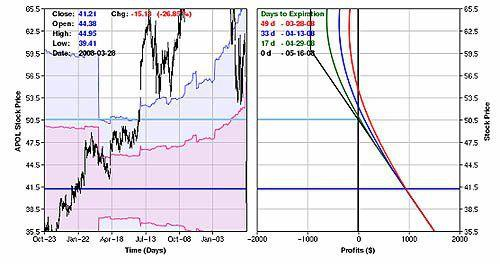

## Table of Contents

## What are earnings surprises and why are they important for investors?

Earnings surprises happen when a company's reported earnings are different from what financial experts predicted. If a company earns more than expected, it's a positive surprise. If it earns less, it's a negative surprise. These surprises can make a company's stock price go up or down quickly because investors are always trying to guess what will happen next.

Earnings surprises are important for investors because they can show how well a company is doing compared to what people thought. If a company keeps beating expectations, investors might think it's a good investment and want to buy its stock. On the other hand, if a company often misses its targets, investors might lose confidence and sell their shares. Knowing about earnings surprises helps investors make smarter choices about buying or selling stocks.

## What is a straddle and how does it work?

A straddle is a trading strategy where you buy both a call option and a put option for the same stock, at the same time, and with the same expiration date and strike price. The idea is to make money no matter which way the stock price moves, as long as it moves a lot. If the stock price goes up a lot, you can use the call option to buy the stock at a lower price and then sell it at the higher market price. If the stock price goes down a lot, you can use the put option to sell the stock at a higher price than the market price.

The tricky part about a straddle is that it costs money to buy both options, so the stock price has to move enough to cover this cost before you start making a profit. If the stock price doesn't move much, you could lose the money you spent on the options. So, a straddle is usually used when someone thinks a big change in the stock price is coming, but they're not sure if it will go up or down.

## What is a strangle and how does it differ from a straddle?

A strangle is another trading strategy similar to a straddle, but with a key difference. In a strangle, you buy a call option and a put option for the same stock and with the same expiration date, but the strike prices are different. The call option has a higher strike price, while the put option has a lower strike price. Like a straddle, the goal is to make money if the stock price moves a lot, but you're betting on a bigger move because the options are further out of the money.

The main difference between a strangle and a straddle is the cost and the potential profit. A strangle is usually cheaper to set up because you're buying options that are further away from the current stock price. However, because the options are further out of the money, the stock price needs to move more for you to start making a profit. So, if you think the stock will make a big move but you want to spend less upfront, a strangle might be a better choice than a straddle.

## How can straddles and strangles be used to profit from earnings surprises?

Straddles and strangles can be used to make money from earnings surprises because these surprises can cause big changes in a stock's price. When a company reports earnings, the stock price can jump up or down a lot depending on whether the news is good or bad. If you think a big surprise is coming but you're not sure if it will be good or bad, you can use a straddle or a strangle. A straddle involves buying a call option and a put option with the same strike price and expiration date. This way, you can make money if the stock price moves a lot in either direction.

A strangle is similar, but it's a bit cheaper to set up because you buy options with different strike prices. You buy a call option with a higher strike price and a put option with a lower strike price. This means the stock price has to move more for you to start making money, but it costs less to get started. Both strategies can be good ways to bet on big moves in a stock's price after an earnings report, but they work best if you think the stock will move a lot, even if you're not sure which way it will go.

## What are the key factors to consider when selecting stocks for straddles and strangles around earnings announcements?

When picking stocks for straddles and strangles around earnings announcements, it's important to look at how much the stock price usually moves after earnings. Some companies have bigger price swings than others. If a stock tends to move a lot after earnings, it might be a good choice for these strategies. You should also check the stock's "implied volatility," which is a way of guessing how much the stock price might change. If the implied volatility is high before earnings, the options will be more expensive, but that could mean a bigger payoff if the stock moves a lot.

Another thing to think about is the company's track record with earnings surprises. If a company often beats or misses earnings expectations by a lot, it might be more likely to cause a big stock price move. You should also consider the overall market conditions and any big news or events that could affect the stock's price around the earnings date. By looking at these factors, you can make a better guess about whether a straddle or strangle will be profitable after an earnings announcement.

## What are the potential risks associated with using straddles and strangles to trade earnings surprises?

Using straddles and strangles to trade earnings surprises can be risky. The main risk is that the stock price might not move enough after the earnings report to make up for the cost of the options. Both strategies involve buying two options, which means you have to pay for both. If the stock price stays about the same or only moves a little, you could lose the money you spent on the options. This is called "theta decay," where the value of the options goes down over time if they aren't used.

Another risk is that the stock price might move in the wrong direction or not as much as you expected. With a straddle, the stock has to move a good amount in either direction for you to make money. With a strangle, the stock has to move even more because the options are further out of the money. If the stock moves a lot but not enough to cover the cost of the options, you could still lose money. Also, if the market is very unpredictable or there's big news that affects the stock price in a way you didn't expect, your strategy might not work out.

## How do implied volatility and historical volatility influence the pricing of straddles and strangles before earnings?

Implied volatility and historical volatility are important for figuring out how much straddles and strangles will cost before earnings. Implied volatility is a guess about how much the stock price might move in the future. Before earnings, if people think the stock will move a lot, the implied volatility goes up. This makes the options more expensive because there's a bigger chance they'll be worth something after the earnings news comes out. So, if you're thinking about using a straddle or strangle, you'll have to pay more if the implied volatility is high.

Historical volatility looks at how much the stock price has moved in the past. If a stock usually jumps around a lot after earnings, it might be more likely to do that again. Traders look at this to help guess what might happen next time. If the stock has a history of big moves after earnings, the options might cost more because people expect the same thing to happen again. Both implied and historical volatility help decide how much you'll need to spend on a straddle or strangle, and they show how much risk you're taking on.

## What are some advanced strategies for adjusting straddles and strangles post-earnings?

After an earnings announcement, you might need to adjust your straddle or strangle to make the most of the stock's price movement or to cut your losses. One way to adjust is by rolling the options. This means you can sell the options you have and buy new ones with different strike prices or expiration dates. If the stock price moved a lot but not enough for you to make money, you could roll to options with a new expiration date further in the future. This gives the stock more time to move in your favor. Or, if the stock moved in one direction, you could roll the option that's out of the money to a different strike price to give it a better chance of becoming profitable.

Another strategy is to close one side of the trade. If the stock price moved up a lot, you could sell the call option for a profit and keep the put option, turning your straddle or strangle into a cheaper bet that the stock will go back down. If the stock went down a lot, you could do the opposite and sell the put option. This way, you lock in some profit and reduce your risk. You might also decide to take some profit off the table by selling part of your position, like selling half of your options, and letting the other half ride to see if you can make more money. These adjustments help you manage your trade better after the earnings surprise.

## How can one analyze the success rate of straddles and strangles in past earnings seasons?

To analyze how well straddles and strangles worked in past earnings seasons, you need to look at the stock prices before and after the earnings announcements. Start by finding the stock's price and the options' prices right before the earnings report. Then, see how the stock price changed after the earnings news came out. If the stock moved a lot and the options made more money than they cost, the strategy was successful. You can do this for many earnings reports and keep track of how often the strategy made money and how much it made or lost each time.

By looking at a lot of past earnings data, you can figure out the success rate of straddles and strangles. You can see if they worked better for some companies than others, or if they were more successful in certain market conditions. You might notice that the strategies worked better when the implied volatility was high before earnings, or when the stock had a history of big moves after earnings. This kind of analysis can help you decide if using straddles and strangles around earnings is a good idea for you, and which stocks might be the best choices for these strategies.

## What role does market sentiment play in the effectiveness of straddles and strangles during earnings?

Market sentiment, or how people feel about the market, can really affect how well straddles and strangles work around earnings time. If everyone is feeling hopeful and thinks the stock will go up, this can push the stock price up before earnings. But if the earnings are not as good as expected, the stock might fall a lot, which could make a straddle or strangle profitable. On the other hand, if people are feeling worried and think the stock will go down, the stock price might already be low before earnings. If the earnings are better than expected, the stock could jump up, again making the straddle or strangle work out well.

The key thing is that market sentiment can make the stock move more than usual, which is what you need for straddles and strangles to be successful. If everyone is expecting a big surprise, the options might be more expensive because of high implied volatility. But if the earnings really do surprise everyone, the big move in the stock price could still make the strategy pay off. So, understanding how people feel about the market and the stock can help you decide if using a straddle or strangle around earnings is a good idea.

## How can traders use technical analysis to enhance the timing of entering and exiting straddle and strangle positions?

Traders can use technical analysis to help them decide the best times to start and end straddle and strangle positions. By looking at charts and indicators, traders can spot trends and patterns that might tell them when a big price move is coming. For example, if a stock is near a big support or resistance level right before earnings, it might be a good time to set up a straddle or strangle. Technical indicators like the Relative Strength Index (RSI) or Bollinger Bands can also show if a stock is overbought or oversold, which might mean a price swing is on the way. This can help traders pick the right moment to enter their positions.

Once the earnings are out and the stock price moves, technical analysis can also help traders know when to close their positions. If the stock price breaks through a key level or an indicator like the Moving Average Convergence Divergence (MACD) shows a strong trend, it might be time to take profits or cut losses. By watching these signs, traders can make better choices about when to get out of their straddles and strangles, making sure they don't miss out on gains or hold onto losing trades for too long.

## What are the tax implications of profits and losses from straddles and strangles in different jurisdictions?

The tax rules for profits and losses from straddles and strangles can be different depending on where you live. In the United States, any money you make from these options is usually taxed as capital gains. If you hold the options for less than a year, you'll pay short-term capital gains tax, which is the same as your regular income tax rate. If you hold them for more than a year, you'll pay the lower long-term capital gains tax rate. Losses can be used to reduce your taxes, but there are special rules for options trading that you need to know about. It's a good idea to talk to a tax expert to make sure you're following all the rules.

In other places, like the United Kingdom, profits from options trading are usually taxed as income. This means you'll pay the same tax rate on your options profits as you do on your salary. Losses can sometimes be used to lower your tax bill, but the rules can be tricky. In Canada, profits from options are treated as capital gains, and you only pay tax on half of your gains. Losses can be used to reduce your taxable income, but again, it's important to understand the specific rules. No matter where you live, it's always smart to get advice from a tax professional to make sure you're doing everything right.

## What are Straddles and Strangles and how do they work?

Straddles and strangles are options strategies that traders commonly use to profit from substantial stock price movements, particularly in highly volatile market conditions such as during earnings announcements. Each approach involves purchasing a call option and a put option, but they differ in terms of the strike prices chosen, leading to variations in cost, risk, and potential profitability.

A straddle involves purchasing both a call option and a put option with the same strike price and the same expiration date. This strategy is typically used when a trader expects high volatility in the stock price but is uncertain about the direction of the movement. The logic behind this approach is that a significant price change will lead one of the options to become profitable, potentially covering the loss of the other option and making a net profit. The profitability of a straddle depends on the magnitude of the stock's price movement relative to the total premium paid for both options.

Mathematically, the payoff for a straddle can be expressed as:

$$
\text{Payoff} = \max(0, S - K) + \max(0, K - S) - C - P
$$

where $S$ is the stock price at expiration, $K$ is the strike price, $C$ is the premium paid for the call option, and $P$ is the premium paid for the put option.

Conversely, a strangle involves buying a call option and a put option that have different strike prices but the same expiration date. Typically, the call option is purchased with a higher strike price than the current stock price, and the put option is purchased with a lower strike price. This setup usually costs less in terms of premiums compared to a straddle because both options are out-of-the-money (OTM) at the time of purchase.

A strangle tends to require a more substantial movement in the stock price to achieve profitability since the stock has to move beyond the strike prices of either option to generate substantial returns. Nonetheless, the potential for higher profitability exists if the stock undergoes a significant movement, as the purchase of cheaper options allows for larger gains if those options become in-the-money (ITM).

The payoff for a strangle is represented by:

$$
\text{Payoff} = \max(0, S - K_2) + \max(0, K_1 - S) - C - P
$$

where $S$ is the stock price at expiration, $K_1$ and $K_2$ are the strike prices for the put and call options respectively (with $K_1 < S < K_2$ at the outset), and $C$ and $P$ are the premiums for the call and put options correspondingly.

Both strategies bank on the potential for [volatility](/wiki/volatility-trading-strategies), particularly during events such as earnings announcements, which are known to cause sudden and sharp movements in stock prices. However, the selection between a straddle and a strangle often hinges on the trader's forecast for potential price movement, willingness to bear risk, and cost considerations.

## References & Further Reading

[1]: Natenberg, S. (1994). ["Option Volatility and Pricing: Advanced Trading Strategies and Techniques."](https://www.amazon.com/Option-Volatility-Pricing-Strategies-Techniques/dp/0071818774) McGraw-Hill Education.

[2]: McMillan, L. G. (2002). ["Options as a Strategic Investment."](https://www.amazon.com/Options-Strategic-Investment-Lawrence-McMillan/dp/0735201978) New York Institute of Finance.

[3]: Hull, J. C. (2017). ["Options, Futures, and Other Derivatives."](https://www.semanticscholar.org/paper/Options%2C-Futures%2C-and-Other-Derivatives-Hull/89bdee500c8623864fc9eb7a471546aa713acc44) Pearson.

[4]: Israel, R., & Moskowitz, T. J. (2013). ["The Role of Shorting, Firm Size, and Time on Market Anomalies."](https://www.sciencedirect.com/science/article/pii/S0304405X12002401) The Journal of Portfolio Management.

[5]: Cao, C., Choe, H., & Hatheway, F. (1997). ["Does the Specialist Matter? Differential Execution Costs and Intersecurity Substitution."](https://onlinelibrary.wiley.com/doi/10.1111/j.1540-6261.1997.tb01106.x) The Journal of Finance.