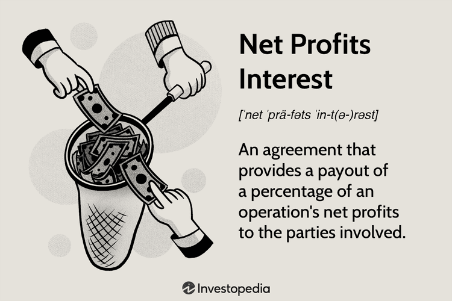

In the fast-paced world of business finance, understanding various investment concepts paves the way for growth and sustainability. In this dynamic environment, terms like profits interest, business finance, capital interest, and algorithmic trading are not mere jargon but crucial components influencing corporate strategies and success. These elements form the backbone of financial operations, guiding decisions that drive organizational progress and efficiency.

Profits interest, an intriguing concept, represents an equity interest granted to company employees or partners, offering them a stake in future profits without the need for upfront capital investment. This form of equity interest is particularly appealing in entrepreneurial ventures and partnerships seeking to motivate their employees by aligning their financial gain with the success of the company.



On the other hand, capital interest refers to the right of stakeholders to a share of the company's existing value at the time of interest grant. It plays an essential role in business finance, reflecting an investor's or partner's claim on a company's assets upon liquidation or other capital events. Understanding these distinctions is crucial as they impact stakeholder expectations and financial outcomes.

Business finance itself is an umbrella term encompassing all activities and decisions that allow an organization to maintain financial health. It involves prudent management of assets and liabilities while strategizing to enhance profitability and achieve long-term objectives. Integrated financial management becomes pivotal in navigating economic fluctuations and market demands.

Algorithmic trading, a facet of modern finance, leverages computer algorithms to automatically execute trades based on specific criteria. This technology-driven approach enhances the speed and precision of trading activities, although it requires sophisticated systems and an understanding of market mechanics.

This article explores these concepts—profits interest, business finance, capital interest, and algorithmic trading—highlighting their significance in the financial sector. By understanding how they influence each other, businesses can better strategize for success, aligning employee incentives with financial performance and leveraging technological advancements for competitive advantage.

## Table of Contents

## Understanding Profits Interest

Profits interest is an essential concept in business finance, especially within partnerships and startups. It is a type of equity right that offers employees a share in the future profits and appreciation of a company without requiring an upfront capital investment. This mechanism is designed to incentivize employees by aligning their interests with those of the company, thereby encouraging them to contribute towards the company's growth and success. 

To understand profits interest, it's crucial to distinguish it from capital interest. Capital interest represents an equity share that equates to a current value in the company. It entails a stake in the present value of the company and is realized during events like liquidation. In contrast, profits interest only entitles holders to future profits and appreciation, with no immediate realization of current equity value. This differentiation is significant as it makes profits interest particularly appealing in startups or partnerships, where immediate cash flow or realization of value might be limited.

Profits interest involves issuing an interest in the partnership's profits and not in its capital. This distinction provides an advantage in the early stages of a business or during financial constraints since it allows companies to provide a stake in future success without diluting current ownership or requiring additional investment. By making employees stakeholders, profits interest helps in motivating the personnel to enhance the company’s performance and reach strategic goals. 

In contrast to a traditional bonus system, where employees are rewarded based on annual performance with cash payouts, profits interest offers a more long-term incentive. This share in future profits can lead to substantial financial gain if the company grows and succeeds, thus creating a vested interest for employees to contribute positively towards the organization's strategic objectives. Moreover, because profits interest does not represent immediate taxable income at the time of grant, it may also provide a tax deferral advantage for employees.

In summary, profits interest is a strategic tool used by businesses to attract and retain talented employees by giving them a stake in the company's promising future. This approach not only aids in maintaining a motivated workforce but also restricts the immediate financial impact on the company, as employees become, in effect, partners in the journey towards shared success.

## Capital Interest: A Brief Overview

Capital interest denotes an individual's or entity's right to receive a portion of the value of a partnership upon the grant date. It is a fundamental element of business finance, often closely associated with the liquidation value of a company. Liquidation value represents the net value that would be realized if a company’s assets were sold off and liabilities paid. Thus, capital interest becomes crucial for stakeholders aiming to assess the tangible value they might derive from their investment at a specific point in time.

For investors and stakeholders, understanding capital interest is pertinent as it provides insight into the potential monetary benefits they might receive, particularly during liquidation events. By analyzing capital interest, stakeholders gain a clear view of the proportion of the enterprise's existing value they are entitled to, thus facilitating informed decision-making. This comprehension is integral in evaluating investment opportunities, negotiating partnership stakes, and formulating effective [exit](/wiki/exit-strategy) strategies.

In mathematical terms, consider the liquidation value (LV) of a company as the difference between its total assets (A) and liabilities (L):

$$
LV = A - L
$$

The capital interest often ties back to this value, allowing stakeholders and investors to predict their share based on their specific entitlement percentage.

Comprehensive knowledge of capital interest aids investors in aligning their financial strategies with the intrinsic value of their investments, ensuring they are well-positioned to maximize returns. For businesses, acknowledging the nuances of capital interest can lead to better stakeholder relations and transparent financial practices, ultimately fostering trust and sustainability in operations.

## The Role of Business Finance

Business finance involves a comprehensive range of financial activities and decisions that facilitate an organization's smooth and efficient operation. It is fundamental to the optimal management of assets, liabilities, income, and expenses, which collectively contribute to sustainable profit margins and financial health.

The efficient management of assets and liabilities is a cornerstone of business finance. Assets, such as cash, inventories, and equipment, must be effectively utilized to generate revenue. Simultaneously, liabilities, including debts and obligations, must be controlled to minimize financial risk and overhead costs. A key aspect of managing these elements involves maintaining a healthy balance sheet, where the equation Assets = Liabilities + Equity holds true, ensuring that the company operates on solid financial footing.

Income management is another critical dimension of business finance. It involves tracking and analyzing revenue streams to ensure consistent cash flow. Organizations need to oversee sales forecasts, operating revenue, and net income to make informed decisions that will boost profitability. This may include identifying new market trends, adjusting pricing strategies, or cutting down on unproductive expenditures.

Expense management plays a pivotal role in preserving profit margins. Businesses must optimize their operational costs, including labor, materials, and overheads, to sustain profitability. This often requires conducting detailed financial analysis and adopting cost-reduction strategies, such as process automation or supply chain efficiencies, which can enhance the organization's bottom line.

Strategic financial planning is vital in supporting long-term growth and achieving corporate objectives. This involves making critical financial decisions regarding investments, capital expenditures, and financial structures. For instance, an organization might decide to retain earnings for growth investments or issue equity to fund new projects. Strategic decisions are typically based on comprehensive financial data analysis, using metrics like return on investment (ROI), internal rate of return (IRR), and net present value (NPV).

Effective financial management also ensures that the organization remains compliant with existing regulatory frameworks and standards, reducing the risk of legal or financial penalties. Moreover, it enables businesses to build robust financing strategies and adopt innovative financial instruments that align with their long-term vision and resilience against market fluctuations.

In summary, business finance is imperative for organizational sustainability and prosperity. It requires a holistic approach to financial planning and control, focusing on maximizing efficiency and optimizing financial health to support continued development and competitive advantage.

 to Algorithmic Trading

Algorithmic trading, commonly known as algo trading, employs computer algorithms to execute trading decisions in the financial markets. These algorithms follow pre-defined criteria and strategies to place trades at a speed and frequency that is impossible for human traders. This approach leverages mathematical models and statistical analyses to identify and capitalize on market opportunities, often in fractions of a second.

High-frequency trading ([HFT](/wiki/high-frequency-trading-strategies)) is a subset of [algorithmic trading](/wiki/algorithmic-trading) characterized by rapid trade execution, frequently involving thousands of trades within seconds. By minimizing human intervention, algo trading reduces the possibility of human errors and biases, significantly increasing the efficiency and effectiveness of trading operations. The algorithms continuously analyze vast datasets, detecting patterns and signals indicative of tradable opportunities.

In recent years, technological advancements have propelled algo trading to the forefront of market activities. It now serves as an essential tool for institutional investors, hedge funds, and other financial entities. These institutions rely on algorithmic trading to manage large portfolios, optimize execution processes, and enhance [liquidity](/wiki/liquidity-risk-premium) provision. Furthermore, by integrating complex strategies such as [market making](/wiki/market-making), [arbitrage](/wiki/arbitrage), and [trend following](/wiki/trend-following), algorithmic trading allows for sophisticated market engagement and risk management.

Moreover, algo trading facilitates improved market quality. By ensuring tighter spreads and greater depth, it contributes to market efficiency and price discovery. However, it requires robust technological infrastructure, including high-speed internet connections and powerful computing hardware, to ensure optimal performance. As a result, not only has algo trading transformed the trading landscape, but it has also raised the technology benchmark for trading platforms and market participants globally.

The continual evolution of computational technology, coupled with increased access to large datasets, suggests that algorithmic trading will only become more ubiquitous and sophisticated, reshaping the future of financial markets further.

## Benefits and Challenges of Algo Trading

Algorithmic trading, often referred to as algo trading, leverages computer algorithms to automatically execute trades based on predefined criteria. This approach brings with it notable benefits that have transformed modern trading practices in various financial markets.

**Benefits of Algorithmic Trading**

1. **Speed**: Algo trading can execute trades at speeds unattainable by human traders. By using complex algorithms, trading systems can react to market conditions in milliseconds, swiftly taking advantage of trading opportunities. This speed ensures that traders can capitalize on even the smallest market movements before they dissipate.

2. **Accuracy**: Through precise mathematical models and pre-set rules, algo trading eliminates the chances of human error. This precision reduces transaction costs and minimizes slippage, ensuring that trades are executed exactly as planned.

3. **Processing Large Volumes of Data**: Algo trading systems can analyze vast datasets simultaneously to identify profitable opportunities. This ability to process and interpret multiple data streams at once allows for more informed decision-making and better risk management.

4. **High-Frequency Trading**: With algo trading, high-frequency trading (HFT) becomes possible, enabling the execution of a large number of orders at extremely high speeds. This tactic is beneficial for arbitraging small price discrepancies across different markets or securities.

**Challenges of Algorithmic Trading**

Despite its benefits, algorithmic trading also presents several challenges:

1. **Dependence on Technology**: The reliance on complex computational algorithms and robust infrastructure makes firms susceptible to technology-related risks. System failures, connectivity issues, or bugs in the algorithm can lead to substantial financial losses.

2. **High-Speed Data Processing Requirements**: The effectiveness of algo trading depends heavily on the ability to process and act upon massive volumes of data in real-time. This demand necessitates advanced data centers and high-speed network capabilities, which can be costly.

3. **Market Volatility**: Automated trading can lead to increased market volatility, as the rapid execution of trades by multiple algorithms may lead to abrupt price swings. Events like the Flash Crash of 2010 are often cited as examples where algorithmic trading played a role in exacerbating market instability.

4. **Regulatory Concerns**: As algo trading grows in prevalence, so do the regulatory challenges surrounding its use. Ensuring transparency and fair market practices are vital to prevent manipulative behaviors and maintain investor trust.

In conclusion, while algorithmic trading offers unprecedented speed and precision in executing trades, it also comes with technological and market-related challenges. Understanding and mitigating these challenges is essential for integrating algorithmic trading strategies effectively within the broader scope of financial market activities.

## Integrating Profits Interest and Algo Trading in Business Strategy

Integrating profits interest and algorithmic trading into a business strategy can significantly enhance both financial incentives for employees and trading efficiency. Profits interest aligns the interests of employees with the company's financial growth, providing a share in future profits without requiring initial investment. This kind of incentive is particularly effective in fostering a culture of growth and collaboration within startups and partnerships where equity up-front might be limited.

Algorithmic trading, leveraging pre-defined criteria for automating transactions, offers substantial benefits in terms of speed and precision. By capitalizing on these advantages, companies can conduct high-frequency trading and process large amounts of market data swiftly, thereby minimizing human errors and improving overall market responsiveness.

The integration of profits interest with algorithmic trading can lead to an optimized financial strategy. As employees are motivated to contribute to the company's financial performance through profits interest, the company can simultaneously enhance its trading operations using algorithmic methods. For instance, an organization could allocate profits interest to technical teams working on refining trading algorithms, thus directly aligning their incentives with the efficiency and success of trading operations.

Moreover, companies can develop more sophisticated algorithmic trading strategies that incorporate employee performance metrics as variables influencing trade execution. Such strategies could automatically adjust trading behavior based on real-time feedback from employee-driven results, achieving a dynamic interaction between human capital and automated tasks.

Python, as a tool, can play a pivotal role here. Businesses can implement Python-based algorithms that process employee performance data and market trends simultaneously. For example, an algorithm might be designed to increase trading frequencies or adjust risk parameters dynamically based on key performance indicators (KPIs) tied to profits interest goals.

```python
def adjust_trading_strategy(employee_kpi, market_trend):
    if employee_kpi > threshold and market_trend == 'bullish':
        increase_trading_frequency()
    elif employee_kpi < threshold and market_trend == 'bearish':
        reduce_trading_risk()

def increase_trading_frequency():
    # Code to increase the number of trades
    pass

def reduce_trading_risk():
    # Code to lower the risk level of trades
    pass

# Example execution
employee_kpi = 85  # A hypothetical KPI score
market_trend = 'bullish'
adjust_trading_strategy(employee_kpi, market_trend)
```

By incorporating dynamic strategies that link employee incentives to algorithmic trading parameters, companies can better manage risks while maximizing returns. This symbiotic relationship not only enhances employee engagement but also supports the robust and agile financial management needed to succeed in competitive markets.

## Conclusion

In the fast-paced financial landscape, comprehensively understanding concepts such as profits interest, capital interest, and algorithmic trading is paramount for any business aiming to achieve sustained growth and maintain a competitive edge. Each of these components plays a distinct yet interconnected role in shaping a robust financial strategy.

Profits interest functions as a motivational tool, aligning employee interests with the company's future success without requiring upfront monetary investment. It enables businesses to attract and retain talented personnel by offering a stake in the future profits, thus fostering a sense of ownership and commitment. This alignment is critical for startups and partnerships where immediate capital is limited, yet growth potential is substantial.

Conversely, capital interest allows investors and stakeholders to comprehend their immediate and potential future returns by providing them with a share of the existing value in a partnership. This understanding is vital for making informed investment decisions and evaluating the potential profitability of a venture, especially during liquidation events.

Algorithmic trading represents the technological frontier in financial markets, enabling rapid and efficient trade execution. By automating trades based on predefined algorithms, firms can minimize human error and capitalize on market opportunities with unparalleled precision and speed. Despite inherent challenges, such as dependency on technology and market [volatility](/wiki/volatility-trading-strategies), algorithmic trading significantly enhances an entity's ability to engage in high-frequency trading and data analysis.

Integrating these elements—profits interest, capital interest, and algorithmic trading—into a cohesive business strategy offers immense potential. Businesses can enhance efficiency, ensure stakeholder alignment with long-term goals, and exploit technological advancements for market success. This synergistic approach can lead businesses to a path of sustained growth, transforming challenges into opportunities and building a resilient, forward-looking enterprise prepared for the evolving dynamics of the global financial landscape.

## References & Further Reading

[1]: Sykes, E., & Guy, R. (2017). ["Profits Interests: The What, Why, and How of a Powerful Incentive Structure."](https://intelliven.com/wp-content/uploads/2016/11/The-Profits-Interest-_-Bronfman-_Sept-2016.pdf) In Mergers & Acquisitions: A Guide to Creating Value for Stakeholders.

[2]: López de Prado, Marcos. ["Advances in Financial Machine Learning."](https://www.amazon.com/Advances-Financial-Machine-Learning-Marcos/dp/1119482089) Wiley, 2018.

[3]: Aronson, D. R. (2007). ["Evidence-Based Technical Analysis: Applying the Scientific Method and Statistical Inference to Trading Signals."](https://onlinelibrary.wiley.com/doi/book/10.1002/9781118268315) John Wiley & Sons.

[4]: Jansen, Stefan. ["Machine Learning for Algorithmic Trading."](https://github.com/stefan-jansen/machine-learning-for-trading) Packt Publishing, 2020.

[5]: Chan, E. (2009). ["Quantitative Trading: How to Build Your Own Algorithmic Trading Business."](https://github.com/ftvision/quant_trading_echan_book) John Wiley & Sons.