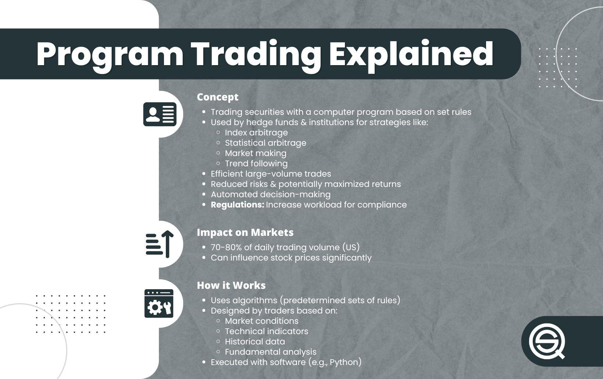

## Table of Contents

## What is program trading?

Program trading is when computers use special programs to buy and sell lots of stocks at the same time. These programs follow rules set by people to make trades quickly, often in just a few seconds. This is different from regular trading where people make each trade one by one. Program trading is used a lot by big investors and companies that manage money for others.

These programs can help make the stock market work better by making it easier to buy and sell stocks. But, they can also cause big changes in stock prices very quickly. Sometimes, if many programs start selling at the same time, it can make stock prices drop a lot. This is why people who watch the stock market pay close attention to program trading.

## How does program trading differ from traditional trading?

Program trading and traditional trading are different in how they work and who does them. In traditional trading, a person looks at the stock market and decides when to buy or sell stocks. They might use information from news, company reports, or their own guesses about what will happen next. It's like shopping at a store where you pick each item you want to buy one at a time.

On the other hand, program trading uses computers and special software to make trades. These programs follow a set of rules to buy and sell many stocks at once, much faster than a person could. It's like using a shopping list and a robot to quickly grab everything on the list from the store. This method is often used by big investors and companies that manage a lot of money, and it can affect the stock market in big ways because of how fast and large the trades can be.

## What are the main types of program trading strategies?

One common type of program trading strategy is called index [arbitrage](/wiki/arbitrage). This is when a computer program looks for small differences in price between a stock index, like the S&P 500, and the stocks that make up that index. If the program finds a difference, it will quickly buy the cheaper one and sell the more expensive one, hoping to make a small profit from the difference. This kind of trading helps keep the prices of the index and its stocks in line with each other.

Another type of program trading strategy is called [statistical arbitrage](/wiki/statistical-arbitrage). This strategy uses math and past data to find patterns in how different stocks move compared to each other. The program then makes trades based on these patterns, buying stocks it thinks will go up and selling stocks it thinks will go down. This method tries to make money from small changes in stock prices over short periods of time.

A third type of program trading strategy is portfolio insurance. This strategy is used to protect a group of investments from big drops in value. The program will automatically sell stocks if their prices start to fall, trying to limit losses. It's like having a safety net for your investments, but it can also make the market go down faster if many programs start selling at the same time.

## Can you explain the concept of index arbitrage in program trading?

Index arbitrage in program trading is a strategy where a computer program looks for small price differences between a stock index, like the S&P 500, and the individual stocks that make up that index. The idea is to find moments when the index is priced slightly differently from the total value of its component stocks. When the program spots this difference, it quickly buys the cheaper one and sells the more expensive one. The goal is to make a small profit from the difference in prices, which can add up over many trades.

This type of trading helps keep the prices of the index and its stocks closely aligned. If the index is trading at a higher price than the sum of its stocks, the program will buy the stocks and sell the index, pushing their prices back together. On the other hand, if the index is cheaper, the program will buy the index and sell the stocks. By doing this, index arbitrage helps make the stock market more efficient, but it requires very fast computers and good timing to work well.

## What role do algorithms play in program trading?

Algorithms are like the brain behind program trading. They are sets of rules that computers follow to decide when to buy and sell stocks. These rules can be simple or very complex, but they all help the computer make quick decisions without needing a person to tell it what to do each time. In program trading, algorithms look at a lot of information very fast, like stock prices, news, and even other trades happening at the same time. This helps them find the best times to make trades and try to make money.

Using algorithms in program trading makes everything happen much faster than if a person was doing it. A computer can make thousands of trades in just a few seconds, which is way faster than any human could. This speed can be good for finding small chances to make money, but it can also cause big changes in the stock market if lots of computers start trading at the same time. That's why it's important for the people who make these algorithms to be careful and make sure they work well without causing too much trouble.

## How is program trading regulated, and what are the key regulations to be aware of?

Program trading is watched over by rules to make sure it's fair and safe for everyone in the stock market. In the United States, the main group that makes these rules is the Securities and Exchange Commission (SEC). They have rules like the Market Access Rule, which says that companies using program trading must have good systems to check and control their trades. This helps stop mistakes or bad trades from causing big problems in the market. Another rule is the Circuit Breaker Rule, which can stop trading for a little while if stock prices start moving too fast, giving everyone a chance to calm down and think.

There are also rules from other places, like stock exchanges themselves. For example, the New York Stock Exchange (NYSE) has its own set of rules for program trading. One important rule is the Rule 80A, which makes companies report their program trades. This helps keep an eye on how much program trading is happening and makes sure it's not messing up the market too much. All these rules together try to keep program trading in check, making sure it helps the market work well without causing too much trouble.

## What are some common software tools used in program trading?

In program trading, people use special computer programs to help them buy and sell stocks quickly. One popular tool is MetaTrader, which is easy to use and lets traders set up their own trading rules, or algorithms. Another tool is NinjaTrader, which is good for people who want to see lots of information about the market and make their own trading plans. Both of these tools have features that help traders keep an eye on the market and make trades without having to watch the screen all the time.

Another common tool is Bloomberg Terminal, which is used by big companies and professional traders. It gives a lot of information about the market, news, and even lets traders make trades right from the program. It's more expensive than MetaTrader or NinjaTrader, but it's very powerful and used by many people who work in finance. All these tools help make program trading easier and faster, letting computers do a lot of the work.

## How can program trading impact market volatility?

Program trading can make the stock market move up and down more quickly, which is called market [volatility](/wiki/volatility-trading-strategies). This happens because computers using program trading can buy and sell a lot of stocks in just a few seconds. If many of these programs start buying or selling at the same time, it can push stock prices up or down very fast. For example, if a lot of programs see a small drop in prices and start selling at the same time, it can make prices fall even more quickly.

On the other hand, program trading can also help calm down the market sometimes. When these programs find small differences in prices, they can make trades that help bring prices back to normal. This can make the market more stable by keeping prices from moving too far away from what they should be. But, because program trading is so fast and can involve a lot of money, it's important for people who watch the market to be careful and make sure it doesn't cause too much trouble.

## What are the risks associated with program trading?

Program trading can be risky because it uses computers to make trades very quickly. If something goes wrong with the computer program, it can cause big problems. For example, if the program makes a mistake and starts selling a lot of stocks at once, it can make stock prices drop a lot. This is called a "flash crash," and it can scare people and make the market hard to predict. Also, if many programs are using the same rules to trade, they might all start buying or selling at the same time, which can make prices move a lot.

Another risk is that program trading can make the market more volatile, meaning prices can go up and down very quickly. This can be hard for regular people who are trying to invest their money because they might not know why prices are changing so much. It can also be hard for big investors who need to make sure their money is safe. Even though program trading can help make the market work better by finding small chances to make money, it's important for everyone to be careful and watch how it affects the market.

## Can you provide examples of successful program trading strategies?

One successful program trading strategy is called index arbitrage. This strategy works by looking for small differences in price between a stock index, like the S&P 500, and the stocks that make up that index. If the program finds that the index is a bit more expensive than the total value of its stocks, it will quickly buy the stocks and sell the index. By doing this, the program can make a small profit from the price difference. This strategy helps keep the prices of the index and its stocks in line with each other, making the market more efficient.

Another successful strategy is statistical arbitrage. This strategy uses math and past data to find patterns in how different stocks move compared to each other. The program then makes trades based on these patterns, buying stocks it thinks will go up and selling stocks it thinks will go down. This method tries to make money from small changes in stock prices over short periods of time. It's like betting that certain stocks will do better than others, and it can be very successful if the patterns the program finds are accurate.

## How do institutional investors typically use program trading?

Institutional investors, like big banks and pension funds, use program trading to manage their large amounts of money more efficiently. They use computers to buy and sell lots of stocks at the same time, following rules set by their trading strategies. This helps them take advantage of small price differences in the market quickly, which can add up to big profits over time. For example, they might use index arbitrage to make money from the small gaps between a stock index and its component stocks.

These investors also use program trading to protect their investments from big drops in the market. They might use a strategy called portfolio insurance, where the computer program automatically sells stocks if prices start to fall, trying to limit their losses. This can be helpful, but it can also make the market more volatile if many investors start selling at the same time. Overall, program trading helps institutional investors manage their money more effectively, but they need to be careful to not cause too much trouble in the market.

## What future trends are expected to influence program trading?

In the future, program trading is expected to become even more advanced with the help of new technology. One big trend is the use of [artificial intelligence](/wiki/ai-artificial-intelligence) (AI) and [machine learning](/wiki/machine-learning). These technologies can help computers learn from past trades and get better at finding good times to buy and sell stocks. This could make program trading even faster and more accurate, helping investors make more money. Another trend is the growth of high-frequency trading, where computers make thousands of trades in just a few seconds. This can make the market move very quickly, but it also means that investors need to be careful to not cause too much trouble.

Another important trend is the increasing use of big data. Program trading programs will use more and more information from different places, like news, social media, and even weather reports, to make better trading decisions. This can help the programs understand what's happening in the market and react faster. However, with more data comes more responsibility to make sure the programs are using it correctly and not making the market too unpredictable. Overall, these trends could make program trading more powerful, but it's important for everyone to keep an eye on how they affect the market.

## References & Further Reading

[1]: Cartea, Á., Jaimungal, S., & Penalva, J. (2015). ["Algorithmic and High-Frequency Trading."](https://assets.cambridge.org/97811070/91146/frontmatter/9781107091146_frontmatter.pdf) Cambridge University Press.

[2]: Kissell, R. (2014). ["The Science of Algorithmic Trading and Portfolio Management."](https://www.sciencedirect.com/book/9780124016897/the-science-of-algorithmic-trading-and-portfolio-management) Academic Press.

[3]: Aldridge, I. (2013). ["High-Frequency Trading: A Practical Guide to Algorithmic Strategies and Trading Systems."](https://www.amazon.com/High-Frequency-Trading-Practical-Algorithmic-Strategies/dp/1118343506) Wiley.

[4]: De Prado, M. L. (2018). ["Advances in Financial Machine Learning."](https://www.amazon.com/Advances-Financial-Machine-Learning-Marcos/dp/1119482089) Wiley.

[5]: Chan, E. (2008). ["Quantitative Trading: How to Build Your Own Algorithmic Trading Business."](https://github.com/ftvision/quant_trading_echan_book) Wiley.