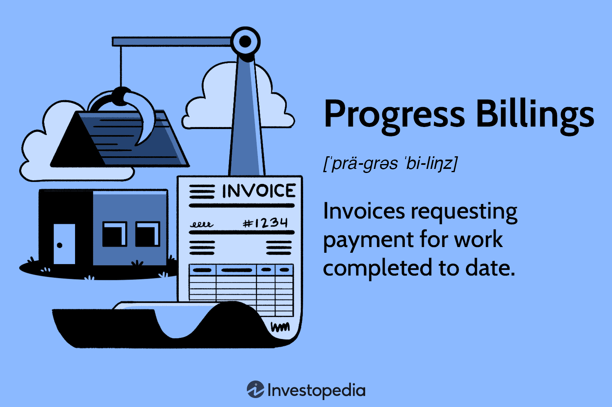

The intersection of construction invoicing, diverse billing methods, progress billings, and algorithmic trading represents a dynamic fusion of traditional practices and innovative technology. In the construction industry, as well as financial sectors like algorithmic trading, the concepts of billing and invoicing hold significant importance. These processes are fundamental for maintaining cash flow stability, which is a critical determinant of operational success.

In construction, billing methods are diverse and tailored to address the unique needs of projects. Common methods such as Lump Sum Billing, Cost-Plus Billing, and Time and Material Billing each offer distinct advantages. Progress billing is particularly noteworthy as it allows for incremental payments throughout lengthy projects, offering a mechanism to match project costs and labor with revenue inflows. This methodology is essential for large-scale projects, where the completion timeline spans months or years, requiring sustained financial management.



Algorithmic trading, typically associated with the financial markets, presents an intriguing opportunity when applied to construction billing processes. By using software to automate decisions, algo trading principles can be leveraged to automate invoicing, thereby optimizing cash flow management. The integration of real-time data and project updates with these algorithms could transform billing processes, ensuring intervals of precise and timely payments.

Understanding the diverse billing methods and their inherent benefits is crucial. It can reduce financial risk and enhance overall business efficiency. By exploring the systematic nature of algo trading and its potential synergy with construction billing, there is potential to innovate in cash flow management, reducing manual errors, and enhancing the financial health of construction projects. This exploration aims to provide insights into how merging these fields can foster advancements and elevate financial strategy within the construction sector.

## Table of Contents

## Understanding Construction Billing Methods

Construction projects require an understanding of different billing methods to ensure financial stability and maintain cash flow. Several billing methodologies can be employed, each tailored to suit various project specifications and timelines. These methods are instrumental in achieving cohesive financial management throughout the project's lifecycle.

**Lump Sum Billing** is a straightforward approach where a fixed total price is agreed upon for the entire project. This method offers predictability in terms of budget, as the contractor is obligated to complete the project within the agreed amount. It is beneficial for projects with well-defined scopes, allowing minimal deviation from the original plans. However, this can also pose a risk to contractors if unanticipated costs arise, as they must absorb these additional expenses.

**Cost-Plus Billing** provides flexibility by compensating the contractor for all project expenses plus a predefined fee representing profit. This method is advantageous when project details are uncertain or likely to change, as it allows for project modifications without stringent budget restrictions. The main advantage is transparency, as the client can see the actual costs incurred. However, it may lead to budget overruns if not carefully monitored, as there lacks an inherent incentive to control costs on the part of the contractor.

**Time and Material Billing** charges the client based on the actual time spent and materials used to complete the project. This method is suitable for projects with undefined scopes or those expected to have significant changes during execution. It provides flexibility for modifications and adjustments, ensuring that contractors are compensated for all additional work. Nonetheless, this approach may lack cost predictability, potentially leading to higher-than-expected expenditure if not properly managed.

**Progress Billing** is commonly used for extensive projects that span longer durations. Under this method, payments are made periodically based on the percentage of the project completed, effectively tying cash flow to project progression. This ensures that the contractor maintains liquidity throughout the project, reducing the risk of financial strains due to delayed payments. Progress billing also incorporates mechanisms like schedules of values and retention percentages, which protect both parties by ensuring that work is completed to satisfaction before full payment is made.

Each billing method presents unique advantages and is chosen based on the project's specific requirements and objectives. Selecting the appropriate billing method aligns with a project’s financial and operational goals, thus supporting its successful completion.

## The Role of Progress Billings in Construction

Progress billings are a critical component in managing construction projects, particularly for those that are large-scale and long-term. By allowing invoicing in stages, progress billings ensure a continuous flow of cash, reducing financial strain on contractors and subcontractors. This method aligns payments with the actual progress of the project, thereby mitigating financial risks that may arise from misalignments between expenditures and revenues.

A key feature of progress billings is the documentation involved, such as schedules of values and retention percentages. The schedule of values is a comprehensive list that breaks down the project cost according to each work item. This serves as a basis for preparing progress billings and provides a clear picture of project completion and costs incurred. During each billing period, the percentage of work completed is used to determine the amount payable, ensuring that all parties have a transparent understanding of project progress.

Retention percentages are another important element, where a portion of the payment is withheld until project completion or until certain major milestones are met. This practice protects against potential defects or issues that may arise during the project, fostering a sense of security for project owners.

Progress billing methods are particularly advantageous for extensive and long-term projects, where the scope and complexity require careful financial management. By offering a systematic approach to payment, progress billings reduce the financial burden on contractors and ensure that funds are available to cover ongoing operational costs. This financial predictability supports the sustainable management of resources and labor throughout the project's lifecycle, ultimately contributing to project success.

## Algorithmic Trading and Its Relevance to Construction Billing

Algorithmic trading, often employed within the financial markets, leverages automated software to execute trades with optimal speed and precision. This automation can be extended to the domain of construction billing to streamline financial operations. 

Just as algorithms in trading analyze market data to make real-time decisions, billing software can be configured to automatically process invoices and manage cash flow efficiently. This is particularly beneficial in construction projects where numerous invoices and financial transactions occur simultaneously. By utilizing algorithmic processes, construction companies can ensure that payments are executed precisely and on time, thereby maintaining financial stability and minimizing the risk of human error.

One crucial aspect of integrating [algorithmic trading](/wiki/algorithmic-trading) principles into construction billing is the utilization of real-time data. Financial data, alongside ongoing project updates, can be incorporated into the billing process to make informed decisions. For instance, algorithms can analyze project progress, identify delays or advancements, and adjust billing schedules accordingly. This adaptive approach ensures that billing aligns accurately with the project’s current state, thus providing transparency and predictability for all stakeholders involved.

To illustrate, consider a scenario where progress billing is used in a large construction project. By incorporating an algorithmic system, the software can automatically trigger billing events when specific project milestones are reached. In Python, such a system might use time-series analysis to predict upcoming billing needs by evaluating historical billing data and current project progress:

```python
import pandas as pd
from sklearn.linear_model import LinearRegression

# Example data: previous billing amounts and periods
data = {'Period': [1, 2, 3, 4, 5],
        'Billing': [10000, 20000, 15000, 25000, 30000]}

# Create a DataFrame
df = pd.DataFrame(data)

# Linear Regression Model
X = df[['Period']]
y = df['Billing']
model = LinearRegression()
model.fit(X, y)

# Predict future billing for period 6
future_period = [[6]]
predicted_billing = model.predict(future_period)
print("Predicted Billing for Period 6:", predicted_billing[0])
```

In this example, a basic linear regression model predicts the future billing amount based on past data, demonstrating how algorithmic techniques can pre-emptively adjust billing schedules.

Integrating algorithmic trading methodologies into construction billing brings numerous advantages, such as enhancing cash flow management, ensuring precise and timely payments, and optimizing decision-making processes through data integration. This convergence of technology not only augments financial operations but also contributes to the overall efficiency and success of construction projects.

## Benefits of Integrating Algo Trading with Construction Progress Billing

Integrating algorithmic trading principles with construction progress billing offers substantial advantages primarily through automation, which plays a crucial role in enhancing the accuracy and efficiency of billing processes. Automation minimizes human errors commonly associated with manual billing, thereby reducing discrepancies and improving the precision of financial reporting.

Both large contractors and small firms stand to gain from this integration through enhanced cash flow management and alleviated financial pressures. For larger contractors, automated systems help manage complex billing cycles related to extensive projects, ensuring that cash flow is consistently aligned with project milestones. Smaller firms, often constrained by limited resources, benefit from the streamlined processes and time savings, allowing them to focus their efforts on core business activities.

Furthermore, the integration allows for improved project oversight and risk management, which are vital in dynamic construction environments where project conditions and requirements can rapidly change. By leveraging real-time data, algorithmic billing systems can provide insights into project status, enabling more informed decision-making and proactive management of potential risks.

In addition to operational efficiencies, this integration fosters greater transparency and trust among stakeholders. With algorithm-driven billing, invoicing becomes more consistent and accurate, reducing disputes and fostering trust between contractors and clients. Automated records ensure that stakeholders have clear visibility into financial transactions, thereby enhancing collaborative efforts and facilitating smoother project executions.

Overall, the amalgamation of algorithmic trading systems with construction progress billing not only enhances operational efficiency but also contributes to more stable financial health in the construction sector.

## Challenges and Considerations

Integrating algorithmic trading with billing systems in the construction industry requires meticulous planning and strategic technology adoption. One of the primary challenges is ensuring compliance with industry regulations. The construction sector is governed by numerous legal frameworks, which vary by jurisdiction and project type. Companies must navigate these regulations carefully to prevent legal complications. Implementing algorithmic processes in billing necessitates a thorough understanding of these laws to ensure that the integration does not inadvertently violate compliance standards.

There is also potential resistance to change within organizations as traditional construction firms may be hesitant to adopt complex algorithmic systems unfamiliar to their operational structure. This resistance can be mitigated through comprehensive training programs and effective communication strategies that emphasize the benefits of automation and innovation. By illustrating the long-term cost efficiencies and error reductions provided by algorithmic billing, stakeholders can be more inclined to adopt these technologies.

The integration of progress billing with algorithmic trading presents technical challenges such as ensuring data integrity and real-time operations. Progress billing demands accurate and timely invoicing that reflects the project's current state. Therefore, maintaining data accuracy is crucial; errors in data can lead to substantial financial discrepancies and project delays. Real-time operation is particularly challenging due to the dynamic nature of construction projects, which often experience unforeseen changes and adjustments. Algorithms must be robust and adaptable, capable of processing updates instantaneously across various systems.

To address these challenges, organizations might leverage advanced data management tools and invest in robust software solutions that accommodate real-time data processing. Cryptographic methods can be employed to secure data transmissions, ensuring the authenticity and integrity of financial information. Furthermore, regular system audits and updates can help maintain operational robustness and security, reducing the risk of malfunction or data breaches.

## Conclusion

The article highlighted the significance of construction billing methods, notably progress billing, as a vital tool for managing cash flows throughout project lifecycles. Progress billing provides a financial framework that aligns payments with the phases of construction work, thereby minimizing financial risks and enhancing stability for all parties involved. This method proves especially beneficial in large-scale and long-term projects where constant cash movement is essential for maintaining [momentum](/wiki/momentum).

In parallel, algorithmic trading techniques present a promising avenue for automating and optimizing billing processes within the construction industry. By employing software systems that automate billing based on predefined rules and real-time data, companies can achieve a higher level of precision and reliability in their financial transactions. This approach parallels the benefits seen in financial markets, where algorithmic trading automates transactions, reducing errors and increasing efficiency.

The potential integration of algorithmic solutions with traditional construction billing methods offers a pathway to future advancements. For instance, leveraging algorithms can refine cash flow management by harnessing predictive analytics and [machine learning](/wiki/machine-learning) to project financial requirements and streamline billing schedules. This synthesis can play a pivotal role in meeting the rapidly evolving demands of construction financing.

For effective implementation, the construction industry must embrace technology while ensuring compliance with regulatory requirements. This adaptation process includes overcoming organizational resistance through education and illustrating the tangible benefits of integrated systems. When executed effectively, such advancements promise sustained financial health, improved efficiency, and ultimately contribute to the overall success of construction projects. By bridging the gap between traditional billing methods and algorithmic innovations, the industry can anticipate a more streamlined and resilient financial future.

## References & Further Reading

[1]: Bengtsson, C. (2011). ["Construction Project Management: Planning and managing construction projects with scheduling"](https://www.researchgate.net/publication/373292347_Project_Management_Practices_in_Construction_Projects_and_Their_Roles_in_Achieving_Sustainability-A_Comprehensive_Review) by Peter Fewings.

[2]: Lopez de Prado, Marcos. ["Advances in Financial Machine Learning"](https://www.amazon.com/Advances-Financial-Machine-Learning-Marcos/dp/1119482089)

[3]: Aronson, D. R. ["Evidence-Based Technical Analysis: Applying the Scientific Method and Statistical Inference to Trading Signals"](https://www.amazon.com/Evidence-Based-Technical-Analysis-Scientific-Statistical/dp/0470008741)

[4]: Jansen, Stefan. ["Machine Learning for Algorithmic Trading"](https://github.com/stefan-jansen/machine-learning-for-trading)

[5]: Chan, E. P. ["Quantitative Trading: How to Build Your Own Algorithmic Trading Business"](https://github.com/ftvision/quant_trading_echan_book)

[6]: "The Management of Construction: A Project Lifecycle Approach" by F. Lawrence Bennett. 

[7]: Collier, K. (2020). ["The Business of Construction: A Guide to Risk Management"](https://www.researchgate.net/publication/331350747_A_Guide_for_Risk_Management_in_Construction_Projects_Present_Knowledge_and_Future_Directions)