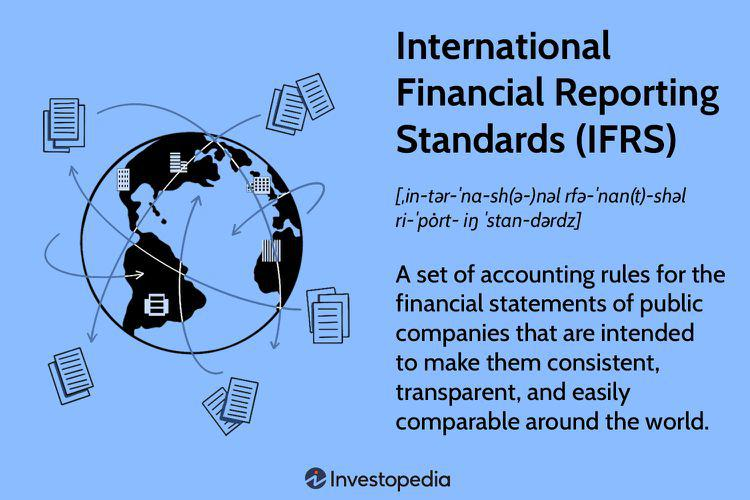

In today's fast-paced financial landscape, the convergence of accounting standards and technological innovations is critical. Accounting methodologies, such as Last-In-First-Out (LIFO), play a significant role in how companies manage inventory and report financial results. LIFO influences cost accounting by designating the most recently acquired inventory as sold first, thus affecting taxable income and profitability during periods of inflation. However, while LIFO remains permissible under the Generally Accepted Accounting Principles (GAAP) in the United States, it is prohibited under the International Financial Reporting Standards (IFRS) due to its potential to misrepresent financial reality.

Similarly, the global applicability and transparency promoted by IFRS underscore the need for consistent financial reporting across borders. On the other hand, algorithmic trading has emerged as a pivotal technological innovation, leveraging computer algorithms to make high-speed trading decisions based on pre-defined criteria. Its rise is altering traditional trading practices and presenting fresh challenges and opportunities within financial markets.

Understanding these components is essential for financial professionals aiming to navigate the complex and interconnected global markets effectively. The interaction between LIFO, IFRS, and algorithmic trading can significantly impact financial reporting, regulatory compliance, and strategic decision-making. This article aims to provide insights into how these diverse elements interact, influence each other, and shape modern finance strategies. Financial professionals must remain well-informed about these dynamics to ensure robust and compliant financial operations.

## Table of Contents

## Understanding Accounting Methods: LIFO

Last-In-First-Out (LIFO) is an inventory valuation method primarily utilized in accounting to determine the cost of goods sold (COGS) and ending inventory valuation. This approach assumes that the most recently acquired or manufactured items are sold first, a process that can have notable effects on a company’s financial reporting, especially in periods of inflation.

When inflation occurs, prices tend to increase over time. By employing the LIFO method, a company records its newest, and usually more expensive, inventory as cost of goods sold. This leads to a higher COGS, which can significantly reduce the reported taxable income for the period, resulting in short-term tax savings. The reduction in taxable income, due to higher COGS, subsequently decreases the company's net income. While this can be advantageous during periods of rising prices, it may also present a less favorable picture of the company's profitability to investors.

Contrastingly, the LIFO method is prohibited under the International Financial Reporting Standards (IFRS). The primary reason for this prohibition is the method's perceived lack of representational faithfulness. By recording older, often outdated, inventory costs on the balance sheet, LIFO can distort the true financial position of an organization, not reflecting the current market reality or the actual economic events. This concern over faithful representation has led to the exclusive acceptance of the First-In-First-Out (FIFO) and the Weighted Average methods under IFRS.

In comparison, FIFO assumes that the oldest inventory items are sold first, leading to lower COGS when prices are rising and potentially higher net income figures. It often results in a more accurate reflection of a company’s inventory valuation on the balance sheet, aligning closely with current market costs. The Weighted Average method, on the other hand, smooths out price fluctuations by averaging the cost of all items available for sale during the period. This method tends to be a middle ground between LIFO and FIFO, providing consistency in reported earnings.

Understanding the implications of LIFO is crucial for businesses aiming to optimize tax strategies and improve financial reporting. While it offers potential tax benefits during inflationary periods by lowering taxable income, it may affect financial statements' transparency and comparability. Businesses operating in jurisdictions allowing LIFO, such as under the Generally Accepted Accounting Principles (GAAP) in the United States, may leverage this method strategically. However, they must also weigh it against the potential negative perceptions of diminished profitability and the challenges posed by differing international accounting standards.

## IFRS and Its Stand on LIFO

International Financial Reporting Standards (IFRS) maintain a strict prohibition on the use of the Last-In-First-Out (LIFO) method for inventory valuation. This stance is grounded in the assertion that LIFO can lead to distortion in financial statements, which undermines the clarity and reliability of these reports.

LIFO's method of accounting records the most recently acquired inventory as sold first. While this approach can provide tax advantages in certain jurisdictions, it often results in lower net income due to higher cost of goods sold (COGS) during periods of inflation. Consequently, this can lead to earnings understatement. Furthermore, LIFO might cause inventory figures on balance sheets to reflect outdated prices, thereby offering an inaccurate valuation of current assets. These distortions can significantly affect decision-making processes for investors and other stakeholders relying on accurate financial information.

The prohibition of LIFO under IFRS aims to promote financial statement transparency and improve the accuracy with which financial positions are reported. IFRS prioritizes representational faithfulness and seeks to portray a company’s economic activities with the utmost accuracy. Thus, removing LIFO from accepted accounting practices aligns with these principles.

A comparative examination of IFRS and Generally Accepted Accounting Principles (GAAP) in the United States reveals significant differences in their approach to inventory accounting. While GAAP allows the use of LIFO, IFRS prefers methods such as First-In-First-Out (FIFO) and the Weighted Average Cost method, which arguably provide a clearer reflection of market conditions and inventory valuation. The allowance of LIFO under GAAP reflects a more flexible accounting approach, accommodating industries where LIFO aligns with actual inventory flows.

These differences hold substantial implications for multinational corporations managing inventories across borders. Companies operating in jurisdictions following IFRS must eschew LIFO, potentially resulting in disparate financial reporting strategies across different regions of their operations. Understanding these contrasts is critical as organizations strive to maintain compliance while optimizing their financial strategies in global operations.

In summary, IFRS's restriction against LIFO reinforces the organization's commitment to transparency and high-quality financial reporting. This policy serves as an influential [factor](/wiki/factor-investing) for businesses that must carefully navigate the contrasting requirements set forth by IFRS and GAAP, particularly when engaging in international commerce.

## Algorithmic Trading: A Modern Financial Strategy

Algorithmic trading, commonly referred to as 'algo trading', employs sophisticated algorithms to execute orders in financial markets with remarkable speed and precision. These algorithms analyze multiple market variables, execute trades based on pre-defined criteria, and optimize the order execution process to minimize market impact and maximize efficiency. The proliferation of [algorithmic trading](/wiki/algorithmic-trading) has created a new paradigm for financial markets, driving the need for real-time data processing and reporting, which traditional accounting systems struggle to accommodate.

The inherent [high frequency](/wiki/high-frequency-trading) and [volume](/wiki/volume-trading-strategy) associated with algorithmic trading necessitate rapid and accurate financial reporting. Conventional accounting practices are typically not designed to handle the sheer speed and scale at which trades are executed in modern markets. This misalignment with traditional systems creates challenges in tracking transactions and reconciling trades accurately, especially as they pertain to inventory accounting and compliance with financial frameworks such as Generally Accepted Accounting Principles (GAAP) and International Financial Reporting Standards (IFRS).

Integration of algorithmic trading into existing financial frameworks requires seamless data synchronization. This is crucial for maintaining precise financial statements and ensuring compliance with respective accounting standards. Inadequate integration can result in inaccurate inventory valuations and distorted financial outcomes. As algorithmic trading becomes more predominant, companies must adopt technologies that enable seamless integration with financial frameworks, ensuring that their accounting practices keep pace with trading activities.

Adopting robust systems to manage the intricacies of algorithmic trading is essential for modern financial professionals. Leveraging technologies such as [artificial intelligence](/wiki/ai-artificial-intelligence), [machine learning](/wiki/machine-learning), and real-time data analytics can enhance the capability to monitor trading activities, predict market trends, and refine trading strategies. These advanced systems support accurate bookkeeping by aligning with the requirements of GAAP and IFRS, thus offering solutions for the complex demands posed by algorithmic trading.

The strategic adoption of technology is imperative for firms aiming to optimize their financial strategies in a fast-evolving market landscape. Companies harnessing the potential of algorithmic trading must ensure that their accounting systems can meet the demands of rapid data processing and provide accurate, real-time reporting. By investing in robust technological solutions, financial professionals are better equipped to maintain compliance, optimize performance, and enhance strategic decision-making processes in today's competitive financial environment.

## Challenges and Solutions in Integration

Integrating Last-In-First-Out (LIFO) accounting methods, International Financial Reporting Standards (IFRS), and algorithmic trading requires overcoming significant challenges, notably in maintaining data consistency and ensuring real-time accuracy across these domains. The fast-paced movement of modern financial markets, driven by technological advancements, necessitates robust solutions to successfully merge these diverse components.

One of the key solutions to these challenges lies in the deployment of advanced technological tools such as blockchain, artificial intelligence (AI), and machine learning. Blockchain technology, renowned for its decentralized and tamper-proof nature, can enhance data transparency and integrity in financial reporting by providing an immutable ledger. This ensures that all inventory and trading data is securely recorded and accessible for auditing, thereby aligning with IFRS requirements for accuracy and transparency.

AI and machine learning further bolster this integration by offering predictive analytics capabilities. These technologies facilitate real-time data processing, allowing for more accurate forecasting of financial trends and algorithms optimization in trading systems. By analyzing past and current data patterns, AI-driven systems can predict inventory requirements and trading movements, ultimately aiding companies in optimizing their financial strategies under both GAAP and IFRS.

Developing a unified approach to inventory valuation is another critical strategy for simplifying the integration of LIFO, IFRS, and algorithmic trading. A common methodology can streamline accounting processes, ensuring that inventory valuation aligns with both local and international standards. By harmonizing these practices, businesses can achieve seamless integration, reducing discrepancies between financial reports prepared under different accounting frameworks.

Financial professionals play an essential role in making these integrations successful. They must leverage these technological solutions not only to ensure compliance with regulatory standards but also to achieve greater efficiency in financial operations. This involves staying updated on technological advancements and incorporating them into existing accounting systems to improve data accuracy and reporting.

In conclusion, the integration of LIFO, IFRS, and algorithmic trading in modern finance demands a multifaceted approach that combines cutting-edge technology with traditional accounting principles. By adopting solutions like blockchain, AI, and machine learning, and developing standardized methods of inventory valuation, financial professionals can address the inherent challenges, ensuring compliance and optimizing operational efficiency in today’s competitive landscape.

## Future Trends and Convergence Efforts

Efforts to harmonize International Financial Reporting Standards (IFRS) and Generally Accepted Accounting Principles (GAAP) are ongoing, focused on simplifying global financial reporting and addressing discrepancies such as the acceptance of Last-In-First-Out (LIFO) accounting methods. The divergent acceptance of LIFO exemplifies a broader challenge in achieving global accounting standardization. LIFO is permitted under GAAP, primarily used in the United States, but is prohibited under IFRS. Bridging these differences is a priority for harmonizing global accounting practices, ensuring more uniform and reliable financial information across borders.

Technological advancements, particularly in algorithmic trading, underscore the necessity for accounting standards that support real-time financial data integration. Algorithmic trading leverages high-frequency data processing, which demands precise and immediate accounting reconciliations. Hence, there's a growing need for financial reporting frameworks capable of handling the speed and volume of transactions inherent in algorithmic trading, fostering more effective real-time decision-making.

The future of accounting is likely to witness a closer alignment between IFRS and GAAP, potentially introducing unified methods for inventory valuation. Such efforts are not only aimed at reconciling differences like those involving LIFO but also at improving overall transparency, comparability, and efficiency in financial reporting. A unified global standard could reduce the complexity and costs associated with financial compliance for multinational corporations and facilitate more straightforward comparisons across financial statements.

Stakeholders, including regulators, financial professionals, and companies, must remain informed about these trends to navigate the rapidly evolving financial landscape effectively. As global commerce becomes increasingly interconnected, a clear understanding of both existing standards and emerging changes is crucial for strategic planning and operational efficiency. 

Companies prepared to embrace these shifts will be better positioned to compete in the global marketplace. They can improve financial decision-making processes by adopting systems that scale effectively across various jurisdictions and regulatory environments. For instance, implementing advanced data analytics and machine learning can enhance predictive capabilities, allowing firms to optimize inventory management and other financial operations. In doing so, businesses not only ensure compliance but also gain a competitive edge through more agile and informed financial strategies. 

Overall, convergence efforts are foundational to the future financial ecosystem, aiming to bring about more consistent and transparent financial reporting mechanisms worldwide.

## Conclusion

The convergence of Last-In-First-Out (LIFO) accounting methods, International Financial Reporting Standards (IFRS), and algorithmic trading presents multifaceted challenges and opportunities for financial professionals. Each component has a distinct role in shaping financial reporting and strategy. LIFO impacts inventory valuation and tax strategies, IFRS promotes transparency and international comparability in financial statements, and algorithmic trading revolutionizes market operations with high-speed transactions. Understanding the nuances and interactions between these elements is crucial for effective financial management.

Aligning accounting standards such as IFRS and Generally Accepted Accounting Principles (GAAP) is vital for fostering transparency and comparability across global markets. Efforts to harmonize these standards show meaningful progress as they address discrepancies like the acceptance of LIFO. Such alignment facilitates easier cross-border operations for multinational corporations and contributes to a more standardized global financial landscape.

Technology significantly enhances the adaptation of accounting systems to meet modern financial practices' demands. Advanced tools like artificial intelligence (AI), machine learning, and blockchain improve data accuracy, compliance, and reporting agility. These technologies support real-time data processing crucial for algorithmic trading while aligning with IFRS and GAAP standards. Leveraging technological advancements is therefore essential in ensuring financial systems remain robust and adaptive to the complexities of contemporary markets.

Financial professionals must strategically integrate these technological solutions with established accounting standards. This integration is necessary to maintain a competitive edge and ensure precision in financial operations. Staying abreast of these developments allows better strategic decisions, enhancing efficiency and clarity in financial operations globally. As the financial landscape continues to evolve, those who effectively embrace and integrate these changes stand to benefit from improved decision-making processes and competitive advantage.

## References & Further Reading

[1]: Bazley, Michael. (2009). ["International Financial Reporting Standards and the LIFO Conundrum."](https://www.webology.org/data-cms/articles/20220123025455pmWEB19347.pdf) Journal of Accountancy.

[2]: IASB. (2020). ["IFRS Standards."](https://www.ifrs.org/news-and-events/updates/iasb/2020/iasb-update-october-2020/)

[3]: Patel, N. (2013). ["Algorithm Trading: A Comprehensive Guide to Learn and Master Algorithm Trading."](https://www.semanticscholar.org/paper/ALGORITHMIC-TRADING%3A-A-COMPREHENSIVE-REVIEW-OF-AND-Garg/94ead853e1835e7caae78d080e8b0e2f5f504607) Financial Times Press.

[4]: ("Algorithmic Trading and DMA: An Introduction to Direct Access Trading Strategies"](https://www.amazon.com/Algorithmic-Trading-DMA-introduction-strategies/dp/0956399207) by Barry Johnson

[5]: ["Financial Reporting and Analysis"](https://www.wallstreetmojo.com/financial-reporting/) by Charles H. Gibson