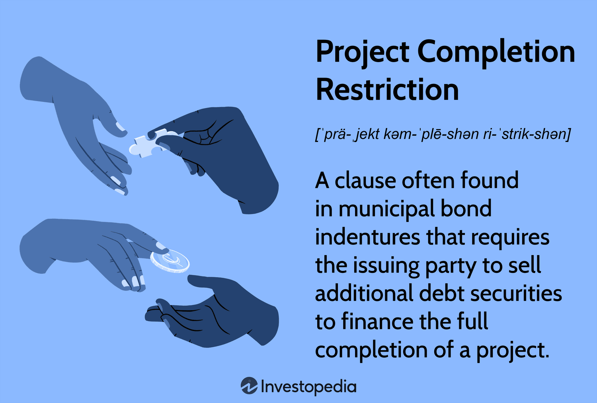

In today's fast-paced business environment, effectively managing project deadlines has become crucial. Meeting these deadlines is essential not only for maintaining client satisfaction but also for ensuring the timely completion of projects. Project management plays a significant role in this process, as it involves coordinating resources, team members, and timelines to achieve the desired outcomes within specified constraints.

Algorithmic trading is one field where adhering to deadlines is of paramount importance. In this highly time-sensitive domain, even minor delays can mean the difference between seizing a profitable trading opportunity and incurring a financial loss. The rapid pace at which market conditions change necessitates the development and deployment of trading algorithms within strict time frames.



This article explores the intersection of project deadlines, project management, completion restrictions, and algorithmic trading. By understanding these elements, businesses can enhance both the efficiency and success of their projects. The effective management of deadlines, combined with strategies to navigate completion restrictions, can provide organizations with a competitive edge in their respective industries.

## Table of Contents

## The Importance of Project Deadlines in Management

Project deadlines serve as integral components in the efficient management of projects. Meeting these deadlines is essential not only for maintaining client trust but also for ensuring the successful and timely delivery of project objectives. Deadlines facilitate meticulous resource planning by allowing project managers to allocate human and material resources efficiently across different phases of a project. This allocation helps in minimizing resource wastage and optimizing productivity.

Moreover, deadlines play a crucial role in risk management. By establishing clear timelines, potential risks can be identified and mitigated at an early stage. Properly set deadlines enable teams to anticipate possible delays and implement contingency plans, thereby reducing the likelihood of project stagnation. Setting realistic deadlines also helps in forming a mutual understanding between the project team and stakeholders regarding the expected pace and progression of the work.

Failing to meet project deadlines can have severe repercussions. Cost overruns are a common consequence when projects extend beyond their planned durations, leading to increased expenses related to labor, materials, and other resources. Furthermore, repeated failure to meet deadlines can result in dissatisfied clients and stakeholders, damaging the long-term reputation and credibility of the organization. This reputational harm can have significant impacts, discouraging future business opportunities and partnerships.

To effectively manage deadlines, several strategies can be implemented. One effective approach is to establish clear and realistic timelines at the outset of the project. This involves understanding the project's requirements thoroughly and accounting for potential bottlenecks. Breaking down tasks into smaller, manageable components also enhances clarity and focus, allowing team members to concentrate on achieving specific goals within the overarching timeline.

Regular progress checks are another critical element in managing deadlines effectively. By monitoring progress frequently, project managers can identify deviations from the planned schedule and take corrective actions promptly. This continuous oversight ensures that the project remains on track and that any issues are addressed before escalating into significant problems.

In conclusion, project deadlines are vital instruments in project management, significantly impacting resource planning, risk management, and stakeholder satisfaction. Adopting strategies for effective deadline management can mitigate risks associated with delays, enhance project efficiency, and maintain trust and reputation with clients.

## Project Completion Restrictions Explained

Project completion restrictions are mechanisms implemented to ensure that projects, particularly in sectors like municipal bonds, are completed on time and within budget. These restrictions are designed to safeguard the interests of investors and stakeholders by guaranteeing that adequate resources and strategies are in place to address potential obstacles that might impede project completion.

Within municipal bonds, project completion restrictions serve as financial safeguards. These financial instruments are typically used to fund public sector projects such as infrastructure development. For these projects, completion restrictions might include setting aside reserve funds, requiring performance bonds, or instituting legal covenants that mandate specific project milestones be met within predefined timelines. Such measures help in minimizing the risk of project delays or failures, thereby protecting investors' interests and ensuring confidence in the financial vehicle.

Similarly, in the field of [algorithmic trading](/wiki/algorithmic-trading), where time is a critical [factor](/wiki/factor-investing), applying project completion restrictions can mitigate the risks associated with algorithm development and deployment. Algorithmic trading requires that trading strategies are developed, tested, and executed within strict timeframes. Restrictions can include predefined development cycles, mandatory testing phases before live deployment, and continuous monitoring and refinement to achieve optimal performance. These restrictions ensure that trading algorithms are ready to capitalize on market opportunities promptly, reducing the likelihood of financial loss due to untested or poorly executed trading strategies.

Understanding and implementing project completion restrictions is essential for mitigating financial risks. By setting clear boundaries and expectations, organizations can better allocate resources, identify potential risks early, and implement corrective measures promptly. Such restrictions not only provide a structured approach to project management but also enhance stakeholders' trust by demonstrating commitment to project success and financial prudence.

In conclusion, project completion restrictions are pivotal in both municipal bonds and algorithmic trading, providing a framework that ensures project objectives are met efficiently. These restrictions bridge the gap between planning and execution, thereby fortifying the project's integrity against unforeseen challenges.

## Algorithmic Trading: Importance of Timely Execution

In algorithmic trading, executing strategies at the right moment is crucial for maximizing profit. This form of trading employs automated, pre-programmed strategies which analyze market data and execute trades at speeds and frequencies that are impossible for human traders. The necessity for timely execution arises from the dynamic and fast-paced nature of financial markets, where prices fluctuate rapidly, and opportunities can dissipate in mere milliseconds.

Deadlines in algorithmic trading are not just about project completion but about seizing trading opportunities. An important metric is the latency time, which refers to the delay between the detection of a trading signal and the execution of the trade. Lower latency enhances the likelihood of capturing favorable price movements before they are reflected in the broader market. For instance, if an algorithm detects an [arbitrage](/wiki/arbitrage) opportunity between two markets, any delay, even a few milliseconds, can result in a missed opportunity. 

Moreover, algorithms must be continuously updated and tested to adapt to changing market conditions. This ongoing refinement is essential as markets are influenced by a myriad of factors such as economic data releases, geopolitical events, and market sentiment shifts. The need for continuous testing ensures that algorithms remain robust, capable of performing under a range of market conditions. This can be achieved through [backtesting](/wiki/backtesting), where historical data is used to simulate and evaluate the performance of a strategy. Yet, time constraints must be considered during backtesting to ensure that updates can be integrated swiftly without compromising the system's stability.

Ensuring timely development and deployment of trading algorithms is vital for maintaining a competitive advantage. This involves not only the initial design and testing but also a rapid deployment pipeline to ensure strategies are implemented without undue delay. To achieve this, project managers and algorithm developers can utilize continuous integration and deployment (CI/CD) practices. For example, a typical CI/CD pipeline for algorithmic trading might include:

```python
def run_backtest(strategy, historical_data):
    # Simulate strategy on historical data
    results = simulate_strategy(strategy, historical_data)
    return results

def deploy_strategy(strategy, trading_platform):
    # Deploy the algorithm to the trading platform
    trading_platform.deploy(strategy)

# Example flow
def pipeline(strategy, historical_data, trading_platform):
    # Step 1: Backtest the strategy
    results = run_backtest(strategy, historical_data)
    if results.is_profitable():
        # Step 2: Deploy if profitable
        deploy_strategy(strategy, trading_platform)

# Execute the pipeline
pipeline(my_strategy, my_historical_data, my_trading_platform)
```

Through these methods, algorithmic traders can ensure their strategies are not only finely tuned but also available to exploit opportunities as they arise, thus maintaining a competitive edge in the market. This combination of algorithm refinement, rapid response to market conditions, and strategic project management underscores the importance of timing in algorithmic trading.

## Strategies for Managing Deadlines in Algorithm Projects

Managing deadlines effectively in algorithm projects is crucial for ensuring that strategic goals are met while maintaining flexibility to adapt to changing conditions. Prioritization of tasks, the use of project management tools, employing agile methodologies, and conducting regular reviews are strategies that can significantly enhance deadline management in these projects.

### Prioritize Tasks Based on Urgency and Importance

Prioritization involves assessing each task's urgency and importance in relation to the project's objectives. Critical tasks that directly impact the project's core functionality should be completed first. A task prioritization matrix, which classifies tasks by urgency and importance, can be a useful tool. A simplified version of this matrix is:

    Urgency
    Importance  |  High         |  Low
    -------------------------------------
    High        |  Do first     |  Schedule
    Low         |  Delegate     |  Eliminate

Applying this matrix ensures that high-impact tasks receive the immediate attention they require.

### Utilize Project Management Tools

Project management tools like Gantt charts and Kanban boards can facilitate effective planning and tracking of project tasks. A Gantt chart provides a visual timeline of the project's schedule, highlighting deadlines and task dependencies. Python's matplotlib and plotly libraries can help generate Gantt charts with customizable features. 

Here is a simple Python code snippet to create a Gantt chart using matplotlib:

```python
import matplotlib.pyplot as plt
import pandas as pd

# Sample data
data = {'Task': ['Research', 'Design', 'Coding', 'Testing'], 
        'Start': [1, 4, 6, 9], 
        'Duration': [3, 2, 4, 2]}

df = pd.DataFrame(data)

# Create Gantt chart
plt.barh(df['Task'], df['Duration'], left=df['Start'])
plt.xlabel('Time')
plt.title('Project Timeline')
plt.show()
```

Kanban boards, on the other hand, help visualize the workflow, allowing project teams to manage the flow of tasks in stages such as 'To Do', 'In Progress', and 'Completed'. Online tools like Trello and Jira offer digital Kanban boards that support collaborative work environments.

### Incorporate Agile Methodologies

Incorporating agile methodologies in algorithm projects can enhance a team's ability to quickly adapt to changes and improve efficiency. Agile methods, characterized by iterative development and regular feedback loops, encourage flexibility. In algorithmic projects, Scrum and Kanban are popular agile frameworks. They promote sprint planning, daily stand-ups, and post-sprint reviews, ensuring continuous improvement.

### Regular Reviews and Flexible Approaches

Conducting regular project reviews helps identify potential delays at an early stage. This proactive measure allows project managers to adjust resources and timelines as necessary. Reviews should assess the project's progress against the initial plan, and any discrepancies should be addressed promptly.

Flexibility in management techniques allows for real-time adjustments to accommodate unforeseen changes. For instance, if market data shifts unexpectedly, algorithm parameters can be recalibrated to maintain alignment with project goals.

In conclusion, by prioritizing tasks, leveraging project management tools, incorporating agile methodologies, and maintaining regular reviews with flexible approaches, project managers can more effectively manage deadlines in algorithm projects, ensuring timely completion and optimal performance.

## The Role of Automation and Tools in Meeting Deadlines

Automation and tools are indispensable in ensuring the prompt completion of tasks and adherence to project deadlines. Automation tools eliminate redundant processes by performing routine tasks efficiently and with minimal errors. This optimization is critical in reducing human error, thus freeing up valuable resources for more complex decision-making tasks. In project management, software tools like Microsoft Project, Asana, and Trello serve as platforms that allow teams to visualize timelines, track progress, and allocate resources efficiently. These tools use Gantt charts, Kanban boards, or similar visualization frameworks to facilitate task management and foster team collaboration.

In the domain of algorithmic trading, automation is even more crucial. Automated trading systems, commonly known as trading bots, are programmed to execute trades at high speeds, surpassing human capabilities. These systems apply complex algorithms to adhere to specific strategies and take advantage of market opportunities instantaneously, which is vital for profit maximization. A Python script that uses a simple moving average (SMA) strategy can illustrate this concept:

```python
def simple_moving_average(prices, window_size):
    return sum(prices[-window_size:]) / window_size

def trading_strategy(prices):
    short_window = 5
    long_window = 20
    if len(prices) > long_window:
        short_sma = simple_moving_average(prices, short_window)
        long_sma = simple_moving_average(prices, long_window)

        if short_sma > long_sma:
            return "Buy"
        elif short_sma < long_sma:
            return "Sell"
    return "Hold"

# Example usage
prices = [120, 122, 121, 123, 125, 127, 128, 130, 132, 134, 136, 137, 138, 140, 142, 144, 145, 147, 148, 150, 151, 153]
trade_decision = trading_strategy(prices)
print("Trade decision:", trade_decision)
```

This snippet automates a basic trading decision process, indicating how swiftly and efficiently trades can be made with the support of automation.

Furthermore, leveraging technology is pivotal in enhancing time management within both project management and trading sectors. Automation enables expedited testing and deployment of trading algorithms, which is critical given the rapid shifts in market conditions. Such technical tools facilitate quicker pivots and adjustments in strategy, maintaining an organization's agility and competitive edge.

The integration of advanced project management software and automated trading systems underscores the profound impact that automation and tools have on optimizing operations and meeting deadlines effectively. By strategically implementing these technological advancements, businesses can greatly improve both productivity and outcome delivery.

## Conclusion

Successfully managing project deadlines requires a comprehensive approach that integrates planning, tools, and flexibility. This involves setting realistic timelines, employing project management tools, and adopting flexible methodologies that allow for adjustments as required. Through the strategic use of automation and technology, organizations can streamline their processes, reducing manual errors and increasing efficiency.

Project completion restrictions and effective deadline management enhance investor and stakeholder confidence by ensuring that projects are delivered on time and within budget. These elements act as safeguards against unforeseen challenges that can derail project timelines and incur financial penalties. For instance, in industries like municipal bonds, completion restrictions are vital in protecting investments and ensuring resource availability, thus minimizing the risk of project abandonment.

In algorithmic trading, timely execution is critical, where delays can result in significant missed opportunities and financial losses. The fast-paced nature of trading demands rigorous time management strategies to ensure that algorithms are developed, tested, and deployed promptly. Continuous updates and testing are necessary to adapt to ever-changing market conditions, leveraging an automated approach to achieve faster execution and testing of trading strategies.

By implementing these practices, organizations can improve project outcomes and maintain a competitive edge. Efficient deadline management combined with strategic planning and technological integration not only fosters a trustworthy relationship with stakeholders but also enhances overall project success. These practices ensure that organizations remain agile and competitive, capable of swiftly responding to the dynamic demands of markets and clients.

## References & Further Reading

[1]: Bergstra, J., Bardenet, R., Bengio, Y., & Kégl, B. (2011). ["Algorithms for Hyper-Parameter Optimization."](https://dl.acm.org/doi/10.5555/2986459.2986743) Advances in Neural Information Processing Systems 24.

[2]: ["Advances in Financial Machine Learning"](https://www.amazon.com/Advances-Financial-Machine-Learning-Marcos/dp/1119482089) by Marcos Lopez de Prado

[3]: ["Evidence-Based Technical Analysis: Applying the Scientific Method and Statistical Inference to Trading Signals"](https://www.amazon.com/Evidence-Based-Technical-Analysis-Scientific-Statistical/dp/0470008741) by David Aronson

[4]: ["Machine Learning for Algorithmic Trading"](https://github.com/stefan-jansen/machine-learning-for-trading) by Stefan Jansen

[5]: ["Quantitative Trading: How to Build Your Own Algorithmic Trading Business"](https://www.amazon.com/Quantitative-Trading-Build-Algorithmic-Business/dp/1119800064) by Ernest P. Chan