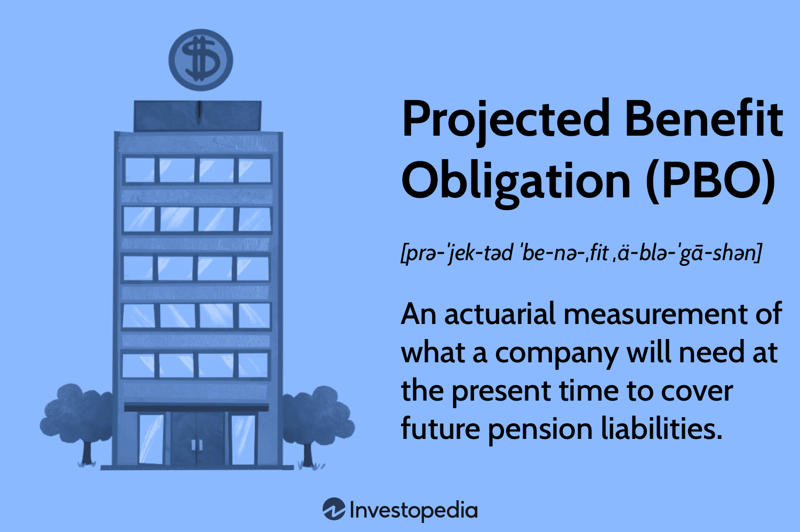

## Table of Contents

## What is Projected Benefit Obligation (PBO)?

Projected Benefit Obligation (PBO) is a term used in accounting to measure the amount of money a company needs to set aside to pay for its employees' future pension benefits. It takes into account not just the current salaries of the employees, but also their expected future salary increases. This means that the PBO is an estimate of what the company will owe its employees when they retire, based on how much they are expected to earn over their careers.

Calculating the PBO is important for companies because it helps them plan their finances and ensure they have enough money to meet their pension obligations. The PBO can change over time due to factors like changes in interest rates, employee turnover, and amendments to the pension plan. By keeping track of the PBO, companies can make adjustments to their pension plans or their funding strategies to make sure they can cover the costs of the benefits they have promised to their employees.

## How is PBO different from other pension obligation measures?

Projected Benefit Obligation (PBO) is different from other pension obligation measures because it includes future salary increases in its calculations. Other measures, like the Accumulated Benefit Obligation (ABO), only consider the employees' current salaries. This means that the PBO gives a more complete picture of what a company will owe its employees when they retire, because it takes into account how much their salaries might grow over time.

Another measure, the Vested Benefit Obligation (VBO), only accounts for the benefits that employees are legally entitled to if they leave the company right away. The VBO is usually smaller than the PBO and ABO because it doesn't include benefits that employees might earn in the future. By comparing these different measures, a company can get a better understanding of its pension obligations and plan its finances accordingly.

## Why is PBO important for companies with defined benefit plans?

PBO is important for companies with defined benefit plans because it helps them figure out how much money they need to save for their employees' future pensions. A defined benefit plan promises to pay employees a certain amount of money when they retire, based on their salary and years of service. By calculating the PBO, companies can see how much they will have to pay out in the future, taking into account not just current salaries but also expected salary increases.

Knowing the PBO helps companies plan their finances better. If the PBO is high, the company might need to put more money into the pension fund to make sure they can pay the promised benefits. If the PBO changes because of things like interest rates or employee turnover, the company can adjust its pension plan or funding strategy to stay on track. This way, the company can make sure it has enough money to take care of its employees when they retire.

## How is the PBO calculated?

The PBO is calculated by looking at how much money a company will need to pay its employees when they retire. It starts with the employees' current salaries and then adds in how much their salaries might grow over time. This means the PBO takes into account future raises and promotions. To figure out the PBO, the company uses a formula that includes the employees' years of service, their expected retirement age, and how much their salaries are expected to increase each year.

The calculation also considers things like interest rates and how long employees might live after they retire. These factors can change the PBO over time. For example, if interest rates go down, the PBO might go up because the company needs to save more money to meet its pension obligations. By keeping track of the PBO, a company can see if it needs to put more money into its pension fund or make changes to its pension plan to make sure it can pay its employees what it promised when they retire.

## What assumptions are used in calculating PBO?

When calculating the Projected Benefit Obligation (PBO), companies make several assumptions to figure out how much money they need to save for their employees' pensions. One big assumption is about how much employees' salaries will increase in the future. This is important because the PBO includes not just current salaries but also expected raises and promotions. Another assumption is about when employees will retire. This helps the company predict how long it will have to pay out pension benefits.

Another key assumption is about how long employees will live after they retire. This affects the PBO because the longer employees live, the more money the company needs to pay out. Interest rates are also a big [factor](/wiki/factor-investing) in the calculation. If interest rates are low, the company needs to save more money to meet its pension obligations. By using these assumptions, the company can estimate the PBO and make sure it has enough money in its pension fund to take care of its employees when they retire.

## How does the discount rate affect the PBO?

The discount rate is a big deal when figuring out the PBO. It's like the [interest rate](/wiki/interest-rate-trading-strategies) the company uses to figure out how much money it needs to save now to pay for pensions in the future. If the discount rate is high, the PBO goes down. This is because a higher rate means the money the company saves now will grow more over time, so they don't need to save as much. But if the discount rate is low, the PBO goes up. That's because the money won't grow as much, so the company needs to save more now to cover the same future costs.

Changes in the discount rate can really shake things up for a company's pension plan. If interest rates drop, the PBO can jump up a lot, and the company might need to put more money into the pension fund to keep up. On the other hand, if interest rates go up, the PBO can go down, which might mean the company doesn't need to save as much. Keeping an eye on the discount rate helps companies plan better and make sure they can pay their employees what they promised when they retire.

## What is the impact of changes in actuarial assumptions on PBO?

Changes in actuarial assumptions can have a big impact on the PBO. Actuarial assumptions are guesses about things like how long employees will work, when they will retire, and how long they will live after retiring. If these assumptions change, the PBO changes too. For example, if people start living longer, the company might need to save more money for pensions because they will be paying them out for a longer time. Or if employees start retiring earlier than expected, the company might need to adjust the PBO to account for paying out pensions sooner.

Another important assumption is about how much employees' salaries will go up in the future. If the company thinks salaries will grow faster than before, the PBO will go up because they will need to pay out more money when employees retire. On the other hand, if they think salaries will grow slower, the PBO will go down. These changes in assumptions can make a big difference in how much money the company needs to save for pensions, so they have to keep an eye on them and update their plans accordingly.

## How does PBO affect a company's financial statements?

The PBO shows up on a company's financial statements because it tells how much money the company needs to save for its employees' pensions. This number goes on the balance sheet as a liability, which means it's money the company owes. If the PBO goes up, the company's liabilities go up too, which can make the company look less financially healthy. On the other hand, if the PBO goes down, the company's liabilities go down, which can make it look better financially.

Changes in the PBO can also affect the income statement. If the PBO changes because of new assumptions or changes in things like interest rates, the company might need to record a gain or loss on its income statement. This can make the company's profits go up or down, depending on whether the PBO went up or down. Keeping track of the PBO helps the company plan its finances better and make sure it can pay its employees what it promised when they retire.

## Can you explain the relationship between PBO and funding status of a pension plan?

The PBO is closely tied to the funding status of a pension plan. The funding status tells you if the company has saved enough money to pay for its employees' pensions. If the PBO is higher than the money the company has in its pension fund, the plan is underfunded. This means the company needs to put more money into the fund to cover what it owes. On the other hand, if the PBO is lower than the money in the fund, the plan is overfunded, and the company might have some extra money to work with.

Changes in the PBO can affect the funding status a lot. If the PBO goes up because of things like lower interest rates or employees living longer, the plan might become underfunded. The company would then need to find more money to put into the pension fund. But if the PBO goes down because of higher interest rates or slower salary growth, the plan might become overfunded. Keeping an eye on the PBO helps the company make sure it has enough money to pay its employees what it promised when they retire.

## How do regulatory changes influence the calculation of PBO?

Regulatory changes can change how a company figures out its PBO. Governments might make new rules about how much money companies have to save for pensions or how they should calculate their future costs. If these rules change, the company might need to use different numbers or methods to figure out the PBO. For example, if the government says companies have to use a lower discount rate, the PBO will go up because the company needs to save more money to cover the same future costs.

These changes can make a big difference in how much money the company thinks it needs for pensions. If the rules get stricter, the PBO might go up, and the company might need to put more money into its pension fund. On the other hand, if the rules get easier, the PBO might go down, and the company might not need to save as much. Keeping up with these regulatory changes helps companies make sure they are following the rules and have enough money to pay their employees what they promised when they retire.

## What are the challenges in accurately estimating PBO?

Estimating the PBO can be tricky because it involves guessing about the future. Companies have to predict things like how long employees will work, when they will retire, and how long they will live after retiring. They also have to guess how much employees' salaries will go up over time. If any of these guesses are off, the PBO can be way off too. For example, if people start living longer than expected, the company might need to save a lot more money for pensions than they thought.

Another challenge is that the PBO can change a lot because of things like interest rates. If interest rates go down, the PBO goes up, and the company might need to put more money into the pension fund. But if interest rates go up, the PBO can go down, and the company might not need to save as much. Keeping up with all these changes and making sure the PBO is accurate can be hard work. Companies have to keep an eye on everything and be ready to adjust their plans if things change.

## How do companies manage the risks associated with PBO?

Companies manage the risks associated with PBO by keeping a close watch on all the things that can change it. They pay attention to interest rates, how long employees might live, and how much salaries might go up in the future. If they see that any of these things are changing, they can adjust their pension plans or put more money into the pension fund to make sure they have enough to pay out pensions when employees retire. This helps them avoid big surprises and make sure they can meet their promises to employees.

Another way companies manage PBO risks is by using financial tools like insurance or investing in bonds. These tools can help protect the company from big changes in the PBO. For example, if interest rates drop and the PBO goes up, having insurance or bonds can help cover the extra cost. Companies also sometimes change their pension plans to make them less risky. They might switch to a different kind of plan that doesn't promise a set amount of money when employees retire, which can make it easier to predict and manage costs.

## What is the understanding of retirement benefits and pension liabilities?

Retirement benefits form the cornerstone of financial stability for individuals post-employment, underscoring the importance of understanding pension liabilities. These liabilities represent the financial commitments employers make to provide post-retirement benefits to their employees, necessitating precise and often complex actuarial calculations. 

Pension liabilities primarily arise from defined benefit (DB) plans, which promise a specific retirement benefit amount based on factors such as years of service and final salary. This contrasts with defined contribution (DC) plans, like 401(k)s, where the retirement benefit is contingent upon contributions and investment performance. DB plans typically require employers to bear the risk of ensuring sufficient fund allocation to meet future payout obligations.

Actuarial science plays a critical role in projecting future pension obligations. It uses assumptions about numerous factors, including demographic trends like mortality rates and financial variables such as interest rates and salary progression. This scientific process requires predicting the present value of future pension payments, which can be represented mathematically by the formula:

$$
PV = \sum \frac{C_t}{(1+r)^t}
$$

where $PV$ is the present value of the pension obligations, $C_t$ is the expected cash flow at time $t$, and $r$ is the discount rate. Accurate estimation of these variables is vital for maintaining the financial health of pension plans.

Understanding these components is essential for assessing the financial robustness of pension plans and preparing adequately for forthcoming payment obligations, ensuring that both employees and employers can manage and anticipate their future financial landscapes effectively.

## References & Further Reading

[1]: Shiller, R. J. (2006). ["Irrational Exuberance"](https://press.princeton.edu/books/paperback/9780691173122/irrational-exuberance). Princeton University Press.

[2]: ["Pensions and Employee Benefits: Second Edition"](https://www.amazon.com/Pension-Employee-Benefit-University-Casebook/dp/1628100214) by David E. Schulman

[3]: Bodie, Z., Merton, R. C., & Cleeton, D. L. (2008). ["Financial Economics"](https://www.amazon.com/Financial-Economics-2nd-Zvi-Bodie/dp/0131856154). Pearson Education.

[4]: Hull, J. C. (2018). ["Options, Futures, and Other Derivatives"](https://www.semanticscholar.org/paper/Options%2C-Futures%2C-and-Other-Derivatives-Hull/89bdee500c8623864fc9eb7a471546aa713acc44) (10th Edition). Pearson Education.

[5]: Black, F., & Scholes, M. (1973). ["The Pricing of Options and Corporate Liabilities."](https://www.cs.princeton.edu/courses/archive/fall09/cos323/papers/black_scholes73.pdf) Journal of Political Economy, 81(3), 637-654.

[6]: Turner, A., Riedel, G., & Webb, A. (2006). ["The NAPF And The Evolution of Pension Fund Management"](https://www.researchgate.net/publication/248345185_Towards_a_theory_of_Project_Management_The_functions_of_Project_Management). Pensions, 11(1), 14-26.

[7]: Lopez de Prado, M. (2018). ["Advances in Financial Machine Learning"](https://www.amazon.com/Advances-Financial-Machine-Learning-Marcos/dp/1119482089). Wiley.

[8]: Jansen, S. (2020). ["Machine Learning for Algorithmic Trading"](https://github.com/stefan-jansen/machine-learning-for-trading). Packt Publishing.

[9]: Chan, E. P. (2008). ["Quantitative Trading: How to Build Your Own Algorithmic Trading Business"](https://github.com/ftvision/quant_trading_echan_book). Wiley.