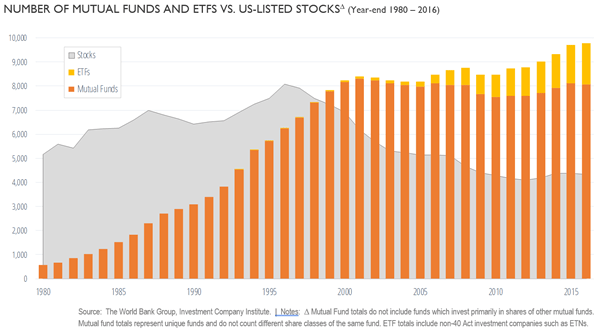

## Table of Contents

## What is a mutual fund?

A mutual fund is a type of investment where many people pool their money together to buy a variety of stocks, bonds, or other assets. This is managed by a professional who makes decisions about what to buy and sell. It's like a big basket where everyone's money goes in, and the manager decides how to spread it out to try and make it grow.

Investing in a mutual fund can be a good choice for someone who doesn't want to pick individual stocks themselves. By investing in a mutual fund, you get a piece of many different investments, which can help spread out the risk. If one stock does poorly, it might be balanced out by others that do well. This way, your money is not all riding on just one or two companies.

## How do mutual funds work?

When you invest in a mutual fund, you're putting your money into a big pool with other investors. This pool of money is used to buy a mix of different investments like stocks, bonds, or other assets. A professional manager runs the fund and decides what to buy and sell. They try to pick investments that will grow over time, making the value of the fund go up. You own a part of the fund based on how much money you put in, and the value of your investment goes up or down with the overall value of the fund.

The price of a mutual fund share is called its Net Asset Value (NAV), which is calculated by dividing the total value of all the investments in the fund by the number of shares. When you want to buy or sell shares of the fund, you do it at the end of the trading day at the NAV price. Mutual funds can offer different goals, like growth, income, or a mix of both. Some funds focus on specific areas, like technology or healthcare, while others spread their investments across many different types of companies and industries. This diversification can help reduce risk, as it's less likely that all the investments in the fund will go down at the same time.

## What are the different types of mutual funds?

Mutual funds come in different types, each with its own way of investing. There are stock funds that mainly buy shares in companies. These can focus on big companies, small companies, or even companies from a certain part of the world. Then there are bond funds that invest in bonds, which are like loans to companies or governments. Bond funds can be safer but usually don't grow as fast as stock funds. Money market funds are another type; they invest in very safe, short-term things like government securities and are good for saving money you might need soon.

There are also balanced funds, which mix stocks and bonds to give you a bit of growth and a bit of safety. Index funds try to match the performance of a big group of investments, like the S&P 500, instead of trying to beat it. They often have lower costs because they don't need a manager to pick and choose investments. Sector funds focus on a specific industry, like technology or healthcare, and can be riskier because they depend a lot on how that one industry does. Lastly, target-date funds change their mix of investments over time, getting safer as you get closer to a certain date, like when you plan to retire.

## Why have mutual funds proliferated in recent years?

Mutual funds have become more popular in recent years because they make investing easier for people. Instead of having to pick individual stocks or bonds, which can be hard and risky, people can put their money into a mutual fund and let a professional manage it. This is especially helpful for people who don't have a lot of time or knowledge about investing. Also, mutual funds let you spread your money across many different investments, which can make it less risky than putting all your money into just one or two things.

Another reason mutual funds have grown is because they offer a lot of choices. There are funds for almost every kind of investment goal, whether you want to grow your money fast, get regular income, or save for something specific like retirement. This variety means more people can find a fund that fits what they need. Plus, with the rise of online investing platforms, it's easier than ever to buy and sell mutual funds, making them more accessible to everyone.

## What are the benefits of investing in mutual funds?

Investing in mutual funds has many benefits. One big advantage is that they help you spread out your risk. Instead of putting all your money into one stock or bond, a mutual fund lets you own a small piece of many different investments. This means if one company does badly, it might not hurt your whole investment because other parts of the fund could do well. Also, mutual funds are managed by professionals who know a lot about investing. They make the decisions about what to buy and sell, which can be a big help if you don't have the time or knowledge to do it yourself.

Another benefit is that mutual funds are easy to get into. You can start with a small amount of money, and many funds let you add more money over time. This makes it easier for regular people to invest and grow their savings. Plus, there are lots of different types of mutual funds, so you can pick one that fits your goals, whether you want to grow your money fast, get regular income, or save for the future. With so many options, you can find a fund that matches what you're looking for.

## What are the risks associated with mutual funds?

Investing in mutual funds comes with risks, just like any other type of investment. One big risk is that the value of the fund can go down. This happens when the stocks, bonds, or other things the fund owns lose value. If you need to take your money out when the fund's value is low, you might get back less than you put in. Another risk is that the fund might not do as well as you hoped. Even though there's a professional managing the fund, they can make mistakes or the market might not go the way they expected.

Another thing to watch out for is fees. Mutual funds charge fees for managing your money, and these can eat into your returns. If the fees are high, they can make a big difference in how much money you end up with. Also, some mutual funds can be risky because they focus on just one type of investment, like a certain industry. If that industry does badly, the whole fund can suffer. So, it's important to understand what you're investing in and how much risk you're comfortable with.

## How does the proliferation of mutual funds impact the investment market?

The growth of mutual funds has changed the investment market a lot. More people can now invest easily because mutual funds let you put in small amounts of money. This has made investing more popular and has brought in a lot of new investors. Also, since there are so many different types of mutual funds, people can find ones that match what they want, whether it's saving for retirement, getting regular income, or growing their money fast. This variety has made the market more interesting and has given people more choices.

But the rise of mutual funds has also made the market more competitive. Fund managers are always trying to do better than others to attract more investors. This competition can be good because it pushes them to work harder and find better investments. However, it can also lead to more risk-taking as managers try to stand out. Plus, with so many funds to choose from, it can be hard for people to pick the right one. They need to be careful and do their homework to make sure they're investing in a fund that fits their goals and comfort with risk.

## What role do regulations play in the proliferation of mutual funds?

Regulations play a big part in how many mutual funds there are and how they work. Governments make rules to protect people who invest their money. These rules say what funds can and can't do, and they make sure that funds tell investors clearly about the risks and costs. Because of these rules, people feel safer putting their money into mutual funds. The rules also help keep the market fair, so everyone has a good chance to invest and make money.

These regulations also help the mutual fund industry grow. When people trust that the rules will keep their money safe, more of them want to invest. This means more money for the funds to manage, and it can lead to more funds being created. But the rules can also make things harder for new funds to start up, because they have to follow all the rules from the beginning. Overall, regulations help balance the growth of mutual funds with the need to protect investors.

## How can investors choose the right mutual fund from the vast array available?

Choosing the right mutual fund can be tough because there are so many options. Start by figuring out what you want from your investment. Are you saving for something far away like retirement, or do you need money sooner? Knowing your goal will help you pick a fund that matches it. For example, if you're saving for the long term, you might want a fund that grows fast, even if it's a bit riskier. But if you need money soon, you might choose a safer fund that doesn't grow as fast but is more stable.

Next, look at the fund's past performance and fees. Past performance doesn't guarantee future results, but it can give you an idea of how the fund has done. Also, check the fees because they can eat into your returns. Lower fees usually mean more money in your pocket over time. Think about how the fund is managed, too. Some funds try to beat the market, while others just try to match it. Index funds, which try to match the market, often have lower fees. Finally, consider how much risk you're okay with. Some funds are riskier than others, so pick one that fits your comfort level.

## What are the latest trends in mutual fund offerings?

One big trend in mutual funds these days is the rise of [ESG](/wiki/esg-investing) funds. ESG stands for Environmental, Social, and Governance. These funds invest in companies that are good for the planet, treat their workers well, and are run in a fair way. More and more people want to invest their money in ways that match their values, so these funds are becoming really popular. They let people feel good about where their money is going while still trying to grow their savings.

Another trend is the growth of target-date funds. These funds change what they invest in over time, getting safer as you get closer to a certain date, like when you plan to retire. They're super popular for retirement savings because they do the hard work of changing your investments for you. As you get older, the fund will automatically move your money into safer investments, so you don't have to worry about making those changes yourself. This makes saving for the future a lot easier for a lot of people.

## How do global economic factors influence the proliferation of mutual funds?

Global economic factors play a big role in how many mutual funds there are and how well they do. When the world economy is doing well, more people feel good about investing their money. They might put more money into mutual funds because they think the funds will grow. Also, when interest rates are low, people look for other places to put their money to get a better return, and mutual funds can be a good choice. But if the world economy is struggling, people might pull their money out of mutual funds because they're worried about losing it. This can make it harder for new funds to start up and for existing ones to grow.

Another thing that affects mutual funds is what's happening in different countries. If a country is doing really well, funds that invest in that country might attract more money. But if a country is having problems, funds that focus on that country might see people taking their money out. Also, things like trade agreements and political changes can shake up the market and influence how many mutual funds there are and how they do. Overall, the global economy can make the mutual fund market grow or shrink, depending on how things are going around the world.

## What future developments can we expect in the mutual fund industry due to its proliferation?

As mutual funds keep growing, we can expect to see more types of funds being created to meet different needs. One big change might be even more focus on ESG funds, which invest in companies that are good for the environment, treat their workers well, and are run fairly. People are caring more about where their money goes, so these funds could become even more popular. Also, technology will probably play a bigger role. More funds might use [artificial intelligence](/wiki/ai-artificial-intelligence) and big data to pick investments, which could make them better at finding good opportunities and managing risks.

Another thing we might see is more personalized mutual funds. With all the data and technology available, funds could be made to fit each person's goals and how much risk they're okay with. This could make investing easier and more tailored to what people want. Plus, as more people around the world start investing, mutual funds might become even more global. Funds could invest in more countries and industries, giving people a chance to spread their money out even more and maybe find new ways to grow their savings.

## References & Further Reading

[1]: Bergstra, J., Bardenet, R., Bengio, Y., & Kégl, B. (2011). ["Algorithms for Hyper-Parameter Optimization."](https://dl.acm.org/doi/10.5555/2986459.2986743) Advances in Neural Information Processing Systems 24.

[2]: ["Advances in Financial Machine Learning"](https://www.amazon.com/Advances-Financial-Machine-Learning-Marcos/dp/1119482089) by Marcos Lopez de Prado

[3]: ["Evidence-Based Technical Analysis: Applying the Scientific Method and Statistical Inference to Trading Signals"](https://www.amazon.com/Evidence-Based-Technical-Analysis-Scientific-Statistical/dp/0470008741) by David Aronson

[4]: ["Machine Learning for Algorithmic Trading"](https://github.com/stefan-jansen/machine-learning-for-trading) by Stefan Jansen

[5]: ["Quantitative Trading: How to Build Your Own Algorithmic Trading Business"](https://www.amazon.com/Quantitative-Trading-Build-Algorithmic-Business/dp/1119800064) by Ernest P. Chan