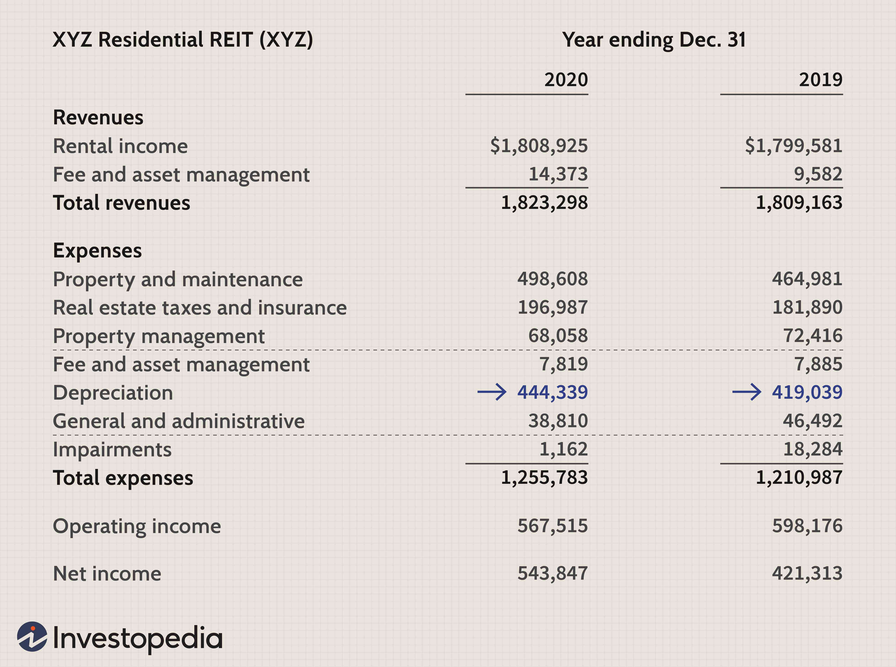

Apartment Investment Real Estate Trusts (REITs) have emerged as a popular choice for investors seeking both stable income and portfolio diversification. Known for owning and managing residential rental properties, these REITs provide a strategic avenue for acquiring real estate exposure without the complexities of direct property ownership. They are often valued for their potential to deliver consistent dividends and their resistance to economic downturns, making them a reliable asset class in volatile markets.

Algorithmic trading now presents a novel opportunity in this sector by optimizing investment strategies through advanced technology. This process involves the use of automated systems to execute trades based on pre-defined criteria, thus enhancing trading precision and efficiency. By leveraging statistical models and technical indicators, algorithmic trading minimizes human error and enables the execution of trades at a speed unattainable by human traders. The synergy between apartment REITs and algorithmic trading can potentially maximize returns and streamline portfolio management.



This article explores the intersection of algorithmic trading with apartment REITs, providing insight into the benefits and challenges investors may encounter. It also discusses future trends, including the development of more sophisticated algorithms and the possible integration of emerging technologies. By examining these aspects, we aim to highlight the transformative potential of algorithmic trading in apartment REIT investments.

## Table of Contents

## What are Apartment REITs?

Apartment Real Estate Investment Trusts (REITs) are investment vehicles that primarily focus on owning and managing residential rental properties, particularly apartments and multifamily housing. These specialized REITs allow investors to gain exposure to the real estate market without the complications and responsibilities associated with directly owning physical properties. This aspect makes them an attractive option for individuals seeking to invest in real estate with potentially less risk and management hassle.

The fundamental structure of apartment REITs involves pooling capital from numerous investors to acquire and manage residential properties. These properties generate income through rent collected from tenants, which is then distributed to the investors in the form of dividends. One of the defining features of apartment REITs is their potential to provide stable dividend yields. This stability primarily arises from the consistent demand for residential rental housing, which can offer a degree of income reliability. 

Moreover, apartment REITs are often perceived as relatively resilient to economic downturns. During periods of economic uncertainty or market volatility, people still require housing, and therefore, rental properties can maintain stronger occupancy rates compared to other real estate sectors such as commercial or retail. This resilience is a key [factor](/wiki/factor-investing) in why investors might choose apartment REITs over other forms of real estate investments.

Apartment REITs also benefit from professional management. They typically employ experienced property management teams to handle day-to-day operations, maintenance, and tenant relations, which can lead to more efficient property oversight and enhanced tenant satisfaction.

In conclusion, apartment REITs offer an accessible and efficient method for investors to engage in the real estate market, promising benefits such as stable income and certain economic safety nets. This structure facilitates a diverse range of participation in real estate investment, accommodating both individual and institutional investors seeking to bolster their portfolios with real estate assets.

## Fundamentals of Algorithmic Trading

Algorithmic trading employs automated systems to conduct trades based on predetermined criteria, utilizing statistical models and technical indicators. This form of trading reduces human error, which can often arise from emotional biases and inconsistent decision-making. By relying on algorithms, traders can achieve speeds and accuracy levels unattainable through manual processes.

At the core, [algorithmic trading](/wiki/algorithmic-trading) systems observe market data to execute trades under specific conditions. There are two primary components in this system: trade generation and trade execution. 

Trade generation involves scanning for investment opportunities, often via statistical models such as moving averages, regression analysis, or [machine learning](/wiki/machine-learning) techniques. For instance, a simple moving average (SMA) crossover strategy may involve buying an asset when a short-term SMA crosses above a long-term SMA, signaling an upward trend. Mathematically, an SMA can be represented as:

$$
\text{SMA}_n = \frac{P_1 + P_2 + \cdots + P_n}{n}
$$

where $P$ represents the price of the asset at each time interval.

Technical indicators, like the Relative Strength Index (RSI), Bollinger Bands, or MACD (Moving Average Convergence Divergence), provide additional signals to refine these strategies. These indicators help algorithms discern overbought or oversold conditions or confirm ongoing trends.

The trade execution stage involves swiftly trading assets to optimize execution price and timing using advanced strategies, such as market impact models or [volume](/wiki/volume-trading-strategy)-weighted average price (VWAP) algorithms. For example, minimizing slippage—which refers to the difference between expected transaction prices and actual executed prices—is crucial, especially in fast-moving markets.

Algorithms can also adapt using [backtesting](/wiki/backtesting) and optimization, where historical data is used to evaluate the strategy's effectiveness and refine it accordingly. A Python outline of a simple moving average crossover strategy might look like this:

```python
import pandas as pd

# Assuming 'data' is a DataFrame containing historical stock prices
short_window = 40
long_window = 100

data['Short_MA'] = data['Close'].rolling(window=short_window, min_periods=1).mean()
data['Long_MA'] = data['Close'].rolling(window=long_window, min_periods=1).mean()

# Generate signals
data['Signal'] = 0
data.loc[data['Short_MA'] > data['Long_MA'], 'Signal'] = 1
data.loc[data['Short_MA'] < data['Long_MA'], 'Signal'] = -1

# Shifting the signal column by 1 day
data['Position'] = data['Signal'].shift()

# Backtesting framework would enter or exit positions based on this 'Position' column
```

In summary, algorithmic trading merges computational precision with financial acumen, enabling traders to capture fleeting market opportunities more accurately. This capability is particularly valuable in high-frequency trading environments and can be tailored to different asset classes and trading conditions, including apartment REITs.

## Application of Algo Trading in Apartment REITs

Apartment Real Estate Investment Trusts (REITs) are uniquely positioned to benefit from algorithmic trading due to the steady demand for residential properties. The application of algorithmic trading in apartment REITs leverages advanced technologies to analyze extensive datasets, which is pivotal in forecasting market trends and making well-informed trading decisions.

Algorithms in trading automate the analysis of large datasets to identify patterns and predict market movements. In the context of apartment REITs, these algorithms can process various data inputs, such as rental price trends, occupancy rates, and economic indicators, to gauge the future performance of the REITs market. For instance, using time-series analysis and regression techniques, algorithms can predict rental growth rates or detect market anomalies, thus enabling traders to make timely buy or sell decisions.

The integration of algorithms allows for precise market timing. Algorithms can execute trades at optimal times by reacting instantaneously to market fluctuations. They accomplish this by utilizing strategies like [momentum](/wiki/momentum) trading, where buy or sell signals are generated based on the short-term performance momentum of apartment REIT stocks. A Python script employing a simple moving average crossover strategy could look like this:

```python
import pandas as pd

# Example data setup
data = pd.DataFrame({
    'price': [100, 101, 102, 104, 103, 105, 106, 107]
})

# Calculate moving averages
short_window = 3
long_window = 5
data['short_mavg'] = data['price'].rolling(window=short_window, min_periods=1, center=False).mean()
data['long_mavg'] = data['price'].rolling(window=long_window, min_periods=1, center=False).mean()

# Generate trading signals
data['signal'] = 0  # No position
data['signal'][short_window:] = \
    np.where(data['short_mavg'][short_window:] > data['long_mavg'][short_window:], 1.0, 0.0)  # Buying signal

# Print signals
print(data)
```

In addition to market timing, algorithmic trading enhances risk management capabilities. Through backtesting and stress testing, investors can evaluate the performance of their trading strategies under different market conditions. Algorithms can automatically adjust portfolios by reallocating assets or adjusting leverage to mitigate potential risks. This optimization is crucial for maintaining returns while minimizing exposure to adverse market movements.

Furthermore, algorithms can capitalize on [arbitrage](/wiki/arbitrage) opportunities within the apartment REIT market. By simultaneously buying and selling REIT stocks across different exchanges or markets, these algorithms help in capturing price discrepancies, leading to potentially higher profits. High-frequency trading systems can swiftly perform these arbitrage operations, contributing to market efficiency and [liquidity](/wiki/liquidity-risk-premium).

In summary, algorithmic trading in apartment REITs enables efficient data handling for market forecasting, precise timing for market entry and [exit](/wiki/exit-strategy), and sophisticated risk and portfolio management. This strategic application holds the potential to greatly enhance returns and offer robust investment opportunities within the apartment REIT sector.

## Benefits of Algo Trading for Apartment REITs Investors

Algorithmic trading has revolutionized the way investments are managed, offering distinct advantages for Apartment Real Estate Investment Trusts (REITs) investors seeking improved financial outcomes. Among the primary benefits is the heightened precision and efficiency in trading activities. Algorithms can process large datasets and execute trades based on pre-defined criteria with remarkable speed and accuracy, minimizing human error and reducing the risk of irrational decision-making. By leveraging statistical models and technical indicators, algorithms can effectively identify optimal entry and exit points, potentially leading to superior returns.

The use of algorithmic trading also results in considerable cost savings compared to manual trading processes. Traditional trading methods often incur higher labor costs due to the need for skilled human traders and analysts. Furthermore, transaction fees may be elevated as a result of slower execution times and less efficient order placements. Algorithms, conversely, streamline the execution process, significantly reducing both labor and transaction expenses. This increased operational efficiency allows investors to allocate capital more effectively, enhancing overall investment performance.

Additionally, algorithmic trading affords investors the ability to swiftly adapt to ever-changing market conditions. The real estate market is subject to various influences such as economic indicators, interest rates, and demographic shifts, which can impact the performance of REITs. Algorithms are equipped to analyze real-time data and adjust trading strategies quickly, capitalizing on short-term opportunities that may arise. This adaptability is crucial in maintaining a competitive edge and ensuring investment portfolios are optimally aligned with prevailing market dynamics.

In summary, the integration of algorithmic trading in Apartment REITs provides investors with precise and efficient trading capabilities, lowered operational costs, and the flexibility to respond promptly to market developments, all of which contribute to maximizing the potential for financial success.

## Challenges and Risks

The integration of algorithmic trading in Apartment REITs is not without its challenges and risks. A primary concern revolves around the reliance on automation, which can introduce systemic risks if algorithms fail to perform as expected. This is particularly critical in fast-moving markets or during unexpected events where human intervention might be less agile in addressing issues that arise from algorithmic failures.

Market [volatility](/wiki/volatility-trading-strategies) poses another significant challenge to the effectiveness of algorithmic trading strategies, especially within less liquid segments of the REITs market. During periods of high volatility, prices can fluctuate rapidly, leading to potential mispricing or execution at unfavorable price points. Algorithms designed without accounting for these volatilities may fail to adapt quickly, resulting in either missed opportunities or unexpected losses.

The continuous need for development and refinement of trading algorithms is paramount to ensure they remain effective. Markets are dynamic, influenced by innumerable factors, including economic policies, interest rates, and investor sentiment. As such, algorithms require frequent updates to incorporate new data and adapt to evolving market dynamics. This involves employing advanced machine learning techniques—such as neural networks or [reinforcement learning](/wiki/reinforcement-learning)—to improve predictive accuracy and decision-making capabilities. Here is a simple example of how a reinforcement learning model might be set up in Python:

```python
import numpy as np
import gym

# Initialize environment
env = gym.make('CartPole-v1')

# Example neural network model
from keras.models import Sequential
from keras.layers import Dense, Activation

model = Sequential()
model.add(Dense(units=24, input_dim=4, activation='relu'))
model.add(Dense(units=24, activation='relu'))
model.add(Dense(units=2, activation='linear'))
model.compile(optimizer='adam', loss='mse')

# Reinforcement learning loop
for episode in range(1000):
    state = env.reset()
    done = False
    while not done:
        action = np.argmax(model.predict(state.reshape(1, -1)))
        next_state, reward, done, _ = env.step(action)
        model.fit(state.reshape(1, -1), next_state, verbose=0)
        state = next_state
```

This example illustrates the basics of setting up a model, but algorithmic trading in REITs would involve more complex models tailored to financial data. The key takeaway is the importance of regular updates and rigorous testing to ensure the algorithms align with current market conditions, thus reducing the risks associated with trading in the dynamic real estate market. Continued research and development in this area are crucial to refine these tools and mitigate the inherent risks of algorithmic trading in Apartment REITs.

## Future Trends

The evolution of algorithmic trading is being significantly impacted by advances in [artificial intelligence](/wiki/ai-artificial-intelligence) (AI) and machine learning (ML), which promise to transform the trading of Apartment Real Estate Investment Trusts (REITs). AI and ML-driven algorithms can analyze vast amounts of data more efficiently, providing insights and predictions that are more accurate than traditional models. This capability is particularly beneficial in refining trading strategies and enhancing decision-making processes.

For example, by employing AI models such as neural networks, investors can automatically identify complex patterns in market data that might be imperceptible to human analysts. These models can process historical and real-time data to predict future trends, thus optimizing buy and sell decisions. A simple illustration could involve utilizing a Python-based machine learning library, such as TensorFlow or PyTorch, to develop a predictive algorithm that forecasts REIT price movements based on historical data points:

```python
import numpy as np
import tensorflow as tf

# Sample data preparation
def generate_data(n_samples):
    X = np.random.rand(n_samples, 10)  # 10 features
    y = np.random.rand(n_samples, 1)   # Target variable
    return X, y

# Creating and training the model
X_train, y_train = generate_data(1000)
model = tf.keras.Sequential([
    tf.keras.layers.Dense(units=64, activation='relu', input_shape=(10,)),
    tf.keras.layers.Dense(units=1)
])
model.compile(optimizer='adam', loss='mean_squared_error')
model.fit(X_train, y_train, epochs=10)
```

In terms of adoption, institutional investors are increasingly turning to algorithmic trading to manage and optimize their REITs portfolios. This shift is driven by the desire for improved efficiency, minimized transaction costs, and the ability to capitalize on market opportunities with precision. The expansion of algorithmic trading within this segment is supported by the increased availability of data and the growing sophistication of computational tools, making it an attractive option for large-scale investors looking to maximize returns.

Blockchain technology also presents a promising future trend for algorithmic trading in the REITs market. Its potential to enhance transparency and efficiency in the transaction settlement process could revolutionize how trades are confirmed and recorded. Blockchain could enable more secure and faster transactions, reduce the risk of fraud, and provide a clear, immutable record of ownership changes in REIT securities.

Overall, the future of algorithmic trading in the REITs sector is one of increased sophistication and integration of emerging technologies. While these advancements offer numerous opportunities, they also necessitate continuous adaptation and monitoring to ensure that algorithmic strategies remain effective in the face of evolving market conditions.

## Conclusion

The fusion of apartment Real Estate Investment Trusts (REITs) and algorithmic trading offers a cutting-edge investment strategy with significant potential. By integrating complex algorithms, investors harness a tool that operates with precision and speed, enabling swift adjustments and capitalizing on market opportunities. This innovative approach facilitates a new level of responsiveness and accuracy in executing trades, vital in today's fast-paced markets.

However, the dynamic nature of algorithmic trading and the intricacies of apartment REITs demand careful consideration from investors. It's crucial to balance the prospective rewards with the inherent risks, such as the possibility of systemic failures if algorithms malfunction or market volatility impacts strategy performance. Thus, a comprehensive evaluation of strategies, continuous monitoring, and periodic recalibration of algorithms are recommended to ensure alignment with evolving market conditions.

Technological progressions continue to shape the landscape of algorithmic trading, promising further enhancement of trading tactics within the REITs sector. Developments in artificial intelligence, machine learning, and blockchain technology may offer additional avenues for optimizing transaction processing, market analysis, and transparency. Investors who stay informed about these advancements can strategically position themselves to capitalize on upcoming opportunities in the apartment REITs market, maintaining a balanced viewpoint amidst evolving trends.

## References & Further Reading

[1]: Bergstra, J., Bardenet, R., Bengio, Y., & Kégl, B. (2011). ["Algorithms for Hyper-Parameter Optimization."](https://dl.acm.org/doi/10.5555/2986459.2986743) Advances in Neural Information Processing Systems 24.

[2]: ["Advances in Financial Machine Learning"](https://www.amazon.com/Advances-Financial-Machine-Learning-Marcos/dp/1119482089) by Marcos Lopez de Prado

[3]: ["Evidence-Based Technical Analysis: Applying the Scientific Method and Statistical Inference to Trading Signals"](https://www.amazon.com/Evidence-Based-Technical-Analysis-Scientific-Statistical/dp/0470008741) by David Aronson

[4]: ["Machine Learning for Algorithmic Trading"](https://github.com/stefan-jansen/machine-learning-for-trading) by Stefan Jansen

[5]: ["Quantitative Trading: How to Build Your Own Algorithmic Trading Business"](https://www.amazon.com/Quantitative-Trading-Build-Algorithmic-Business/dp/1119800064) by Ernest P. Chan