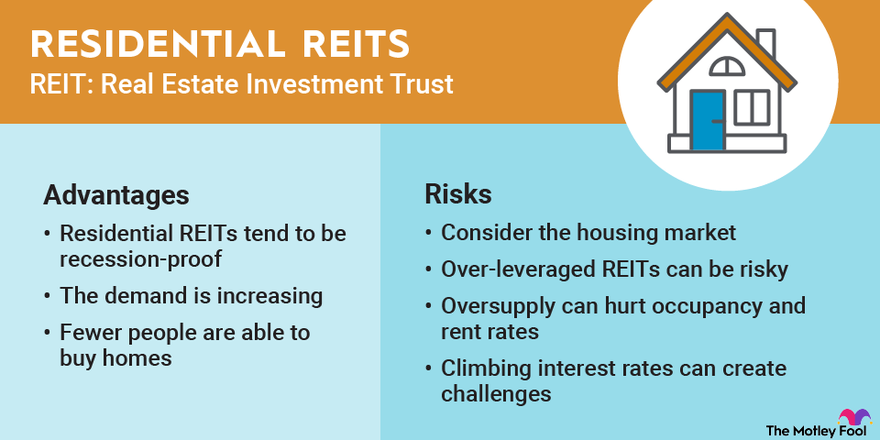

## Table of Contents

## What is an Apartment Real Estate Investment Trust (REIT)?

An Apartment Real Estate Investment Trust (REIT) is a company that owns and manages apartment buildings and other residential properties. People invest in these REITs to earn money from the rent that tenants pay. The REIT collects the rent, takes care of the buildings, and gives some of the money back to the investors as dividends. This way, investors can make money from real estate without having to buy and manage properties themselves.

REITs are popular because they offer a way to invest in real estate with less money than buying a property outright. They also provide regular income through dividends, which can be attractive to people looking for steady returns. Additionally, because REITs are traded on stock exchanges, they are easy to buy and sell, making them more liquid than owning physical real estate.

## How do Apartment REITs generate revenue?

Apartment REITs make money mainly by collecting rent from the people who live in their apartment buildings. When someone rents an apartment, they pay rent every month. The REIT takes this money and uses some of it to pay for things like fixing up the buildings, paying workers, and other costs. After paying these expenses, the REIT keeps the rest of the money as profit.

The REIT then shares this profit with its investors by paying them dividends. Dividends are like a share of the money the REIT makes, and they are usually paid out every few months. This way, investors get a regular income from the rent that tenants pay, without having to own or manage the apartments themselves.

## What are the benefits of investing in Apartment REITs?

Investing in Apartment REITs can be a good way to make money without having to buy and take care of apartment buildings yourself. When you invest in an Apartment REIT, you are buying a piece of a big company that owns lots of apartments. The company collects rent from the people living in these apartments, and then it gives some of that money back to you as dividends. This means you can get a regular income from the rent without the hassle of being a landlord.

Another benefit is that Apartment REITs are easy to buy and sell. They are traded on stock exchanges, so you can buy and sell them whenever you want, just like stocks. This makes them more flexible than owning a real apartment, where it can take a long time to find a buyer. Also, because you are investing in a big company that owns many apartments, your investment is spread out, which can make it less risky than owning just one apartment.

## What are the risks associated with Apartment REITs?

One risk of investing in Apartment REITs is that the value of the REIT can go up and down. If a lot of people want to rent apartments, the REIT can make more money and the value might go up. But if fewer people want to rent, the REIT might make less money, and the value could go down. This means you could lose money if you need to sell your shares when the value is low.

Another risk is that the REIT might have a lot of debt. To buy more apartment buildings, REITs often borrow money. If they can't pay back this debt, it could cause problems for the company and hurt the value of your investment. Also, if interest rates go up, it can cost the REIT more to borrow money, which might mean they have less money to pay out as dividends to you.

Lastly, changes in laws or the economy can affect Apartment REITs. For example, if the government makes new rules about renting or if there is a big economic downturn, it could be harder for the REIT to make money. This could lead to lower dividends or a drop in the value of your investment. It's important to think about these risks before deciding to invest in an Apartment REIT.

## How can someone start investing in Apartment REITs?

To start investing in Apartment REITs, you first need to open a brokerage account. This is like a special bank account where you can buy and sell investments like stocks and REITs. You can open a brokerage account at many different places, like big banks or online companies. Once your account is set up, you can look for Apartment REITs that you want to invest in. You can search for them by their names or by the stock symbols they use on the stock market.

After you find an Apartment REIT you like, you can buy shares of it through your brokerage account. Just like buying anything else, you'll need to decide how many shares you want and then place an order. Once you own the shares, you'll start to get dividends, which are like little payments from the REIT, usually every few months. Keep in mind that the value of your shares can go up or down, so it's a good idea to keep an eye on how your investment is doing.

## What are some key performance indicators to look at when evaluating Apartment REITs?

When you're thinking about investing in Apartment REITs, it's important to look at some key performance indicators to see how well the company is doing. One thing to check is the occupancy rate, which shows what percentage of the apartments are rented out. A high occupancy rate means more people are paying rent, which is good for the REIT. Another thing to look at is the funds from operations (FFO), which is a way to see how much money the REIT is making after paying for things like maintenance and management. A higher FFO usually means the REIT is doing well.

You should also pay attention to the dividend yield, which tells you how much money you're getting back from your investment as a percentage of what you paid for it. A higher dividend yield can be a good sign, but make sure it's not too high because that might mean the REIT is having trouble. Lastly, look at the debt-to-equity ratio, which shows how much the REIT has borrowed compared to what the investors have put in. A lower ratio is usually better because it means the REIT isn't relying too much on borrowed money, which can be risky.

## Can you list some of the largest and most prominent Apartment REITs?

Some of the biggest and most well-known Apartment REITs are AvalonBay Communities, Equity Residential, and Mid-America Apartment Communities. AvalonBay Communities owns and manages a lot of apartments in places like Boston, New York, and Washington, D.C. Equity Residential is another big one, with apartments in cities like New York, Los Angeles, and San Francisco. Mid-America Apartment Communities, often called MAA, has apartments in the Sunbelt region, which includes places like Texas, Florida, and Georgia.

These Apartment REITs are popular because they own a lot of apartments in areas where a lot of people want to live. They are also known for being good at managing their properties and making money for their investors. When you invest in one of these REITs, you can get regular payments from the rent that tenants pay, without having to own and take care of the apartments yourself.

## How do economic cycles affect Apartment REIT performance?

Economic cycles can have a big impact on how well Apartment REITs do. When the economy is doing well, people have more money and jobs, so more of them can afford to rent apartments. This means the Apartment REITs can charge higher rents and have more people wanting to rent, which is good for their business. They can make more money and pay bigger dividends to their investors. But when the economy is not doing so well, like during a recession, people might lose their jobs or have less money. This can make it harder for them to pay rent, so the Apartment REITs might have to lower their rents or have more empty apartments. This can hurt their profits and the value of their shares.

Another way economic cycles affect Apartment REITs is through interest rates. When the economy is growing, interest rates often go up because the government tries to slow things down a bit. Higher interest rates can make it more expensive for Apartment REITs to borrow money to buy new buildings or fix up old ones. This can cut into their profits and make it harder for them to grow. On the other hand, when the economy is struggling, interest rates usually go down to help things get better. Lower interest rates can make it cheaper for Apartment REITs to borrow money, which can help them expand and do better. So, keeping an eye on the economy and interest rates can give you a good idea of how Apartment REITs might do in the future.

## What role does location play in the success of an Apartment REIT?

Location is really important for Apartment REITs. When an Apartment REIT owns apartments in popular cities or neighborhoods, it can charge higher rents because a lot of people want to live there. For example, apartments in big cities like New York or San Francisco are usually more expensive to rent than apartments in smaller towns. Also, if the area is growing and getting more jobs, more people will want to move there, which is good for the REIT. But if the location is not so good, like in a place where people are moving away or there are fewer jobs, it can be harder for the REIT to find tenants and keep the apartments full.

Another thing about location is that it can affect how much the apartments are worth. If the area is becoming more popular or getting new shops and restaurants, the value of the apartments can go up. This is good for the Apartment REIT because it means their property is worth more money. But if the area is getting worse or people are moving out, the value of the apartments can go down. This can be bad for the REIT because it might mean they have to sell their properties for less money or have a harder time making a profit. So, [picking](/wiki/asset-class-picking) the right locations is a big part of how successful an Apartment REIT can be.

## How do Apartment REITs manage and improve their properties?

Apartment REITs take care of their buildings by doing things like fixing broken things and making the place look nice. They have workers who check the apartments often to see if anything needs to be repaired. If something is broken, like a leaky faucet or a broken window, they fix it quickly so that the people living there are happy. They also paint the walls, clean the hallways, and make sure the outside of the building looks good. This helps keep the apartments in good shape and makes them a nice place to live.

To make their properties even better, Apartment REITs sometimes add new things that people want. They might put in a new gym, a pool, or a place where people can hang out and meet their neighbors. They also might add things like better security systems or faster internet to make living there easier and safer. By doing these things, they can charge more rent and keep their apartments full of happy tenants. This helps the REIT make more money and keep their investors happy too.

## What are the tax implications of investing in Apartment REITs?

When you invest in Apartment REITs, you need to think about taxes. One thing to know is that REITs don't pay corporate income tax if they give at least 90% of their taxable income back to investors as dividends. This is good for the REIT, but it means you have to pay taxes on the dividends you get. The dividends are usually taxed as regular income, which can be higher than the tax on other types of investments like stocks.

Another thing to remember is that if you sell your shares in an Apartment REIT and make a profit, you might have to pay capital gains tax. How much you pay depends on how long you held the shares. If you held them for less than a year, you pay short-term capital gains tax, which is the same as your regular income tax rate. If you held them for more than a year, you pay long-term capital gains tax, which is usually lower. So, it's important to think about these taxes when you're deciding to invest in Apartment REITs.

## How do regulatory changes impact Apartment REITs and their investors?

Regulatory changes can have a big impact on Apartment REITs and the people who invest in them. When the government makes new rules about renting or housing, it can change how much money Apartment REITs can make. For example, if a new law says that rents can't go up too much, the REIT might not be able to charge as much for their apartments. This can mean less money for the REIT, which might lead to smaller dividends for investors. Also, if the government changes the rules about taxes or how REITs have to report their earnings, it can affect how much profit the REIT can keep and how much they have to pay out.

These changes can also make things more complicated for Apartment REITs. If new rules come out about how they have to take care of their buildings or how they can evict people, it can cost more money to follow them. This extra cost can cut into the REIT's profits and make it harder to pay good dividends to investors. So, it's important for people who invest in Apartment REITs to keep an eye on what the government is doing and how it might change things for the REITs they own.

## What are the fundamentals of algorithmic trading?

Algorithmic trading employs automated systems to conduct trades based on predetermined criteria, utilizing statistical models and technical indicators. This form of trading reduces human error, which can often arise from emotional biases and inconsistent decision-making. By relying on algorithms, traders can achieve speeds and accuracy levels unattainable through manual processes.

At the core, [algorithmic trading](/wiki/algorithmic-trading) systems observe market data to execute trades under specific conditions. There are two primary components in this system: trade generation and trade execution. 

Trade generation involves scanning for investment opportunities, often via statistical models such as moving averages, regression analysis, or [machine learning](/wiki/machine-learning) techniques. For instance, a simple moving average (SMA) crossover strategy may involve buying an asset when a short-term SMA crosses above a long-term SMA, signaling an upward trend. Mathematically, an SMA can be represented as:

$$
\text{SMA}_n = \frac{P_1 + P_2 + \cdots + P_n}{n}
$$

where $P$ represents the price of the asset at each time interval.

Technical indicators, like the Relative Strength Index (RSI), Bollinger Bands, or MACD (Moving Average Convergence Divergence), provide additional signals to refine these strategies. These indicators help algorithms discern overbought or oversold conditions or confirm ongoing trends.

The trade execution stage involves swiftly trading assets to optimize execution price and timing using advanced strategies, such as market impact models or [volume](/wiki/volume-trading-strategy)-weighted average price (VWAP) algorithms. For example, minimizing slippage—which refers to the difference between expected transaction prices and actual executed prices—is crucial, especially in fast-moving markets.

Algorithms can also adapt using [backtesting](/wiki/backtesting) and optimization, where historical data is used to evaluate the strategy's effectiveness and refine it accordingly. A Python outline of a simple moving average crossover strategy might look like this:

```python
import pandas as pd

# Assuming 'data' is a DataFrame containing historical stock prices
short_window = 40
long_window = 100

data['Short_MA'] = data['Close'].rolling(window=short_window, min_periods=1).mean()
data['Long_MA'] = data['Close'].rolling(window=long_window, min_periods=1).mean()

# Generate signals
data['Signal'] = 0
data.loc[data['Short_MA'] > data['Long_MA'], 'Signal'] = 1
data.loc[data['Short_MA'] < data['Long_MA'], 'Signal'] = -1

# Shifting the signal column by 1 day
data['Position'] = data['Signal'].shift()

# Backtesting framework would enter or exit positions based on this 'Position' column
```

In summary, algorithmic trading merges computational precision with financial acumen, enabling traders to capture fleeting market opportunities more accurately. This capability is particularly valuable in high-frequency trading environments and can be tailored to different asset classes and trading conditions, including apartment REITs.

## References & Further Reading

[1]: Bergstra, J., Bardenet, R., Bengio, Y., & Kégl, B. (2011). ["Algorithms for Hyper-Parameter Optimization."](https://dl.acm.org/doi/10.5555/2986459.2986743) Advances in Neural Information Processing Systems 24.

[2]: ["Advances in Financial Machine Learning"](https://www.amazon.com/Advances-Financial-Machine-Learning-Marcos/dp/1119482089) by Marcos Lopez de Prado

[3]: ["Evidence-Based Technical Analysis: Applying the Scientific Method and Statistical Inference to Trading Signals"](https://www.amazon.com/Evidence-Based-Technical-Analysis-Scientific-Statistical/dp/0470008741) by David Aronson

[4]: ["Machine Learning for Algorithmic Trading"](https://github.com/stefan-jansen/machine-learning-for-trading) by Stefan Jansen

[5]: ["Quantitative Trading: How to Build Your Own Algorithmic Trading Business"](https://www.amazon.com/Quantitative-Trading-Build-Algorithmic-Business/dp/1119800064) by Ernest P. Chan