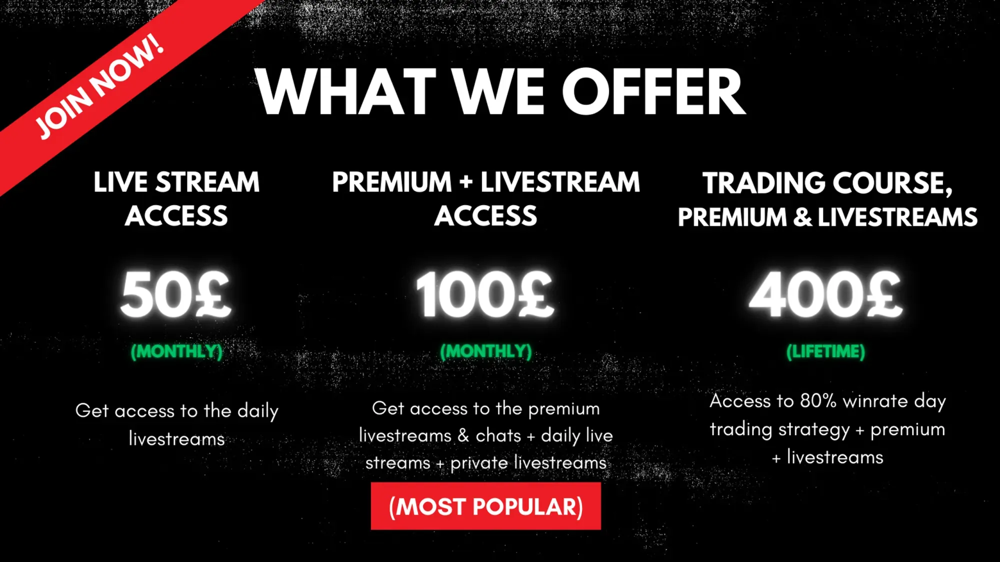

## Table of Contents

## What is day trading and why might someone want to take a course on it?

Day trading is when people buy and sell stocks or other financial things in one day. They try to make money from small changes in the prices. It's different from buying and holding onto stocks for a long time. Day traders need to watch the market closely and make quick decisions.

Someone might want to take a course on day trading to learn how to do it right. These courses can teach you about the tools and strategies that successful day traders use. They can also help you understand the risks and how to manage them. Learning from experts can make you feel more confident and help you avoid common mistakes that beginners often make.

## What are the key components to look for in a day trading course?

When looking for a day trading course, it's important to find one that covers the basics well. A good course should teach you about the different tools and platforms used for trading. It should also explain key concepts like technical analysis, which helps you predict price movements, and risk management, which is crucial for protecting your money. The course should be easy to understand, even if you're new to trading, and it should include practical examples and exercises to help you apply what you learn.

Another important thing to look for is the instructor's experience and reputation. The person teaching the course should have a proven track record in day trading and be able to share real-life insights and strategies. It's also helpful if the course offers ongoing support, like a community or forum where you can ask questions and learn from other traders. This can make a big difference in your learning journey and help you stay motivated.

Lastly, consider the course format and how it fits your learning style. Some courses might be entirely online with video lessons, while others might offer live webinars or even in-person sessions. Make sure the course provides enough material and resources to keep you engaged and learning at your own pace. A good course will also give you access to trading simulators, where you can practice trading without risking real money.

## Can you recommend beginner-friendly day trading courses and what makes them suitable for novices?

One great beginner-friendly day trading course is "Trading for Beginners" by Udemy. This course is perfect for novices because it starts with the basics and explains everything in simple terms. It covers important topics like how to read stock charts, understand market trends, and manage risk. The instructor, who has a lot of trading experience, also shares easy-to-follow strategies that beginners can use right away. Plus, the course includes quizzes and practice exercises to help you learn by doing, which is really helpful when you're just starting out.

Another good option is "Day Trading 101" offered by Warrior Trading. This course is designed specifically for people new to day trading. It breaks down complex ideas into simple lessons and uses lots of real-life examples to show you how trading works. The course also comes with a trading simulator, so you can practice without losing any money. The instructors at Warrior Trading are well-known in the trading world and they provide ongoing support through a community where you can ask questions and learn from other beginners. This makes it easier to keep learning and stay motivated as you start your trading journey.

## How do intermediate day trading courses differ from beginner courses?

Intermediate day trading courses are different from beginner courses because they go deeper into the topics. While beginner courses teach you the basics like how to read charts and manage risk, intermediate courses assume you already know these things. They focus on more advanced strategies and techniques that you can use to make better trading decisions. For example, an intermediate course might teach you about advanced chart patterns, different types of orders, and how to use more complex indicators to predict market movements.

Intermediate courses also often include more real-world examples and case studies. This helps you see how the strategies work in actual trading situations. They might also offer more hands-on practice, like trading simulations with more complex scenarios. This is important because it helps you get better at making quick decisions, which is a big part of day trading. Overall, intermediate courses are for people who already have some trading experience and want to improve their skills and knowledge.

## What advanced techniques are covered in expert-level day trading courses?

Expert-level day trading courses dive into really advanced techniques that go beyond what intermediate courses cover. They focus on things like high-frequency trading, where you make lots of trades very quickly using special computer programs. These courses also teach you about algorithmic trading, which means using math formulas to decide when to buy and sell. You'll learn about more complex ways to manage risk, like using options and futures, which are more advanced financial tools. The courses often go into detail about market psychology, helping you understand how other traders think and how to use that to your advantage.

These expert courses also spend a lot of time on backtesting and optimizing trading strategies. Backtesting means checking how well a trading plan would have worked in the past, using old market data. This helps you see if your strategy is good or if it needs changes. Expert courses might also teach you about different trading styles, like scalping, where you make lots of small trades for quick profits, or swing trading, where you hold onto trades for a few days. The goal is to give you the tools and knowledge to make smart, quick decisions in any market situation, and to keep improving your trading skills over time.

## Are there any day trading courses that focus specifically on technical analysis?

One course that focuses specifically on technical analysis is "Technical Analysis Masterclass" offered by Trading Academy. This course is perfect for people who want to get really good at reading charts and understanding price movements. It covers all the important parts of technical analysis, like different chart patterns, indicators, and how to use them to make smart trading decisions. The course starts with the basics and then goes into more advanced stuff, so it's good for everyone, no matter how much you already know. The instructors are experts in technical analysis and they share a lot of real-life examples to help you learn.

Another great course is "Mastering Technical Analysis" by Investopedia. This course is all about teaching you how to use technical analysis to predict what the market will do next. It goes over things like moving averages, support and resistance levels, and how to spot trends. The course also talks about how to use technical analysis with other trading strategies to make better trades. It's taught by people who have been trading for a long time, so you get to learn from their experience. Plus, there are quizzes and practice exercises to help you get better at using technical analysis in real trading situations.

## What are the benefits of taking a day trading course that includes live trading sessions?

Taking a day trading course that includes live trading sessions can be really helpful. In these sessions, you get to watch experienced traders make real trades in real time. This is a great way to see how they think and make decisions. You can learn a lot from seeing how they handle different situations and what strategies they use. It's like having a mentor show you exactly what to do, which can be much more useful than just reading about it or watching recorded videos.

Live trading sessions also let you ask questions and get immediate feedback. If you're not sure about something, you can ask the instructor right away and get an answer. This helps you understand things better and makes you feel more confident in your own trading. Plus, being part of a live session can make learning more exciting and keep you motivated. Overall, these sessions give you a more hands-on and interactive way to learn, which can make a big difference in how well you do as a day trader.

## How important is the reputation of the instructor when choosing a day trading course?

The reputation of the instructor is very important when choosing a day trading course. A good instructor can make a big difference in how much you learn and how well you do as a trader. If the instructor has a lot of experience and a good track record, you can trust that they know what they're talking about. They can share real-life tips and strategies that work, which can help you avoid common mistakes and make better trades.

Also, an instructor with a strong reputation often has a following of other traders who can help you learn. This means you can be part of a community where you can ask questions, get advice, and learn from others. A well-known instructor is more likely to keep the course up to date with the latest trading techniques and market changes, making sure you get the best information possible. So, when picking a day trading course, it's a good idea to look at who is teaching it and what others say about them.

## Can you list some day trading courses that offer certification upon completion?

One day trading course that offers certification upon completion is the "Professional Trading Certification" by Online Trading Academy. This course teaches you all about trading, from the basics to more advanced stuff. It includes hands-on practice and real trading simulations. When you finish the course and pass the exams, you get a certificate that shows you have the skills and knowledge to trade well. This can be helpful if you want to show others that you know what you're doing in trading.

Another course is "Day Trading Certification" by Bear Bull Traders. This course is all about day trading and it covers everything you need to know to start trading on your own. It includes lessons, live trading sessions, and a community where you can ask questions and learn from other traders. After you complete the course and pass the final test, you get a certification that proves you've learned the skills needed to be a day trader. This can be useful for building your confidence and showing potential employers or partners that you're serious about trading.

## What are the costs associated with top day trading courses and is there a correlation between cost and quality?

The costs for top day trading courses can be different, but they often range from a few hundred to a few thousand dollars. For example, a course like "Trading for Beginners" on Udemy might cost around $100 to $200, while more advanced courses like the "Professional Trading Certification" by Online Trading Academy can cost over $5,000. The price can depend on things like how long the course is, what you get with it, and who is teaching it. Some courses might also have extra fees for things like live trading sessions or one-on-one coaching.

There is not always a clear link between the cost of a day trading course and how good it is. Sometimes, a more expensive course might give you better resources, more hands-on practice, and access to experienced instructors. But, a cheaper course can still be really good if it teaches you what you need to know in a way that's easy to understand. The most important thing is to look at what the course offers and what other people say about it, not just the price. A course that fits your needs and helps you learn well is worth more than just a high price tag.

## How do online day trading courses compare to in-person seminars in terms of effectiveness and convenience?

Online day trading courses are very convenient because you can learn from home at your own pace. You don't have to travel to a specific place or take time off work to attend. These courses often have videos, quizzes, and trading simulators that you can use whenever you want. This makes it easier to fit learning into your schedule. Also, online courses can be cheaper than in-person seminars because they don't have to pay for a physical location.

In-person seminars, on the other hand, can be more effective for some people because you get to interact with the instructor and other students face-to-face. This can make it easier to ask questions and get immediate feedback. Being in a room with other traders can also help you stay motivated and learn from their experiences. But, in-person seminars can be more expensive and less flexible because you have to be there at a certain time and place. So, it really depends on what you prefer and what fits your schedule and budget better.

## What ongoing support and community resources do the best day trading courses provide to their students?

The best day trading courses offer ongoing support and community resources to help students keep learning and improving. They often have online forums or chat groups where you can ask questions and talk to other traders. This is really helpful because you can learn from people who are going through the same things as you. Some courses also have mentors or coaches who you can reach out to for advice. They might give you feedback on your trading or help you figure out what you're doing wrong. This kind of support can make a big difference in how well you do as a trader.

Another thing the best courses do is provide regular updates and new content. The trading world changes all the time, so it's important to keep learning new stuff. These courses might send you newsletters, hold webinars, or add new lessons to keep you up to date. They also might have special events or meetups where you can learn more and meet other traders. All of this helps you stay motivated and keep getting better at day trading.

## References & Further Reading

[1]: Bergstra, J., Bardenet, R., Bengio, Y., & Kégl, B. (2011). ["Algorithms for Hyper-Parameter Optimization."](https://papers.nips.cc/paper/4443-algorithms-for-hyper-parameter-optimization) Advances in Neural Information Processing Systems 24.

[2]: ["Advances in Financial Machine Learning"](https://www.amazon.com/Advances-Financial-Machine-Learning-Marcos/dp/1119482089) by Marcos Lopez de Prado

[3]: ["Evidence-Based Technical Analysis: Applying the Scientific Method and Statistical Inference to Trading Signals"](https://www.amazon.com/Evidence-Based-Technical-Analysis-Scientific-Statistical/dp/0470008741) by David Aronson

[4]: ["Machine Learning for Algorithmic Trading"](https://github.com/PacktPublishing/Machine-Learning-for-Algorithmic-Trading-Second-Edition) by Stefan Jansen

[5]: ["Quantitative Trading: How to Build Your Own Algorithmic Trading Business"](https://www.amazon.com/Quantitative-Trading-Build-Algorithmic-Business/dp/1119800064) by Ernest P. Chan