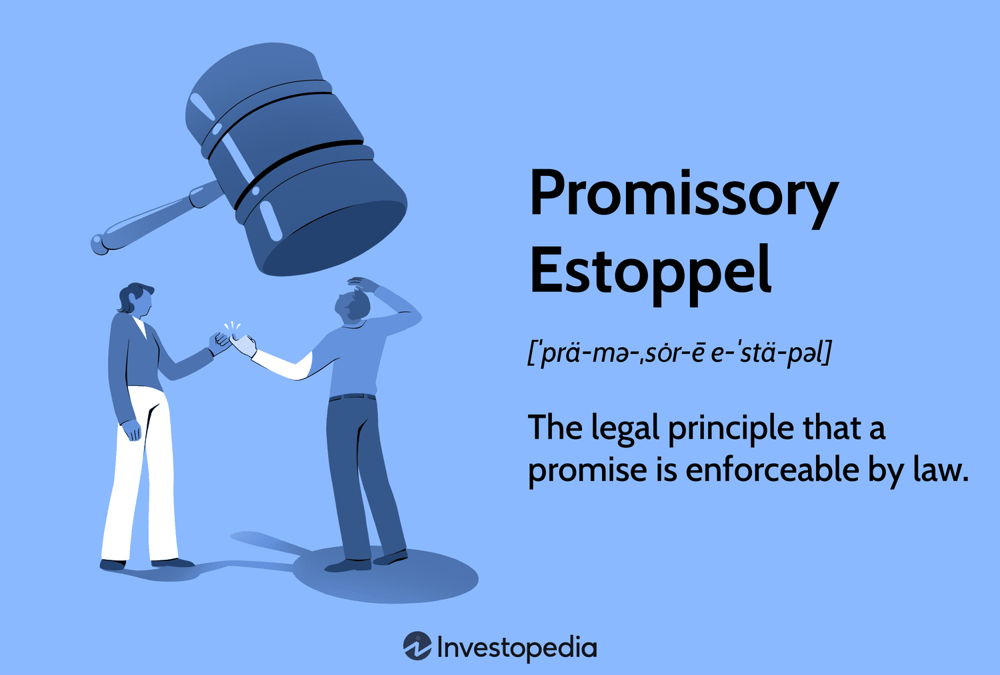

In recent years, the rapid advancement of financial technology has led to a profound intersection with established legal principles, creating a landscape where concepts such as contract law, promissory estoppel, and algorithmic trading converge. This dynamic amalgamation signals a transformative shift in how legal frameworks interact with financial systems, necessitating a comprehensive understanding to effectively navigate these complexities. Contract law provides the foundational structure for agreements and transactions, ensuring that parties adhere to their commitments. Promissory estoppel, a principle within contract law, plays a crucial role by making certain promises enforceable even in the absence of formal contracts, thereby promoting fairness and accountability when parties rely on such promises to their detriment.

Simultaneously, algorithmic trading represents a paradigm shift in financial markets, utilizing sophisticated algorithms to execute trades at speeds and efficiencies previously unattainable. This technological innovation not only enhances market operations but also introduces new challenges and complexities, particularly concerning legal and ethical considerations related to market manipulation and fairness. Understanding how these elements—legal principles and financial technology—interrelate is vital for legal practitioners, regulators, and market participants seeking to foster equitable and transparent trading environments.

This article examines the interconnectedness of these domains, providing insights into their individual roles and their collective impact on modern financial systems. By exploring the intersections between contract law, promissory estoppel, and algorithmic trading, we shed light on the evolving nature of financial transactions and the crucial role that legal doctrines play in supporting ethical and just practices in an increasingly technological world.

## Table of Contents

## Understanding Promissory Estoppel in Contract Law

Promissory estoppel serves as an essential doctrine in contract law, safeguarding participants from the unjust denial of promises upon which they have relied, even when formal contracts are absent. This doctrine plays a pivotal role in maintaining fairness and accountability, fundamentally ensuring that the legal system upholds justice and equitable treatment of parties involved in contractual agreements.

At its core, promissory estoppel operates on the principle that when a promisor makes a promise that they reasonably expect to induce reliance, and the promisee indeed takes action based on that reliance, the promisor is precluded from reneging on the promise if such reneging would result in a detriment to the promisee. This concept is particularly significant in situations where one party makes assurances upon which another party acts to their detriment, trusting that the original promise will be honored.

The requirements of promissory estoppel typically encompass several elements: a clear and definite promise, reasonable reliance on the promise by the promisee, and a detriment incurred as a result of the reliance. Additionally, enforcing the promise must be necessary to avoid injustice. These criteria collectively establish the foundation for invoking promissory estoppel in legal proceedings, providing a mechanism to circumvent scenarios where strict adherence to contract formalities might otherwise lead to unjust outcomes.

In practice, promissory estoppel has wide-ranging applications and significantly impacts contractual relationships. It serves as a corrective measure where traditional contract doctrine falls short, especially in informal agreements where parties act in good faith based on assurances without formalizing the terms. Thus, the doctrine of promissory estoppel becomes instrumental in legal contexts, offering protection to parties who might otherwise be vulnerable to arbitrary withdrawal of commitments.

Notably, its application extends beyond traditional contract situations, influencing various fields such as employment law, real estate transactions, and even family law. Courts often undertake a fact-intensive analysis to apply promissory estoppel judiciously, balancing the interests of both parties and assessing the broader implications of enforcing or denying the promise in question.

Promissory estoppel thus underscores the dynamism within legal frameworks, adapting to the intricacies and nuances of human promises by prioritizing equitable treatment and ensuring that legal resolutions reflect the just expectations of all parties involved.

## The Evolution of Estoppel in Legal Systems

Estoppel has a rich history rooted in English common law, serving as a crucial mechanism for promoting fairness and consistency within legal systems. Originating as a principle to prevent parties from contradicting their previous statements or actions, estoppel addresses injustices that may arise from such inconsistencies.

The doctrine of estoppel has evolved through various legal decisions, each contributing to its current form and application. One of the earliest significant cases was "High Trees House Ltd" (Central London Property Trust Ltd v High Trees House Ltd [1947] K.B. 130), where Lord Denning articulated the principle of promissory estoppel. This case set forth the notion that if a party makes a promise, intending it to be relied upon, and the promisee does indeed rely on it to their detriment, the promisor is estopped from going back on their word. This case expanded the traditional boundaries of estoppel beyond mere contractual relationships, introducing a more equitable doctrine to contract law.

Another landmark case was "Jordan v Money" (1854), which distinguished the nature of representation in estoppel. Here, the court held that for estoppel by representation to apply, the representation must pertain to past or present facts, rather than future promises. This distinction underscores the careful balance estoppel seeks to maintain between preventing injustice and ensuring that parties are held accountable for misleading representations.

As estoppel permeated other jurisdictions, its principles adapted to local legal contexts. In the United States, for example, promissory estoppel became a fundamental doctrine in situations where traditional contract requirements—such as consideration—might not be present but where enforcing a promise was necessary to avoid injustice. The Restatement (Second) of Contracts, Section 90, reflects this adaptation, illustrating how estoppel aids in achieving equity within contractual dealings.

Furthermore, the development of estoppel has been instrumental in promoting consistency in legal proceedings by preventing parties from adopting positions contradictory to their previous assertions. This is evident in cases like "Hughes v Metropolitan Railway Co" (1877), where the court underscored the need for consistency to preclude parties from unfair advantage.

Overall, estoppel's evolution demonstrates its adaptability and importance in ensuring justice within legal systems. Through landmark judicial interpretations and its adoption in various jurisdictions, estoppel continues to play a pivotal role in preventing injustices and upholding the integrity of legal processes. As modern legal challenges evolve, particularly with advancements in financial technologies and trading systems, the principles of estoppel will likely continue to adapt and inform legal practices.

 to Algorithmic Trading

Algorithmic trading entails the use of computer algorithms to automate the process of trading financial instruments such as stocks, bonds, and commodities. These algorithms are designed to execute trades with precision and speed, far exceeding human capabilities, thereby playing a significant role in modern financial markets. At its core, [algorithmic trading](/wiki/algorithmic-trading) seeks to capitalize on profitable trading opportunities by rapidly analyzing market data and executing orders.

The functionality of algorithmic trading systems revolves around a set of pre-defined rules and parameters that dictate trade execution based on data analysis. These parameters might include timing, price, quantity, or any mathematical model. For instance, an algorithm may be programmed to buy a stock when its 50-day moving average exceeds its 200-day moving average, a simple example of a crossover strategy.

The benefits of algorithmic trading are manifold. Firstly, it enhances the efficiency of trade execution, reducing manual intervention and minimizing the likelihood of human error. Secondly, it provides [liquidity](/wiki/liquidity-risk-premium) to the markets, as algorithms can operate continuously, offering buy and sell orders as market conditions change. Thirdly, it allows for high-frequency trading, where thousands of trades can occur within seconds, providing opportunities to exploit small price discrepancies.

Algorithmic trading also impacts trading dynamics by contributing to greater market efficiency. By ensuring that prices reflect available information swiftly, these algorithms help in price discovery, reducing bid-ask spreads, and consequently transaction costs. Moreover, algorithmic trading can stabilize markets by providing consistent liquidity, although concerns about market [volatility](/wiki/volatility-trading-strategies) and flash crashes persist.

Despite these advantages, algorithmic trading requires substantial technological infrastructure, including robust computer systems, high-speed internet connections, and sophisticated software tools. The algorithms must be regularly updated and back-tested against historical data to ensure their efficacy under various market conditions. Additionally, regulatory compliance is crucial, as unsupervised algorithms might lead to market manipulation or systemic risks.

In sum, algorithmic trading harnesses the power of technology to transform trading strategies, offering significant benefits to financial markets, although it necessitates careful planning and monitoring to mitigate potential risks.

## Legal Challenges in Algorithmic Trading

Algorithmic trading has revolutionized financial markets by utilizing sophisticated algorithms to make rapid trading decisions. This technology offers significant advantages, including increased speed, efficiency, and reduced costs. However, it also poses distinct legal challenges, particularly concerning market manipulation and fairness.

One prominent issue is market manipulation, where traders might use algorithmic strategies to create artificial price movements or [volume](/wiki/volume-trading-strategy) changes, misleading other market participants. For example, spoofing, a tactic where traders place large orders they intend to cancel to manipulate market perceptions, can disrupt market integrity. This practice violates legal standards and undermines fair trading principles, posing challenges for regulators who must constantly evolve their monitoring techniques.

Fairness in algorithmic trading is another concern. The use of cutting-edge technology gives certain market participants an advantage over others, potentially leading to an uneven playing field. High-frequency traders, who can execute orders in milliseconds, may capitalize on [arbitrage](/wiki/arbitrage) opportunities unavailable to traditional traders. This disparity raises questions about fairness and equitable market access, pressing regulators to implement measures that ensure all participants operate under similar conditions.

To address these challenges, legal doctrines like estoppel can provide a framework for accountability and fairness in trading practices. Promissory estoppel, in particular, can be relevant in contexts where initial trading commitments are established through smart contracts or automated systems. If a party acts to their detriment based on a reasonable belief in the fulfillment of a promise related to a trading strategy, promissory estoppel may offer legal recourse. This can prevent unscrupulous traders from reneging on commitments made within algorithmic systems, upholding ethical standards and maintaining trust in financial markets.

In practice, applying estoppel in algorithmic trading requires a nuanced understanding of technological and contractual interfaces. Market participants and legal professionals must collaborate to ensure that trading algorithms adhere to established legal principles and ethical norms. This includes designing systems that incorporate safeguards against manipulation and ensuring transparency in algorithmic decision-making processes.

In summary, while algorithmic trading presents opportunities for enhancing market operations, it also invites legal challenges relating to manipulation and fairness. Employing doctrines like promissory estoppel can aid in navigating these challenges, contributing to a more ethical and equitable trading environment. Continued dialogue between technology developers, traders, and regulators is essential to keep pace with the rapidly evolving landscape of algorithmic trading.

## The Intersection of Promissory Estoppel and Algorithmic Trading

Algorithmic trading, a key component of modern financial markets, often relies on smart contracts and automated systems to execute transactions with precision and speed. These technologies create an environment where initial commitments, often made through algorithms, need to be upheld to maintain trust and integrity in financial transactions. Promissory estoppel, a doctrine of contract law, becomes pertinent in this context by providing legal recourse to enforce those initial commitments.

Smart contracts, defined by their ability to enforce and execute predefined terms automatically, can benefit from the principles of promissory estoppel. In scenarios where an algorithm triggers a trade that another party relies upon, the initial commitment becomes crucial. Promissory estoppel prevents the party from going back on the promise if the other party has acted upon it to their detriment.

Consider a scenario where an algorithmic trading system, based on specific market indicators, initiates a sequence of trades that a counterparty relies upon to position themselves advantageously. If the originating party attempts to retract these trades before execution, promissory estoppel may be invoked. This ensures that the counterparty can seek restitution or enforcement of the initial trading commitments, thereby maintaining fairness and reducing the risk of manipulative practices.

Real-world application of promissory estoppel in algorithmic trading can be illustrated through case studies where trading disputes arise from the automation of trades. For example, a trading firm might program their algorithm to make large trades based on stock price movements. If another market participant positions themselves based on the expected impact of these trades—such as by purchasing related options—the withdrawal of the initial trades could result in significant financial loss. Here, promissory estoppel serves as a safeguard, compelling the initial party to adhere to their trading decisions if the counterparty shows detrimental reliance.

These occurrences highlight the need for integrating legal doctrines with technological advancements in trading. Legal frameworks must adapt to the unique challenges posed by automated financial transactions and the complex interplay of market dynamics. Promissory estoppel aids in ensuring that trust and accountability are upheld, which is crucial for the ongoing development and integrity of algorithmic trading systems.

## Future Implications and Developments

As technology advances, the principles of estoppel, a legal doctrine that prevents a party from retracting a promise upon which another party has relied to their detriment, must evolve to address new challenges presented by innovations such as [artificial intelligence](/wiki/ai-artificial-intelligence) (AI) and blockchain in trading systems. The integration of AI in trading platforms introduces algorithms capable of making autonomous decisions, often based on patterns and predictive analytics. These systems are prone to complex decision-making that can result in ambiguous situations regarding the issuance of promises and commitments. Promissory estoppel could be applied to these autonomous commitments, ensuring that AI-driven trading decisions remain consistent and parties reliant on these decisions are protected.

Blockchain technology also presents unique implications for estoppel. Smart contracts, which are self-executing contracts with the terms of the agreement directly written into code, rely on the immutability and transparency of blockchain networks. These contracts operate without human intervention once executed, making it vital for legal principles like estoppel to be integrated within the coding and architecture of blockchain systems to ensure that once a smart contract promise is relied upon, it cannot be unfairly altered or annulled.

Future developments must consider the establishment of comprehensive legal frameworks that incorporate the flexibility required to adapt to the rapid changes presented by such technologies. The establishment of standard protocols and guidelines can help address the ethical and legal challenges posed by AI and blockchain, facilitating an environment where innovative financial tools can be leveraged responsibly. 

A multidisciplinary approach is essential in maintaining legal and ethical standards in financial markets, drawing on insights from legal scholars, technologists, ethicists, and financial regulators. This approach ensures that as technologies evolve, the accompanying legal doctrines also advance, providing robust mechanisms for accountability and fairness. In doing so, the principles that govern traditional financial transactions can be preserved and adapted, fostering trust and integrity across increasingly complex digital trading ecosystems.

## Conclusion

The convergence of legal doctrine and financial technology represents a dynamic frontier that poses both challenges and opportunities in ensuring equitable trading practices. As these domains intersect, understanding key principles such as promissory estoppel becomes crucial for navigating the complex regulatory landscape that governs modern financial systems. Promissory estoppel serves as a safeguard against the retraction of promises upon which parties have relied to their detriment, promoting a sense of trust and ensuring accountability. This principle’s application within financial technology, particularly in areas involving automated trading systems and smart contracts, underscores its evolving relevance.

Algorithmic trading, fueled by rapid technological advancements, introduces complexities that require robust legal frameworks. The precision and speed of algorithmic decision-making necessitate comprehensive oversight to prevent issues such as market manipulation and to maintain fairness within trading environments. Traditional legal doctrines, including promissory estoppel, must be adapted and potentially expanded to address these novel challenges. By enforcing initial trading commitments and providing recourse against unfair reversals, estoppel aids in mitigating potential disputes and reinforces the integrity of automated trading systems.

Looking towards the future, the continued integration of artificial intelligence and blockchain technologies into financial markets will further reshape the landscape in which legal doctrines operate. The adaptability of estoppel principles to these advancements will be crucial in maintaining ethical standards and fostering trust among market participants. A multidisciplinary approach, engaging both legal and technological expertise, is essential for developing strategies that ensure the fair and transparent functioning of financial markets. As these converging fields evolve, they present an opportunity to enhance regulatory frameworks and build a more equitable financial system.

## References & Further Reading

[1]: Central London Property Trust Ltd v High Trees House Ltd [1947] K.B. 130.

[2]: Corbin, Arthur L. (1952). ["Promises, Conditions and Promissory Estoppel."](https://www.jstor.org/stable/794783) Columbia Law Review, 52(6), 819-856.

[3]: Restatement (Second) of Contracts, Section 90. American Law Institute.

[4]: Goodhart, Charles A.E. (2010). ["The Regulatory Response to the Financial Crisis."](https://papers.ssrn.com/sol3/papers.cfm?abstract_id=1113002) Princeton University Press.

[5]: Lo, Andrew W. (2010). ["Hedge Funds: An Analytic Perspective."](https://www.jstor.org/stable/j.ctt7rq28) Princeton University Press.

[6]: Gomber, Peter, Arndt, Boehme, & Robby, Lutat. (2011). ["Algorithmic Trading: Characteristics and Future Developments."](https://papers.ssrn.com/sol3/papers.cfm?abstract_id=1858626) In Algorithmic Finance: Platform for Next Generation.

[7]: Pasquale, Frank. (2015). ["The Black Box Society: The Secret Algorithms That Control Money and Information."](https://www.jstor.org/stable/j.ctt13x0hch) Harvard University Press.

[8]: Narayanan, Arvind et al. (2016). ["Bitcoin and Cryptocurrency Technologies."](https://press.princeton.edu/books/hardcover/9780691171692/bitcoin-and-cryptocurrency-technologies) Princeton University Press.

[9]: MacKenzie, Donald. (2006). ["An Engine, Not a Camera: How Financial Models Shape Markets."](https://academic.oup.com/mit-press-scholarship-online/book/20588) MIT Press.