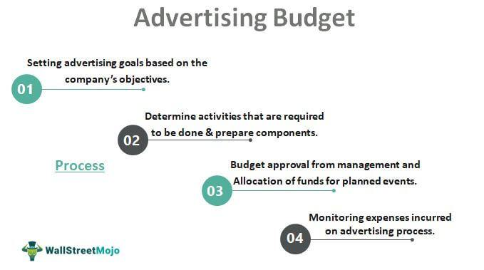

The intersection of budget dynamics, marketing strategies, promotional budgets, and algorithmic trading is an emerging field of interest, gaining traction as businesses seek to enhance financial performance and marketing efficacy. This intersection represents a convergence of financial discipline with innovative marketing tactics, facilitated by cutting-edge technological advancements in data analysis and automation. At its core, the process involves a continuous cycle of resource allocation, strategic planning, and adaptation to fluctuating market conditions.

Understanding how businesses allocate resources and modify their marketing strategies in response to market changes is essential for maintaining competitiveness and achieving business objectives. Modern businesses face the challenge of distributing limited resources across various channels and strategies to maximize returns. Market volatility, consumer preferences, and technological innovations necessitate a flexible approach to budgeting and strategy formulation.

This article examines the synergy between budget dynamics, marketing strategies, and algorithmic trading. It highlights how these components interact to produce optimal business outcomes and the significance of strategic allocation and adaptability in optimizing both marketing efforts and financial returns. By employing data-driven techniques and algorithmic insights, companies can make informed decisions that align with their long-term goals while ensuring immediate responsiveness to market variations.

Strategic allocation involves directing resources towards initiatives with the highest potential impact on growth and profitability. Adaptability refers to the ability to adjust strategies swiftly in light of new data or changing conditions. Together, these principles form the backbone of a robust marketing and budgeting framework, allowing businesses to harness the benefits of technological advancements and stay ahead in the competitive landscape.

## Table of Contents

## Understanding Promotional Budgets

A promotional budget represents a financial plan dedicated to advertising and marketing activities. This budget is crucial for enhancing brand awareness and bolstering sales efforts by strategically reaching target audiences. Traditionally, promotional expenditures were primarily allocated to print, radio, and television advertisements. However, the rise of the internet and social media has dramatically altered the landscape, prompting a significant shift towards digital channels.

This digital transformation necessitates a reevaluation of how businesses allocate their promotional budgets. Digital marketing channels, including search engine advertising, social media promotions, and influencer partnerships, often offer more precise targeting and measurable outcomes than traditional media. As a result, companies are increasingly directing their promotional spending towards these platforms, recognizing the potential to more effectively engage consumers and drive sales.

Additionally, the impact of data-driven strategies and market analytics on promotional spending has grown significantly. Businesses now have access to vast amounts of consumer data and advanced analytics tools that enable them to tailor their marketing efforts with greater accuracy. By analyzing consumer behaviors, preferences, and trends, companies can optimize their promotional strategies, ensuring resources are allocated to the most impactful channels and messages.

The integration of data analytics into promotional budgeting also facilitates more dynamic and responsive marketing strategies. Companies can monitor campaign performance in real-time, allowing for swift adjustments in spending and tactics as needed. This adaptability helps maximize returns on promotional investments and enhances overall marketing effectiveness.

Overall, promotional budgets are no longer static financial allocations but rather dynamic instruments that require ongoing assessment and adjustment. By embracing data-driven insights and digital channels, businesses can enhance the efficiency and effectiveness of their marketing functions, ultimately supporting sustained brand growth and sales performance.

## Market Dynamics and Marketing Strategies

Market analysis plays a pivotal role in shaping effective marketing strategies. Understanding and leveraging consumer behavior and market trends are crucial for businesses when allocating marketing funds. This understanding not only influences how funds are distributed across different channels and initiatives but also determines the overall impact and success of promotional efforts.

One key approach to budget allocation is the percent-of-sales method. This method involves setting the promotional budget as a fixed percentage of past or projected sales. It is straightforward and ensures that the marketing expenditure scales with sales figures. However, its limitation lies in its reactive nature, as it does not account for market changes or opportunities that could significantly alter current sales trends.

In contrast, the objective and task method offers a more strategic approach to budget allocation. This methodology requires companies to define specific marketing objectives and determine the tasks needed to achieve them. The budget is then calculated based on the cost of these tasks. This method aligns promotional spending directly with business goals, ensuring that resources are used efficiently and effectively to drive desired outcomes. It demands a thorough understanding of each promotional task's cost and expected impact, making it more complex but also potentially more rewarding in terms of resource utilization.

Aligning promotional efforts with strategic business goals is vital for maximizing resource usage. This alignment ensures that marketing strategies support broader organizational objectives, such as increasing market share, enhancing brand recognition, or entering new markets. When promotional activities are strategically aligned, businesses can more effectively measure the success of their marketing campaigns and adjust their approaches based on performance data.

Furthermore, advanced data analytics tools and market research methodologies have transformed how companies interpret market dynamics. These tools enable firms to gain insights into consumer preferences, emerging trends, and competitive activity. With this data, businesses can predict future market behaviors and adjust their marketing strategies accordingly. By understanding market dynamics, companies can position themselves to respond swiftly to market changes, thereby maintaining a competitive advantage.

In conclusion, market analysis and strategic fund allocation are indispensable in modern marketing strategies. By employing methodologies like the percent-of-sales and objective and task methods, businesses can ensure their promotional budgets are optimally utilized. Aligning these efforts with strategic business goals allows firms not only to enhance efficiency but also to drive meaningful impact in their marketing endeavors.

## Algorithmic Trading: Influence on Budget Dynamics

Algorithmic trading has transformed budget dynamics by introducing precision and efficiency in financial planning through the use of big data analytics. At its core, [algorithmic trading](/wiki/algorithmic-trading) utilizes complex algorithms to automate trading decisions, drawing on vast datasets to anticipate market movements and optimize investment strategies. This process aids in predicting market trends by analyzing historical data, price patterns, and economic indicators. By doing so, it enhances the precision of financial forecasts and investment allocations.

The integration of trading algorithms with marketing strategies offers substantial benefits in streamlining budget allocations. When marketing and trading data are synthesized, businesses can more effectively distribute resources across advertising platforms that are likely to yield higher returns. This integrated approach helps in identifying which marketing channels are most responsive to consumer trends and market conditions, leading to more informed allocation decisions. 

For instance, trading algorithms can process hourly fluctuations in consumer demand, allowing marketing teams to adjust their budgets dynamically. Insights such as sudden spikes in keyword searches or e-commerce activity can indicate shifts in consumer interest, prompting marketers to allocate funds to digital advertising campaigns that capitalize on such trends.

Additionally, the insights gained from trading algorithms contribute to refining promotional and marketing strategies. By continuously analyzing real-time data, these algorithms provide actionable insights into consumer preferences and the effectiveness of marketing campaigns. For example, A/B testing can be enhanced with algorithmic insights to quickly identify which promotional messages or product placements resonate best with target audiences.

Moreover, [machine learning](/wiki/machine-learning) models employed in algorithmic trading can be adapted to predict customer lifetime value (CLV) and determine the most lucrative customer segments to target. This predictive capability enables marketers to focus efforts on acquiring and retaining high-value customers, thereby increasing overall revenue and improving return on investment (ROI).

In conclusion, the role of algorithmic trading in budget dynamics is significant as it leverages big data analytics to not only enhance financial planning but also refine and optimize marketing strategies. By integrating these advanced data-driven techniques, businesses can achieve more effective and strategic budget allocations, leading to better financial outcomes.

## Maximizing Return on Investment (ROI)

Maximizing return on investment (ROI) is a central goal for businesses seeking to efficiently utilize their promotional budgets and marketing strategies. Effective budget allocation is imperative to achieve this objective, requiring a nuanced understanding of which areas produce the highest returns. By prioritizing strategic allocation of resources towards high-impact areas, businesses can enhance their financial outcomes and drive growth.

To identify these high-impact areas, businesses must engage in data-driven analysis and leverage advanced methodologies to assess and predict the potential returns of various marketing activities. This approach allows companies to channel resources into initiatives that are most likely to yield significant returns. A key practice in this process is the concept of regular monitoring and adjustment of promotional spend, enabling businesses to respond to evolving market conditions and consumer behaviors effectively.

The fluid nature of market dynamics means businesses must remain agile, making real-time adjustments to their budget allocations as new information becomes available. Tools such as real-time analytics platforms and machine learning algorithms can play an instrumental role in facilitating these adjustments. By continuously analyzing consumer data and market trends, companies can refine their promotional strategies and reallocate funds to optimize ROI.

Advanced decision-making tools, such as predictive analytics and resource optimization software, empower businesses to make informed budget management decisions. These tools not only enhance the accuracy of forecasting potential returns but also assist in visualizing ROI across different marketing channels. By utilizing these technologies, companies gain a competitive edge, fine-tuning their use of resources to achieve the greatest impact.

In summary, maximizing ROI demands meticulous planning and strategic allocation of resources. Through careful analysis and the adoption of advanced decision-making tools, businesses can ensure their promotional budgets are effectively directed towards the most profitable ventures, leading to sustained growth and competitive advantage.

## Conclusion

The dynamic interplay between promotional budgets, marketing strategies, and algorithmic trading presents new opportunities for businesses. By harnessing these multidimensional approaches, companies can achieve significant efficiency and effectiveness. This integration allows for the strategic allocation of financial resources where they are most needed, maximizing potential returns and minimizing wasted efforts.

The continuous evaluation and adaptation of strategies in response to changing market landscapes are essential to maintain competitiveness. Businesses must use real-time data and predictive analytics to fine-tune their approaches, ensuring that marketing efforts align with consumer demands and economic fluctuations. For instance, by employing advanced algorithms, companies can predict market trends more accurately, adjusting promotional budgets accordingly to capitalize on emerging opportunities.

As businesses integrate these elements, they are better positioned for sustainable growth and competitive advantage. This integration facilitates a holistic approach to resource management, where financial and marketing strategies support each other. It also encourages a proactive stance, allowing businesses to anticipate changes rather than simply react to them. By continuing to refine these strategies, companies can not only weather the uncertainties of the market but thrive in them, securing a lasting presence in their respective industries.

## References & Further Reading

[1]: Bergstra, J., Bardenet, R., Bengio, Y., & Kégl, B. (2011). ["Algorithms for Hyper-Parameter Optimization."](https://dl.acm.org/doi/10.5555/2986459.2986743) Advances in Neural Information Processing Systems 24.

[2]: ["Advances in Financial Machine Learning"](https://www.amazon.com/Advances-Financial-Machine-Learning-Marcos/dp/1119482089) by Marcos Lopez de Prado

[3]: ["Evidence-Based Technical Analysis: Applying the Scientific Method and Statistical Inference to Trading Signals"](https://www.amazon.com/Evidence-Based-Technical-Analysis-Scientific-Statistical/dp/0470008741) by David Aronson

[4]: ["Machine Learning for Algorithmic Trading"](https://github.com/stefan-jansen/machine-learning-for-trading) by Stefan Jansen

[5]: ["Quantitative Trading: How to Build Your Own Algorithmic Trading Business"](https://www.amazon.com/Quantitative-Trading-Build-Algorithmic-Business/dp/1119800064) by Ernest P. Chan