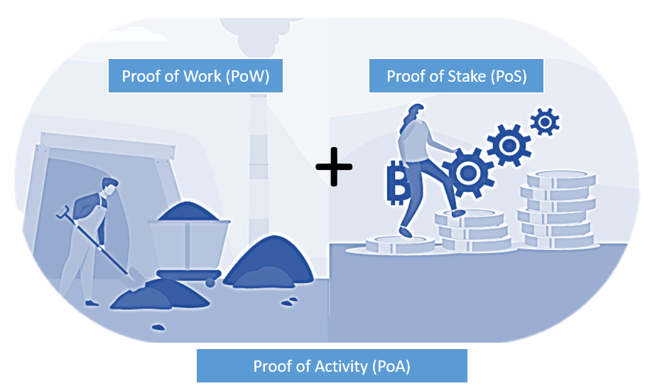

The blockchain and cryptocurrency landscape is witnessing rapid advancements, driving a fundamental transformation in how decentralized networks achieve consensus. Among the various innovative protocols emerging from this evolution, Proof-of-Activity (PoA) stands out as a novel consensus algorithm. PoA uniquely integrates elements from both the traditional Proof-of-Work (PoW) and Proof-of-Stake (PoS) mechanisms. PoW, which underlies Bitcoin, relies on computational power to validate transactions and secure the network, while PoS assigns validation power based on the amount of cryptocurrency held by participants. By merging these two approaches, PoA aims to enhance security and sustainability while addressing some inherent shortcomings of each method.

This article examines the principles of PoA, exploring its operational mechanics and its potential impact on cryptocurrency algorithmic trading. As blockchain technology progresses, understanding such hybrid models is crucial for navigating the new opportunities and challenges they present in the broader cryptocurrency ecosystem. In particular, PoA's implications for algorithmic trading highlight its potential to influence trading strategies by incorporating the dynamics of both network participation and staking mechanisms.

## Table of Contents

## What is Proof-of-Activity?

Proof-of-Activity (PoA) is an innovative consensus algorithm designed to enhance the security and efficiency of blockchain networks. It seeks to bridge the operational dynamics of Proof-of-Work (PoW) and Proof-of-Stake (PoS) mechanisms, each with their distinct strengths and weaknesses. Through this integration, PoA offers a hybrid mechanism that leverages PoW's block-proposing ability while incorporating PoS's stake-based validation process.

In a conventional PoW system, miners compete to solve complex mathematical puzzles, which requires significant computational resources and energy consumption. The successful miner proposes a new block to the blockchain. While secure, this approach is criticized for its high energy demands and environmental impact.

PoS, on the other hand, shifts the onus of block validation from computational work to ownership of the network's cryptocurrency. Validators are chosen to create new blocks based on their stake in the network, reducing the need for extensive computational effort. However, PoS systems face challenges related to centralization, as wealthier stakeholders with more tokens hold more influence over block creation and governance.

PoA attempts to combine these mechanisms by initiating consensus processes with a PoW component to propose new blocks. Once a block is proposed, the system transitions to a PoS-like phase where stakeholders validate the proposed block. This hybrid approach aims to retain the security advantages of PoW while moderating energy consumption and incorporating a stake-based commitment to the network. 

The overarching goal of PoA is to ensure long-term sustainability against potential blockchain attacks, especially in contexts where diminishing Bitcoin mining rewards could undermine network security. By using PoW for block proposals and PoS for validation, PoA creates a system that is not only secure but also scalable and less resource-intensive than traditional PoW alone. This duality positions PoA as a promising solution for adapting blockchain technology to the evolving [cryptocurrency](/wiki/cryptocurrency) landscape.

## Understanding the Mechanics of PoA

Proof-of-Activity (PoA) is a consensus algorithm that synergizes the methodologies of Proof-of-Work (PoW) and Proof-of-Stake (PoS) to enhance both security and energy efficiency within blockchain networks. The mechanism begins with aspects reminiscent of PoW. Initially, network participants, often referred to as miners, compete to solve a computationally intensive puzzle, aiming to generate a valid hash that satisfies the network's difficulty target.

The process initiates when these miners endeavor to compute a block header hash that is less than or equal to the current target. This effort guarantees that a significant amount of computational power is expended, thereby ensuring the integrity and chronological order of transactions. The formula for hash generation often involves functions such as SHA-256, standard in many blockchain protocols:

$$
\text{hash} = \text{SHA-256}(\text{block header})
$$

Upon the successful generation of a valid hash, which involves solving the cryptographic puzzle, the system seamlessly transitions into a PoS-like procedure. This subsequent phase requires stakeholder involvement for block validation, leveraging their existing token holdings. Stakeholders, selected through a deterministic process based on the weight of their staked tokens, are instrumental in confirming transactions and achieving consensus within the network. 

The selection process in PoS can be illustrated as follows:

$$
\text{Selection Probability} = \frac{\text{Number of tokens staked by stakeholder}}{\text{Total tokens staked in the network}}
$$

Cryptocurrencies such as Decred effectively employ this hybrid PoW/PoS system to optimize energy consumption and bolster security. While the initial PoW phase establishes foundational security, the subsequent PoS component allows for sustainable and efficient transaction validation by reducing reliance on compute-intensive operations. Decred, specifically, initiates with a PoW segment to determine block validity, subsequently involving PoS stakeholders who vote on these blocks. This inclusive approach not only enhances network resilience but also mitigates the risk of malicious block proposals.

The integration of these methodologies underlines the adaptability and innovation within the PoA framework, offering a scalable solution that harmonizes the advantages of both PoW and PoS while addressing their traditional limitations.

## Pros and Cons of Proof-of-Activity

Proof-of-Activity (PoA) presents a nuanced blend of benefits and drawbacks, combining elements from both Proof-of-Work (PoW) and Proof-of-Stake (PoS), intending to improve blockchain security and sustainability. 

One of the principal benefits of PoA is enhanced sustainability. The hybrid nature of PoA offers a balance between PoW's necessity for computational power and PoS's stake-based validation, allowing it to operate on an energy-efficient model relative to traditional PoW systems. This combination helps mitigate the environmental concerns associated with purely PoW systems, making it a potentially more sustainable option for block validation.

However, the architecture of PoA also inherits certain disadvantages inherent in both PoW and PoS systems. A significant criticism is related to the energy consumption derived from PoA's PoW component. Although PoA may generally consume less energy than standalone PoW systems, it still requires significant computational resources to mine initial blocks. This requirement may overshadow the energy efficiency seen in PoS models, which do not rely on intensive computations.

Furthermore, the PoS aspect of PoA introduces the risk of centralization. Within a PoS system, the probability of a stakeholder being chosen as a block validator typically increases with the number of tokens held. This mechanism potentially favors wealthier stakeholders, creating disparity and increasing the chance of centralization within the network. As larger stakeholders accumulate more validation opportunities, they can further consolidate their control over the network, which may run counter to the decentralized ethos foundational to blockchain technology.

While PoA aims to enhance security by combining components of both PoW and PoS, it bears the risk of inheriting and possibly amplifying the limitations and criticisms of these individual consensus mechanisms. Addressing these concerns is crucial for PoA's evolution and broader acceptance within the blockchain community.

## Algorithmic Trading Strategies with PoA

As blockchains utilizing the Proof-of-Activity (PoA) consensus model are increasingly recognized, [algorithmic trading](/wiki/algorithmic-trading) strategies are being refined to account for their composite nature. PoA's hybrid design, which amalgamates elements of Proof-of-Work (PoW) and Proof-of-Stake (PoS), introduces distinct factors that traders must evaluate.

Algorithmic trading, reliant on mathematical models and automated processes, must now consider the dynamic elements introduced by PoA. This involves understanding both network participation - a key component driven by the PoW system - and the staking mechanisms reminiscent of PoS. As network participation under PoW impacts the availability and speed of transaction processing, traders will benefit from monitoring variations in mining activity, which can provide insights into network congestion or efficiency.

Staking, on the other hand, introduces a measure of economic incentive where participants, acting as validators, are rewarded based on their token holdings. In the context of PoA, traders must analyze staking patterns, as they can indicate short-term fluctuations in token supply or demand, potentially impacting price movements.

The PoA structure, with its dual PoW and PoS elements, creates a multifaceted environment. Savvy traders can exploit this by devising strategies that are cognizant of the oscillating conditions within the network. For instance, trading algorithms could be programmed to execute buy or sell orders based on predicted mining activity spikes or dips, correlated with anticipated changes in validator staking behavior.

Moreover, this hybrid framework offers opportunities for diversifying crypto portfolios. By balancing investments between PoA-based assets and traditional PoW or PoS cryptocurrencies, traders can potentially increase their resilience against market [volatility](/wiki/volatility-trading-strategies) rooted in network performance.

In summary, the intricate nature of PoA blockchains necessitates a nuanced approach to algorithmic trading, where both computational power and staked assets directly influence the network's behavior and, consequently, trading strategies. This requires an adaptive framework capable of responding to shifts in both mining participation and staking activities, providing traders with avenues to optimize their holdings and exploit unique market conditions associated with PoA ecosystems.

## Example: Decred and PoA

Decred stands out as a prominent example of a cryptocurrency implementing the Proof-of-Activity model, referred to as a Hybrid PoW/PoS system. The Decred network initiates its consensus mechanism with a Proof-of-Work process that involves miners competing to solve cryptographic puzzles. This mining phase not only ensures the creation of new blocks but also serves as an initial security layer.

Subsequent to the PoW phase, Decred transitions into a Proof-of-Stake-like process called stakeholder voting. Here, stakeholders are selected based on the number of Decred tokens (DCR) they possess and have decided to lock up in a staking pool. This selection process is probabilistic, enhancing the security and decentralization of the network by involving multiple stakeholders in the verification of blocks. The transition from PoW to PoS validation facilitates a balanced distribution of power, aiming to mitigate the risks associated with mining centralization.

In the stakeholder voting phase, participants validate the blocks proposed by miners through a voting mechanism. The use of tickets, which are essentially participation tokens acquired by locking Decred tokens, is central to this process. Each block can accommodate a limited number of votes, and stakeholders are rewarded with additional Decred tokens upon successfully voting, incentivizing active participation and further securing the network.

This hybrid protocol in Decred not only ensures robust network security by combining PoW's computational challenge with PoS's economic stake but also demonstrates Proof-of-Activity's practical application. The system encourages participation from both miners and stakeholders, enhancing both network integrity and governance. This combination of processes underscores the capacity of PoA models to reward participants while maintaining a secure and efficient blockchain network.

## Conclusion: The Future of PoA in Crypto Trading

Proof-of-Activity (PoA) emerges as a compelling alternative for achieving blockchain consensus, particularly as the cryptocurrency ecosystem shifts beyond the era of substantial mining rewards. This innovative protocol offers the potential for enhanced security and efficiency by blending the best features of Proof-of-Work (PoW) and Proof-of-Stake (PoS) systems. As cryptocurrency trading evolves, an increasing number of traders are exploring and adopting PoA due to its ability to support robust and energy-efficient strategies.

PoA's hybrid approach allows traders to benefit from the network's security afforded by the PoW process while concurrently taking advantage of the economic incentives and energy savings provided by the PoS mechanism. This dual structure can result in reduced volatility and decreased energy consumption, making PoA an attractive choice for those seeking sustainable trading approaches.

Despite its promising attributes, the widespread adoption of PoA is contingent on addressing specific challenges, particularly those related to potential centralization issues inherent in PoS-based systems. Stakeholder centralization, where individuals or entities holding substantial token quantities gain disproportionate influence over network validations, presents a significant obstacle. Overcoming this will require innovative governance models and system designs that ensure equitable participation and distribution of network power among stakeholders.

In conclusion, the future of PoA in crypto trading appears promising, with its emphasis on sustainability and efficiency aligning well with the evolving priorities of the crypto industry. However, achieving its full potential will depend on resolving centralization risks and fostering wider acceptance within the cryptocurrency market. As the community continues to innovate and refine PoA solutions, its role in shaping the next generation of blockchain consensus models may become increasingly significant.

## References & Further Reading

[1]: Bentov, I., Lee, C., Mizrahi, A., & Rosenfeld, M. (2014). ["Proof of Activity: Extending Bitcoin's Proof of Work via Proof of Stake."](https://eprint.iacr.org/2014/452) In Proceedings of the 2014 International Conference on Financial Cryptography and Data Security.

[2]: Decred. (n.d.). ["Decred Documentation."](https://docs.decred.org/) Retrieved from the official Decred documentation site.

[3]: Kiayias, A., Russell, A., David, B., & Oliynykov, R. (2017). ["Ouroboros: A Provably Secure Proof-of-Stake Blockchain Protocol."](https://eprint.iacr.org/2016/889.pdf) In Advances in Cryptology – CRYPTO 2017.

[4]: Nakamoto, S. (2008). ["Bitcoin: A Peer-to-Peer Electronic Cash System."](https://nakamotoinstitute.org/library/bitcoin/) Retrieved from the Bitcoin.org website.

[5]: Saleh, F. (2021). ["Blockchain Without Waste: Proof-of-Stake."](https://papers.ssrn.com/sol3/papers.cfm?abstract_id=3183935) The Review of Financial Studies, 34(3), 1156-1190.