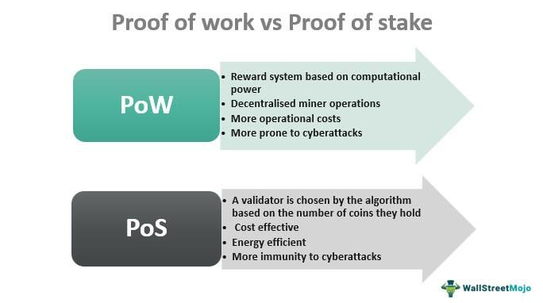

Algorithmic trading has emerged as a transformative force in financial markets, leveraging the power of automated software to execute trades with precision and speed that surpass human capabilities. This method employs complex algorithms to analyze market variables and determine optimal trading strategies, enabling traders to capitalize on the minute-to-minute fluctuations in asset prices. The growing popularity of algorithmic trading is driven by its efficiency and the ability to process vast amounts of data, which traditional trading methods cannot match.

Integral to the operation of blockchain technology, which increasingly underpins these algorithmic systems, are consensus mechanisms. These protocols ensure that all nodes in a network agree on the data and operations being processed, maintaining the integrity and security of decentralized networks. Traditional consensus mechanisms like Proof of Work (PoW) and Proof of Stake (PoS) have fulfilled this role in various blockchain applications. However, their high energy consumption and scalability issues pose significant limitations, especially in the context of high-frequency trading environments.

Enter Proof of Assignment (PoA), a newer consensus mechanism explicitly designed to address these challenges in algorithmic trading. PoA allocates specific roles to network participants based on predefined criteria, effectively reducing the computational overhead associated with consensus processes. This tailored mechanism enhances the efficiency and speed vital for financial markets where time is of the essence.

In trading environments, PoA promises several benefits. Chief among them is its low power consumption, which significantly reduces the operational costs traditionally associated with blockchain processes. Additionally, PoA provides a scalable solution capable of handling the high transaction volumes typical of algorithmic trading systems. This makes PoA a promising prospect for traders seeking a more sustainable and cost-effective approach to executing trades in increasingly competitive financial markets.

## Table of Contents

## Understanding Proof of Assignment (PoA)

Proof of Assignment (PoA) is a blockchain consensus mechanism designed to efficiently validate transactions while minimizing energy consumption and maximizing scalability. Unlike traditional consensus models such as Proof of Work (PoW) and Proof of Stake (PoS), PoA emphasizes the assignment of specific tasks to nodes based on certain criteria, which can include reputation, past performance, or the possession of unique identifiers. This method can enhance network efficiency by reducing the need for intensive computational power.

In PoW, as employed by Bitcoin, consensus is achieved by having nodes compete to solve complex mathematical puzzles, which requires considerable computational power and leads to high energy consumption. PoW ensures security and decentralization, but at the cost of efficiency and environmental impact. PoS, adopted by platforms like Ethereum 2.0, reduces energy consumption by requiring validators to lock up a certain amount of [cryptocurrency](/wiki/cryptocurrency) to propose and validate new blocks. Although PoS is more energy-efficient than PoW, it still faces challenges regarding centralization, as wealthier entities can potentially exert more influence over the network.

PoA offers several distinct advantages, primarily due to its assignment-based system, which allows for lower power consumption and enhanced scalability. By delegating specific tasks rather than having all nodes compete simultaneously, PoA reduces redundancy and optimizes resource usage. This allows PoA-powered networks to process more transactions per second compared to PoW or PoS systems. Additionally, the PoA model can effectively integrate with Internet of Things (IoT) devices, enabling lightweight, everyday devices to participate in the consensus process without the need for significant computational resources.

Overall, the Proof of Assignment mechanism represents a promising alternative for blockchain networks that require efficient and scalable solutions, particularly in environments such as [algorithmic trading](/wiki/algorithmic-trading) where high transaction throughput and minimal latency are crucial.

## Benefits of PoA in Algorithmic Trading

Proof of Assignment (PoA) presents notable advantages in algorithmic trading, particularly concerning the optimization of coordination between Internet of Things (IoT) devices. One of PoA's key features is its capacity to efficiently manage the complex interactions among IoT devices involved in trading operations. By assigning specific tasks or roles to individual devices within a network, PoA ensures streamlined communication and task execution. This systematic approach reduces the potential for conflicts and inefficiencies, which are common in decentralized networks that utilize other consensus models.

Scalability is another significant benefit of PoA within algorithmic trading environments. Traditional consensus mechanisms like Proof of Work (PoW) struggle with scalability due to their high computational and energy demands. In contrast, PoA is designed to handle a higher [volume](/wiki/volume-trading-strategy) of transactions per second, a crucial requirement in the fast-paced world of trading. The mechanism's architecture allows it to accommodate an increasing number of transactions without compromising speed or security, thus facilitating more robust trading operations and greater market participation.

Cost-effectiveness is a major consideration in algorithmic trading, where operational costs directly impact profitability. PoA offers a more energy-efficient alternative to conventional consensus models. By assigning roles that vary in energy and resource requirements based on device capabilities, PoA minimizes unnecessary energy consumption. This reduction in resource use not only lowers operational costs but also aligns with growing environmental consciousness in technology deployments. PoA's ability to leverage existing device capabilities ensures that the additional infrastructure costs often associated with setting up consensus networks are substantially reduced.

In summary, PoA optimizes coordination among IoT devices, enhancing efficiency and reducing potential operational hiccups in trading environments. Its scalability supports higher transaction throughput, crucial for high-frequency trading and dynamic market conditions. Furthermore, the cost-effectiveness of PoA, achieved through reduced energy and resource consumption, presents a compelling case for its adoption in algorithmic trading scenarios.

## The Role of IoT in PoA Algorithmic Trading

The integration of Internet of Things (IoT) devices within Proof of Assignment (PoA) systems is a vital advancement in algorithmic trading, primarily for micro-mining tasks. Micro-mining refers to the process whereby devices perform small-scale computational tasks to maintain blockchain operations efficiently. Utilizing IoT devices for these tasks significantly enhances PoA systems due to the decentralized and accessible nature of IoT networks. 

### Participation of Everyday Devices

Unlike traditional mining which often requires specialized hardware, PoA allows everyday IoT devices to participate in blockchain networks. Devices such as smart appliances, sensors, and even smartphones can take part in these networks, contributing computational resources in exchange for transaction validation rewards. This participation supports a more decentralized system by spreading the responsibilities across numerous devices rather than concentrating power within a few entities. 

By leveraging the widespread distribution of IoT devices, PoA systems can enhance accessibility in the trading network. This capability is beneficial because it lowers the entry barrier for participating in blockchain maintenance, enabling a broader range of participants, from individuals to small enterprises, fostering an inclusive trading ecosystem.  

### Real-World Example: IOTW Project

A tangible instance of IoT and PoA integration is the IOTW project, which demonstrates the potential for high transaction throughput using these technologies. IOTW employs a unique PoA algorithm designed to tap into the computational capabilities of everyday IoT devices for micro-mining purposes. Through this model, IOTW achieves distributed ledger maintenance with significantly lower energy consumption compared to traditional consensus mechanisms like Proof of Work (PoW).

The IOTW project effectively showcases how IoT devices can collectively manage blockchain tasks, resulting in high throughput and accessibility. This approach allows the system to scale with minimal additional resource consumption, making it a practical option for environments that demand efficient and sustainable transaction processing. 

### Conclusion

Integrating IoT into PoA for algorithmic trading offers numerous advantages, including enhanced decentralization, increased accessibility, and improved system scalability. Real-world projects like IOTW provide compelling evidence of the efficiency and potential impact of this technology combination on trading and beyond.

## Case Study: IOTW and PoA

The IOTW blockchain project exemplifies a practical application of the Proof of Assignment (PoA) consensus mechanism, specifically designed to harness the potential of Internet of Things (IoT) devices and optimize algorithmic trading environments. By leveraging PoA, IOTW achieves high throughput, enabling a seamless and efficient infrastructure for decentralized applications and trading operations.

In IOTW, the PoA mechanism assigns specific tasks to IoT devices, transforming them into micro-miners. Unlike traditional consensus mechanisms, which may demand high computational power or substantial financial stakes, PoA relies on the existing processing capabilities of IoT devices. This design promotes energy efficiency and democratizes access to blockchain participation, as everyday devices can contribute to network security and transaction validation without incurring significant energy costs.

The efficiency of PoA in IOTW is evident in its capacity for high transaction throughput. By enabling numerous IoT devices to participate in the network, IOTW can process a large number of transactions per second, addressing scalability issues that commonly hinder blockchain technologies. This high throughput is critical in algorithmic trading, where speed and the ability to handle multiple transactions simultaneously can significantly impact trading performance.

The use of PoA within the IOTW project not only optimizes transaction processing but also fosters effective decentralized applications by distributing the computational load among a wide array of devices. This decentralization enhances network security and resilience against attacks, as it removes single points of failure and relies on a diverse set of contributors for network operations.

The outcomes of the IOTW project highlight the practical benefits and potential of PoA in trading and broader blockchain applications. By integrating a diverse set of IoT devices, IOTW demonstrates scalability, efficiency, and cost-effectiveness, which are critical for the future evolution of blockchain technologies. The project's implications extend to future PoA developments, suggesting a shift towards incorporating everyday smart devices into blockchain ecosystems, thus broadening participation and enhancing transaction processing capabilities in various blockchain-based applications and trading environments.

As blockchain technology continues to evolve, the IOTW project stands as a testament to the innovative use of PoA, providing valuable insights into how such mechanisms can be leveraged for enhanced performance and inclusivity in trading networks. This has promising implications for the future of algorithmic trading, potentially paving the way for more sustainable and decentralized trading systems.

## Challenges and Considerations

Implementing Proof of Assignment (PoA) in algorithmic trading systems brings several challenges, particularly concerning security, network trust, and node maintenance. Understanding these issues is pivotal to ensuring the reliable and efficient operation of trading systems leveraging PoA.

### Security Concerns

Security is a prime consideration when integrating PoA into algorithmic trading. Since PoA involves assigning specific roles to nodes within the network, it is essential to ensure that these assignments are secure and tamper-proof. Malicious actors might attempt to manipulate the assignment process to gain undue advantage in the trading environment. To mitigate this, cryptographic measures akin to those used in traditional blockchain architectures, such as digital signatures and encryption, can be employed. These ensure the authenticity and integrity of data exchanged between nodes.

Furthermore, the network must be resilient against Sybil attacks, where an adversary could create numerous pseudo-nodes to manipulate the network. Implementing a robust node identity verification mechanism can help in preventing such vulnerabilities. This might involve a combination of reputation systems and third-party verification to ensure that each node is legitimate and trustworthy.

### Network Trust

Network trust is another pivotal challenge, as the success of PoA heavily relies on the cooperation and integrity of participating nodes. Unlike some consensus mechanisms that inherently discourage malicious behavior through high resource costs, PoA's low power requirements mean that additional measures are necessary to foster trust. Incentive structures could be developed to reward honest participation and penalize dishonest or non-cooperative behavior.

Additionally, consensus protocols can be designed to include cross-verification methods, where random nodes double-check assignments. This can prevent any single node from becoming a bottleneck or point of failure. By diversifying the verification responsibility, the network can maintain higher levels of trust and reliability.

### Node Maintenance

Node maintenance presents logistical and technical challenges, especially given the diverse range of IoT devices that can make up a PoA network. These devices may have varying levels of computational power, connectivity, and reliability, potentially affecting the network's stability. Regular updates and maintenance schedules are necessary to ensure that all nodes operate optimally.

To address these maintenance challenges, automated update systems and lightweight client software could be developed to streamline the process. This ensures that devices can easily receive necessary updates without requiring significant user intervention, minimizing downtime and reducing maintenance overhead.

In summary, addressing the challenges of security, network trust, and node maintenance in PoA-based algorithmic trading systems is crucial for successful implementation. Employing robust cryptographic methods, establishing trust incentives, and ensuring efficient node upkeep are key strategies that can help mitigate these issues, paving the way for a secure and efficient trading environment.

## Future Prospects of PoA in Trading

Proof of Assignment (PoA) is poised to significantly impact the future of algorithmic trading by providing a more efficient and scalable consensus mechanism. As PoA evolves, it is expected to incorporate several emerging trends and technologies that could enhance its functionality and integration within the financial sector.

One of the key areas of evolution for PoA is the integration of [machine learning](/wiki/machine-learning) and [artificial intelligence](/wiki/ai-artificial-intelligence). These technologies can optimize decision-making processes, allowing PoA-based systems to predict market trends more accurately and execute trades more effectively. By analyzing large sets of market data, machine learning models can continuously adjust and improve trading algorithms, resulting in better outcomes and reduced risks.

Another promising trend is the advancement of quantum computing. As quantum technology matures, PoA mechanisms can leverage its computational power to perform complex calculations at unprecedented speeds. This enhancement could significantly increase transaction throughput and lower latency, which are critical for high-frequency trading environments.

Potential partnerships are also likely to influence the future trajectory of PoA in financial markets. Collaborations between blockchain startups and established financial institutions could result in the development of hybrid models that combine the strengths of both traditional and blockchain-based systems. These partnerships could facilitate the adoption of PoA in areas such as cross-border payments, asset tokenization, and decentralized finance (DeFi), thus broadening its application scope.

Furthermore, increased regulatory clarity surrounding blockchain technologies is expected to drive wider acceptance of PoA. As regulators define clear frameworks for blockchain-based financial systems, more organizations may be encouraged to explore PoA, leveraging its energy efficiency and low operational costs to meet compliance requirements while maintaining competitive edge.

Environmental sustainability is becoming a priority across industries, including finance. PoA's low power consumption aligns with this trend, making it an attractive choice for companies aiming to reduce their carbon footprint. This sustainability aspect could further influence corporate strategies, leading to increased investment in PoA development and deployment.

In conclusion, the future prospects of PoA in algorithmic trading are promising, with advancements in AI, quantum computing, strategic partnerships, regulatory clarity, and environmental sustainability defining its evolution. These developments are likely to enhance PoA's efficiency, broaden its applications, and cement its role in shaping the future of algorithmic trading.

## Conclusion

Proof of Assignment (PoA) emerges as a compelling consensus mechanism tailored for algorithmic trading, offering substantial benefits that address efficiency and sustainability challenges in financial markets. By significantly reducing energy consumption compared to traditional mechanisms like Proof of Work (PoW), PoA presents an environmentally friendly alternative that aligns with the increasing demand for sustainable technologies.

One of the critical advantages of PoA is its seamless integration with IoT devices, which transforms everyday devices into active participants in trading networks. This not only enhances decentralization but also improves accessibility, allowing for a more diversified and inclusive network. This integration facilitates the execution of micro-mining tasks by IoT devices, which boosts transaction throughput without compromising computational efficiency. Projects such as IOTW exemplify the successful application of PoA with IoT devices, demonstrating the potential for high transaction rates and effective decentralized applications.

Moreover, the adoption of PoA supports a scalable environment conducive to handling a high volume of transactions per second, an essential feature for dynamic trading scenarios. This scalability, combined with reduced resource consumption, positions PoA as a cost-effective solution for modern trading infrastructures.

In conclusion, the convergence of PoA and IoT devices provides a promising pathway toward innovation in trading platforms. By fostering a decentralized yet efficient network, PoA not only addresses current challenges in algorithmic trading but also encourages further research and experimentation to enhance its capabilities. As financial markets continue to evolve, embracing PoA could lead to more sustainable and efficient trading ecosystems, benefiting both market participants and the environment.

## References & Further Reading

[1]: Wollstein, E. (2020). ["A Survey on Consensus Mechanisms in Blockchain for IoT."](https://www.researchgate.net/publication/369305733_A_Survey_on_Role_of_Blockchain_for_IoT_Applications_and_Technical_Aspects) In: Singh, S., Chhabra, J., & Kumar, N. (eds) Blockchain Technology for IoT Applications. Springer, Cham.

[2]: Puthal, D., Malik, N., Mohanty, S. P., Kougianos, E., & Yang, C. (2018). ["The Blockchain as a Decentralized Security Framework."](https://ieeexplore.ieee.org/document/8287055) IEEE Consumer Electronics Magazine, 7(2), 18-21.

[3]: de Almeida, F. G., & Santos, L. C. (2020). ["Analysis of Blockchains in Algorithmic Trading."](https://www.semanticscholar.org/paper/Artificial-Intelligence-Regulation%3A-A-for-and-Almeida-Santos/58496569c75a69032124ff7031f01904e8c7c723) 2020 IEEE International Conference on Consumer Electronics (ICCE). 

[4]: ["Proof of Stake versus Proof of Work"](https://www.coindesk.com/learn/proof-of-work-vs-proof-of-stake-what-is-the-difference) - Investopedia.

[5]: Wang, H., Chen, C., Xu, D., Zhang, Y., & Hassan, M. M. (2019). ["Blockchain-Based IoT for Codebase Management and Dependability."](https://www.sciencedirect.com/science/article/pii/S221128552030567X) International Journal of Distributed Sensor Networks.