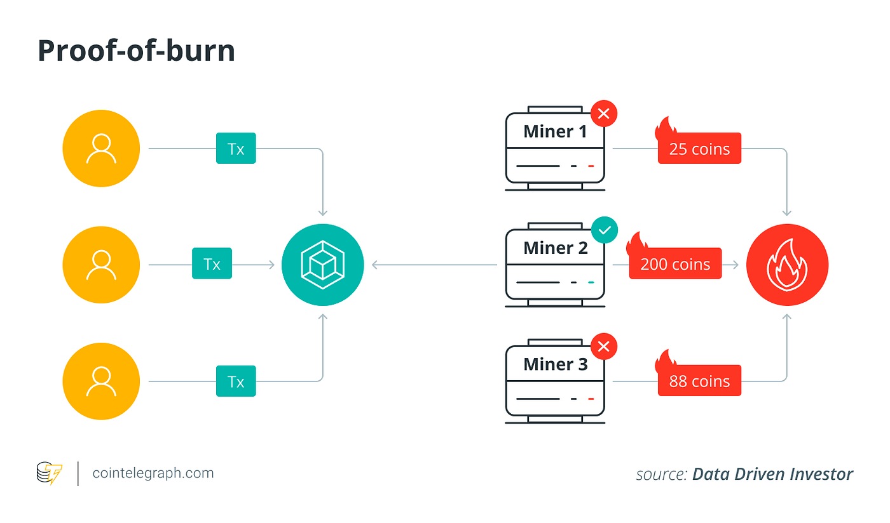

## Table of Contents

## What is Proof of Burn (PoB) in the context of cryptocurrencies?

Proof of Burn (PoB) is a way to keep a cryptocurrency network safe and secure. In PoB, instead of using computer power like in Proof of Work (PoW), people "burn" or destroy some of their coins. By doing this, they show the network that they are serious about helping it run smoothly. The more coins someone burns, the more chance they have to be chosen to add new blocks to the blockchain and earn rewards.

This method is good because it uses less electricity than PoW, making it more eco-friendly. Also, since burning coins can't be undone, it helps keep the network fair. People who burn coins are like investors in the network, and their "investment" helps make the system more stable and trustworthy.

## How does Proof of Burn differ from Proof of Work (PoW) and Proof of Stake (PoS)?

Proof of Burn (PoB) is different from Proof of Work (PoW) and Proof of Stake (PoS) in how it keeps a cryptocurrency network safe. In PoW, people use a lot of computer power to solve hard math problems. The first one to solve it gets to add a new block to the blockchain and gets a reward. This uses a lot of electricity and can be bad for the environment. PoB, on the other hand, asks people to "burn" or destroy some of their coins. This shows the network that they are serious about helping it run well. The more coins someone burns, the better chance they have to add new blocks and get rewards. This way, PoB is kinder to the environment because it doesn't need as much electricity.

Proof of Stake (PoS) is another way to keep a network safe, but it works differently from both PoW and PoB. In PoS, instead of burning coins or using computer power, people "stake" or lock up some of their coins. The more coins someone stakes, the more likely they are to be chosen to add a new block to the blockchain and earn rewards. PoS is also more eco-friendly than PoW because it doesn't need a lot of electricity. But unlike PoB, where coins are destroyed, in PoS, the coins are just locked up and can be used again later. So, PoB and PoS both try to be more eco-friendly than PoW, but they do it in different ways.

## What is the process of 'burning' coins in a Proof of Burn system?

In a Proof of Burn system, 'burning' coins means sending them to a special address where they can't be spent or used again. This address is like a black hole for the coins. When someone wants to participate in the Proof of Burn system, they send some of their coins to this address. By doing this, they show the network that they are serious about helping it run smoothly and securely.

Once the coins are sent to the special address, they are considered 'burnt' and can't be recovered. The more coins someone burns, the better chance they have to be chosen to add new blocks to the blockchain and earn rewards. This process helps keep the network fair and stable because people are showing their commitment by giving up some of their coins.

## What are the benefits of using Proof of Burn for a blockchain network?

Using Proof of Burn for a blockchain network has several benefits. One big benefit is that it's more eco-friendly than Proof of Work. In Proof of Work, people use a lot of computer power to solve hard math problems, which uses a lot of electricity. In Proof of Burn, people just send some of their coins to a special address where they can't be used again. This doesn't need a lot of electricity, so it's better for the environment.

Another benefit is that Proof of Burn helps keep the network fair and stable. When people burn their coins, they are showing the network that they are serious about helping it run well. The more coins someone burns, the better chance they have to add new blocks to the blockchain and earn rewards. This makes it harder for someone to cheat the system because they have to give up some of their coins to participate. So, Proof of Burn can make the network more trustworthy and reliable.

## Can you explain how Proof of Burn contributes to network security?

Proof of Burn helps keep a blockchain network safe by making people show they are serious about helping the network. When someone burns their coins, they send them to a special address where they can't be used again. This shows the network that the person is willing to give up something valuable to help keep the system running smoothly. The more coins someone burns, the better chance they have to add new blocks to the blockchain and earn rewards. This makes it harder for someone to cheat the system because they have to give up their coins to participate.

By making people burn their coins, Proof of Burn helps make the network more stable and trustworthy. It's like an investment in the network, where people show their commitment by giving up some of their coins. This helps keep the system fair because everyone has to do the same thing to participate. So, Proof of Burn helps keep the network secure by making sure that only people who are serious about helping the network can add new blocks and earn rewards.

## What are some real-world examples of cryptocurrencies that use Proof of Burn?

One example of a [cryptocurrency](/wiki/cryptocurrency) that uses Proof of Burn is Slimcoin. Slimcoin uses Proof of Burn to make the network more secure and eco-friendly. In Slimcoin, people burn their coins to show they are serious about helping the network. The more coins someone burns, the better chance they have to add new blocks and earn rewards. This helps keep the network fair and stable because everyone has to give up some of their coins to participate.

Another example is Counterparty. Counterparty uses Proof of Burn to create new tokens on its platform. People burn bitcoins to create new Counterparty tokens. This shows their commitment to the platform and helps keep it secure. By burning bitcoins, people show that they are willing to give up something valuable to use the Counterparty platform. This helps make the platform more trustworthy and reliable.

## How does the 'burn rate' affect the dynamics of a Proof of Burn system?

The 'burn rate' in a Proof of Burn system is how fast people are burning their coins. It can change how the system works. If the burn rate is high, it means a lot of people are burning their coins to help the network. This can make the network more secure because more people are showing they are serious about helping it. It also means that people who want to add new blocks to the blockchain have to burn more coins to have a good chance of getting chosen. So, a high burn rate can make the system more competitive and stable.

On the other hand, if the burn rate is low, it means fewer people are burning their coins. This can make the network less secure because fewer people are showing their commitment. It also means that people who want to add new blocks don't have to burn as many coins to have a good chance of getting chosen. So, a low burn rate can make the system less competitive and less stable. The burn rate can also affect how many new coins are created in the system. If the burn rate is high, more new coins might be created as rewards, and if it's low, fewer new coins might be created.

## What are the potential drawbacks or criticisms of Proof of Burn?

One big problem with Proof of Burn is that it can be risky for people who want to join the system. They have to burn their coins, which means they can't use them anymore. This can be scary because if the network doesn't do well, they lose their money and don't get anything back. It's like throwing away money on a bet that the network will be successful. This can make people not want to join, especially if they're not sure about the network's future.

Another criticism is that Proof of Burn might not be as fair as it seems. People who have more coins can burn more, which gives them a better chance to earn rewards. This can make it harder for people with fewer coins to participate and earn rewards. It can create a situation where the rich get richer, and the poor stay poor. This can make the network less equal and less appealing to new people who want to join.

## How does Proof of Burn impact the overall supply and value of a cryptocurrency?

Proof of Burn can change the total number of coins in a cryptocurrency. When people burn their coins, they send them to a special address where they can't be used again. This makes the total number of coins in the system go down. But, people who burn their coins might get new coins as a reward for helping the network. So, the total number of coins can go up or down depending on how many people are burning coins and how many new coins are being created as rewards.

The value of the cryptocurrency can also be affected by Proof of Burn. If a lot of people are burning their coins, it can make the coins seem more valuable because people are willing to give them up to help the network. This can make other people want to buy the coins, which can make the price go up. But, if not many people are burning their coins, it can make the coins seem less valuable because it shows that people are not as interested in helping the network. This can make the price go down. So, Proof of Burn can make the value of the cryptocurrency go up or down depending on how people are using it.

## What are the technical requirements for implementing Proof of Burn in a new cryptocurrency?

To use Proof of Burn in a new cryptocurrency, you need to set up a special address where people can send their coins to be burned. This address is made so that once coins are sent there, they can't be used again. The system needs to keep track of how many coins each person burns. This helps decide who gets to add new blocks to the blockchain and earn rewards. The more coins someone burns, the better chance they have to be chosen. The system also needs a way to create new coins as rewards for people who burn their coins. This can be done by setting up rules for how many new coins are created based on how many coins are burned.

The technical setup also needs to make sure that the burning process is safe and can't be cheated. This means the special address where coins are burned needs to be very secure. The system should also have ways to check that the coins are really being burned and not just moved around. This can be done by using smart contracts or other ways to make sure the burning process is done right. Overall, the technical requirements for Proof of Burn are about making a safe and fair way for people to show they are serious about helping the network by burning their coins.

## How can Proof of Burn be combined with other consensus mechanisms to enhance a blockchain's efficiency?

Proof of Burn can be mixed with other ways to keep a blockchain safe, like Proof of Work or Proof of Stake, to make the system work better. For example, you could use Proof of Burn to start the system, where people burn their coins to show they are serious about helping the network. Then, after the network is up and running, you could switch to Proof of Stake, where people lock up their coins instead of burning them. This way, the system starts with a strong commitment from people and then becomes more eco-friendly and easier to keep going.

Another way to mix Proof of Burn with other methods is to use it together with Proof of Work. In this setup, people could burn some of their coins to get a better chance at solving the hard math problems needed for Proof of Work. This makes the system more fair because people who are willing to burn their coins have a better chance to earn rewards. It also makes the system more eco-friendly because fewer people might need to use a lot of computer power to solve the problems. By combining Proof of Burn with other methods, you can make the blockchain more secure, fair, and good for the environment.

## What advanced strategies can be used to optimize the Proof of Burn process for better performance and security?

To make the Proof of Burn process work better and be safer, one good idea is to use smart contracts to make the burning of coins more clear and safe. Smart contracts are like computer programs that run on the blockchain and can't be changed. They can check that the coins are really being burned and not just moved around. This helps stop people from cheating the system. Also, smart contracts can be set up to give rewards in a fair way, based on how many coins someone burns. This makes the system more fair and trustworthy.

Another good strategy is to use a system where the amount of coins someone needs to burn changes over time. This can help keep the system balanced and stop too many coins from being burned at once. For example, if a lot of people are burning their coins, the system could ask for more coins to be burned to keep things under control. This can make the network more stable and stop big changes in the number of coins. By using these smart ways to change the Proof of Burn process, the blockchain can be safer and work better.

## What are the Mechanics of Proof of Burn?

Proof of Burn (PoB) is a consensus mechanism used within blockchain networks, which operates on the principle of allowing participants to gain mining rights by 'burning' their own coins. This unique process involves the intentional destruction or removal of coins from circulation to earn the privilege to create new blocks and confirm transactions.

### The Concept of Burning Coins

In Proof of Burn, participants voluntarily send their coins to an address where they become permanently unspendable. This act signifies a commitment to the network, as it incurs an economic cost similar to the expenses associated with consuming resources in Proof of Work (PoW) or staking in Proof of Stake (PoS). By burning coins, participants earn a form of 'virtual mining rigs' that give them a proportional chance of being selected to validate new transactions or blocks.

Mathematically, if a participant burns $C$ coins, they might receive an equivalent mining power in return, quantified as a probability $P$ of being selected for block validation:

$$
P = \frac{C}{T}
$$

where $T$ is the total amount of coins burned by all participants in the network. This probability ensures fairness and incentivizes participants to continuously invest in the network by burning coins over time.

### Technical Insights into Sending Coins to Unspendable Addresses

The technical execution of Proof of Burn involves sending coins to an address that is cryptographically provable as unspendable. These addresses are often generated in such a way that the private key is undiscoverable or nonexistent, ensuring that coins sent to it cannot be retrieved or used in any form.

In Bitcoin-like blockchain systems, a typical method is to use a Bitcoin script that translates to an address starting with an improbable pattern, such as several leading zeros. This address is often the result of a hash output for which there's no corresponding private key. An example script might look like:

```python
import hashlib

def generate_unspendable_address():
    # Create an address with the RIPEMD160 hash prefixed by arbitrary data
    # that cannot correspond to any known private key
    arbitrary_data = b'ProofOfBurnSignature'
    hashed_data = hashlib.new('ripemd160', arbitrary_data).digest()
    return hashed_data.hex()

unspendable_address = generate_unspendable_address()
print(f"Unspendable Address: {unspendable_address}")
```

This Python script demonstrates the creation of an unspendable address, ensuring that coins sent to it are effectively removed from circulation. The coins' removal is irrevocable, thereby substantiating their 'burnt' status, and showcasing the participant's oath to the network.

The robust framework of Proof of Burn offers an alternative route in consensus-building mechanisms, promoting long-term investment by network members while ensuring reduced environmental impact compared to traditional models like PoW. Nevertheless, complete implementation requires careful consideration of economic dynamics and strategic design to prevent centralization and encourage sustained engagement.

## What are some case studies and real-world applications?

Several cryptocurrencies have adopted the Proof of Burn (PoB) consensus mechanism to enhance their operational models. Noteworthy among these are Slimcoin and Counterparty, both of which offer distinct implementations and insights into PoB's practicalities within cryptocurrency systems.

### Slimcoin
Slimcoin is one of the earliest adopters of the Proof of Burn protocol, integrating it alongside Proof of Work (PoW) and Proof of Stake (PoS), creating a hybrid consensus mechanism. In Slimcoin, PoB allows miners to earn mining rights by "burning" coins, which involves sending them to an unspendable address, effectively removing them from circulation. This process is represented mathematically as:

$$
\text{Mining Power} = \text{Burned Coins} \times \text{Time}\]

This encourages participants to hold and burn the coin, ensuring commitment to network security and longevity. Slimcoin's implementation of PoB combines the strengths of various consensus mechanisms, providing a low-energy alternative to PoW while encouraging long-term investment through PoS.

### Counterparty
Counterparty leverages PoB to create a decentralized financial platform riding atop the Bitcoin blockchain. The burning process in Counterparty was initially used to distribute XCP tokens, the native currency of the platform. To obtain XCP, users were required to burn a certain amount of Bitcoin, which established value and scarcity for the new token without requiring traditional mining operations.

$$
\text{XCP Received} = \frac{\text{BTC Burned}}{\text{Fixed Rate}}\]

This approach ensured the security of Counterparty by binding it to Bitcoin's robust infrastructure while avoiding the ecological drawbacks associated with PoW mining. The Counterparty experience underscores PoB's utility in launching new tokens and creating decentralized financial instruments.

### Future Applications
The Proof of Burn mechanism presents numerous possibilities for future applications that extend beyond traditional currency systems. Decentralized storage solutions, for example, can use PoB to manage data redundancy and access rights without the energy costs associated with PoW. Participants might gain storage access or privileges by burning tokens, fostering a sustainable ecosystem.

Governance models within blockchain platforms also stand to benefit from PoB. By integrating token burning into decision-making processes, networks can enhance participation incentives and commitment to the common good. This could lead to governance frameworks where influence scales with the extent of a participant's financial sacrifice, i.e., burned tokens, promoting responsible decision-making.

In summary, Slimcoin and Counterparty exemplify the versatile applications of PoB in real-world cryptocurrency systems. PoB not only facilitates efficient consensus but also opens avenues for innovative applications in storage and governance, expanding its utility beyond mere transaction validation.

## References & Further Reading

[1]: Bonneau, J., Miller, A., Clark, J., Narayanan, A., Kroll, J. A., & Felten, E. W. (2015). ["Research Perspectives and Challenges for Bitcoin and Cryptocurrencies."](https://ieeexplore.ieee.org/document/7163021) Proceedings of the IEEE.

[2]: Vora, P. (2015). ["Cryptocurrency Technology: A Study on Proof of Burn and Its Applications."](https://file.scirp.org/pdf/ME_2015072011152606.pdf) SSRN Electronic Journal.

[3]: Decker, C., & Wattenhofer, R. (2013). ["Information Propagation in the Bitcoin Network."](https://ieeexplore.ieee.org/document/6688704) IEEE P2P 2013 Proceedings.

[4]: Bentov, I., Lee, C., Mizrahi, A., & Rosenfeld, M. (2014). ["Proof of Activity: Extending Bitcoin's Proof of Work via Proof of Stake."](https://eprint.iacr.org/2014/452) ACM SIGMETRICS Performance Evaluation Review.

[5]: Narayanan, A., Bonneau, J., Felten, E., Miller, A., & Goldfeder, S. (2016). ["Bitcoin and Cryptocurrency Technologies: A Comprehensive Introduction."](https://press.princeton.edu/books/hardcover/9780691171692/bitcoin-and-cryptocurrency-technologies) Princeton University Press.