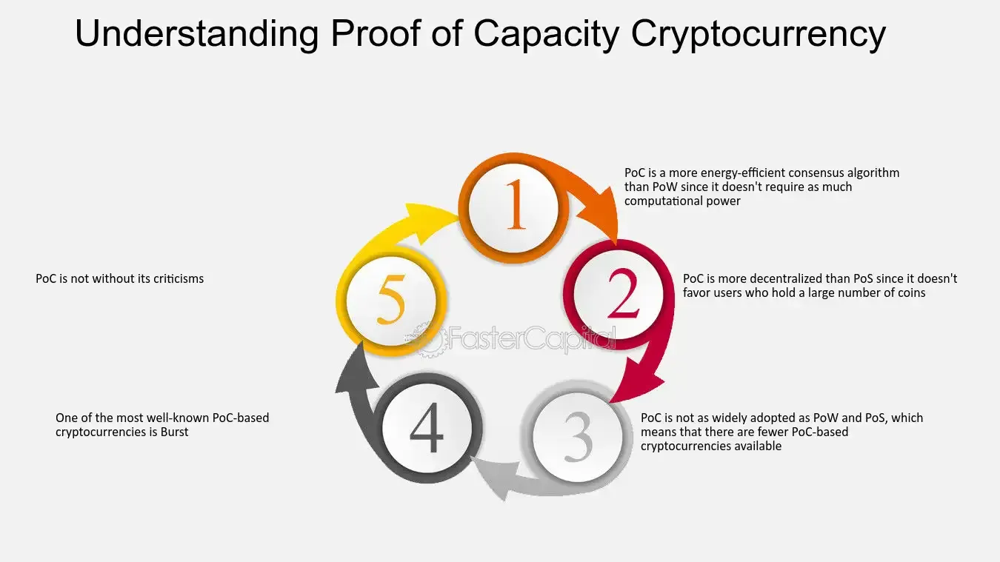

## Table of Contents

## What is Proof of Capacity (PoC) in the context of cryptocurrency?

Proof of Capacity (PoC) is a type of consensus mechanism used in some cryptocurrencies. It is different from other mechanisms like Proof of Work (PoW) or Proof of Stake (PoS). In PoC, the mining power of a user depends on the amount of hard drive space they are willing to dedicate to the network. This means that instead of using computing power or holding a lot of coins, miners use their available storage space to participate in the mining process.

The way PoC works is by allowing miners to pre-compute and store a list of possible solutions to mining puzzles on their hard drives. When a new block needs to be added to the blockchain, the network checks the stored solutions on the miners' hard drives. The miner with the solution that matches the puzzle gets to add the new block and is rewarded with cryptocurrency. This method is more energy-efficient compared to Proof of Work, as it doesn't require solving complex mathematical problems in real-time.

## How does Proof of Capacity differ from Proof of Work and Proof of Stake?

Proof of Capacity (PoC) is different from Proof of Work (PoW) and Proof of Stake (PoS) in how it decides who gets to add new blocks to the blockchain. In PoC, miners use their hard drive space to store possible solutions to mining puzzles ahead of time. When a new block is needed, the network checks these stored solutions, and the miner with the right solution gets to add the block and earn rewards. This makes PoC more energy-efficient because it doesn't need a lot of computing power like PoW does.

In Proof of Work, miners compete to solve complex math problems to add new blocks. The first one to solve the problem gets the reward, but this uses a lot of electricity and computing power. On the other hand, Proof of Stake chooses validators based on how many coins they hold and are willing to "stake" or lock up as a security deposit. The more coins a person stakes, the better their chance of being chosen to add a new block. PoS is also more energy-efficient than PoW, but it's different from PoC because it relies on coin ownership instead of storage space.

## What are the basic components required for a Proof of Capacity system?

A Proof of Capacity system needs a few key parts to work. First, it needs miners who are willing to use their hard drive space. These miners set aside space on their hard drives to store possible solutions to mining puzzles. This is called "plotting." The more space a miner dedicates, the better their chance of being chosen to add a new block to the blockchain.

Second, the system needs a way to check these stored solutions. When a new block needs to be added, the network looks at the solutions stored on the miners' hard drives. The miner with the solution that matches the current puzzle gets to add the block and earn a reward. This process is much less energy-intensive than other methods like Proof of Work, which makes it more eco-friendly.

Lastly, the system needs a way to keep everything fair and secure. This includes rules for how the network decides which miner gets to add the next block, and ways to make sure miners can't cheat. By using hard drive space instead of computing power or coin ownership, Proof of Capacity aims to make mining more accessible to more people.

## Can you explain how the mining process works in a Proof of Capacity system?

In a Proof of Capacity system, mining is all about using hard drive space. Miners start by setting aside space on their hard drives to store possible solutions to mining puzzles. This step is called "plotting." The more space a miner uses for plotting, the better their chance of being chosen to add a new block to the blockchain. Once the plotting is done, the miner's hard drive is ready to help with mining.

When it's time to add a new block to the blockchain, the network looks at all the solutions stored on the miners' hard drives. It's like a big game of matching. The network picks a puzzle, and then it checks all the stored solutions to see which one matches the puzzle. The miner whose solution matches the puzzle gets to add the new block and earn a reward. This way of mining uses less energy than other methods because it doesn't need a lot of computing power.

## What are the advantages of using Proof of Capacity over other consensus mechanisms?

Proof of Capacity has some big advantages over other ways of deciding who adds new blocks to a blockchain. One main advantage is that it's much kinder to the environment. Unlike Proof of Work, which uses a lot of electricity because miners need to solve hard math problems all the time, Proof of Capacity uses hard drive space instead. This means it doesn't need as much power, so it's better for the planet.

Another advantage is that Proof of Capacity can be more fair and open to everyone. With Proof of Work, you need special, expensive computers to mine well. And with Proof of Stake, you need to own a lot of the cryptocurrency to have a good chance of adding blocks. But with Proof of Capacity, anyone with some extra space on their hard drive can join in. This makes mining more accessible to regular people, not just those who can afford fancy equipment or already have a lot of coins.

## What are the potential drawbacks or challenges faced by Proof of Capacity?

One big challenge with Proof of Capacity is the need for a lot of hard drive space. Miners need to set aside big chunks of their hard drives to store solutions to mining puzzles. This can be expensive because good hard drives cost money. Also, using so much space means miners might not have room for other things on their computers, which can be a problem for people who need their hard drives for other stuff.

Another issue is that even though Proof of Capacity is more energy-efficient than Proof of Work, it still has some security risks. For example, if someone has a huge amount of hard drive space, they might be able to take over the network. This is called a "51% attack," where one person controls most of the mining power. Also, the process of plotting, where miners prepare their hard drives, can take a long time. This means new miners might have to wait before they can start earning rewards, which could discourage people from joining in.

## Which cryptocurrencies currently use Proof of Capacity as their consensus mechanism?

A few cryptocurrencies use Proof of Capacity to decide who adds new blocks to their blockchain. One of the most well-known is Burstcoin. It was one of the first cryptocurrencies to use Proof of Capacity, starting back in 2014. Burstcoin uses hard drive space to let miners store solutions to puzzles ahead of time. When a new block is needed, the network checks these stored solutions, and the miner with the right answer gets to add the block and earn some Burstcoin.

Another cryptocurrency that uses Proof of Capacity is Chia. Chia was created by Bram Cohen, the person who made BitTorrent. Chia aims to be more eco-friendly than other cryptocurrencies by using hard drive space instead of a lot of electricity. Like Burstcoin, Chia miners store possible solutions on their hard drives. When it's time to add a new block, the network looks at these solutions, and the miner with the matching solution gets to add the block and earn Chia coins.

## How does the energy efficiency of Proof of Capacity compare to other methods?

Proof of Capacity is much more energy-efficient than Proof of Work. In Proof of Work, miners have to solve really hard math problems to add new blocks to the blockchain. This takes a lot of electricity because the computers have to work very hard all the time. But in Proof of Capacity, miners use their hard drive space to store solutions to puzzles ahead of time. When a new block is needed, the network just checks these stored solutions. This uses a lot less power because the hard drives don't have to work as hard as the computers do in Proof of Work.

Compared to Proof of Stake, Proof of Capacity is also energy-efficient, but in a different way. Proof of Stake doesn't use a lot of electricity either, because it picks validators based on how many coins they hold and are willing to lock up. But Proof of Capacity is unique because it doesn't rely on coin ownership. Instead, it uses hard drive space, which is usually cheaper and more accessible than buying a lot of coins. So, while both methods are good for the environment, Proof of Capacity can be easier for more people to join in.

## What is the role of 'plots' in Proof of Capacity, and how are they created?

In Proof of Capacity, 'plots' are very important. They are like special files that miners store on their hard drives. These plots contain possible solutions to mining puzzles. The more plots a miner has, the better their chance of being chosen to add a new block to the blockchain and earn rewards. So, having a lot of plots is key to mining well in a Proof of Capacity system.

Creating plots is a process called 'plotting.' Miners use their computers to make these plots, which can take some time. They need to set aside space on their hard drives for the plots. Once the plots are made, they stay on the hard drive, ready for the network to check when a new block needs to be added. Plotting is done ahead of time, so it's different from Proof of Work, where miners have to solve puzzles in real-time. This makes Proof of Capacity more energy-efficient because the hard drive doesn't have to work as hard once the plots are ready.

## How does the security of a Proof of Capacity network compare to other consensus mechanisms?

Proof of Capacity networks are designed to be secure, but they face some different challenges compared to other consensus mechanisms like Proof of Work and Proof of Stake. In Proof of Capacity, security relies on the idea that no single miner can control too much of the network's hard drive space. If one person or group manages to control more than half of the total plotting space, they could launch a "51% attack" and take over the network. This is similar to the risk in Proof of Work, but instead of needing lots of computing power, attackers would need a lot of hard drive space.

Compared to Proof of Work, Proof of Capacity is generally seen as more secure in terms of energy use and accessibility. Proof of Work can be vulnerable to attacks from people with a lot of expensive mining equipment, but Proof of Capacity levels the playing field by using hard drive space, which is cheaper and more widely available. However, the need to store plots on hard drives can be a weak point. If someone can tamper with or destroy these plots, they could disrupt the network. So, while Proof of Capacity has its own security strengths, it also has unique challenges that need careful management.

## What are the future prospects and developments expected in Proof of Capacity technology?

Proof of Capacity is still a new way to run a cryptocurrency network, but it's growing. More and more people are looking at it because it uses less energy than other methods like Proof of Work. This is good for the environment. Also, because it uses hard drive space instead of special computers or lots of coins, more people can join in. This could make cryptocurrencies more popular and fair. Some big companies, like Chia Network, are working on making Proof of Capacity even better and more secure. They want to make it easier for people to start mining and to keep the network safe from attacks.

In the future, we might see more cryptocurrencies using Proof of Capacity. As the technology gets better, it could become a common way to run blockchains. People are already working on new ways to make plotting faster and more efficient. This would make it easier for new miners to join in without waiting a long time. Also, researchers are trying to find ways to make the network even safer, so it's harder for anyone to take over. If these improvements keep happening, Proof of Capacity could become a big part of how we use and think about cryptocurrencies.

## Can you discuss any notable implementations or case studies of Proof of Capacity in real-world scenarios?

One of the most notable implementations of Proof of Capacity is Burstcoin. Burstcoin started using this method back in 2014. It's been a good example of how Proof of Capacity can work in the real world. Burstcoin lets miners use their hard drive space to store solutions to puzzles. When it's time to add a new block to the blockchain, the network checks these solutions. If a miner's solution matches the puzzle, they get to add the block and earn some Burstcoin. This has shown that Proof of Capacity can be a fair and eco-friendly way to mine cryptocurrency.

Another important case study is Chia. Chia was created by Bram Cohen, the person who made BitTorrent. Chia uses Proof of Capacity to make mining more accessible and better for the environment. Instead of using a lot of electricity like other methods, Chia miners store possible solutions on their hard drives. When a new block needs to be added, the network looks at these solutions. The miner with the right solution gets to add the block and earn Chia coins. Chia has been working on making the plotting process faster and more efficient, which could help more people join in and make the network even safer.

## References & Further Reading

[1]: ["The Burstcoin Cryptocurrency FAQs"](https://www.burstcoin.community/faqs/) - Information about Burstcoin and its use of Proof of Capacity.

[2]: Cohen, Bram. (2019). ["Chia - A New Blockchain and Smart Transaction Platform"](https://hackernoon.com/company/chia-network) - Overview of the Chia cryptocurrency, which utilizes a PoC-like consensus called Proof of Space and Time.

[3]: Ateniese, G., Magri, B., Venturi, D., & Andrade, E. (2014). ["Redactable Blockchain – or – Rewriting History in Bitcoin and Friends."](https://eprint.iacr.org/2016/757.pdf) IACR Cryptology ePrint Archive.

[4]: Benet, J. (2014). ["IPFS - Content Addressed, Versioned, P2P File System"](https://arxiv.org/abs/1407.3561) arXiv preprint arXiv:1407.3561. - Discusses the implementation of peer-to-peer storage systems, relevant for understanding decentralized storage applications in blockchain and PoC.

[5]: Vukolic, M. (2015). ["The quest for scalable blockchain fabric: Proof-of-work vs BFT replication"](http://vukolic.com/iNetSec_2015.pdf) arXiv preprint arXiv:1511.01261. - Comparative study of different consensus mechanisms including PoW and its alternatives, providing context for PoC’s efficiency.