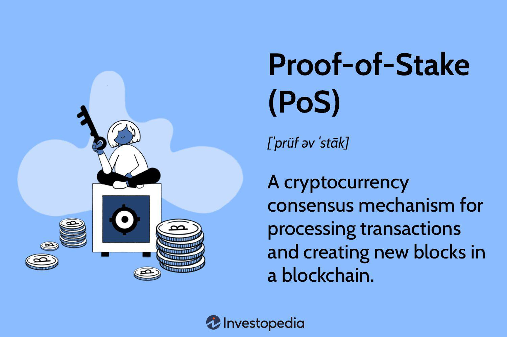

In the rapidly advancing field of cryptocurrencies, various mechanisms are continuously being developed to enhance network efficiency and security. At the heart of these digital currencies lies the necessity for consensus mechanisms, which are instrumental in maintaining the integrity and operational performance of blockchain networks. These mechanisms ensure that all participants in the network agree on a single version of the truth, preventing issues like double-spending.

Proof of Capacity (PoC) is a consensus mechanism that has recently garnered attention for its innovative approach to improving efficiency. Unlike traditional consensus methods, such as Proof of Work (PoW) or Proof of Stake (PoS), which rely heavily on computational power or financial investment, PoC utilizes available hard drive space to determine mining rights and validate transactions. This unique method allows for significant improvements in energy efficiency, presenting a potential solution to the energy consumption issues that have been a concern with conventional cryptocurrency mining techniques.

The focus of this article is to explore the nuances of Proof of Capacity, examining its role and impact within the cryptocurrency landscape. Furthermore, it will address the implications of PoC for algorithmic trading, where its efficiency can offer remarkable benefits. As the cryptocurrency ecosystem continues to evolve, understanding such consensus mechanisms becomes crucial for stakeholders aiming to leverage these technologies effectively.

## Table of Contents

## Understanding Proof of Capacity

Proof of Capacity (PoC) is a consensus mechanism distinct from the more commonly known systems like Proof of Work (PoW) and Proof of Stake (PoS). The key differentiator for PoC is its reliance on disk storage capacity instead of computational power or ownership stake to validate transactions and forge new blocks in the blockchain network.

In PoC, the mining process allows participants to plot available storage space to store solutions to cryptographic puzzles. These solutions, known as "plots," are precomputed and saved onto the miner's hard drives. When a new block is required, miners check their stored plots to find one that matches the ongoing puzzle requirement, enabling the block to be mined effectively based on disk space rather than processing power or financial stake.

This method presents considerable benefits in terms of energy efficiency. Unlike PoW that requires incessant computational activity leading to high electricity consumption, PoC uses less power as it predominantly relies on existing storage capabilities. This makes PoC an environmentally friendlier alternative to traditional energy-intensive mechanisms like PoW, which necessitates continuous operation of hardware to solve complex mathematical problems.

Examples of cryptocurrencies that have adopted PoC include Signum (formerly Burstcoin), Chia, and SpaceMint. These digital currencies leverage the benefits of PoC to offer a greener and potentially cost-effective solution for blockchain operations, tapping into unused hard drive resources.

The efficiency gain from PoC is chiefly derived from its ability to utilize idle hardware, thereby reducing the need for constant upgrades to mining equipment. Instead of powerful ASICs needed in PoW, PoC allows the average user to participate in mining activities with standard hard drives, democratizing access and reducing barriers to entry for new miners. This approach not only conserves energy but also aligns well with sustainable practices by reducing electronic waste and the environmental footprint of [cryptocurrency](/wiki/cryptocurrency) mining.

## The Process of Plotting and Mining

Proof of Capacity (PoC) is recognized for its distinctive operation comprising two essential processes: plotting and mining. This method capitalizes on hard drive space, setting it apart from conventional consensus mechanisms like Proof of Work (PoW) and Proof of Stake (PoS).

**Plotting:** The initial phase is plotting, where a miner pre-calculates possible solutions to hashing problems, known as "nonces," and stores these solutions on the hard drive. This pre-processing involves generating an extensive set of cryptographic hash functions, referred to as "plots." Each plot contains numerous precomputed hash solutions, with the aim of reducing computational load during the mining process. This phase is resource-intensive upfront, requiring time and disk writes, but it provides substantial energy savings and efficiency during mining.

During plotting, the data is structured in non-linear sequences on the disk, referred to as "plot files." Each plot file is divided into distinct segments called "scoops." The creation of these scoops is achieved through a computationally intensive method involving cryptographic algorithms, such as Shabal256, which ensures the sequences are unique and can be effectively utilized during the mining process.

**Mining:** Once plotting is completed, the mining phase capitalizes on these pre-stored plots. In PoC, mining involves scanning the plot files for solutions to a new block’s mathematical problem. Since the plots contain precomputed solutions, miners can quickly determine the correct outcome, resulting in a highly efficient block validation process compared to the constant computation required in PoW systems.

The effectiveness of PoC mining largely hinges on the amount of hard drive space dedicated by the miner. The more space allocated for storing plots, the greater the number of potential solutions available, hence increasing the probability of solving the hash problem first and [earning](/wiki/earning-announcement) the block reward. This relationship between allocated storage space (plot size) and mining success can be likened to a lottery where more tickets (plots) increase the chance of winning (solving a block).

An added advantage of PoC's methodology is its low energy consumption during the mining phase, as the pre-calculated data leverages the substantial storage capacity over computational power. This aspect makes PoC a more sustainable alternative, reducing both operational costs and environmental impact.

In conclusion, PoC's plotting and mining processes offer a sophisticated yet efficient approach, emphasizing the use of storage over computational expenditure, presenting a feasible solution for a more sustainable blockchain ecosystem.

## Pros and Cons of Proof of Capacity

Proof of Capacity (PoC) serves as a compelling option in the spectrum of consensus mechanisms, offering a blend of energy efficiency and economic practicality. Unlike Proof of Work (PoW), which is notorious for its high energy demands due to computational intensity, PoC leverages standard hard drives for its operations. This transition from energy-hungry processors to regular storage solutions translates into a significantly smaller carbon footprint, aligning with global pushes towards greener technologies.

One of the primary advantages of PoC is its utilization of readily available hard drive space. This accessibility eliminates the need for specialized and continually upgraded hardware such as Application-Specific Integrated Circuits (ASICs) used in PoW. Consequently, participants can engage in PoC mining without substantial upfront investments or frequent hardware replacements, thus lowering the barrier to entry and associated costs significantly.

Furthermore, PoC is less resource-intensive compared to ASIC-based mining. The mechanism predominantly relies on pre-calculated plots stored on hard drives, leading to reduced electricity consumption for continuous calculation, which is a hallmark of other consensus methodologies. This characteristic positions PoC as a favorable option for individuals or organizations conscious of energy expenditures and environmental impact.

Nevertheless, PoC is not without its drawbacks. A notable concern is its limited adoption within the cryptocurrency community. Being a relatively novel concept, PoC has yet to achieve widespread recognition and implementation compared to more entrenched mechanisms like PoW and Proof of Stake (PoS). This limited adoption may impede network effect benefits that come with larger user bases and extensive application development, making it a less attractive option for certain developers and investors.

Additionally, PoC's reliance on storage could introduce vulnerabilities related to malware attacks. The plots stored on hard drives might become targets for malicious software, potentially compromising individual mining setups or entire networks. Therefore, ensuring robust security measures and protective protocols is paramount.

Should PoC witness broader adoption, the mechanism may trigger increased demand for larger capacity storage solutions. This could lead to a market shift towards larger hard drives, potentially altering production and price dynamics within the hardware industry. If not managed carefully, this may result in resource strain or shifts in electronic waste patterns, challenging the eco-friendly advantage PoC currently offers.

In summary, while Proof of Capacity presents numerous advantages such as energy efficiency and cost-effectiveness, particularly in reducing the need for specialized hardware, it faces challenges in adoption and security. As the cryptocurrency sector continues to innovate, overcoming these challenges will be critical for PoC to solidify its standing in the broader blockchain ecosystem.

## PoC and Algorithmic Trading

Algorithmic trading involves using computational models and formulas to execute trades rapidly and efficiently, often capitalizing on small price discrepancies in various markets. The efficiency of these models is largely influenced by the underlying blockchain consensus mechanisms, where Proof of Capacity (PoC) is emerging as a beneficial alternative.

PoC offers significant advantages due to its lower energy consumption compared to more traditional consensus mechanisms like Proof of Work (PoW). This reduction in energy costs directly benefits traders, as lower operating expenses translate to more efficient trading operations. Reduced energy consumption also contributes to faster transaction confirmations, crucial for traders who rely on speed to maximize profits.

Integrating PoC with [algorithmic trading](/wiki/algorithmic-trading) algorithms can significantly enhance decision-making speed. Given the reduced confirmation times associated with PoC, algorithms can process trades at a higher frequency and execute them in near real-time. This increase in transaction speed enables traders to implement strategies that rely on short-lived market trends or [arbitrage](/wiki/arbitrage) opportunities that require prompt execution.

Moreover, PoC's characteristics align well with the operational requirements of algorithmic trading, which demands quick access to, and execution in, the market with minimal latency. The efficiency and scalability offered by PoC reduce overhead for traders, as they can rely on the existing computation rather than continual upgrades to expensive hardware. This ability to utilize standard computing components without sacrificing efficiency makes PoC an attractive option for traders seeking cost-effective and sustainable trading methodologies. 

Thus, as cryptocurrency markets lean more towards sustainable and efficient systems, PoC stands out as a consensus mechanism that aligns with these goals while offering tangible benefits for algorithmic trading.

## Conclusion

Proof of Capacity (PoC) is emerging as a compelling alternative to traditional energy-intensive consensus mechanisms such as Proof of Work (PoW). By leveraging the storage space of hard drives rather than relying on computational power or financial stake, PoC aligns well with sustainability objectives. This alternative approach significantly reduces the energy consumption associated with maintaining blockchain networks, offering a more environmentally friendly solution to transaction verification. 

The evolving landscape of cryptocurrencies presents opportunities where PoC could play a crucial role in improving trading efficiency. Its ability to provide faster transaction confirmations at lower energy costs makes it an attractive consensus mechanism for traders, particularly in the domain of algorithmic trading. This potential for quicker and more cost-effective solutions can lead to enhanced decision-making speed and reduced overhead in trading algorithms, benefiting traders who require rapid and reliable transaction processing.

Moreover, continued research and increased adoption of PoC could solidify its position within the broader blockchain ecosystem. Its broader implementation across different platforms could lead to significant advancements in blockchain applications, including algorithmic trading, where efficiency is paramount. As the industry continues to prioritize environmental considerations while striving for high performance, PoC's unique contributions to sustainability and efficiency could become central to future cryptocurrency developments.

## References & Further Reading

[1]: ["The Burstcoin Cryptocurrency FAQs"](https://www.burstcoin.community/faqs/) - Information about Burstcoin and its use of Proof of Capacity.

[2]: Cohen, Bram. (2019). ["Chia - A New Blockchain and Smart Transaction Platform"](https://hackernoon.com/company/chia-network) - Overview of the Chia cryptocurrency, which utilizes a PoC-like consensus called Proof of Space and Time.

[3]: Ateniese, G., Magri, B., Venturi, D., & Andrade, E. (2014). ["Redactable Blockchain – or – Rewriting History in Bitcoin and Friends."](https://eprint.iacr.org/2016/757.pdf) IACR Cryptology ePrint Archive.

[4]: Benet, J. (2014). ["IPFS - Content Addressed, Versioned, P2P File System"](https://arxiv.org/abs/1407.3561) arXiv preprint arXiv:1407.3561. - Discusses the implementation of peer-to-peer storage systems, relevant for understanding decentralized storage applications in blockchain and PoC.

[5]: Vukolic, M. (2015). ["The quest for scalable blockchain fabric: Proof-of-work vs BFT replication"](http://vukolic.com/iNetSec_2015.pdf) arXiv preprint arXiv:1511.01261. - Comparative study of different consensus mechanisms including PoW and its alternatives, providing context for PoC’s efficiency.