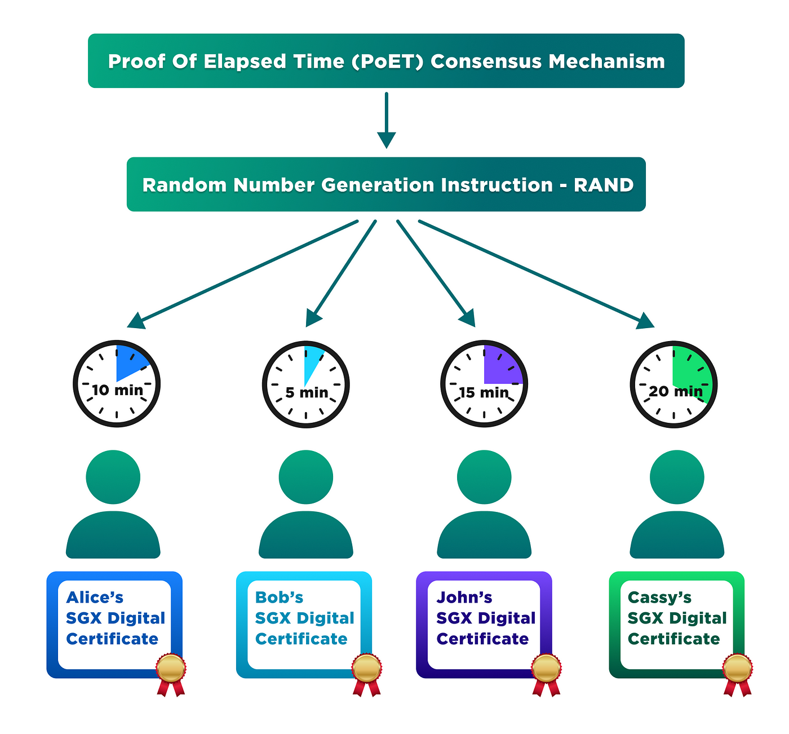

## Table of Contents

## What is Proof of Elapsed Time (PoET)?

Proof of Elapsed Time (PoET) is a way to choose who gets to add new information to a blockchain. It's like a lottery where everyone waits for a certain amount of time, and the first one to finish waiting gets to add the new information. This method is fair because everyone has an equal chance, and it uses less energy than other methods like Proof of Work.

PoET was created by a company called Intel. They use special computer chips to make sure everyone is waiting the right amount of time. This helps keep the blockchain secure and efficient. It's different from other systems because it doesn't need a lot of computing power, making it easier on the environment.

## How does Proof of Elapsed Time work?

Proof of Elapsed Time (PoET) works by making everyone on the blockchain network wait for a random amount of time. Each participant gets a special timer from Intel's secure chip. This timer tells them how long they need to wait. The first one whose timer runs out gets to add a new block to the blockchain. It's like a fair lottery where everyone has an equal chance to win, but instead of picking numbers, they're waiting.

This method is different from others because it doesn't need a lot of energy. In systems like Proof of Work, computers have to solve hard math problems, which uses a lot of power. But with PoET, the secure chip does all the work, so it's much more efficient. This makes PoET a greener choice for blockchains, and it also helps keep the network running smoothly because everyone follows the same rules.

## What is the main purpose of Proof of Elapsed Time?

The main purpose of Proof of Elapsed Time (PoET) is to choose who gets to add new information to a blockchain in a fair and efficient way. It's like a waiting game where everyone on the network has an equal chance to win. Each person gets a timer, and the first one whose timer runs out gets to add the new block. This method makes sure that no one person or group can control the blockchain, keeping it decentralized and fair.

Another important purpose of PoET is to save energy. Unlike other methods like Proof of Work, which use a lot of computer power to solve hard math problems, PoET uses special chips to manage the timers. This means it doesn't need as much energy, making it a greener choice for blockchains. By using less power, PoET helps protect the environment while still keeping the blockchain secure and efficient.

## How does Proof of Elapsed Time compare to Proof of Work (PoW)?

Proof of Elapsed Time (PoET) and Proof of Work (PoW) are two different ways to decide who gets to add new information to a blockchain. PoET works by making everyone on the network wait for a random amount of time, and the first one to finish waiting gets to add the new block. It uses special chips to manage these timers, which makes it fair because everyone has an equal chance. On the other hand, PoW makes everyone solve hard math problems, and the first one to solve it gets to add the block. This method can be unfair because people with more powerful computers have a better chance of winning.

The main difference between PoET and PoW is how much energy they use. PoET is much more energy-efficient because it doesn't need a lot of computing power. The special chips handle the timers, so it's easier on the environment. PoW, however, uses a lot of energy because solving those math problems takes a lot of computer power. This makes PoW less green and more expensive to run. So, if you want to save energy and keep things fair, PoET might be a better choice for a blockchain.

## What are the advantages of using Proof of Elapsed Time over Proof of Work?

Using Proof of Elapsed Time (PoET) instead of Proof of Work (PoW) has some big advantages. One of the main ones is that PoET is much kinder to the environment. PoW uses a lot of energy because it makes computers solve hard math problems. This can be bad for the planet and expensive to keep running. But PoET uses special chips to manage timers, so it doesn't need as much power. This makes it a greener choice and helps save money on energy costs.

Another advantage of PoET is that it's fairer for everyone on the network. In PoW, people with more powerful computers have a better chance of winning the right to add new information to the blockchain. This can make things unfair. But with PoET, everyone gets a timer and has an equal chance to win. It's like a fair waiting game where no one can cheat. This helps keep the blockchain decentralized and makes sure no single person or group can control it.

## What are the potential drawbacks of Proof of Elapsed Time?

One potential drawback of Proof of Elapsed Time (PoET) is that it relies on special chips made by Intel. This can be a problem because not everyone might have access to these chips. If you can't get one, you can't join the network. This could limit who can participate and might make the system less decentralized than it seems. Also, if there's a problem with Intel's chips, it could affect the whole blockchain, making it less secure.

Another issue is that PoET is still pretty new compared to other systems like Proof of Work. This means it hasn't been tested as much, and there might be problems we don't know about yet. People might be hesitant to use a system that's not fully proven. Plus, since it's newer, fewer people and companies might support it, which can slow down its growth and adoption.

## Can you explain the energy efficiency of PoET compared to PoW?

Proof of Elapsed Time (PoET) is much more energy-efficient than Proof of Work (PoW). PoW makes computers solve hard math problems to add new information to a blockchain. This uses a lot of energy because the computers have to work really hard to solve these problems. On the other hand, PoET uses special chips to manage timers. These chips don't need as much power, so PoET uses way less energy overall. This makes PoET a greener choice for blockchains.

The energy savings with PoET can make a big difference for the environment. PoW can use as much power as small countries, which is bad for the planet. But with PoET, the energy use is much lower, so it's better for the environment. This also means that running a blockchain with PoET can be cheaper because you don't have to pay as much for electricity. So, if you care about saving energy and money, PoET is a better option than PoW.

## How is security maintained in Proof of Elapsed Time?

Security in Proof of Elapsed Time (PoET) is maintained by using special chips made by Intel. These chips create a random timer for each person on the network. Only the chip knows how long the timer is set for, so no one can cheat by guessing or changing the time. This makes sure that everyone has a fair chance to add new information to the blockchain. If someone tries to mess with their timer, the chip will know and stop them, keeping the system safe.

The other way PoET keeps things secure is by making sure the blockchain stays decentralized. Because everyone has an equal chance to win, no single person or group can control the network. This spreads the power out among many people, making it harder for anyone to attack or take over the blockchain. By using these special chips and keeping things fair, PoET helps keep the blockchain secure and trustworthy.

## What role does randomness play in Proof of Elapsed Time?

Randomness is really important in Proof of Elapsed Time (PoET). It makes sure that everyone on the network has a fair chance to add new information to the blockchain. Each person gets a special timer from Intel's chip, and the time on this timer is chosen randomly. No one knows how long their timer will be until it starts, so it's like a fair lottery where everyone waits and the first one to finish wins. This randomness stops anyone from cheating or trying to guess when their turn will come, making the whole system fair and secure.

The random timers also help keep the blockchain decentralized. Because no one can predict when they'll get to add a new block, no single person or group can control the network. This spreads out the power among many people, which is good for security. If the timers weren't random, someone might figure out a way to always win, which would make the blockchain less safe. So, randomness in PoET is key to keeping things fair, decentralized, and secure.

## How is Proof of Elapsed Time implemented in blockchain technology?

Proof of Elapsed Time (PoET) is a way to choose who gets to add new information to a blockchain. It uses special chips made by Intel to give everyone on the network a random timer. When someone's timer runs out first, they get to add the new block. This is different from other methods because it doesn't need a lot of energy. Instead of solving hard math problems like in Proof of Work, PoET just makes everyone wait. This makes it a greener choice for blockchains and helps keep the system fair because everyone has an equal chance to win.

To implement PoET in a blockchain, you need to make sure everyone has access to these special chips. The chips are important because they keep the timers secret and secure, stopping anyone from cheating. Once everyone has a chip, the blockchain software can start the timers randomly for each person. When a timer runs out, the software checks to make sure it's valid, and then lets that person add the new block. This keeps the blockchain running smoothly and securely, without using too much power.

## What are some real-world applications or platforms using Proof of Elapsed Time?

One real-world application of Proof of Elapsed Time (PoET) is in Hyperledger Sawtooth, a blockchain platform developed by the Linux Foundation. Sawtooth uses PoET to make sure that everyone on the network has a fair chance to add new information to the blockchain. It's designed to be easy to use and can be used for things like supply chain management, where it's important to keep track of products as they move from one place to another. Because PoET is energy-efficient, it's a good choice for businesses that want to save on energy costs while keeping their blockchain secure.

Another example is the use of PoET in some private blockchains. Companies might use PoET in their own networks to manage things like contracts or financial transactions. Since PoET uses less energy than other methods, it's a good fit for businesses looking to be more environmentally friendly. Plus, the fairness of PoET means that no one person or group can control the blockchain, which is important for keeping things secure and trustworthy.

## What future developments or improvements are expected for Proof of Elapsed Time?

In the future, we might see Proof of Elapsed Time (PoET) become more popular as people learn about its benefits. One big improvement could be making the special chips easier to get. Right now, you need Intel's chips to use PoET, but if more companies start making similar chips, more people could join the network. This would make PoET more accessible and help it grow. Another idea is to make the software better so it works with more types of blockchains, not just the ones that use Intel's chips.

Another possible development is finding new ways to make PoET even more secure. Since PoET relies on the special chips, any problem with the chips could affect the whole blockchain. So, researchers might work on making the chips even harder to hack. They could also look into adding extra checks in the software to make sure everything is running smoothly. As PoET becomes more common, these improvements will help it stay a fair and green choice for blockchains.

## What is Proof of Work (PoW)?

Proof of Work (PoW) is recognized as the pioneering consensus mechanism that underpins Bitcoin and several early cryptocurrencies. Introduced by Satoshi Nakamoto in the Bitcoin whitepaper, PoW serves as a decentralized method for validating transactions and securing blockchain networks. 

In the PoW mechanism, miners compete to solve complex mathematical puzzles. These puzzles are cryptographic in nature and involve finding a nonce that, when hashed with the transaction data, fulfills a specific condition: the hash should be less than a defined target. This target is dynamically adjusted based on the network's mining difficulty, which ensures blocks are mined at consistent intervals. The process can be described by:

$$
\text{Hash}(nonce + \text{transaction data}) < \text{Target}
$$

Once a miner successfully solves this puzzle, they can validate and add a new block to the blockchain. They receive a block reward as an incentive, which also includes transaction fees collected from the users whose transactions are included in the block.

The primary drawback of PoW is its substantial energy consumption. Miners employ high-performance hardware to perform vast numbers of calculations, consuming significant amounts of electricity. As reported by the Cambridge Centre for Alternative Finance, Bitcoin alone is estimated to consume more electricity annually than some small countries. This energy-intensive nature raises environmental concerns, which are increasingly subject to scrutiny.

Despite its energy concerns, PoW's security advantages are well-documented. The effort and resources required to alter any aspect of the blockchain make it resistant to attacks. For an attacker to rewrite any part of the ledger, they would need to control more than 50% of the network's total computational power, an endeavor that is impractically costly and resource-intensive—making it a robust security model for blockchain networks.

PoW does face scalability challenges. As more participants join the network, the complexity of the puzzles must be adjusted to maintain block creation times, which can limit the number of transactions processed in a given period. This bottleneck can lead to congestion and increased transaction times, rendering it less efficient as a network grows. Solutions like the Lightning Network have been proposed to alleviate some of these scalability issues by enabling off-chain transactions, but PoW remains fundamentally limited in throughput compared to newer consensus algorithms.

## References & Further Reading

[1]: Nakamoto, S. (2008). ["Bitcoin: A Peer-to-Peer Electronic Cash System."](https://nakamotoinstitute.org/library/bitcoin/)

[2]: Vukolic, M. (2015). ["The Quest for Scalable Blockchain Fabric: Proof-of-Work vs. BFT Replication."](http://vukolic.com/iNetSec_2015.pdf) International Workshop on Open Problems in Network Security.

[3]: Xu, X., Weber, I., & Staples, M. (2019). ["Architecture for Blockchain Applications."](https://link.springer.com/book/10.1007/978-3-030-03035-3) Springer.

[4]: Cachin, C., & Vukolic, M. (2017). ["Blockchain Consensus Protocols in the Wild."](https://arxiv.org/abs/1707.01873) arXiv preprint arXiv:1707.01873.

[5]: Intel Corporation. (2016). ["Understanding the Basics of Blockchain."](https://financialcrimeacademy.org/understanding-the-basics-of-blockchain/) 

[6]: Linux Foundation. ["Hyperledger Sawtooth Documentation."](https://8112310.fs1.hubspotusercontent-na1.net/hubfs/8112310/Hyperledger/Hyperledger_Sawtooth_WhitePaper.pdf)

[7]: Bonneau, J., Miller, A., Clark, J., Narayanan, A., Kroll, J. A., & Felten, E. (2015). ["Research Perspectives and Challenges for Bitcoin and Cryptocurrencies."](https://ieeexplore.ieee.org/document/7163021) IEEE Security & Privacy.