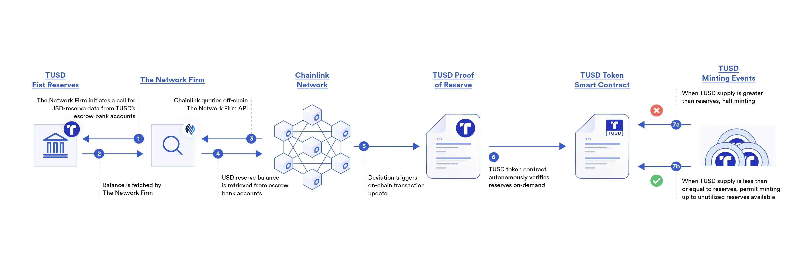

## Table of Contents

## What is Proof of Reserves?

Proof of Reserves is a way for a company, especially in the cryptocurrency world, to show that it has enough assets to cover what it owes to its customers. It's like showing that a bank has enough money to give back to people who have accounts there. This is important because it helps build trust. If customers know that the company can pay them back, they feel safer keeping their money or assets with that company.

Usually, a third party checks the company's assets and debts to make sure the numbers add up. This third party is like a referee, making sure the company is telling the truth. If everything checks out, the company can say it has a Proof of Reserves, which can make customers feel more secure. It's a bit like getting a stamp of approval that says, "Yes, this company can cover its promises."

## Why is Proof of Reserves important in the cryptocurrency industry?

Proof of Reserves is really important in the cryptocurrency world because it helps people trust the companies they use. In crypto, there's no big boss or government watching over things, so it can be hard to know if a company is being honest about having enough money or assets to give back to its customers. When a company shows Proof of Reserves, it's like saying, "Look, we have checked our books, and we can pay you back if you want your money." This makes people feel safer about keeping their money with that company.

Also, the crypto world has seen some big problems when companies didn't have enough money to pay everyone back. This can make people very nervous about using crypto at all. Proof of Reserves helps stop this from happening by making sure companies are honest about what they have. It's like a safety net that helps keep the whole crypto system more stable and trustworthy. When people see that companies are being open and honest, they are more likely to keep using and trusting crypto services.

## How does Proof of Reserves work?

Proof of Reserves works by having a company show that it has enough money or assets to give back to its customers. The company does this by getting a third party, like an accountant or an auditor, to check its [books](/wiki/algo-trading-books). This third party looks at how much the company has and how much it owes to its customers. If the company has more than enough to cover what it owes, the third party can say that the company has a Proof of Reserves. This is like getting a stamp of approval that says the company is good at keeping its promises.

This process is important because it helps build trust. When customers see that a company has been checked and approved, they feel safer about leaving their money with that company. It's like knowing that a bank has enough money to give back to everyone who has an account there. In the world of cryptocurrencies, where there's no big boss making sure everyone plays fair, Proof of Reserves is a way to make sure companies are honest about what they have. This helps keep the whole crypto system more stable and trustworthy.

## What are the key components of a Proof of Reserves audit?

A Proof of Reserves audit has a few important parts. First, there's the company's assets. These are things like money, cryptocurrencies, or other valuable stuff the company owns. The audit checks if the company really has these assets and if they are worth as much as the company says. Second, there are the company's liabilities. These are what the company owes to its customers, like money or crypto they need to give back. The audit makes sure the company knows exactly how much it owes.

The third part is the actual audit process. This is where a third party, like an accountant or auditor, comes in to check everything. They look at the company's books and make sure the numbers add up. They check if the assets are more than enough to cover the liabilities. If everything looks good, they give the company a Proof of Reserves, which is like saying, "Yes, this company can pay back its customers."

This whole process is important because it helps build trust. When customers see that a company has been checked and approved, they feel safer about leaving their money with that company. It's like knowing that a bank has enough money to give back to everyone who has an account there. In the world of cryptocurrencies, where there's no big boss making sure everyone plays fair, Proof of Reserves is a way to make sure companies are honest about what they have.

## Who typically conducts a Proof of Reserves audit?

A Proof of Reserves audit is usually done by a third party. This third party is often an accountant or an auditing firm. They are like referees who check if the company is telling the truth about its money and assets. They look at the company's books and make sure the company has enough to pay back its customers.

These third parties are important because they help make sure everything is fair and honest. People trust them to do a good job because they are not part of the company being checked. This way, customers can feel safe knowing that someone else has looked at the numbers and said, "Yes, this company can pay you back if you want your money."

## How often should a Proof of Reserves audit be performed?

A Proof of Reserves audit should be done regularly to keep trust strong. It's like checking the health of a company often to make sure it's still doing well. Many people think it should be done at least once a year. This way, customers know the company is always being honest about what it has.

But, some say it should be done even more often, like every few months. This is because things can change fast in the world of cryptocurrencies. Doing it more often can help catch any problems early and keep everyone feeling safe about their money.

## What are the benefits of Proof of Reserves for users?

Proof of Reserves helps users feel safe about their money. When a company shows it has enough money or assets to pay back its customers, users can trust that their money is in good hands. It's like knowing a bank can give back all the money people have put in it. This makes users more comfortable using the company's services because they know they can get their money back when they need it.

Having regular Proof of Reserves audits also keeps users calm. If a company checks its money often and shows it to everyone, users know the company is being honest and open. This can stop big problems from happening, like when a company doesn't have enough money to pay everyone back. When users see that a company is always making sure it can pay them, they are more likely to keep using and trusting that company.

## Can Proof of Reserves be manipulated or falsified?

Yes, Proof of Reserves can be manipulated or falsified, but it's hard to do. A company might try to hide the truth by showing fake numbers or lying about how much money or assets they have. But, if a good third party is checking the books, it's harder for the company to trick them. The third party is like a detective looking for any signs of cheating.

Even though it's hard, it's still important to be careful. Sometimes, a company might work with a third party that isn't very good at their job or is willing to help the company lie. That's why it's good to check if the third party is trusted and has a good reputation. If users see that the third party is honest and does a good job, they can feel safer about the Proof of Reserves.

## What are the limitations of Proof of Reserves?

Proof of Reserves is a good way to show that a company has enough money to pay back its customers, but it has some limits. One big problem is that it only checks the company's money at one moment in time. Things can change quickly, so just because a company had enough money during the audit doesn't mean it will always have enough. Also, if the third party doing the check isn't very good or honest, the audit might not be trustworthy. If the third party is not careful or is working with the company to lie, the Proof of Reserves might not mean much.

Another limit is that Proof of Reserves only looks at the money the company has, not how well it's run. A company might have enough money today but could be making bad choices that will cause problems later. It's like checking if a bank has enough money but not looking at how it's spending or investing that money. So, while Proof of Reserves can help build trust, it's not perfect and should be used with other checks to make sure a company is really safe and honest.

## How does Proof of Reserves differ from Proof of Liabilities?

Proof of Reserves and Proof of Liabilities are two sides of the same coin, but they focus on different things. Proof of Reserves is all about showing that a company has enough money or assets to pay back its customers. It's like checking if a bank has enough money to give back to everyone who has an account there. A third party, like an accountant, looks at the company's money and says, "Yes, they have enough to cover what they owe."

On the other hand, Proof of Liabilities is about showing exactly how much a company owes to its customers. It's like making a list of all the money or crypto the company needs to give back. This helps make sure the company knows exactly what it owes and can plan to pay it back. Both Proof of Reserves and Proof of Liabilities are important to build trust, but they look at different parts of the company's money situation.

## What are some real-world examples of Proof of Reserves audits?

One real-world example of a Proof of Reserves audit is when the [cryptocurrency](/wiki/cryptocurrency) exchange Kraken did one in 2022. They worked with a company called Armanino LLP to check their books. Armanino looked at Kraken's money and said they had enough to pay back all their customers. This made people feel safer about using Kraken because they knew the company was being honest about what they had.

Another example is when the crypto platform Binance did a Proof of Reserves audit in 2022. They worked with a company called Mazars to check their money. Mazars looked at Binance's books and said they had more than enough to cover what they owed to customers. This helped build trust with people using Binance because they could see that the company was open about their finances.

## What advanced technologies are being developed to enhance the effectiveness of Proof of Reserves?

New technologies are being made to make Proof of Reserves even better and more trustworthy. One of these is using something called "zero-knowledge proofs." This is a fancy way of checking if a company has enough money without telling everyone exactly what they have. It's like saying, "Yes, we have enough," without showing all the details. This can help keep things private while still proving that the company can pay back its customers.

Another technology being used is blockchain. Some companies are putting their Proof of Reserves audits on the blockchain, which is like a big, open book that anyone can see. This makes it harder for companies to lie because everyone can check the numbers for themselves. Using blockchain can make people trust the audits more because it's harder to change or hide information once it's on the blockchain.

## References & Further Reading

[1]: Antonopoulos, A. M. (2017). [Mastering Bitcoin: Unlocking Digital Cryptocurrencies](https://books.google.com/books/about/Mastering_Bitcoin.html?id=IXmrBQAAQBAJ). O'Reilly Media.

[2]: Narayanan, A., Bonneau, J., Felten, E., Miller, A., & Goldfeder, S. (2016). [Bitcoin and Cryptocurrency Technologies: A Comprehensive Introduction](https://press.princeton.edu/books/hardcover/9780691171692/bitcoin-and-cryptocurrency-technologies). Princeton University Press.

[3]: Barber, S., Boyen, X., Shi, E., & Uzun, E. (2012). [Bitter to Better—How to Make Bitcoin a Better Currency](https://link.springer.com/chapter/10.1007/978-3-642-32946-3_29). In Financial Cryptography and Data Security (pp. 399-414). Springer, Berlin, Heidelberg.

[4]: Bonneau, J., Miller, A., Clark, J., Narayanan, A., Kroll, J. A., & Felten, E. W. (2015). [SoK: Research Perspectives and Challenges for Bitcoin and Cryptocurrencies](https://ieeexplore.ieee.org/document/7163021). 2015 IEEE Symposium on Security and Privacy.

[5]: Müller-Bloch, C., & Kranz, J. (2015). [A Framework for Rigorously Identifying Research Gaps in Qualitative Literature Reviews](https://www.researchgate.net/publication/283271278_A_Framework_for_Rigorously_Identifying_Research_Gaps_in_Qualitative_Literature_Reviews). Wirtschaftsinformatik Proceedings 2015.