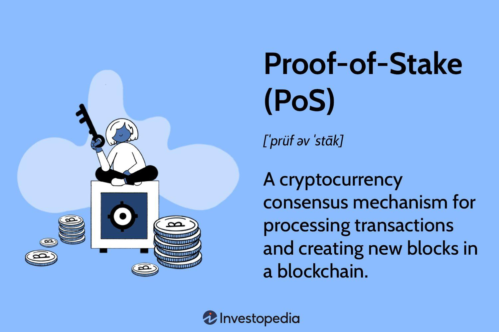

## Table of Contents

## What is Proof-of-Stake (PoS) and how does it work?

Proof-of-Stake (PoS) is a way for a computer network to agree on things without needing a boss. It's used by some cryptocurrencies to keep their records safe and correct. Instead of using a lot of computer power like in Proof-of-Work, PoS picks someone to add new information to the records based on how many coins they have and are willing to "stake" or lock up as a promise to behave honestly.

Here's how it works: Imagine a group of people who all have some coins. If someone wants to add new information to the records, they put some of their coins at stake. The network then picks someone to add the new information, usually giving a better chance to those who have more coins staked. If the chosen person adds the information correctly, they get a reward. But if they try to cheat, they could lose the coins they staked. This makes people want to be honest because they don't want to lose their coins.

## How does Proof-of-Stake differ from Proof-of-Work (PoW)?

Proof-of-Stake (PoS) and Proof-of-Work (PoW) are two different ways for a computer network to agree on things without a boss. PoS picks someone to add new information to the records based on how many coins they have and are willing to lock up as a promise to be honest. This means that if you have more coins and you're willing to lock them up, you have a better chance of being chosen. On the other hand, PoW picks someone based on how much computer power they can use to solve a hard math problem. The first one to solve the problem gets to add the new information and gets a reward.

The big difference between PoS and PoW is how they use resources. PoW uses a lot of computer power and electricity because everyone is trying to solve the math problem as fast as they can. This can be bad for the environment because it uses so much energy. PoS, however, doesn't need as much computer power because it's not about solving math problems. Instead, it's about how many coins you're willing to lock up. This makes PoS more energy-friendly and easier on the environment.

## What are the benefits of using Proof-of-Stake in cryptocurrencies?

Using Proof-of-Stake in cryptocurrencies has several benefits. One big benefit is that it uses less energy. Unlike Proof-of-Work, which needs a lot of computer power to solve math problems, Proof-of-Stake picks someone to add new information based on how many coins they have locked up. This means it doesn't use as much electricity, which is good for the environment. It also makes it easier for more people to join in because they don't need expensive computers to participate.

Another benefit is that Proof-of-Stake can be safer and less likely to be attacked. In Proof-of-Stake, if someone tries to cheat, they could lose the coins they locked up. This makes people think twice before trying to mess with the system. Also, because it's harder for one person to control a lot of the network, it's more spread out and harder to take over. This helps keep the [cryptocurrency](/wiki/cryptocurrency) safe and fair for everyone.

## What are the potential drawbacks or challenges of Proof-of-Stake systems?

One challenge with Proof-of-Stake systems is that they can favor people who already have a lot of coins. Because the chance of being picked to add new information depends on how many coins someone has locked up, those with more coins have a bigger say in what happens. This can make the system less fair and might make it harder for new people to join in and have a say. It's like a rich-get-richer situation, where those with more coins can keep getting more power.

Another issue is the problem of "nothing at stake." In some Proof-of-Stake systems, validators might be able to vote for multiple versions of the blockchain history without risking their staked coins. This means they could support different versions of the truth, which can cause confusion and make it harder for the network to agree on what's real. This problem can make the system less stable and trustworthy, and it needs careful design to avoid it.

Lastly, there can be challenges in getting people to start using Proof-of-Stake. Moving from a Proof-of-Work system to a Proof-of-Stake system can be tricky. It might need a lot of people to agree and change how they do things. If not enough people want to switch, or if the change is not done well, it could cause problems for the cryptocurrency. This transition needs to be handled carefully to make sure the new system works well and is accepted by everyone.

## Can you explain the concept of 'staking' in Proof-of-Stake?

Staking in Proof-of-Stake is when someone locks up some of their coins to help keep the cryptocurrency network safe and running smoothly. When you stake your coins, you're promising to behave honestly and follow the rules of the network. In return, you get a chance to be picked to add new information to the records, like transactions. If you're picked and you do it right, you get a reward, which is usually more coins. This is a way to encourage people to help out and keep the system working well.

The amount of coins you stake can affect your chances of being picked. Usually, the more coins you stake, the better your chances are. This is because the system sees you as having more at stake, so you're more likely to play by the rules. But if you try to cheat or mess with the system, you could lose the coins you staked. This makes people think twice before doing anything dishonest, because they don't want to lose their coins. So, staking is a way to keep everyone honest and make sure the network stays safe and reliable.

## How does one become a validator in a Proof-of-Stake network?

To become a validator in a Proof-of-Stake network, you need to have some of the cryptocurrency that the network uses. You then lock up, or stake, a certain amount of these coins. This shows that you're willing to help keep the network running honestly. Different networks might have different rules about how many coins you need to stake, but the basic idea is the same: you put up some of your coins as a promise to behave well.

Once you've staked your coins, you can start working as a validator. Your job is to check new transactions and add them to the network's records. The network picks validators to do this job based on how many coins they've staked. If you do your job well and follow the rules, you get rewarded with more coins. But if you try to cheat or mess things up, you could lose the coins you staked. This system encourages validators to be honest and keep the network safe and reliable.

## What is the role of validators in a Proof-of-Stake system?

Validators in a Proof-of-Stake system have a very important job. They are the ones who check new transactions and make sure they are correct before adding them to the network's records. To become a validator, someone needs to lock up, or stake, some of their coins. This shows that they are serious about helping the network and willing to follow the rules. The more coins someone stakes, the better their chance of being picked to add new transactions.

Once picked, a validator adds the new transactions to the records and gets a reward in the form of more coins. This reward is like a thank you for doing a good job. But if a validator tries to cheat or mess things up, they could lose the coins they staked. This makes validators think twice before doing anything dishonest, because they don't want to lose their coins. So, validators help keep the network safe, reliable, and running smoothly by making sure only correct transactions are added.

## How is the security of a Proof-of-Stake network maintained?

The security of a Proof-of-Stake network is maintained by making sure that validators have a lot to lose if they try to cheat. When someone wants to be a validator, they have to lock up some of their coins. This is called staking. If a validator tries to add wrong information or mess with the network, they could lose these staked coins. This makes people think twice before doing anything dishonest because they don't want to lose their money. So, the threat of losing their staked coins keeps validators honest and helps keep the network safe.

Another way the security is maintained is by making it hard for one person or group to take over the network. In Proof-of-Stake, the more coins someone stakes, the more say they have in what happens. But if someone tries to control too much of the network, other validators can work together to stop them. This is called a decentralized system, where power is spread out among many people. By working together, validators can keep the network fair and secure, making sure no one person can mess things up for everyone else.

## What are some well-known cryptocurrencies that use Proof-of-Stake?

Some well-known cryptocurrencies that use Proof-of-Stake are Ethereum, Cardano, and Solana. Ethereum switched from Proof-of-Work to Proof-of-Stake with its big update called "The Merge" in 2022. This change made Ethereum use a lot less energy and helped it become more friendly to the environment. Cardano has been using Proof-of-Stake from the start and is known for its focus on being safe and easy to use. Solana is another popular one that uses Proof-of-Stake and is known for being very fast and able to handle a lot of transactions at the same time.

These cryptocurrencies use Proof-of-Stake to keep their networks safe and running well. In Proof-of-Stake, people who have coins can lock them up to become validators. Validators check new transactions and add them to the records. If they do a good job, they get rewarded with more coins. But if they try to cheat, they could lose the coins they locked up. This makes validators want to be honest and helps keep the network secure and fair for everyone.

## How does the energy consumption of Proof-of-Stake compare to Proof-of-Work?

Proof-of-Stake uses a lot less energy than Proof-of-Work. In Proof-of-Work, people use powerful computers to solve hard math problems. The first one to solve the problem gets to add new information to the records and gets a reward. This means a lot of computers are working all the time, using a lot of electricity. This can be bad for the environment because it uses so much energy. On the other hand, Proof-of-Stake doesn't need powerful computers. Instead, it picks someone to add new information based on how many coins they have locked up. This uses much less energy, making it better for the environment.

Because Proof-of-Stake is more energy-friendly, it's easier for more people to join in. You don't need to buy expensive computers or use a lot of electricity to participate. This makes it more fair and accessible. Also, since Proof-of-Stake doesn't use as much energy, it can help cryptocurrencies be more sustainable in the long run. This is why many cryptocurrencies, like Ethereum, have switched from Proof-of-Work to Proof-of-Stake to save energy and be kinder to the planet.

## What are the economic implications of Proof-of-Stake for cryptocurrency holders?

Proof-of-Stake can have big effects on people who hold cryptocurrencies. When someone stakes their coins, they lock them up to help the network and get a chance to earn more coins as a reward. This means that people who stake their coins can earn more money over time, kind of like getting interest from a bank. But if they try to cheat, they could lose the coins they staked. This makes people think twice before doing anything dishonest. So, staking can be a good way for people to make their money grow, but it also comes with some risks.

Another thing to think about is how Proof-of-Stake can change who has power in the network. Because the more coins someone stakes, the more say they have, people with a lot of coins can have more control. This can make the system less fair and might make it harder for new people to join in and have a say. It's like a rich-get-richer situation, where those with more coins can keep getting more power. This can affect how the cryptocurrency works and who benefits from it the most.

## What advanced techniques like delegated Proof-of-Stake or liquid staking exist, and how do they work?

Delegated Proof-of-Stake (DPoS) is a way to make the Proof-of-Stake system work better and faster. In DPoS, people who hold the cryptocurrency can vote for special people called "delegates" to check and add new transactions to the records. These delegates do the work of keeping the network safe and running well. People who vote for the delegates don't have to lock up their own coins, but they can still earn rewards if the delegates they voted for do a good job. This makes it easier for more people to join in and have a say in what happens, without needing to stake their own coins.

Liquid staking is another way to make staking easier and more flexible. When someone wants to stake their coins, they can use a special service to do it for them. This service locks up the coins and helps the network, and in return, the person gets a special token that they can use or trade while their coins are locked up. This means people can still use their money for other things, even though it's staked. Liquid staking makes it easier for people to join in and helps them keep their money working for them in different ways.

## References & Further Reading

[1]: ["Ethereum.org: Proof of Stake."](https://ethereum.org/en/developers/docs/consensus-mechanisms/pos/)

[2]: Benetton, M., & Compiani, G. (2020). ["Proof of Stake and the Economics of Blockchain Governance."](https://papers.ssrn.com/sol3/papers.cfm?abstract_id=3668582) CESifo Working Paper No. 8577.

[3]: Saleh, F. (2020). ["Blockchain Without Waste: Proof-of-Stake."](https://academic.oup.com/rfs/article-abstract/34/3/1156/5868423) The Review of Financial Studies, 33(11), 4977-5050.

[4]: Antonopoulos, A. M., & Wood, G. (2018). ["Mastering Ethereum: Building Smart Contracts and Dapps"](https://www.amazon.com/Mastering-Ethereum-Building-Smart-Contracts/dp/1491971940) O'Reilly Media.

[5]: Muneeza, A., Arshad, N., & Arifin, A. M. T. (2021). ["Cryptocurrencies and Islamic Finance: Compatibility and Implications."](https://www.researchgate.net/profile/Aishath-Muneeza/publication/327586306_The_Application_of_Blockchain_Technology_in_Crowdfunding_Towards_Financial_Inclusion_via_Technology/links/5ed5221f92851c9c5e720aa7/The-Application-of-Blockchain-Technology-in-Crowdfunding-Towards-Financial-Inclusion-via-Technology.pdf) Springer.