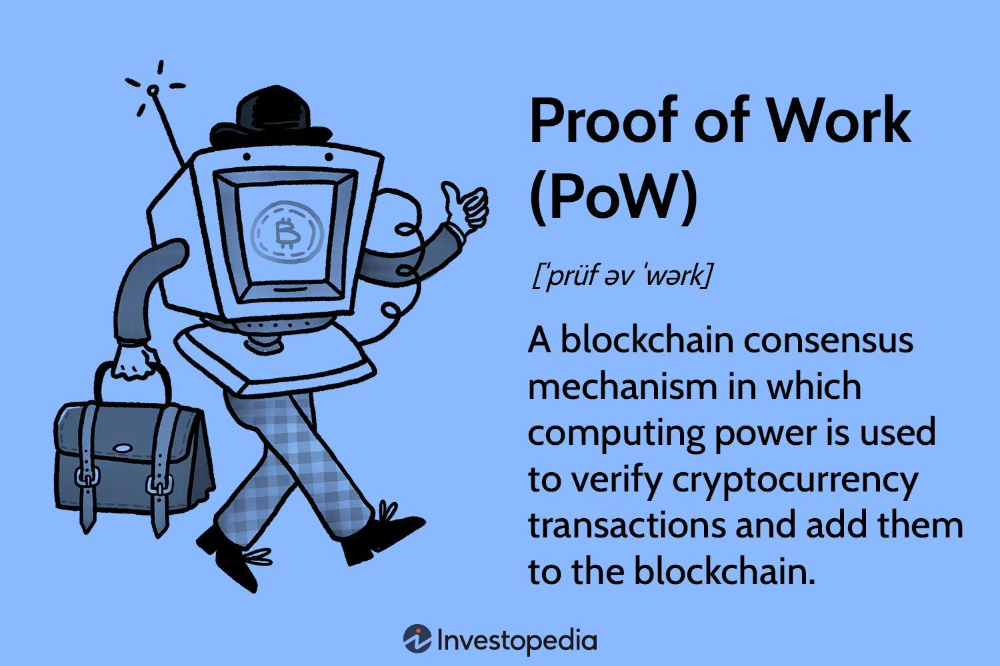

## Table of Contents

## What is Proof of Work (PoW) in the context of blockchain?

Proof of Work (PoW) is a system that many blockchain networks use to make sure that new blocks of transactions are added to the blockchain in a secure way. In PoW, miners compete to solve a complex math problem. The first miner to solve the problem gets to add a new block to the blockchain and is rewarded with cryptocurrency. This process is called mining. The math problem is hard to solve but easy to check, which helps keep the blockchain safe from attacks.

The main idea behind PoW is to make it hard for anyone to add fake transactions to the blockchain. Because solving the math problem takes a lot of computing power and energy, it would be very expensive for someone to try to cheat the system. This makes the blockchain more secure because it's not easy for bad actors to take control of it. PoW is used by well-known cryptocurrencies like Bitcoin, and it helps maintain the trust and integrity of the network.

## How does Proof of Work help secure a blockchain network?

Proof of Work helps secure a blockchain network by making it hard for anyone to add fake transactions. Miners have to solve a tough math problem to add a new block to the blockchain. This problem takes a lot of computer power and energy to solve. If someone wanted to cheat and add fake transactions, they would need to solve these problems faster than everyone else, which would be very expensive and hard to do. This makes it unlikely for bad actors to take over the network.

Also, Proof of Work makes sure that everyone on the network agrees on what transactions are real. When a miner solves the math problem and adds a new block, other miners check the work to make sure it's correct. If it is, they add the new block to their copy of the blockchain. This way, everyone on the network has the same version of the blockchain, which helps keep it secure and trustworthy.

## What is the role of miners in a Proof of Work system?

Miners in a Proof of Work system are very important. They use powerful computers to solve hard math problems. When a miner solves the problem first, they get to add a new block of transactions to the blockchain. This is called mining. As a reward for their work, miners get some cryptocurrency, like Bitcoin. This reward encourages miners to keep working and helps keep the blockchain running smoothly.

Miners also help keep the blockchain safe. By solving these math problems, miners make it hard for anyone to cheat and add fake transactions. It would cost a lot of money and energy for someone to try to take over the network and add fake blocks. Miners also check each other's work. When a miner adds a new block, other miners make sure it's correct before adding it to their own copy of the blockchain. This way, everyone agrees on what transactions are real, which keeps the blockchain secure and trustworthy.

## Can you explain the concept of mining difficulty in PoW?

Mining difficulty in Proof of Work is how hard it is for miners to solve the math problem to add a new block to the blockchain. The difficulty can change to make sure that new blocks are added at a steady rate, like every 10 minutes for Bitcoin. If lots of miners are working and solving problems quickly, the difficulty goes up to make it harder. If fewer miners are working, the difficulty goes down to make it easier. This keeps the blockchain growing at a steady pace.

The difficulty is adjusted by changing the target that miners need to hit when solving the math problem. A higher difficulty means a smaller target, making it harder to find the right solution. A lower difficulty means a bigger target, making it easier. This system helps keep the blockchain secure because it makes sure that the network can adapt to changes in how many miners are working and how powerful their computers are.

## What are the energy consumption concerns associated with Proof of Work?

Proof of Work uses a lot of energy. Miners need powerful computers that use a lot of electricity to solve the math problems. As more people mine, they use more and more energy. This can be bad for the environment because it adds to the world's energy use and can make climate change worse. Some people worry that the energy used for mining could be better spent on other things that help people more directly.

To deal with these concerns, some people are looking for other ways to secure blockchain networks that don't use as much energy. One idea is Proof of Stake, which uses less energy because it doesn't need miners to solve math problems. But Proof of Work is still used by big cryptocurrencies like Bitcoin, so the energy problem is still a big issue. People are trying to find ways to use cleaner energy for mining, but it's a hard problem to solve.

## How does the Proof of Work consensus mechanism prevent double-spending?

Proof of Work helps stop double-spending by making it hard for someone to cheat the system. Double-spending means trying to spend the same money twice. In a blockchain, when someone wants to send money, they make a transaction. This transaction is then checked and added to a block by miners. The miners solve a hard math problem to add the block to the blockchain. Once a block is added, everyone on the network agrees that the transactions in that block are real. If someone tries to double-spend, they would need to change the blockchain, which is very hard because they would have to solve the math problem faster than everyone else.

To change the blockchain and double-spend, a person would need to control more than half of the network's mining power. This is called a 51% attack, and it would be very expensive and hard to do. Because of this, it's not likely that someone could successfully double-spend. The hard work that miners put in to solve the math problems makes the blockchain secure and stops people from spending the same money twice.

## What is a nonce in the context of Proof of Work, and why is it important?

In Proof of Work, a nonce is a number that miners change to try to solve the math problem. It's like a guess that miners keep changing until they find the right one that solves the problem. The nonce is important because it's what makes the mining process work. Miners keep trying different nonces until they find one that makes the hash of the block's data meet the target set by the network's difficulty.

The nonce is key to keeping the blockchain secure. Because miners have to keep guessing different nonces, it takes a lot of work and energy to find the right one. This makes it hard for someone to cheat and add fake blocks to the blockchain. If someone wanted to change the blockchain, they would have to find the right nonce faster than everyone else, which is very hard and expensive. So, the nonce helps make sure that the blockchain stays safe and that transactions are real.

## How does the block reward system work in Proof of Work blockchains?

In Proof of Work blockchains, miners get a reward for adding new blocks to the blockchain. This reward is called the block reward. When a miner solves the hard math problem and adds a new block, they get some cryptocurrency, like Bitcoin. The block reward is a way to thank miners for their work and to encourage them to keep mining. It's important because it helps keep the blockchain running smoothly and securely.

The block reward can change over time. For example, in Bitcoin, the reward gets cut in half every four years in an event called the halving. This makes the reward smaller as time goes on. Miners also get to keep any transaction fees from the transactions in the block they added. These fees can become a bigger part of the reward as the block reward gets smaller. The block reward system is key to making sure that miners have a reason to keep working and that the blockchain stays safe and reliable.

## What are the differences between Proof of Work and Proof of Stake?

Proof of Work and Proof of Stake are two ways to keep a blockchain safe and agree on what transactions are real. In Proof of Work, miners use powerful computers to solve hard math problems. The first miner to solve the problem gets to add a new block to the blockchain and is rewarded with cryptocurrency. This process uses a lot of energy because the computers need a lot of power. Proof of Work is used by big cryptocurrencies like Bitcoin, and it makes the blockchain secure by making it hard for anyone to cheat and add fake transactions.

Proof of Stake is different because it doesn't use miners or hard math problems. Instead, people who already have some cryptocurrency can become validators. They get picked to add new blocks based on how much cryptocurrency they have and are willing to "stake," or lock up, as a promise to behave honestly. Proof of Stake uses a lot less energy because it doesn't need powerful computers to solve problems. It's used by cryptocurrencies like Ethereum, which switched to Proof of Stake to be more eco-friendly. Both systems help keep the blockchain safe, but they do it in different ways.

## Can you discuss any notable attacks or vulnerabilities specific to Proof of Work systems?

One big worry with Proof of Work systems is something called a 51% attack. This happens when one group or person gets more than half of the mining power on the network. If they control more than half, they can add fake blocks to the blockchain and even stop other people's transactions from going through. It's really hard and expensive to do this, but it's a big risk because it could let someone cheat the system and spend the same money twice.

Another problem is something called selfish mining. In selfish mining, a miner or group of miners keeps their solved blocks secret instead of sharing them right away. They keep working on new blocks and only share their chain when it's longer than the public one. This can make other miners waste their work and let the selfish miners get more rewards. It's tricky because it can mess up the fairness of the system and make it harder for everyone to agree on what's true.

Lastly, there's the risk of mining pools getting too big. Mining pools are groups of miners who work together to solve the math problems and share the rewards. If one pool gets too big, it can have a lot of control over the network. This can be a problem because it might let them do things like 51% attacks more easily. It's important to keep an eye on how big these pools get to make sure the blockchain stays safe and fair for everyone.

## How have Proof of Work algorithms evolved to address scalability and efficiency?

Proof of Work algorithms have changed over time to try to make them work better and handle more transactions. One big change is how the difficulty of the math problems miners solve is adjusted. This helps keep the time between new blocks steady, even if more miners join or leave the network. For example, Bitcoin adjusts its difficulty every two weeks to make sure new blocks are added about every 10 minutes. This helps the blockchain grow at a steady pace and makes it easier for the network to handle more transactions without slowing down.

Another way Proof of Work has tried to improve is by using different ways to solve the math problems. Some newer cryptocurrencies use different algorithms that are less hard on the computer and use less energy. For example, some use memory-hard algorithms that need a lot of memory instead of just fast processing power. This can make mining more fair because it's harder for big companies with lots of special mining computers to control the network. These changes help make Proof of Work more efficient and able to handle more transactions, but it's still a challenge to make it work as well as other systems like Proof of Stake.

## What are the future prospects and potential alternatives to Proof of Work in blockchain technology?

The future of Proof of Work in blockchain technology is not clear. Many people worry about how much energy it uses, so they are looking for other ways to keep blockchains safe. One big idea is Proof of Stake, which uses less energy because it doesn't need miners to solve hard math problems. Instead, people who already have some cryptocurrency can help keep the blockchain safe by "staking" their coins. Ethereum, a big cryptocurrency, has already switched to Proof of Stake to be more eco-friendly. Other ideas like Proof of Capacity and Proof of Space and Time are also being tried to see if they can work better and use less energy.

Even though Proof of Work has some big problems, it's still used by important cryptocurrencies like Bitcoin. Some people think that new ways to mine, like using clean energy or better computer technology, might make Proof of Work better in the future. But it's hard to say what will happen. The blockchain world is always changing, and new ideas keep coming up. So, while Proof of Work might not be the best way to keep blockchains safe in the long run, it's still important to keep an eye on how things change and what new solutions come up.

## References & Further Reading

[1]: Nakamoto, S. (2008). ["Bitcoin: A Peer-to-Peer Electronic Cash System."](https://nakamotoinstitute.org/library/bitcoin/)

[2]: Bonneau, J., Miller, A., Clark, J., Narayanan, A., Kroll, J. A., & Felten, E. W. (2015). ["SoK: Research Perspectives and Challenges for Bitcoin and Cryptocurrencies."](https://ieeexplore.ieee.org/document/7163021) 2015 IEEE Symposium on Security and Privacy.

[3]: De Filippi, P., & Wright, A. (2018). ["Blockchain and the Law: The Rule of Code."](https://www.jstor.org/stable/j.ctv2867sp) Harvard University Press.

[4]: Malkiel, B. G. (2019). ["A Random Walk Down Wall Street: The Time-tested Strategy for Successful Investing."](https://yourknowledgedigest.org/wp-content/uploads/2020/04/a-random-walk-down-wall-street.pdf) W.W. Norton & Company. 

[5]: Tapscott, D., & Tapscott, A. (2016). ["Blockchain Revolution: How the Technology Behind Bitcoin Is Changing Money, Business, and the World."](https://dl.acm.org/doi/10.5555/3051781) Penguin.