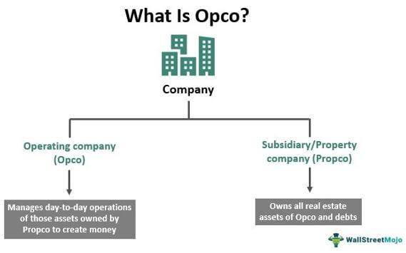

Real estate, Propco (Property Company), and algorithmic trading are multifaceted components that increasingly shape the modern financial landscape. Real estate refers to the tangible property consisting of land and any structures attached to it, such as buildings or houses. It plays a crucial role in the economic framework as a significant contributor to wealth generation and an asset class in investment portfolios. Property companies, or Propcos, are entities focused on managing, developing, and investing in real estate assets. They enable efficient allocation of resources within real estate markets by specializing in property acquisition, development, management, and leasing.

Algorithmic trading, on the other hand, is the process of using computer algorithms to execute trades in financial markets. This technique leverages mathematical models, statistical analysis, and advanced computing power to make trading decisions with precision and speed. Algorithmic trading has revolutionized the financial markets by enhancing the efficiency of executing trades and providing a competitive edge through data-driven strategies.



In today’s financial climate, the interconnectedness of property management and advanced trading techniques is becoming increasingly apparent. Propcos are exploring the use of algorithmic trading to optimize their financial performance and decision-making processes. By integrating sophisticated trading algorithms, these companies aim to enhance their investment strategies, mitigate risks, and improve returns.

The purpose of this article is to explore the intersection of real estate Propco companies and algorithmic trading. It aims to shed light on how Propcos can leverage algorithmic trading to navigate the complexities of real estate investment in a rapidly evolving market. The article will provide insights into the advantages and challenges of integrating these two domains, offering a comprehensive analysis of how technological innovation can redefine property management and investment practices. As real estate continues to intersect with cutting-edge trading technologies, understanding this dynamic relationship becomes essential for financial success and growth in the sector.

## Table of Contents

## Understanding Propco in Real Estate

A Propco, short for Property Company, is a business entity established specifically for the ownership and management of real estate assets. Propcos are often structured to hold property assets separately from operational business units, known as Opco (Operating Company), which handle other business activities. This separation enables companies to manage real estate investments with greater flexibility and strategic focus.

One of the primary advantages of utilizing a Propco structure in real estate is the segregation of property assets from other business operations. This structural distinction provides several benefits:

1. **Financial Clarity and Separation:** By housing real estate assets within a Propco, businesses can achieve clearer financial records and asset allocation. This separation often makes it easier for investors and management to evaluate the performance of real estate independently from the rest of the company's operations.

2. **Tax Incentives:** Propcos may benefit from various tax advantages, depending on jurisdictional policies. For instance, certain regions provide tax incentives for income generated from real estate investments. Companies may also benefit from capital allowances on the depreciation of property values over time.

3. **Risk Management:** The Propco-Opco structure is an effective risk management tool. By isolating property assets from business operations, companies can shield themselves from potential operational downturns or legal actions targeting the operational aspect of the business.

4. **Access to Financing:** Propcos can directly access investment markets and secure loans using their real estate assets as collateral. This direct access often translates into favorable financing conditions, benefiting from the typically low-risk profile associated with real estate.

5. **Strategic Asset Management:** The Propco model allows for more focused and strategic management of real estate portfolios. Propcos can operate exclusively under a mandate to optimize the value and returns of real estate assets, freeing operational units (Opcos) to concentrate on core business functions.

An illustrative example of Propco and Opco operations can be seen in the hospitality industry. A hotel chain might establish a Propco to own its properties while the Opco manages the day-to-day operations of hotel services. This structure enables the company to present a strong asset base in its financials while the Opco focuses on customer service and operational efficiency.

In conclusion, the establishment of a Propco confers multiple financial advantages, notably tax incentives, better risk management, and enhanced strategic oversight over property assets. When aligned with an Opco, the duo achieves a synergy that optimizes both the operational and asset-driven facets of business enterprises.

## Algorithmic Trading: An Overview

Algorithmic trading refers to the use of computer algorithms to automate the process of executing trades in financial markets. This method leverages mathematical models and complex formulas to decide the timing, price, and quantity of asset purchases and sales. Its significance in financial markets is underscored by its ability to conduct transactions at speeds and frequencies that are beyond the capabilities of human traders.

Algorithmic trading strategies are developed by combining quantitative models with trading signals derived from market data, news, and economic reports. These strategies typically undergo rigorous [backtesting](/wiki/backtesting) against historical data to evaluate their effectiveness and refine their reliability before implementation. Python, due to its extensive libraries such as NumPy and pandas, is a common tool for developing and backtesting trading algorithms. A basic example of a trading algorithm in Python would involve fetching financial data and using predefined conditions to place buy or sell orders as follows:

```python
import pandas as pd
import numpy as np

# Fetch financial data (a hypothetical function)
data = fetch_financial_data('AAPL')

# Define a simple moving average strategy
data['SMA_20'] = data['Close'].rolling(window=20).mean()
data['Signal'] = np.where(data['Close'] > data['SMA_20'], 1, 0)
data['Position'] = data['Signal'].diff()

# Simulate trades
buy_signals = data[data['Position'] == 1]
sell_signals = data[data['Position'] == -1]

print(f"Buy signals:\n{buy_signals[['Close', 'Position']]}\n")
print(f"Sell signals:\n{sell_signals[['Close', 'Position']]}\n")
```

Technologies involved in [algorithmic trading](/wiki/algorithmic-trading) encompass high-speed internet connections, sophisticated servers, and access to financial exchanges. Additionally, data analytics play a pivotal role as they allow traders to make data-driven decisions, optimize their strategies, and refine risk management practices. Tools such as [machine learning](/wiki/machine-learning) and statistical analysis are employed to identify patterns and insights from vast datasets.

The advantages of using algorithmic trading include increased speed, heightened accuracy, and improved efficiency. Automated systems can process complex calculations in milliseconds, significantly faster than any human intervention could achieve. This rapid execution helps in capturing profit opportunities which fleeting changes in market conditions produce. Furthermore, the precision of algorithms minimizes human error in trading decisions and enhances consistency by sticking to predefined rules without the influence of emotion or cognitive biases. Efficiency is further amplified by the system's ability to operate continuously without the need for breaks, unlike human traders who are susceptible to fatigue.

In summary, algorithmic trading represents a technological advancement that extends the capabilities of traditional trading methods by incorporating speed, accuracy, and scalability into financial transactions. Its integration into trading operations continues to grow, driven by ongoing improvements in computing power, analytical methods, and market connectivity.

## The Intersection of Propco and Algorithmic Trading

In recent years, Propco companies have begun to explore the potential of algorithmic trading to enhance their financial performance and optimize property investments. Algorithmic trading, which utilizes complex algorithms and vast datasets to execute trades at high speeds, offers significant advantages for Propco firms seeking to streamline their investment strategies and maximize returns.

By integrating algorithmic trading, Propco companies can leverage advanced data analytics to predict real estate trends more accurately. Algorithms can evaluate multiple variables, such as market demand, pricing dynamics, and historical data, enabling firms to make informed investment decisions. For example, a Propco might employ an algorithm that analyzes time-series data of real estate prices and interest rates to forecast future property valuations. This predictive capability allows Propcos to identify lucrative investment opportunities and avoid potential pitfalls.

Furthermore, the use of algorithmic trading in property management introduces a level of risk mitigation previously unattainable. Traditional property investments often lack the agility to respond quickly to market changes. In contrast, algorithmic systems can swiftly adjust investment portfolios in response to evolving market conditions, thereby reducing exposure to [volatility](/wiki/volatility-trading-strategies). This dynamic approach ensures that Propco firms remain adaptable and resilient in fluctuating market environments.

Empirical evidence of successful integration can be observed in several case studies. For instance, some real estate investment trusts (REITs), functioning as Propcos, have adopted algorithmic trading to manage their property portfolios more effectively. These firms have reported improved yield optimization by using algorithms to dynamically rebalance their investments, focusing on high-growth regions while divesting from underperforming assets.

One practical application of this technological synergy is the utilization of machine learning models in algorithmic trading strategies. These models analyze large datasets to detect patterns and predict market movements, thus enabling Propcos to preemptively adjust their holdings. The following Python example demonstrates a simple algorithm that could form the basis of such a strategy:

```python
import pandas as pd
from sklearn.ensemble import RandomForestRegressor

# Load real estate data
data = pd.read_csv('real_estate_data.csv')

# Prepare the data for machine learning
features = data.drop('price', axis=1)
target = data['price']

# Train the model
model = RandomForestRegressor(n_estimators=100, random_state=42)
model.fit(features, target)

# Predict future market trends
future_data = pd.read_csv('future_trend_data.csv')
predicted_prices = model.predict(future_data)

print(predicted_prices)
```

This integration of algorithmic trading and advanced analytics allows Propcos to enhance their returns while managing risks more effectively. Adopting such innovative approaches positions these firms to capitalize on market opportunities, thereby securing a competitive edge. As the real estate and financial industries continue to evolve, the strategic utilization of algorithmic trading within Propco operations is likely to become increasingly prevalent, reshaping how property investments are managed.

## Challenges and Considerations

Integrating algorithmic trading within Propco operations presents a range of challenges that businesses must address to harness the full potential of this innovative synergy. One of the primary concerns lies in aligning the integration with existing regulatory frameworks and ensuring robust risk management protocols. Algorithmic trading is subject to stringent regulatory requirements to maintain market integrity and prevent manipulation. Propcos must navigate these regulations, ensuring their algorithms comply with financial standards such as the Markets in Financial Instruments Directive II (MiFID II) in Europe or the Securities and Exchange Commission (SEC) mandates in the United States. Compliance involves developing algorithms that are transparent, auditable, and capable of adapting to unforeseen market changes.

Risk management is another core component. The volatility inherent in financial markets can present significant risks, especially when algorithms are used to make real-time trading decisions. Propcos need to implement advanced risk management strategies, such as dynamic hedging and stress testing, to mitigate these risks. Moreover, they must consider the [liquidity](/wiki/liquidity-risk-premium) risks associated with real estate assets, which are traditionally less liquid compared to other financial instruments.

Technical and financial barriers also play a critical role. Establishing a robust technology infrastructure is essential for supporting high-frequency trades and processing large volumes of data in real-time. This necessitates a substantial upfront investment in technology and skilled personnel, posing a financial challenge for some Propcos. Additionally, the integration demands seamless interoperability between Propco legacy systems and modern algorithmic trading platforms, which can be technically complex and resource-intensive.

Data security and privacy represent further considerations. The successful fusion of Propco operations with algorithmic trading relies heavily on data-driven insights, encompassing both historical and real-time market data. Ensuring the confidentiality, integrity, and availability of this data is paramount. Propcos must implement comprehensive cybersecurity measures to protect sensitive financial and customer information from breaches and cyberattacks. Additionally, adherence to data protection regulations like the General Data Protection Regulation (GDPR) in Europe is crucial to safeguarding privacy and maintaining trust.

In summary, while the integration of algorithmic trading into Propco operations offers promising benefits, it requires careful navigation of regulatory, risk management, technical, financial, and data security challenges. Addressing these issues is key to unlocking the potential of this intersection and achieving enhanced financial performance within the real estate sector.

## Future Trends and Opportunities

The integration of real estate Propco operations and algorithmic trading is poised to transform the industry, driven by several emerging trends. One prominent trend is the increasing role of Artificial Intelligence (AI) and Machine Learning (ML) in enhancing decision-making processes. These technologies enable the analysis of vast datasets to identify patterns, forecast market movements, and optimize trading strategies. For instance, ML algorithms can process historical property data, economic indicators, and even social media sentiment to predict property value trends, aiding Propcos in making informed investment decisions.

The utilization of advanced trading technologies opens up new market opportunities for Propco companies. With the application of algorithmic trading, Propcos can access more dynamic and liquid markets, allowing for quicker and more efficient adjustments to their real estate portfolios. By leveraging high-speed trading algorithms, Propcos can exploit short-term market fluctuations to maximize returns or hedge against potential risks. This agility in reaction time is crucial for capitalizing on transient opportunities that may arise in the real estate market.

Looking forward, the evolution of the Propco-algo trading relationship will likely feature increased integration of AI-driven analytics and blockchain technology. AI can automate the continuous monitoring of market conditions and asset performance, thus enabling Propcos to maintain optimal portfolio configurations with minimal manual intervention. Blockchain, on the other hand, promises increased transparency and security in transactions, reducing the risk of fraud and enhancing trust in digital real estate trading platforms.

As these technologies mature, Propcos may further benefit from real-time data analytics and personalized investment strategies, tailored to the unique characteristics of their property portfolios. Such advancements might also foster the development of new financial instruments, such as real estate derivatives, specifically designed for automated trading environments. This innovation-rich landscape will likely encourage Propco entities to adopt a more proactive and technologically sophisticated approach in their operations, potentially redefining competitive standards within the real estate sector.

## Conclusion

In summarizing the exploration of Propco companies and algorithmic trading, it is evident that the synthesis of real estate management with advanced trading techniques offers substantial benefits. Propcos, which are specialized entities focusing on the ownership and management of real estate assets, can significantly enhance their operational efficiency and profitability by integrating algorithmic trading. Algorithmic trading, defined by its reliance on sophisticated algorithms and data analytics for decision-making, improves the speed, accuracy, and efficiency of investment strategies. This integration allows Propcos to optimize their financial performance, predict real estate trends, and make informed decisions, thereby mitigating risks and enhancing returns.

The importance of technological innovation in reshaping traditional real estate management practices cannot be overstated. As the market environment grows increasingly competitive, businesses must leverage modern solutions like algorithmic trading to maintain and enhance their competitive edge. This technological adoption not only paves the way for improved risk management and financial gains but also positions enterprises to swiftly respond to market changes.

Businesses are encouraged to consider adopting algorithmic trading as part of their strategic framework. The potential to streamline operations, capitalize on market opportunities, and achieve superior financial outcomes represents a compelling case for integration. Moreover, the continuous evolution of technology offers a promising avenue for further enhancements in real estate management practices.

Readers are invited to explore further research and opportunities in this dynamic field. As Artificial Intelligence and Machine Learning increasingly influence algorithmic trading strategies, there lies an untapped potential for growth and innovation in the intersection between Propco operations and advanced trading systems. Embracing these advancements offers a pathway to future-ready real estate management, opening new market possibilities and propelling the industry towards a technologically-augmented future.

## References & Further Reading

[1]: ["Advances in Financial Machine Learning"](https://www.amazon.com/Advances-Financial-Machine-Learning-Marcos/dp/1119482089) by Marcos Lopez de Prado

[2]: ["Quantitative Trading: How to Build Your Own Algorithmic Trading Business"](https://www.amazon.com/Quantitative-Trading-Build-Algorithmic-Business/dp/1119800064) by Ernest P. Chan

[3]: ["Machine Learning for Algorithmic Trading: Predictive Models to Extract Signals from Market and Alternative Data for Systematic Trading Strategies with Python"](https://www.amazon.com/Machine-Learning-Algorithmic-Trading-alternative/dp/1839217715) by Stefan Jansen

[4]: Aronson, D. (2006). ["Evidence-Based Technical Analysis: Applying the Scientific Method and Statistical Inference to Trading Signals."](https://www.amazon.com/Evidence-Based-Technical-Analysis-Scientific-Statistical/dp/0470008741) John Wiley & Sons.

[5]: Chincarini, L. B., & Kim, D. (2006). ["Quantitative Equity Portfolio Management: An Active Approach to Portfolio Construction and Management."](https://archive.org/details/quantitativeequi0000chin_c9d6) McGraw-Hill. 

[6]: Bergstra, J., Bardenet, R., Bengio, Y., & Kégl, B. (2011). ["Algorithms for Hyper-Parameter Optimization."](https://dl.acm.org/doi/10.5555/2986459.2986743) Advances in Neural Information Processing Systems 24.

[7]: ["The Econometrics of Financial Markets"](https://press.princeton.edu/books/hardcover/9780691043012/the-econometrics-of-financial-markets) by John Y. Campbell, Andrew W. Lo, and A. Craig MacKinlay