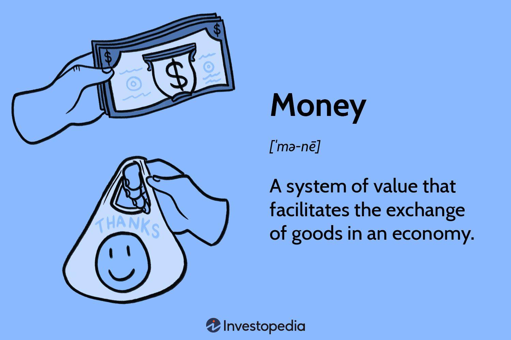

Money is a foundational element within the financial ecosystem, serving not just as a tool for transactions but also as a measure of value and a store of wealth. By facilitating trade, money effectively lubricates the wheels of an economy, influencing both macroeconomic stability and individual financial decisions. The properties of money—such as fungibility, durability, portability, recognizability, and stability—collectively enhance its utility in economic exchanges. These traits ensure that money remains universally accepted and reliable over time, thus underlining its pivotal role in economic growth and stability.

Various forms of money have evolved over time, each reflecting the technological and economic advancements of their respective eras. Market-determined money, government-issued currency, fiat currency, and emerging forms like cryptocurrencies each play unique roles in modern economies. Although diverse, all these forms of money share core attributes that enable them to act as efficient media of exchange.



Algorithmic trading represents a significant innovation in financial markets, presenting a convergence of finance and advanced technology. Automation and algorithmic strategies now dominate an increasing share of trading activities, driven by their ability to execute trades with speed, precision, and efficiency. This innovation reflects a shift towards more data-driven decision-making processes in trading, with algorithms capable of analyzing large volumes of data to identify lucrative opportunities across multiple markets.

By providing comprehensive insights into the properties and applications of money alongside the transformative nature of algorithmic trading, this article seeks to offer a deeper understanding of these interconnected elements within modern financial systems. It aims to elucidate how the foundational concept of money continues to evolve alongside technological innovations, shaping the future landscape of global finance.

## Table of Contents

## Understanding Money: Its Properties and Types

Money serves as a cornerstone in modern economies, essentially functioning as a system of value that enables transactions, savings, and investments across societies. Its utility and effectiveness are primarily attributed to five core properties: fungibility, durability, portability, recognizability, and stability. 

**Fungibility** ensures that one unit or piece of money is equivalent to another of the same denomination, thereby facilitating simple and fair transactions. This property is foundational for any monetary system, as it allows for interchangeability without a loss in value or utility. 

**Durability** refers to money's capacity to withstand physical wear and tear during its use. An ideal monetary unit maintains its form and usability over time, minimizing the need for continual reproduction or replacement. This attribute is crucial for maintaining trust and efficiency in everyday financial exchanges.

**Portability** is the ease with which money can be transported and transferred between parties. In economies ranging from ancient to modern, the portability of money enhances its function as an effective tool for economic exchange, allowing individuals and businesses to engage in commerce across distances without undue burden.

**Recognizability** is about how easily money can be authenticated and identified. For a currency to be trusted and widely accepted, it must have distinct features that can be verified without elaborate processes. Recognizability helps prevent fraud and ensures smooth transactions.

**Stability** is perhaps the most complex property, encapsulating both the internal stability of a currency (resistant to counterfeiting or fluctuations in its perceived value) and its external stability (purchasing power against other goods and currencies). Stability maintains economic confidence, reducing the uncertainty in transactions and investments.

Over time, different types of money have emerged, beginning with market-determined items such as gold and silver, which carried intrinsic value due to their scarcity and social demand. Government-issued currencies evolved as states established control over monetary systems, leading to the development of **fiat currency**—money that has value primarily through government decree rather than intrinsic worth. This form of money is dominant today, with its value underwritten by the trust and legitimacy of the issuing authority.

Apart from traditional currency, **money substitutes** like checks or promissory notes serve as temporary stand-ins, representing an agreement to pay the equivalent value in currency at a future date. More recently, **cryptocurrencies** have gained prominence, offering decentralized digital alternatives to government-issued money. Cryptocurrencies are typically based on blockchain technology, offering secure, transparent, and efficient peer-to-peer transactions.

The historical evolution of money reflects shifts in economic development, technological advancements, and societal needs. From barter systems to metallic coins, paper notes to digital currencies, each transformation has brought unique impacts on economic interactions and growth. These changes underscore the adaptive nature of money as a dynamic component of economic systems, continually reshaped by the requirements of trade, regulation, and innovation.

## Uses of Money in an Economy

Money plays a crucial role in an economy by serving as a medium of exchange, a store of value, and a unit of account. As a medium of exchange, money simplifies the process of buying and selling goods and services, replacing barter systems that required a double coincidence of wants—a situation where each party has what the other desires. This functionality significantly reduces transaction costs, enhancing economic efficiency and allowing market participants to engage in trade more freely and extensively.

As a unit of account, money provides a standard measure for pricing economic goods and services, making it a fundamental component in understanding economic performance. This measuring capacity helps businesses set prices and consumers make informed purchasing decisions. Additionally, this role enables accurate accounting and financial reporting, essential for both microeconomic decision-making and macroeconomic policy formulation. 

Money's function as a store of value allows individuals to preserve their wealth over time. This property is vital for facilitating savings and investment, enabling individuals and businesses to defer consumption or spending until a later date while maintaining value. Economists often describe the store of value function using the time value of money concept, where future worth is calculated using this formula:

$$
FV = PV \times (1 + r)^n
$$

where $FV$ is the future value, $PV$ is the present value, $r$ is the interest rate, and $n$ is the number of periods.

Moreover, money is integral to deferred payments and credit systems, which are vital for modern economies as they enable borrowing and lending pivotal for personal, corporate, and governmental financial management. Credit systems rely on money's ability to act as a unit of account and a medium of exchange in future transactions, fostering capital allocation and supporting financial markets.

The significance of money in measuring economic growth and stability cannot be overstated. Gross Domestic Product (GDP) calculations, for instance, are expressed in monetary terms and provide insights into economic health and productivity. Accurate currency values are crucial for these assessments, aiding policymakers in crafting fiscal and monetary policies aimed at economic stability and growth. Data such as inflation rates, interest rates, and currency exchange rates, all expressed in monetary terms, offer further insights into economic stability and are pivotal in making informed policy and business decisions.

In conclusion, the uses of money in an economy are multifaceted and indispensable. As economies continue to evolve with technological advancements and increased complexity, the foundational roles of money remain central, underpinning modern economic systems and facilitating sustainable growth.

## Algorithmic Trading: Transforming Financial Markets

Algorithmic trading, often referred to as algo trading, represents a significant advancement in financial markets, leveraging computer algorithms to automate trading activities. This approach has become increasingly influential due to its ability to enhance trading strategies by delivering increased speed, precision, and efficiency in executing trades.

### Advantages of Algorithmic Trading

The primary advantage of [algorithmic trading](/wiki/algorithmic-trading) is the speed at which trades can be executed. Unlike manual trading, where human reactions and decision-making can introduce delays, computer algorithms process market data and execute orders in milliseconds or even microseconds. This rapid execution allows traders to take advantage of fleeting market opportunities that would be impossible to exploit manually.

Precision is another significant benefit of algorithmic trading. Algorithms are capable of executing trades at specified criteria without deviation, reducing the likelihood of human error. This precision ensures that trades are executed under optimal conditions as defined by specific trading strategies.

Additionally, efficiency is achieved as algorithms can continuously monitor multiple markets and execute trades based on pre-defined criteria 24/7, without fatigue. This operational efficiency not only reduces transaction costs but also optimizes trading outcomes by adhering strictly to the trader's strategy.

### Key Components for a Successful Algorithmic Trading System

To establish a proficient algorithmic trading system, traders need to integrate several key components:

1. **Data Feeds**: Accurate and real-time data feeds are crucial for analyzing market conditions and making informed trading decisions. These data feeds provide the system with essential information such as price quotes, volume, and market news.

2. **Market Access**: Reliable connectivity to financial markets is essential to execute trades swiftly and seamlessly. This includes having the necessary broker connections and trading platforms that can handle high-frequency trade execution.

3. **Risk Management**: Effective risk management frameworks are critical to safeguard against market volatility and unexpected losses. This includes setting stop-loss limits, utilizing hedging strategies, and employing position sizing techniques to manage exposure.

### Popular Strategies and Their Implementation Using Python

Two popular algorithmic trading strategies are [trend following](/wiki/trend-following) and mean reversion, both of which can be implemented using Python due to its extensive libraries and ease of use.

1. **Trend Following**: This strategy involves identifying the direction of the market trend and executing trades that align with this trend. A simple implementation in Python might involve using the `pandas` and `numpy` libraries to calculate moving averages:

   ```python
   import pandas as pd
   import numpy as np

   # Calculate moving averages
   data['SMA50'] = data['Close'].rolling(window=50).mean()
   data['SMA200'] = data['Close'].rolling(window=200).mean()

   # Generate signals
   data['Signal'] = np.where(data['SMA50'] > data['SMA200'], 1, 0)
   ```

2. **Mean Reversion**: This strategy is based on the assumption that asset prices will revert to their historical mean over time. The implementation can use statistical methods to identify overbought or oversold conditions:

   ```python
   # Calculate Z-Score for mean reversion
   mean = data['Close'].rolling(window=20).mean()
   std = data['Close'].rolling(window=20).std()
   data['Z-Score'] = (data['Close'] - mean) / std

   # Generate signals
   data['Signal'] = np.where(data['Z-Score'] > 1, -1, np.where(data['Z-Score'] < -1, 1, 0))
   ```

Algorithmic trading continues to transform financial markets by providing sophisticated tools and strategies to maximize trading efficiency. By leveraging technology to automate decision-making processes, algorithmic trading not only enhances profitability but also ensures a level of consistency and reliability unattainable through manual efforts.

## Interrelationship Between Money and Algorithmic Trading

Algorithmic trading has transformed the landscape of currency and Forex markets by providing tools for executing trades with speed and precision. It involves using computer algorithms to automate trading decisions based on pre-defined criteria, allowing traders to capitalize on market movements with minimal human intervention.

Currency value fluctuations are intrinsic to Forex markets and are influenced by factors such as interest rates, inflation, political stability, and economic performance. These fluctuations present both challenges and opportunities for traders. Algorithmic trading systems are equipped to analyze vast amounts of data in real-time, identifying patterns and trends that may not be immediately apparent to human traders. By doing so, they can execute trades at optimal times, taking advantage of short-lived price movements that arise from currency fluctuations.

The implementation of algorithmic trading in currency markets requires sophisticated systems that incorporate data feeds, market access protocols, and risk management strategies. These systems must be capable of processing high-frequency data and executing trades across multiple exchanges and time zones. Effective risk management is crucial, as it helps protect against adverse market movements and ensures that algorithms adhere to set parameters.

Key algorithms employed in currency trading include trend-following and mean-reversion strategies. Trend-following algorithms are designed to identify and capitalize on sustained movements in currency prices, while mean-reversion strategies exploit temporary price deviations by betting on a return to an average price level. Here is a simple example of a mean-reversion strategy implemented in Python:

```python
import pandas as pd
import numpy as np

# Example of a simple mean-reversion strategy
def mean_reversion_strategy(data, window=20, threshold=0.01):
    # Calculate moving average and standard deviation
    rolling_mean = data['price'].rolling(window=window).mean()
    rolling_std = data['price'].rolling(window=window).std()

    # Signal generation
    buy_signal = data['price'] < (rolling_mean - threshold * rolling_std)
    sell_signal = data['price'] > (rolling_mean + threshold * rolling_std)

    return buy_signal, sell_signal

# Sample usage with dummy data
data = pd.DataFrame({'price': np.random.rand(100)})
buy_signal, sell_signal = mean_reversion_strategy(data)
```

While algorithmic trading offers significant advantages, it also poses challenges. Market dynamics can shift rapidly, necessitating continual updates to algorithms to ensure their continued effectiveness. The complexity of currency markets, driven by geopolitical events and macroeconomic indicators, can result in unexpected outcomes that algorithms must be resilient against.

Moreover, regulatory and ethical considerations must be addressed. Algorithmic trading can lead to market manipulation if not regulated properly, raising concerns about transparency and fairness. Establishing robust frameworks and guidelines is essential for mitigating these risks and ensuring that algorithmic trading contributes positively to market stability and efficiency.

In summary, the integration of algorithmic trading into currency markets enhances the ability to manage trading complexities and uncover opportunities through data-driven strategies. However, the volatile nature of currency markets and the growing sophistication of algorithms necessitate cautious implementation and comprehensive oversight to navigate the intricate balance between innovation and regulation effectively.

## Future Trends and Ethical Considerations

The integration of [machine learning](/wiki/machine-learning) (ML) and [artificial intelligence](/wiki/ai-artificial-intelligence) (AI) in algorithmic trading is transforming the landscape of financial markets. These advanced technologies offer unprecedented capabilities to analyze vast datasets, identify patterns, and execute trades with enhanced precision and speed. ML algorithms can learn from historical data to predict price movements, while AI can adapt to changing market conditions, providing dynamic and adaptive trading strategies.

However, the incorporation of these technologies also presents significant challenges. One key issue is overfitting, where a model performs well on historical data but fails to generalize to new, unseen data. This can lead to substantial financial losses if not properly managed. Additionally, computational complexity and increased demand for processing power can pose practical limitations for deploying ML and AI models in high-frequency trading environments.

Ethical considerations are paramount as advanced technologies become more prevalent in trading. The potential for market manipulation through the misuse of algorithms is a significant concern. Automated systems could be programmed to execute trades that distort market prices or [liquidity](/wiki/liquidity-risk-premium), leading to instability. Furthermore, transparency in algorithmic trading is critical, as opaque systems can erode trust among market participants and regulators.

The regulatory landscape must adapt to address these ethical issues effectively. Regulators face the challenge of balancing innovation with the need to mitigate risks associated with algorithmic trading. Comprehensive regulatory frameworks are necessary to ensure that trading practices remain fair and transparent, preventing abuse while fostering technological advancement. Additionally, there are calls for implementing circuit breakers or kill switches in algorithmic trading systems to halt trading in the event of extreme [volatility](/wiki/volatility-trading-strategies) or malfunctions.

For sustainable market growth, it is crucial to maintain a balance between innovation and regulation. Implementing robust risk management practices, enhancing model validation techniques, and ensuring regulatory compliance can help mitigate potential downsides. As the financial industry continues to evolve, collaboration between technology developers, traders, and regulators will be essential to harness the benefits of machine learning and AI while safeguarding market integrity.

## Conclusion

The interconnectedness of money, currency, and algorithmic trading plays a critical role in shaping modern finance. Money, in its various forms, acts as a fundamental pillar supporting economic activities by serving as a medium of exchange, a store of value, and a unit of account. Understanding these properties allows for more effective and informed financial decision-making. As economies evolve, currency dynamics increasingly influence global economic stability and growth, highlighting the need for a nuanced comprehension of its impacts.

Algorithmic trading has emerged as a transformative force in financial markets, enabling unprecedented speed, precision, and efficiency in executing trades. This innovation optimizes trading strategies and enhances market liquidity, illustrating the symbiotic relationship between technological advancement and financial practice. Recognizing the interplay between algorithmic trading and currency markets is essential for navigating the complexities of contemporary finance, as currency value fluctuations can significantly impact trading strategies and outcomes.

The continuous adaptation to technological advancements and adherence to ethical standards are imperative for sustaining long-term growth and stability in financial markets. As technologies such as machine learning and artificial intelligence further integrate into trading systems, they present both opportunities and challenges. Ensuring transparency, minimizing risks of market manipulation, and navigating regulatory landscapes are crucial to fostering an ethical framework within which innovation can thrive.

In conclusion, a holistic understanding of the roles and relationships between money, currency, and algorithmic trading is indispensable for thriving in the modern financial ecosystem. As the industry continues to evolve, it is essential to embrace technological progress while upholding ethical considerations. By doing so, we can shape a future that balances innovation with sustainability, paving the way for a resilient and dynamic financial landscape.

## References & Further Reading

[1]: Bergstra, J., Bardenet, R., Bengio, Y., & Kégl, B. (2011). ["Algorithms for Hyper-Parameter Optimization."](https://dl.acm.org/doi/10.5555/2986459.2986743) Advances in Neural Information Processing Systems 24.

[2]: ["Advances in Financial Machine Learning"](https://www.amazon.com/Advances-Financial-Machine-Learning-Marcos/dp/1119482089) by Marcos Lopez de Prado

[3]: ["Evidence-Based Technical Analysis: Applying the Scientific Method and Statistical Inference to Trading Signals"](https://www.amazon.com/Evidence-Based-Technical-Analysis-Scientific-Statistical/dp/0470008741) by David Aronson

[4]: ["Machine Learning for Algorithmic Trading"](https://github.com/stefan-jansen/machine-learning-for-trading) by Stefan Jansen

[5]: ["Quantitative Trading: How to Build Your Own Algorithmic Trading Business"](https://www.amazon.com/Quantitative-Trading-Build-Algorithmic-Business/dp/1119800064) by Ernest P. Chan