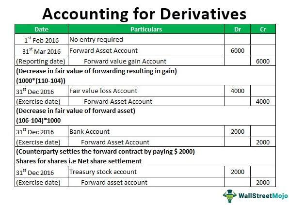

The integration of financial instruments with real estate markets is transforming the investment landscape, offering new and sophisticated avenues for financial engagement. Property derivatives and algorithmic (algo) trading stand at the forefront of this transformation, representing both innovation and opportunity in how real estate investments are approached and managed.

Property derivatives are financial tools linked to real estate indices that allow investors to gain exposure to the real estate market without the need to own physical properties. This type of financial instrument has enabled investors to hedge risks or speculate on real estate price movements flexibly and dynamically. As these derivatives derive their value from indices like the National Council of Real Estate Investment Fiduciaries Property Index (NPI), they provide a mechanism for capitalizing on the performance of real estate markets while minimizing direct exposure to the complexities of owning and managing physical assets.

In tandem with property derivatives, the application of algorithmic trading to real estate markets has provided novel methods for maximizing investment returns. Algorithmic trading, which involves the use of computer programs to execute trades at optimal conditions based on pre-set criteria, offers a sophisticated, data-driven approach to navigating the real estate market's complexities. This includes leveraging the timely execution of trades to capitalize on market inefficiencies and fluctuations more effectively than manual trading strategies could achieve.

The synergy between property derivatives and algo trading is transforming real estate investments and trading strategies. It is redefining how investors approach the market by combining the hedging capabilities and flexibility of derivatives with the precision and efficiency of algorithms. However, with these opportunities come challenges, including the volatility of real estate markets and the risks inherent in algorithm-driven strategies. Understanding and leveraging these financial instruments require a strategic approach, taking into account the accompanying risks and potential regulatory constraints.

The article will further explore these innovative tools, examining how they are reshaping the landscape of real estate investment and what investors need to consider to utilize them effectively.

## Table of Contents

## Understanding Property Derivatives

Property derivatives are sophisticated financial instruments that are intrinsically linked to the values of real estate assets or indices. Unlike traditional real estate investments, these derivatives allow investors to gain exposure to real estate markets without the necessity of owning tangible properties. This feature makes them an attractive tool for investors seeking flexibility, liquidity, and risk management within the real estate sector.

The value of property derivatives is closely tied to real estate indices, such as the National Council of Real Estate Investment Fiduciaries Property Index (NPI). These indices reflect the performance of a broad set of real estate assets, providing a benchmark for derivative pricing. By utilizing these indices, investors can track market performance and use derivatives to hedge against potential downturns or capitalize on expected price movements within the real estate markets.

Property derivatives function in a manner similar to other types of derivatives, such as options or futures. They provide a mechanism for investors to either hedge their existing real estate exposure or speculate on the future direction of real estate prices. For instance, an investor anticipating a decline in property values might use a property derivative to protect against potential losses in their real estate portfolio. Conversely, an investor expecting an upswing in the market might leverage derivatives to benefit from rising values without direct acquisition of property.

These derivatives serve various roles within the real estate market. Primarily, they offer a means for managing risk associated with real estate investments. By hedging, investors can stabilize returns and protect against adverse market fluctuations. Additionally, property derivatives can be used for speculative purposes, allowing investors to take positions on anticipated market movements, potentially yielding significant returns.

In summary, property derivatives are pivotal in modern real estate finance, providing innovative pathways for investment and risk management. They not only offer exposure to real estate markets but also play a crucial role in enhancing market efficiency and [liquidity](/wiki/liquidity-risk-premium) through diversified investment strategies. As the real estate market continues to evolve, the utilization of property derivatives is set to expand, offering new opportunities for both institutional and individual investors.

## Mechanics of Property Derivatives

Property derivatives are intricate financial instruments that provide investors with a means to gain exposure to real estate markets without directly owning physical properties. These derivatives are structured around several key components, including the underlying real estate indices, swaps, and strategic positions that allow for both long and short market operations.

At their core, property derivatives are typically linked to a real estate index, such as the National Council of Real Estate Investment Fiduciaries Property Index (NPI). The value of these derivatives is determined by fluctuations in the underlying index, reflecting the broader movement of real estate market values. This linkage to an index allows investors to align their investments with overall market trends, minimizing the need for substantial capital normally required for direct property acquisitions.

One of the primary mechanisms by which property derivatives reduce capital requirements is through the use of swaps, particularly total return swaps. A total return swap is a contractual agreement where one party makes payments based on a set rate, usually a floating [interest rate](/wiki/interest-rate-trading-strategies), while the other party makes payments based on the total return of a real estate index or assets, including both income and capital gains. This arrangement allows investors to benefit from the performance of real estate assets without the initial outlay involved in purchasing properties. 

The ability to go long or short in real estate markets is another crucial feature of property derivatives. Going long on a property derivative means that an investor is optimistic about future price increases in the real estate market and thus stands to benefit from such appreciation. Conversely, going short allows investors to profit from declines in real estate market prices, providing a hedging tool against market downturns. This flexibility enhances investment strategies by creating opportunities for profit in various market conditions.

Indices play a pivotal role in determining the value of property derivatives. These indices serve as benchmarks that reflect the performance of a specific segment of the real estate market. By using indices, property derivatives facilitate the tracking and assessment of market movements, allowing for informed decision-making based on reliable and standardized data. Investors and traders rely on these indices to gauge market trends, adjust their positions, and optimize their portfolio allocations.

In summary, property derivatives offer a sophisticated mechanism for engaging in the real estate market, providing avenues for investment that bypass the high capital demands and logistical complexities of physical property ownership. Through structured financial instruments like swaps and the strategic use of market positions, these derivatives provide enhanced flexibility and risk management opportunities, making them a valuable component of modern investment portfolios.

## Algo Trading in Real Estate Markets

Algorithmic trading, commonly known as algo trading, represents the use of computer algorithms to automate and optimize trading decisions in financial markets. This approach applies extensively in stock and commodities markets, and is now increasingly relevant in real estate investing, particularly through property derivatives. Algo trading allows investors to execute orders at scale with precision, leveraging real-time data to potentially maximize returns.

In the context of real estate markets, algo trading can be employed to enhance the performance of property derivatives. By using sophisticated algorithms to analyze vast datasets, traders can identify profitable opportunities much quicker than manual methods would allow. These algorithms can consider various factors such as market trends, interest rates, and real estate indices, enabling traders to make data-driven decisions that align with their investment strategies.

The primary advantage of employing algorithms in real estate investing is the ability to handle complex data inputs and outputs. Algo trading can process multiple variables simultaneously – from housing supply metrics to economic indicators, thus providing a comprehensive view of the market landscape. By integrating [machine learning](/wiki/machine-learning) algorithms, the system can continuously improve its predictions based on new data, adjusting investment strategies as necessary. This data-driven approach minimizes human error and biases, making investment decisions more objective and potentially more profitable.

One popular application of algo trading in real estate is through prediction models for property price movements. For instance, algorithms can model the correlation between macroeconomic factors and real estate indices to predict future trends. These models utilize statistical techniques and historical data to forecast the market direction. For example, a simple linear regression model may predict changes in real estate indices based on indicators like GDP growth or interest rate fluctuations:
$$
\text{Price Change} = \beta_0 + \beta_1 \times \text{GDP Growth} + \beta_2 \times \text{Interest Rate} + \varepsilon
$$

Complex algorithmic models specific to real estate derivatives could involve machine learning techniques like neural networks or support vector machines, which manage non-linear relationships and interactions between variables. These models analyze high-dimensional datasets to detect patterns not immediately obvious through traditional models.

Furthermore, the speed and efficiency provided by algo trading allow investors to capitalize on [arbitrage](/wiki/arbitrage) opportunities in property derivatives markets. Algorithms can execute trades in milliseconds, exploiting price discrepancies across different platforms or geographical markets that might be unavailable to human traders due to time constraints.

While algo trading poses enormous benefits, it also comes with its challenges – particularly in the real estate sector, where data can be less liquid compared to equities. Real estate markets are subject to unique local characteristics and varying data quality, making algorithm development and implementation more complex. Consequently, investors must ensure robust risk management processes are in place, integrating algorithms within a broader investment framework to handle uncertainties and volatile market conditions effectively.

In conclusion, algo trading offers a revolutionary approach to navigate the complexities of real estate markets. Through leveraging technology and data analysis, traders can enhance their decision-making processes, potentially boosting returns and optimizing investment strategies related to property derivatives. As this field evolves, continued innovation in algorithms will likely drive further integration of technology within real estate investing strategies.

## Benefits and Risks of Property Derivatives and Algo Trading

Property derivatives and [algorithmic trading](/wiki/algorithmic-trading) play crucial roles in shaping modern real estate investment strategies by offering diversification benefits and enhanced risk management. Property derivatives, as financial instruments tied to real estate indices, allow investors to hedge against price fluctuations and achieve broad market exposure without owning physical properties. They enable diversification across various real estate sectors and geographical locations, thereby reducing idiosyncratic risk.

Algorithmic trading, or algo trading, improves decision-making and timing in real estate investments by automating trading processes and leveraging sophisticated data analysis. Algorithms can process vast amounts of market data swiftly, identify patterns, and execute trades at optimal times, often faster and with greater precision than human traders. This ability to quickly adapt to market changes potentially increases returns and mitigates risks associated with delayed decision-making.

However, the use of property derivatives and algo trading is not without risks. Market [volatility](/wiki/volatility-trading-strategies) poses a significant challenge, as rapid fluctuations in real estate indices can affect the value of property derivatives. Moreover, algorithmic discrepancies, such as coding errors or model inaccuracies, can lead to unintended trading outcomes. It's essential to regularly review and test algorithms to ensure they function as intended across various market conditions.

Regulatory considerations also play a vital role in the use of these financial instruments. Both property derivatives and algo trading are subject to evolving regulations aimed at protecting market integrity and preventing systemic risks. Market participants must remain informed about changes in legislation and compliance requirements to avoid potential legal pitfalls.

To mitigate these risks, investors can adopt several strategies. Diversification across different property sectors and markets can reduce overall exposure to specific market downturns. Additionally, stress testing algorithms against various market scenarios can help identify and rectify potential weaknesses. Implementing robust risk management systems, which include regular monitoring and adjustment of trading strategies, can further enhance the stability and effectiveness of investments in property derivatives and algo trading.

## Future Prospects and Conclusion

The integration of property derivatives and algorithmic trading (algo trading) is set to continue transforming the real estate investment landscape. As financial markets evolve, these tools provide investors with innovative means to access real estate exposure, hedge risks, and optimize trading strategies without the direct ownership of physical properties.

Property derivatives are becoming increasingly integrated into global financial markets due to their ability to offer indirect exposure to real estate assets. These financial products are built on indices that track real estate market performance, allowing for greater market participation without the traditional capital requirements associated with physical property investments. As the understanding and application of property derivatives grow, it's expected that their acceptance and utilization will expand across both developed and emerging markets.

Algo trading in real estate markets presents significant opportunities for advancements in efficiency and accuracy. Innovations in data analytics and machine learning are facilitating more sophisticated algorithmic models that can predict market trends and execute trades at optimal times, maximizing returns. For instance, algorithms that analyze historical property price movements and macroeconomic indicators can provide insights that are far more nuanced and timely than traditional methods.

The synergy between property derivatives and algo trading opens up numerous possibilities for modern investors. These instruments reduce the dependency on physical property transactions, allowing investors to navigate market fluctuations with greater agility. Additionally, they offer diversified investment strategies that can be tailored to specific risk appetites and investment horizons.

However, the integration of these instruments is not without challenges. As markets remain volatile, the reliance on complex algorithms necessitates robust risk management frameworks. The potential for algorithmic discrepancies and market anomalies requires investors to remain vigilant and adaptable. Furthermore, regulatory frameworks will need to evolve to address the unique characteristics and risks associated with these innovative financial instruments.

In conclusion, property derivatives and algo trading are poised to significantly reshape real estate investing. They offer new avenues for diversification, risk management, and strategic investment that transcend traditional real estate transactions. As technological advancements continue to enhance these tools, investors can expect an ever-expanding array of opportunities to leverage in the pursuit of optimized real estate investment portfolios. Embracing these innovations, while grounding them in sound traditional investment practices, will likely define the future of real estate finance.

## References & Further Reading

[1]: Geltner, D., Miller, N. G., Clayton, J., & Eichholtz, P. (2014). ["Commercial Real Estate Analysis and Investments."](https://www.researchgate.net/publication/245702364_Commercial_Real_Estate_Analysis_and_Investments) OnCourse Learning.

[2]: Fabozzi, F. J. (Ed.). (2005). ["The Handbook of Mortgage-Backed Securities."](https://academic.oup.com/book/7943) McGraw-Hill.

[3]: Naldi, M., & Flamini, M. (2014). ["A Review of Algorithmic Trading."](https://papers.ssrn.com/sol3/papers.cfm?abstract_id=2448656) Journal of Finance and Economics, 2(5), 165-178.

[4]: Shiller, R. J. (2015). ["Irrational Exuberance: Revised and Expanded Third Edition."](https://www.jstor.org/stable/j.ctt1287kz5) Princeton University Press.

[5]: Poon, M. W., & Brzeszczyński, J. (2016). ["The Impact of Derivatives on Financial Crises."](https://journals.sagepub.com/doi/abs/10.2190/T3FB-V3XE-L057-1WM3) Routledge.