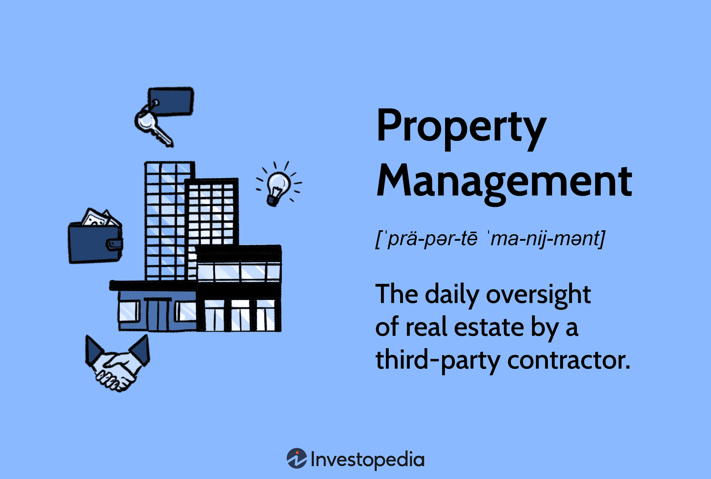

The interconnected world of real estate property management and algorithmic trading represents a transformative fusion of traditional industry practices with cutting-edge technological advancements. This article explores the fundamental roles in property management, detailing the various types and duties involved. Additionally, it investigates into the impact of algorithmic trading within real estate, highlighting how this quantitative approach is reshaping investment strategies.

Property management serves as the backbone of real estate operations, ensuring that residential, commercial, and industrial properties are effectively maintained and financially productive. Responsibilities such as maintenance, tenant management, and rent collection play critical roles in preserving property value while ensuring a stable income stream for property owners. The integration of technology in property management processes is vital, offering tools for streamlined operations, enhanced tenant experiences, and more efficient financial management.

Algorithmic trading, a sophisticated process leveraging computer algorithms to execute trades based on pre-set criteria, finds a unique application within the real estate sector. By automating trading decisions and predicting market trends, algorithmic trading offers significant advantages, such as improved accuracy, efficiency, and speed in financial transactions. The convergence of algorithmic trading and real estate signals major shifts in how investments are assessed and managed, offering opportunities for greater data-driven insights and optimizing return on investment.

This article emphasizes the transformative impact of technology on the real estate sector. Innovations such as artificial intelligence, big data, and blockchain are enhancing traditional property management practices and introducing new paradigms in real estate investment. As the industry continues to evolve, understanding these technological influences is crucial for stakeholders aiming to navigate the complexities of the modern real estate market effectively.

Through this examination, we aim to provide a comprehensive understanding of both the foundational elements of property management and the revolutionary impact of algorithmic trading in real estate. The content underscores the importance of embracing technology, both for optimizing property management and redefining trading strategies, while offering insights into the future landscape of real estate investments.

## Table of Contents

## Understanding Property Management

Property management is a crucial component in the administration of real estate assets, encompassing residential, commercial, and industrial properties. It involves overseeing the daily operations, maintenance, and overall management of these properties to ensure they are preserved and optimized for income generation. The primary objective is to maintain the property’s functionality and appeal while ensuring that it continues to generate revenue for the property owners.

In residential property management, duties include routine maintenance such as plumbing and electrical repairs, landscaping, and general upkeep to ensure the property remains safe and habitable for tenants. Tenant management is another essential role, which involves screening potential renters, handling lease agreements, and addressing tenant concerns and complaints. Rent collection is a primary financial task, requiring the systematic collection of monthly payments, dealing with late payments, and initiating eviction procedures if necessary.

Commercial property management involves similar responsibilities but often on a larger and more complex scale. Managers must coordinate maintenance and repairs while accommodating business tenants whose operational needs may vary significantly. They are tasked with lease negotiations, ensuring compliance with local business codes, and managing common areas shared by multiple tenants.

Industrial property management adds dimensions such as the logistics of managing very large spaces, sometimes with specialized infrastructure. This includes oversight of facilities such as distribution centers or manufacturing plants, focusing on cleanliness, safety regulations, and often intricate lease agreements that tie rent to business production metrics.

Maintaining property value is essential for property managers, who must strategize to balance short-term income with long-term asset preservation. They achieve this by implementing preventive maintenance programs, investing in property upgrades, and conducting regular market assessments to adjust rental rates appropriately. The equation for net operating income, $\text{NOI} = \text{Gross Rental Income} - \text{Operating Expenses}$, illustrates the need to maximize rental income while controlling expenses, thus ensuring sustainable growth and profitability.

Effective property management requires a mix of technical, legal, and interpersonal skills. Property managers must navigate the complexities of real estate laws, tenant rights, and property regulations. They are required to make informed decisions that align with economic trends while meeting the specific needs of property owners and tenants. They often face challenges such as balancing budget constraints with necessary maintenance, fluctuating occupancy rates, and evolving market conditions.

Overall, effective property management involves integrating these diverse roles and responsibilities to uphold property standards, enhance value, and secure ongoing income generation, serving the interests of owners and tenants alike.

## Roles and Responsibilities in Property Management

Property management encompasses a range of responsibilities crucial for the efficient and profitable operation of real estate assets. Property managers act as intermediaries between property owners and tenants, ensuring that properties are maintained, leases are properly managed, and local legal requirements are met.

Lease management is a fundamental responsibility of property managers. It involves drafting lease agreements, negotiating terms with tenants, and ensuring timely rent collection. Effective lease management maximizes occupancy rates and rental income, while minimizing tenant turnover and vacancies. Property managers often employ software solutions to track lease expirations and manage renewals efficiently.

Maintenance and repairs constitute another critical duty. Property managers schedule routine inspections to identify and address maintenance issues promptly, thus preserving property value and ensuring tenant satisfaction. They coordinate with contractors for repairs, manage maintenance budgets, and prioritize tasks to balance cost and urgency.

Compliance with local laws is essential to avoid legal disputes and potential penalties. Property managers must stay informed about zoning laws, health and safety regulations, and landlord-tenant laws. Regular updates and training help ensure that properties remain compliant over time.

Property managers oversee various types of real estate, including residential, commercial, and sometimes industrial properties. Residential properties comprise single-family homes, apartments, and condominiums, where the focus is on tenant relations and community upkeep. In contrast, commercial properties, such as office buildings and retail spaces, demand a greater emphasis on lease negotiations and facility management due to the involvement of businesses as tenants. Industrial properties, which include warehouses and manufacturing plants, require specialized knowledge of logistics and safety standards.

Successful property management demands a diverse skill set. Effective communication and negotiation skills are crucial for dealing with tenants, owners, and contractors. Financial acumen is necessary for budget management, financial reporting, and maximizing property returns. Problem-solving skills help managers address unexpected issues, while organizational abilities ensure the smooth operation of property tasks.

Common challenges in property management include managing tenant disputes, addressing unexpected maintenance emergencies, and keeping up with regulatory changes. Rising property management technology, such as property management software and analytics tools, can alleviate some of these challenges by streamlining operations and providing data insights.

Overall, mastering these roles and responsibilities enables property managers to protect the interests of property owners, enhance tenant satisfaction, and ensure successful property operations.

## Algorithmic Trading in Real Estate

Algorithmic trading, commonly associated with the financial markets, refers to the use of computer programs to execute trading decisions based on pre-defined criteria. These algorithms analyze vast amounts of data and identify trading opportunities at speeds and accuracies unattainable by human traders. In the real estate sector, [algorithmic trading](/wiki/algorithmic-trading) is beginning to gain traction as a tool for optimizing investment strategies and maximizing returns.

The application of algorithmic trading in real estate primarily involves automated systems developed to assess property markets much like they do with stocks or commodities. These systems can parse through numerous data sets, including historical prices, economic indicators, and demographic trends, to predict future real estate market movements. Algorithms can also analyze factors such as property location dynamics, zoning laws, and [interest rate](/wiki/interest-rate-trading-strategies) fluctuations to suggest profitable investment opportunities.

A critical feature of these algorithms is their ability to automate trading decisions. For example, [machine learning](/wiki/machine-learning) algorithms can be trained on past property market data to forecast price appreciations or depreciations, allowing investors to buy or sell assets at optimal times. This automation helps eliminate emotional biases and human errors, fostering more reliable and systematic investment strategies.

However, integrating algorithmic trading into real estate comes with its set of benefits and challenges. One significant advantage is the efficiency gain. Transactions can be executed swiftly based on the algorithm’s recommendations, and continuous market monitoring becomes feasible without human intervention. This technological edge could be particularly beneficial in illiquid real estate markets, enabling more agile capital allocation.

Furthermore, the use of advanced predictive analytics through algorithms can enhance risk management. By simulating a variety of market scenarios, investors can better understand potential risks and devise strategies to mitigate them.

Despite these advantages, there are notable challenges. The complexity and initial costs associated with developing robust trading algorithms can be prohibitive. Real estate markets are also less transparent and standardized compared to financial markets, making data acquisition and integration more complex. Additionally, the reliance on historical data may not always account for unprecedented market shifts, posing predictive limitations.

Moreover, algorithmic trading in real estate raises regulatory and ethical concerns, particularly related to data privacy issues and the potential for market manipulation. As such, careful consideration and strategic planning are vital for successfully leveraging these algorithms within the sector.

In conclusion, while algorithmic trading holds substantial promise for transforming real estate investment, it necessitates careful implementation to navigate its inherent challenges effectively.

## Integrating Technology in Property Management and Trading

Advancements in technology, particularly [artificial intelligence](/wiki/ai-artificial-intelligence) (AI), big data, and blockchain, have profoundly influenced property management and trading systems within the real estate sector. These innovations have enabled more efficient operations, enhanced decision-making processes, and provided new opportunities for investment and growth.

AI has become an integral component in real estate, offering capabilities such as predictive analytics and pattern recognition. These AI applications facilitate smarter property searches, optimize pricing strategies, and improve customer service through chatbots and virtual assistants. For instance, AI-driven algorithms can analyze substantial datasets to predict market trends and identify investment opportunities that might not be apparent through traditional analysis methods.

Big data analytics further enhance the capabilities of AI by providing a vast amount of information that can be processed and analyzed. Property managers and investors utilize big data to understand market dynamics better and make informed decisions. By exploring datasets that include demographics, consumer preferences, and market conditions, stakeholders can tailor their strategies to match current market demands accurately.

Blockchain technology also plays a transformative role in real estate. Known for its decentralized and secure nature, blockchain ensures transparency and security in transactions, which is particularly beneficial in property management and trading. Smart contracts, powered by blockchain, automate contract execution, ensuring transactions are efficient and free from potential fraud. This technology also aids in streamlining processes like property transfers, leasing, and transactions by providing a clear, immutable record.

Automated Valuation Models (AVMs) have revolutionized property valuation by using mathematical modeling to value properties based on comparable sales, current listings, and market trends. These models provide a quick and cost-effective method for assessing property value, making them valuable tools for both buyers and sellers. While traditional appraisals rely heavily on a physical inspection and subjective analysis, AVMs offer an objective, data-driven approach. The formula commonly used in AVMs is:

$$
\text{AVM Value} = \sum_{i=1}^n (w_i \times c_i)
$$

where $c_i$ represents the value of comparable property attributes, and $w_i$ denotes their respective weights based on relevance and reliability.

Fintech innovations also push the boundaries of property management and trading systems, modernizing operations through digital payment solutions, crowdfunding platforms, and real estate exchanges. These financial technologies facilitate easier access to real estate markets, allowing for increased participation from a broader range of investors. Online platforms have democratized real estate investing, enabling fractional ownership models that lower the barrier to entry for individual investors.

In conclusion, integrating advanced technologies such as AI, big data, and blockchain into property management and trading systems represents a significant shift toward more efficient, secure, and informed real estate operations. These technologies continue to reshape the industry, presenting both challenges and opportunities for stakeholders committed to adopting and harnessing these tools effectively.

## Strategic Implications and Opportunities

The integration of property management with algorithmic trading presents numerous strategic opportunities that could redefine the real estate industry. As digital transformation accelerates, property managers and investors increasingly leverage technologies to enhance operational efficiency, improve decision-making, and maximize returns.

Algorithmic trading in real estate involves the use of complex algorithms to analyze vast datasets, identify market trends, and automate trading decisions. When combined with property management, these algorithms can optimize property portfolios by predicting fluctuations in property values, identifying lucrative investment opportunities, and automating transactions to capitalize on favorable market conditions. This integration moves beyond traditional manual analysis and subjective decision-making, enabling data-driven strategies that enhance accuracy and speed.

Businesses that adapt to these advancements have a competitive edge. Adopting machine learning and artificial intelligence can refine property valuation models, improve tenant screening processes, and streamline maintenance workflows. Additionally, these technologies facilitate the development of Automated Valuation Models (AVMs), which provide accurate property assessments by analyzing variables like historical sales data, geographic trends, and economic indicators. Consequently, property managers can better forecast potential risks and returns, leading to more informed investment decisions.

Future trends suggest further integration of blockchain to ensure transparency and security in real estate transactions. Blockchain technology can simplify property sales by providing immutable records of property ownership and ensuring that transactions are carried out efficiently and securely. This evolution supports a more decentralized and democratized trading environment, reducing reliance on intermediaries and lowering transaction costs.

The societal impacts are equally profound. Enhanced efficiency in property management and trading could contribute to economic stability by optimizing property use and investment returns. It may also lead to more equitable access to real estate markets as reduced barriers and costs open opportunities for a broader range of investors.

As technology continues to develop, companies must remain agile, investing in digital infrastructure and skill development to stay ahead. Training personnel in data analytics, AI, and blockchain can facilitate smooth adaptation and exploitation of these innovations. The strategic alignment of property management and algorithmic trading, bolstered by technological advancements, promises a transformative era for the real estate sector.

## Conclusion

The integration of technology within the realms of real estate property management and algorithmic trading has ushered in a new era of efficiency and precision in investment strategies. As property management responsibilities remain crucial in maintaining the value of both residential and commercial properties, the deployment of technology has streamlined operations, enhanced tenant relations, and optimized financial outcomes. Automated tools now assist property managers with tasks such as lease management and maintenance scheduling, effectively reducing human error and freeing up time for more strategic initiatives.

Algorithmic trading has transformed real estate markets by employing complex algorithms to automate and execute trades with minimal human intervention. These algorithms analyze vast datasets to identify profitable opportunities, predict market trends, and mitigate risks. The synergy between property management and algorithmic trading creates a robust framework where data-driven decisions enhance overall real estate investment strategies.

Looking to the future, real estate investment strategies will increasingly rely on the continued advancement of technologies such as Artificial Intelligence (AI), machine learning, and blockchain. AI, in particular, is revolutionizing property valuation through Automated Valuation Models (AVMs) that provide more accurate pricing predictions. Blockchain promises improved transparency and security in transactions, further fostering trust among stakeholders.

The confluence of fintech advancements with property management and trading systems also opens new avenues for innovation. For instance, technology-enabled shared ownership models and real estate tokens could democratize asset ownership, making real estate investment more accessible to a broader audience. As technological adoption grows, industry players must remain agile, adapting to shifts in both consumer behavior and market conditions.

In conclusion, the ongoing technological evolution within real estate heralds significant opportunities for enhanced asset management and trading efficacy. Embracing these innovations is essential for stakeholders aiming to leverage the full potential of modern real estate investment strategies. As these technologies continue to evolve, their integration will not only reshape the landscape but also provide a competitive edge to those prepared to harness their capabilities.

## References & Further Reading

[1]: Bergstra, J., Bardenet, R., Bengio, Y., & Kégl, B. (2011). ["Algorithms for Hyper-Parameter Optimization."](https://papers.nips.cc/paper/4443-algorithms-for-hyper-parameter-optimization) Advances in Neural Information Processing Systems 24.

[2]: ["Advances in Financial Machine Learning"](https://www.amazon.com/Advances-Financial-Machine-Learning-Marcos/dp/1119482089) by Marcos Lopez de Prado

[3]: ["Evidence-Based Technical Analysis: Applying the Scientific Method and Statistical Inference to Trading Signals"](https://www.amazon.com/Evidence-Based-Technical-Analysis-Scientific-Statistical/dp/0470008741) by David Aronson

[4]: ["Machine Learning for Algorithmic Trading"](https://github.com/stefan-jansen/machine-learning-for-trading) by Stefan Jansen

[5]: ["Quantitative Trading: How to Build Your Own Algorithmic Trading Business"](https://www.amazon.com/Quantitative-Trading-Build-Algorithmic-Business/dp/1119800064) by Ernest P. Chan