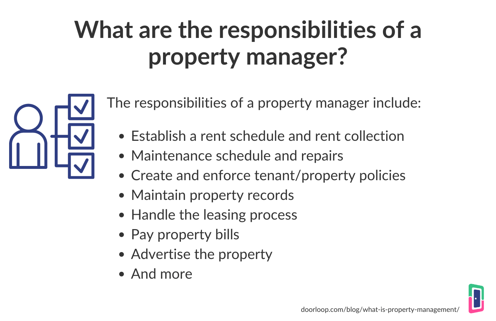

## Table of Contents

## What is a property manager and what do they do?

A property manager is a person who takes care of buildings or homes that someone else owns. They help make sure everything works well and that people who live or work there are happy. Their job includes finding new people to live in the homes or buildings, collecting rent from them, and making sure they follow the rules.

Property managers also fix things when they break, like leaky pipes or broken windows. They keep the place clean and safe. They talk to the owners about how things are going and what needs to be done. This helps the owners because they don't have to do all the work themselves.

## What are the basic responsibilities of a property manager?

A property manager looks after buildings or homes that belong to someone else. They find new people to live in these places and collect money from them every month. They make sure everyone follows the rules set by the owner. If someone doesn't pay or breaks the rules, the property manager talks to them and tries to fix the problem.

Property managers also take care of repairs and maintenance. If something breaks, like a window or a toilet, they get it fixed quickly. They keep the building clean and safe for everyone. They also talk to the owner about how things are going and what needs to be done to keep the place in good shape. This helps the owner because they don't have to do all the work themselves.

## How does a property manager handle tenant relations?

A property manager handles tenant relations by talking to them often. They listen to what tenants say about problems or things they need. If a tenant has a problem, like a broken sink, the property manager makes sure it gets fixed quickly. They also help tenants understand the rules they need to follow. If a tenant doesn't pay rent or breaks a rule, the property manager talks to them to solve the problem.

Property managers also work to keep tenants happy. They might organize events or send out newsletters to keep everyone informed and feeling part of a community. If a tenant wants to move out, the property manager helps them with the process and makes sure everything is done correctly. By being friendly and helpful, property managers help make living in the building a good experience for everyone.

## What legal considerations must a property manager be aware of?

A property manager needs to know about the laws that affect renting and managing buildings. They must follow rules about how to treat tenants fairly. This includes not discriminating against people because of their race, religion, or other personal characteristics. Property managers also need to know the rules about how much rent they can charge and how to handle security deposits. If they don't follow these rules, they could get in trouble and might have to pay money or face other penalties.

Another important legal consideration is understanding lease agreements. Property managers need to make sure that the lease is clear and fair to both the owner and the tenant. They must know how to handle evictions if a tenant doesn't pay rent or breaks the rules. They also need to be aware of tenant privacy laws, which means they can't enter a tenant's home without permission except in emergencies or with proper notice. Keeping up with these legal requirements helps property managers avoid problems and keep good relationships with tenants and owners.

## How does a property manager maintain and repair properties?

A property manager takes care of fixing things that break in the buildings or homes they manage. If a tenant tells them about a problem, like a leaky faucet or a broken window, the property manager quickly finds someone to fix it. They keep a list of good repair people who can come and do the work. Sometimes, they might need to check the building often to make sure everything is working well and fix small problems before they get big.

Property managers also make sure the building stays clean and safe. They might hire people to clean the common areas, like hallways and laundry rooms. They check that things like fire alarms and smoke detectors are working. If something needs to be replaced, like a roof or a heater, the property manager talks to the owner about the cost and gets it done. By doing these things, they help keep the building in good shape for everyone who lives there.

## What financial management tasks does a property manager perform?

A property manager takes care of the money for the buildings they manage. They collect rent from tenants every month. If a tenant is late with their rent, the property manager talks to them and tries to get the money. They keep track of all the money coming in and make sure it gets to the owner. They also have to follow the rules about how much rent they can charge and how to handle security deposits.

Property managers also pay the bills for the building. This includes things like water, electricity, and repairs. They keep track of all these costs and make a budget to plan for future expenses. If something big needs to be fixed, like a new roof, they talk to the owner about how much it will cost and how to pay for it. By managing the money well, they help the owner make sure the building stays in good shape and makes money.

## How does a property manager market and lease properties?

A property manager helps find new people to live in the homes or buildings they take care of. They do this by telling people about the place. They might put ads online or in newspapers, or use signs to let people know the home is empty and ready for someone to move in. They also talk to other people who might know someone looking for a place to live. When someone is interested, the property manager shows them the home and tells them about it.

Once someone wants to rent the home, the property manager helps them fill out the paperwork. They check if the person can pay the rent and if they will follow the rules. They make sure the lease, which is like a contract, is clear and fair. After everything is agreed on, they collect the first month's rent and any security deposit. By doing these things, the property manager helps fill the home with good tenants who will take care of it.

## What are the best practices for property inspections and maintenance schedules?

A property manager should do regular checks on the buildings they take care of. They should walk through the building every month to look for problems like leaks, broken windows, or anything that needs fixing. It's good to keep a list of what they find and fix things quickly. They should also check things like fire alarms and smoke detectors to make sure they work. By doing these checks often, they can stop small problems from becoming big ones.

For bigger things like roofs or heating systems, the property manager should make a plan for when to check and fix them. They might need to look at the roof every year and the heating system every few years. They should keep track of when these big checks happen and plan for the costs. Talking to the owner about these plans helps make sure there's enough money to keep the building in good shape. By following these schedules, the property manager helps keep the building safe and comfortable for everyone who lives there.

## How can a property manager effectively manage multiple properties?

A property manager can manage multiple properties by using a good system to keep track of everything. They use a computer program to remember when rent is due, when to do checks, and when to fix things. This helps them know what needs to be done at each place without getting mixed up. They also make a plan for the week or month, so they know which properties to visit and what to do there. By staying organized, they can make sure all the buildings are taken care of well.

It's also important for a property manager to have good people to help them. They might hire other workers to do repairs or clean the buildings. They can also use a company that does these things for them. Talking to the owners of the properties regularly helps too. They can tell the owners what's going on and get advice on what to do next. By working with a good team and staying in touch with owners, a property manager can take care of many properties at the same time.

## What advanced strategies can a property manager use to increase property value?

A property manager can increase the value of a property by making it more attractive to people who might want to live or work there. They can do this by keeping the building in great shape, fixing things quickly, and making sure it's clean and safe. They might also add new things that people like, such as a gym or a nice garden. By doing these things, more people will want to live in the building, which means the owner can charge more rent. When the building looks good and has nice things, it's worth more money.

Another way to increase property value is by managing the money well. A property manager can save money by planning ahead for big repairs and making a budget. They can also find ways to make more money, like renting out extra space for storage or adding fees for things like parking. By keeping the building full of happy tenants and making sure the money is handled well, the property manager can help make the building more valuable. This makes the owner happy and helps the property manager do a good job.

## How does a property manager stay updated with industry trends and regulations?

A property manager can stay updated with industry trends and regulations by reading news and articles about real estate. They can join groups or go to meetings where other property managers talk about what's new. There are also websites and newsletters that tell them about changes in the law and new ideas for managing properties. By keeping up with these things, a property manager can do their job better and help their owners make more money.

It's also important for a property manager to take classes or get certifications. These can teach them about new rules and how to handle different situations. They might need to learn about new technology that can help them manage properties better. By always learning and staying informed, a property manager can make sure they are doing everything right and keeping up with the latest in their field.

## What are the challenges and solutions in managing properties in different regions or countries?

Managing properties in different regions or countries can be hard because each place has its own rules and ways of doing things. A property manager needs to know the laws about renting and fixing things in each area. They also have to understand what people in different places want in a home or building. Language can be a problem too, because the manager might need to talk to people who speak different languages. Time zones can make it hard to talk to everyone at the right time.

To solve these problems, a property manager can hire people who know the local rules and speak the local language. They can use technology like video calls and emails to talk to people in different time zones. It's also helpful to learn about the culture and what people want in each area. By working with local experts and using technology, a property manager can take care of properties in many places and make sure everyone is happy.

## How can algorithmic tools be integrated into property management?

Property management has increasingly turned to algorithmic tools to enhance operational efficiencies and improve decision-making processes. These algorithms excel at optimizing various property management tasks such as rent pricing, maintenance scheduling, and tenant communications, drawing parallels to their transformative role in financial markets.

### Rent Pricing Optimization

One of the primary applications of algorithms in property management is dynamic rent pricing. By leveraging historical data and predictive analytics, algorithms can help property managers set rental rates that maximize occupancy and revenue. Similar to financial markets where models assess stock prices, rent algorithms might employ linear regression or more advanced [machine learning](/wiki/machine-learning) models to analyze factors like market trends, seasonality, competitor pricing, and local demand. For example, a simple linear regression model to predict rent could be expressed as follows:

$$
\text{Rent\_Price} = \beta_0 + \beta_1 \cdot \text{Local\_Demand} + \beta_2 \cdot \text{Competitor\_Price} + \epsilon
$$

where $\beta_0$, $\beta_1$, and $\beta_2$ are coefficients determined from data, and $\epsilon$ is the error term.

### Maintenance Scheduling

Algorithms also enhance maintenance scheduling by predicting maintenance needs and preventing costly breakdowns. Predictive maintenance algorithms, using IoT sensors and historical maintenance data, can identify patterns indicative of potential equipment failures. For instance, a Python-based implementation might utilize libraries such as Pandas for data manipulation and scikit-learn for machine learning, helping property managers transition from reactive to proactive maintenance strategies.

```python
import pandas as pd
from sklearn.ensemble import RandomForestClassifier

# Example dataset
data = pd.read_csv('maintenance_data.csv')
X = data[['equipment_age', 'usage_hours', 'previous_failures']]
y = data['maintenance_required']

# RandomForest model for predictive maintenance
model = RandomForestClassifier()
model.fit(X, y)

# Predicting maintenance needs
predictions = model.predict([[2, 1500, 1]])
```

### Tenant Communications

Algorithmic tools can streamline tenant communications, improving engagement and satisfaction rates. Chatbots and AI-driven platforms handle routine inquiries and maintenance requests, freeing up property managers for more complex issues. Natural language processing (NLP) models analyze tenant sentiment, providing insights into tenant satisfaction and areas requiring improvement. By automating responses and tracking tenant interactions, these tools enhance the communication process significantly.

### Competitive Advantages

The integration of algorithmic tools provides data-driven insights that can be leveraged for strategic advantages, such as increasing tenant retention and minimizing costs. Like [algorithmic trading](/wiki/algorithmic-trading) in financial markets, which optimizes transaction strategies based on quantitative data, algorithms in property management offer precision and timeliness. They allow for proactive adjustments in operations, ultimately leading to enhanced profitability and performance.

As property management firms continue to adopt these technologies, the industry witnesses increased alignment with other tech-forward sectors, using data as a pivotal asset to drive innovations and efficiencies. These methodologies, supported by both historical insights and predictive analyses, fortify property managers' abilities to adapt to market dynamics effectively.

## References & Further Reading

[1]: Kotler, P., Bowen, J. T., & Makens, J. C. (2013). ["Marketing for Hospitality and Tourism."](https://www.pearsonhighered.com/assets/preface/0/1/3/5/0135209846.pdf) Pearson.

[2]: Reinartz, W., & Kumar, V. (2000). ["On the Profitability of Long-Life Customers in a Noncontractual Setting: An Empirical Investigation and Implications for Marketing."](https://www.jstor.org/stable/3203475) Journal of Marketing, 64(4), 17-35.

[3]: Wolverton, M., & Wolverton, M. L. (1996). ["Analyzing Tenants' Needs in Market Studies and Feasibility Analyses."](https://scholar.google.com/citations?user=OKOQCYYAAAAJ&hl=en) The Appraisal Journal.

[4]: Florance, A. (2020). ["Leveraging Technology to Reimagine Real Estate."](https://www.raymondjames.com/florence-branch/commentary-and-insights/2024/10/29/how-corporate-executives-are-leveraging-ai) Applied Finance Letters.

[5]: Tasoffs, R. (2021). ["Automating Property Management: How AI and Algorithms are Reshaping Real Estate Operations."](https://www.doorloop.com/blog/ai-applications-in-real-estate-property-management) Real Estate Finance.