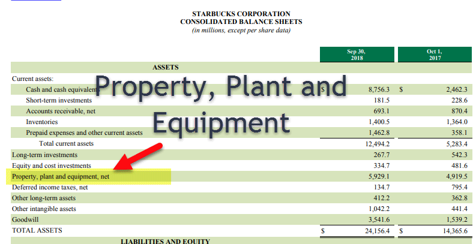

The intersection of fixed assets, Property, Plant, and Equipment (PP&E), capital investment, and algorithmic trading makes a dynamic confluence of fields spanning finance, investment, and technology. Each element on its own plays a pivotal role in the financial landscape, yet their combined synergies offer even greater potential for businesses and investors.

Fixed assets and PP&E are tangible and enduring assets that serve as the backbone of any business operation. They include facilities, machinery, and vehicles, and appear as noncurrent items on a company's balance sheet. These assets represent substantial financial commitments and reflect vital inputs for operational capacity and growth. The value assessment of PP&E is critical, often calculated as the sum of properties, plants, equipment, and capital expenditures, adjusted for accumulated depreciation.



Capital investment denotes the funds allocated by firms to acquire or maintain assets like PP&E, paramount for long-term business expansion and sustainability. This form of investment is intertwined with industries reliant on significant capital input, such as manufacturing or energy, involving hefty initial expenses expected to generate gradual, fruitful returns. 

On the technological front, algorithmic trading incorporates advanced computer programs to conduct trades with precision and speed unattainable by human traders. This modern finance tool uses vast swathes of data, including insights from PP&E investments, to optimize trading strategies. Capital investments in sophisticated technology infrastructures empower enhanced analytical models and algorithms, propelling the financial markets further into the tech-driven era.

In conclusion, recognizing the implications and synergies between fixed assets, PP&E, capital investments, and algorithmic trading is indispensable for investors, analysts, and financial professionals seeking to navigate today's complex economic landscape. By leveraging their interplay, stakeholders can devise strategies that align with technological advancements while solidifying foundational asset investments. Understanding these intricacies is fundamental to harnessing the full potential of these interconnected domains.

## Table of Contents

## Understanding Fixed Assets and PP&E

Fixed assets and Property, Plant, and Equipment (PP&E) are tangible long-term assets vital for the ongoing operations of a business. These assets are the backbone of a company's physical infrastructure and encompass items such as machinery, vehicles, buildings, and land. Often categorized as noncurrent assets on balance sheets, they represent resources that are not expected to be liquidated or turned into cash within a year.

**Components of Fixed Assets and PP&E**

1. **Machinery and Equipment**: Machinery refers to devices and equipment used in the manufacturing or production of products and services. These are integral to industry and production processes.

2. **Vehicles**: This category includes transport machinery used for business operations, such as delivery trucks and company cars.

3. **Buildings**: Structures such as office spaces, warehouses, and factories are categorized under buildings, essential for housing operations and production activities.

4. **Land**: Unlike most other fixed assets, land is not subject to depreciation. It forms the foundational platform for all physical operations.

**Significance on the Balance Sheet**

PP&E is a critical component displayed on a company’s balance sheet, representing substantial capital investments. It reflects a business's commitment to maintaining and expanding its physical operational capacity. This section provides insight into the long-term financial health of a company and its potential for sustaining growth.

**Valuation of PP&E**

The value of PP&E is calculated by taking the gross property, plant, equipment value, and capital expenditures, and subtracting the accumulated depreciation. This calculation reflects the net book value of tangible assets:

$$
\text{Net PP\&E} = \text{Gross PP\&E} - \text{Accumulated Depreciation}
$$

- **Gross PP&E** includes the total initial cost of acquiring assets.
- **Accumulated Depreciation** accounts for the reduction in value due to wear and tear, usage, or obsolescence over time.

The numerical valuation of PP&E helps analysts and investors assess a company's capacity to generate future economic benefits and its level of investment in sustaining its operational infrastructure.

Understanding the roles and measurement of fixed assets and PP&E enables stakeholders to evaluate the company's operational effectiveness and long-term financial strategies. It also aids in predicting future investments in physical infrastructure necessary for growth and competitiveness.

## The Role of PP&E and Fixed Assets in Capital Investments

Investments in Property, Plant, and Equipment (PP&E) alongside fixed assets are vital as they reflect a company's intention and capacity to enhance its operational capabilities. These investments are not only critical for the company’s ongoing operations but also signify its strategic direction in terms of growth and expansion. By allocating resources to PP&E, companies demonstrate a sustained commitment to increasing their production capabilities, improving efficiency, and, ultimately, ensuring their competitive edge within the industry.

Capital investments in PP&E are particularly pivotal for the long-term growth and competitiveness of businesses. These investments underpin the development of physical infrastructure necessary for production and service delivery, facilitating economies of scale that drive cost efficiencies. Businesses in capital-intensive industries like oil production, manufacturing, and telecommunications often allocate significant portions of their capital expenditure to PP&E. This allocation is necessary given the reliance on substantial physical infrastructure to support operations and maintain market presence.

The financial implications of PP&E investments are characterized by considerable upfront costs, as these assets often undergo prolonged acquisition and implementation processes. The expenditure required for purchasing, installing, and commissioning these assets is substantial. However, despite their initial cost, fixed assets are intended to produce returns over the medium to long term, a fundamental aspect of the capital investment strategy.

The return on investment (ROI) from PP&E typically manifests gradually over time through enhanced operational efficiency, increased production capacity, and improved quality of output, which collectively contribute to revenue growth and profitability. A simple formula to consider ROI can be expressed as:

$$
\text{ROI} = \frac{\text{Net Profit}}{\text{Total Investment}} \times 100
$$

In this context, calculating the ROI from PP&E investments requires understanding both the direct financial returns and the broader competitive advantages gained through enhanced capabilities and market positioning.

Ultimately, the strategic deployment of capital in fixed assets and PP&E serves as a bellwether for a company’s long-term strategic planning. It aids in positioning for future market trends, maintaining competitive positioning, and achieving growth targets. By recognizing the strategic importance of these investments, businesses can align their financial resources with operational objectives, thereby optimizing returns and fortifying their market standing over time.

## Algorithmic Trading and Capital Investment

Algorithmic trading utilizes advanced computer programs to execute trades at speeds and frequencies beyond the capabilities of human traders. This trading approach heavily depends on sophisticated technology, a type of capital investment crucial for creating practical models and trading algorithms.

Incorporating technology into trading activities allows for the development of complex analytical models that can process large volumes of market data to identify profitable trading opportunities. These models often employ statistical analysis, [machine learning](/wiki/machine-learning), and data science tools to evaluate historical and real-time data, enabling traders to make decisions based on quantitative analysis rather than intuition alone.

The influence of [algorithmic trading](/wiki/algorithmic-trading) on financial markets is profound. By automating trading strategies, algorithms can rapidly respond to market changes, optimize trade execution, and minimize the impact of human emotional biases. This results in increased [liquidity](/wiki/liquidity-risk-premium) and reduced transaction costs, benefiting both the markets and participants involved.

Furthermore, algorithmic trading leverages data derived from investments in property, plant, and equipment (PP&E). Data from these capital investments gives traders insights into a company's operational performance and future growth potential. For instance, a significant increase in a firm's PP&E might signal an expansion plan, which could influence stock price projections and inform trading strategies.

The relationship between capital investment and algorithmic trading is symbiotic. By bolstering trading infrastructures and analytical capabilities, capital investments in technology provide a competitive edge in today's fast-paced markets. As technology continues to advance, the reliance on algorithmic trading is expected to grow, making it essential for traders and investors to integrate these developments into their financial strategies.

## Synergies Between PP&E, Capital Investment, and Algorithmic Trading

The integration of Property, Plant, and Equipment (PP&E) data into algorithmic trading frameworks has opened new avenues for enhancing financial strategies. This synergy is underpinned by the strategic use of PP&E data to fine-tune the algorithms that govern trading activities. By leveraging this extensive pool of data, companies can discern patterns and insights previously obscured, thus improving the predictive accuracy of trading algorithms.

Capital investments in technology are critical to this process, as they bolster trading platforms and provide the computational power necessary to process vast datasets that include PP&E information. These investments enable the development and implementation of sophisticated models capable of executing high-frequency trades with precision, affording companies a notable competitive advantage.

Moreover, finding an optimal balance between tangible asset investments, such as PP&E, and the integration of advanced technological solutions is fundamental in crafting optimized financial strategies. By aligning PP&E investments with technology upgrades, businesses can maximize their operational efficiency while enhancing their market responsiveness.

Consider a practical scenario where an algorithmic trading firm uses Python to integrate PP&E data into its algorithm. The following Python snippet exemplifies how a firm might preprocess and incorporate PP&E data:

```python
import pandas as pd
from sklearn.preprocessing import MinMaxScaler

# Sample PP&E data
data = {'Year': [2019, 2020, 2021],
        'PP&E_investment': [1.5e6, 2.0e6, 2.5e6]}

df = pd.DataFrame(data)

# Scale the PP&E data
scaler = MinMaxScaler()
df['Scaled_PP&E'] = scaler.fit_transform(df[['PP&E_investment']])

# Display processed data
print(df)
```

In this example, the PP&E investment data is normalized using MinMaxScaler, making it suitable for inclusion in various algorithmic models. This approach illustrates how data handling techniques can facilitate the integration of tangible asset investments into broader trading strategies.

In conclusion, the alignment of PP&E data with capital investments in technology fosters a comprehensive strategy that leverages both financial and technological assets to optimize trading operations. As such, companies are positioned to navigate volatile markets more effectively, informed by a synergy of historical asset investments and cutting-edge algorithmic tools.

## Conclusion

Fixed assets and Property, Plant, and Equipment (PP&E) are fundamental components for assessing a company's financial health and its capacity for growth. These tangible assets provide the infrastructure necessary for a company's operational activities and form a significant part of the capital expenditures. Monitoring the state and value of these assets offers insights into the company's long-term financial commitments and capabilities in sustaining production and service levels. 

Integrating fixed assets and PP&E with capital investment strategies and algorithmic trading creates a robust framework for enhancing financial operations. Capital investment in fixed assets directly impacts a company's production capabilities and efficiencies, ultimately influencing its financial metrics like EBITDA (Earnings Before Interest, Taxes, Depreciation, and Amortization). On the other hand, algorithmic trading, characterized by executing large amounts of trades at high speed, benefits from data derived from capital assets to optimize trading strategies and improve profitability.

The synergy between these elements provides a comprehensive approach to safeguarding against market [volatility](/wiki/volatility-trading-strategies) and adapting to rapid technological advancements. For instance, investments in advanced analytics and algorithmic trading platforms enable companies to process real-time data more efficiently, leading to well-informed investment decisions and optimized asset management.

Given today's fast-paced and technology-driven financial markets, staying updated with the latest developments in fixed assets management and PP&E, alongside strategic capital investments and algorithmic trading techniques, is imperative. Investors and financial professionals equipped with this knowledge can leverage these tools to create resilient investment portfolios and capitalize on market opportunities. By understanding the intricate connections between these aspects, they can ensure sustainable growth and maintain a competitive edge.

## References & Further Reading

[1]: ["Advances in Financial Machine Learning"](https://books.google.com/books/about/Advances_in_Financial_Machine_Learning.html?id=oU9KDwAAQBAJ) by Marcos Lopez de Prado

[2]: ["Quantitative Trading: How to Build Your Own Algorithmic Trading Business"](https://www.amazon.com/Quantitative-Trading-Build-Algorithmic-Business/dp/1119800064) by Ernest P. Chan

[3]: ["Machine Learning for Algorithmic Trading"](https://github.com/stefan-jansen/machine-learning-for-trading) by Stefan Jansen

[4]: ["Evidence-Based Technical Analysis: Applying the Scientific Method and Statistical Inference to Trading Signals"](https://www.amazon.com/Evidence-Based-Technical-Analysis-Scientific-Statistical/dp/0470008741) by David Aronson

[5]: Bergstra, J., Bardenet, R., Bengio, Y., & Kégl, B. (2011). ["Algorithms for Hyper-Parameter Optimization."](https://dl.acm.org/doi/10.5555/2986459.2986743) Advances in Neural Information Processing Systems 24.