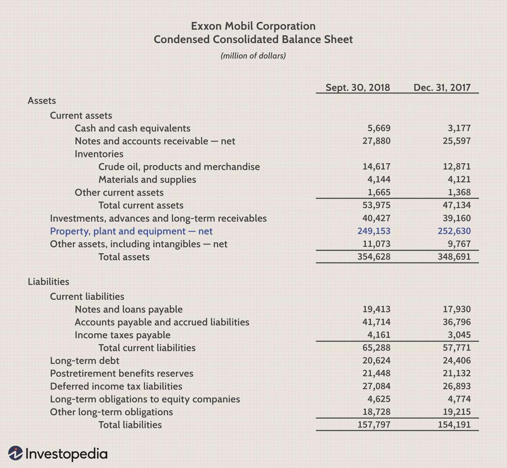

## Table of Contents

## What is Property, Plant, and Equipment (PP&E)?

Property, Plant, and Equipment (PP&E) are long-term assets that a business uses to make its products or provide its services. These assets include things like buildings, machinery, vehicles, and office equipment. They are important because they help a business operate and grow over time. PP&E are not sold to customers but are used in the day-to-day running of the business.

When a company buys PP&E, it records the cost as an asset on its balance sheet. Over time, these assets wear out or become outdated, so businesses need to account for this by recording depreciation. Depreciation spreads the cost of the asset over its useful life. This helps show a more accurate picture of the company's value and financial health. PP&E are crucial for understanding a company's long-term investment and operational capabilities.

## Why is PP&E important for a business?

PP&E is really important for a business because it helps the company do its work. Things like buildings, machines, and trucks are all part of PP&E. These items are not for sale but are used every day to make products or provide services. Without them, a business wouldn't be able to operate smoothly or grow. For example, a bakery needs ovens and mixers to bake cakes, and a delivery company needs trucks to move packages.

Another reason PP&E is important is that it shows how much a company is investing in its future. When a business buys new equipment or builds a new factory, it's making a big commitment to grow and improve. These investments are recorded on the company's balance sheet as assets. Over time, as these assets get older, the company records depreciation, which helps show a true picture of what the company owns and how it's doing financially. This is important for business owners, investors, and anyone else who wants to understand the company's health and potential.

## How is PP&E classified on a company's balance sheet?

On a company's balance sheet, PP&E is listed under the section called "Non-Current Assets" or "Long-Term Assets." This section shows all the big things a company owns that it plans to use for a long time, like buildings, machines, and vehicles. These items are important because they help the company make its products or provide its services.

The value of PP&E on the balance sheet starts with the cost of buying these items. But over time, these assets wear out or become outdated, so the company also shows how much they've depreciated. Depreciation is like spreading out the cost of the asset over the time it's useful. This helps give a more accurate picture of what the company really owns and how its value changes over time.

## What are the common types of assets included in PP&E?

PP&E includes many different types of assets that a business uses to do its work. Some common types are buildings, which can be factories, offices, or warehouses where the business operates. Another type is machinery, like the machines used in manufacturing or production. Vehicles are also part of PP&E, including trucks, cars, or delivery vans that help move goods or people.

Other common assets in PP&E are land, which is the ground where buildings sit or where a business might expand in the future. Office equipment, like computers, desks, and chairs, is also included because these items help employees do their jobs. Lastly, furniture and fixtures, such as shelves, counters, and lighting, are part of PP&E because they make the workplace functional and comfortable.

## How does a company acquire PP&E?

A company can acquire PP&E in a few different ways. The most common way is by buying it. When a business needs a new machine or a new building, it can pay for it with its own money or take out a loan. Sometimes, a company might also lease PP&E, which means they pay to use it for a certain amount of time without owning it outright. This can be helpful if the company doesn't want to spend a lot of money all at once.

Another way to get PP&E is through a merger or acquisition. If a company buys another company, it might get the other company's buildings, machines, and vehicles as part of the deal. Sometimes, PP&E can also be acquired through a trade or exchange. For example, a company might trade an old machine for a new one. No matter how it's acquired, PP&E is important because it helps the business do its work and grow.

## What is the process of depreciation for PP&E?

Depreciation is how a company spreads out the cost of its PP&E over time. When a business buys a big item like a machine or a building, it doesn't count the whole cost as an expense right away. Instead, it records the cost as an asset on the balance sheet. Then, over the years that the item is useful, the company slowly reduces the value of the asset on the books. This is called depreciation, and it helps show a more accurate picture of what the company really owns and how its value changes.

There are different ways to calculate depreciation, but one common method is called straight-line depreciation. With this method, the company figures out how long the asset will be useful, which is called its useful life. Then, it divides the cost of the asset by the number of years in its useful life. For example, if a machine costs $10,000 and is expected to last 10 years, the company would record a depreciation expense of $1,000 each year. This way, the cost of the machine is spread out evenly over the time it's being used.

## How do different depreciation methods affect PP&E?

Different depreciation methods can change how the value of PP&E is shown on a company's books. The straight-line method spreads the cost evenly over the asset's useful life. This makes the value of the asset go down by the same amount each year. It's simple and easy to understand, which is why many companies use it. But other methods, like the declining balance method, make the value go down faster in the early years and slower later on. This can be useful if an asset loses value quickly at first.

Another method is the units of production method, which bases depreciation on how much the asset is used. If a machine is used a lot one year, the depreciation expense will be higher that year. This method is good for assets whose wear and tear depends on how much they're used, not just how old they are. Each method affects the balance sheet and income statement differently, so companies choose the one that best matches how their assets actually lose value over time.

## What are the tax implications of PP&E?

When a company buys PP&E, it can affect its taxes. The cost of PP&E can be written off over time through depreciation, which reduces the company's taxable income. This means the company pays less in taxes each year as it claims depreciation expenses. Different countries have different rules about how much and how fast a company can depreciate its assets, so it's important for businesses to understand these rules to manage their taxes well.

Different depreciation methods can also change how much a company pays in taxes. For example, using an accelerated depreciation method like the declining balance method means more depreciation expense is claimed in the early years, which can lower taxes sooner. On the other hand, using the straight-line method spreads the tax benefits evenly over time. Companies need to think about their tax strategy when choosing a depreciation method because it can impact their cash flow and overall financial planning.

## How should a company manage and maintain its PP&E?

A company should take good care of its PP&E to make sure it lasts a long time and works well. This means doing regular check-ups and fixing things when they break. For example, if a machine starts making strange noises, the company should get it fixed right away instead of waiting until it stops working completely. Keeping a schedule for maintenance, like oiling machines or painting buildings, can help prevent big problems. It's also smart to keep track of how old each piece of PP&E is and plan for when it might need to be replaced.

Another important part of managing PP&E is keeping good records. This means writing down when each item was bought, how much it cost, and how it's being used. Good records help the company know when to claim depreciation on its taxes and make sure everything is accounted for correctly. It's also helpful to train employees on how to use the equipment properly so they don't break it. By taking care of PP&E and keeping good records, a company can make sure its big investments keep helping the business run smoothly.

## What are the key considerations for disposing of PP&E?

When a company decides to get rid of its PP&E, it needs to think about a few important things. First, it should figure out how much the item is worth now. This helps decide if it's better to sell it, trade it in, or just throw it away. The company also needs to think about any costs it might have to pay to get rid of the item, like fees for taking it to a dump or paying someone to take it away. It's also important to keep good records of the sale or disposal because this can affect the company's taxes and financial statements.

Another thing to consider is how getting rid of the PP&E will affect the business. If the item is still useful, selling or trading it could bring in money that the company can use for other things. But if the item is broken or outdated, it might be better to just get rid of it to make room for new equipment. The company should also think about how getting rid of the item will change its operations. For example, if a machine is sold, the company needs to make sure it has another way to do the work that machine was doing. Keeping all these things in mind helps the company make smart choices about disposing of its PP&E.

## How does PP&E impact financial ratios and analysis?

PP&E has a big impact on a company's financial ratios and analysis because it shows how much the company has invested in long-term assets. One important ratio that PP&E affects is the asset turnover ratio, which measures how well a company uses its assets to make money. If a company has a lot of PP&E, it might have a lower asset turnover ratio because it's using more of its money to buy big things instead of making quick sales. But if the company uses its PP&E well, it can still have a good asset turnover ratio. Another ratio that PP&E affects is the return on assets (ROA), which shows how much profit a company makes from its assets. A high value of PP&E can lower the ROA if the company isn't making enough money from those assets.

PP&E also affects how analysts look at a company's financial health. When analysts look at a company's balance sheet, they pay attention to how much the company has spent on PP&E and how it's handling depreciation. If a company is always buying new PP&E, it might be growing and investing in its future. But if the company isn't taking care of its PP&E or if it's selling off a lot of its assets, that could be a warning sign. Analysts also look at how the company is managing its cash flow to see if it can afford to keep buying and maintaining PP&E. All these things help analysts understand if the company is using its money wisely and if it's in good financial shape.

## What are the international accounting standards for reporting PP&E?

The international accounting standards for reporting PP&E are set by the International Accounting Standards Board (IASB) under the International Financial Reporting Standards (IFRS), specifically in IAS 16, Property, Plant and Equipment. This standard says that companies should record PP&E at its cost when they first buy it. The cost includes the price of the item plus any other costs needed to get it ready to use, like delivery fees or installation costs. Over time, companies need to show how the value of their PP&E goes down through depreciation. They can choose different ways to calculate depreciation, but they have to use the same method for similar assets and stick with it.

IAS 16 also says that companies need to check if their PP&E is still worth what they say it is. If an asset's value goes down a lot because it's damaged or outdated, the company has to show that loss on its books. This is called an impairment loss. On the other hand, if an asset's value goes up, the company can't usually show that increase on its books unless it's using a special method called the revaluation model. This model lets companies change the value of their PP&E to what it's worth now, but they have to keep doing this regularly if they choose to use it. Following these rules helps make sure that companies all over the world report their PP&E in a clear and fair way.

## What is the understanding of Fixed Assets and PP&E?

Fixed assets and Property, Plant, and Equipment (PP&E) are tangible long-term assets vital for the ongoing operations of a business. These assets are the backbone of a company's physical infrastructure and encompass items such as machinery, vehicles, buildings, and land. Often categorized as noncurrent assets on balance sheets, they represent resources that are not expected to be liquidated or turned into cash within a year.

**Components of Fixed Assets and PP&E**

1. **Machinery and Equipment**: Machinery refers to devices and equipment used in the manufacturing or production of products and services. These are integral to industry and production processes.

2. **Vehicles**: This category includes transport machinery used for business operations, such as delivery trucks and company cars.

3. **Buildings**: Structures such as office spaces, warehouses, and factories are categorized under buildings, essential for housing operations and production activities.

4. **Land**: Unlike most other fixed assets, land is not subject to depreciation. It forms the foundational platform for all physical operations.

**Significance on the Balance Sheet**

PP&E is a critical component displayed on a company’s balance sheet, representing substantial capital investments. It reflects a business's commitment to maintaining and expanding its physical operational capacity. This section provides insight into the long-term financial health of a company and its potential for sustaining growth.

**Valuation of PP&E**

The value of PP&E is calculated by taking the gross property, plant, equipment value, and capital expenditures, and subtracting the accumulated depreciation. This calculation reflects the net book value of tangible assets:

$$
\text{Net PP\&E} = \text{Gross PP\&E} - \text{Accumulated Depreciation}
$$

- **Gross PP&E** includes the total initial cost of acquiring assets.
- **Accumulated Depreciation** accounts for the reduction in value due to wear and tear, usage, or obsolescence over time.

The numerical valuation of PP&E helps analysts and investors assess a company's capacity to generate future economic benefits and its level of investment in sustaining its operational infrastructure.

Understanding the roles and measurement of fixed assets and PP&E enables stakeholders to evaluate the company's operational effectiveness and long-term financial strategies. It also aids in predicting future investments in physical infrastructure necessary for growth and competitiveness.

## What is the Role of PP&E and Fixed Assets in Capital Investments?

Investments in Property, Plant, and Equipment (PP&E) alongside fixed assets are vital as they reflect a company's intention and capacity to enhance its operational capabilities. These investments are not only critical for the company’s ongoing operations but also signify its strategic direction in terms of growth and expansion. By allocating resources to PP&E, companies demonstrate a sustained commitment to increasing their production capabilities, improving efficiency, and, ultimately, ensuring their competitive edge within the industry.

Capital investments in PP&E are particularly pivotal for the long-term growth and competitiveness of businesses. These investments underpin the development of physical infrastructure necessary for production and service delivery, facilitating economies of scale that drive cost efficiencies. Businesses in capital-intensive industries like oil production, manufacturing, and telecommunications often allocate significant portions of their capital expenditure to PP&E. This allocation is necessary given the reliance on substantial physical infrastructure to support operations and maintain market presence.

The financial implications of PP&E investments are characterized by considerable upfront costs, as these assets often undergo prolonged acquisition and implementation processes. The expenditure required for purchasing, installing, and commissioning these assets is substantial. However, despite their initial cost, fixed assets are intended to produce returns over the medium to long term, a fundamental aspect of the capital investment strategy.

The return on investment (ROI) from PP&E typically manifests gradually over time through enhanced operational efficiency, increased production capacity, and improved quality of output, which collectively contribute to revenue growth and profitability. A simple formula to consider ROI can be expressed as:

$$
\text{ROI} = \frac{\text{Net Profit}}{\text{Total Investment}} \times 100
$$

In this context, calculating the ROI from PP&E investments requires understanding both the direct financial returns and the broader competitive advantages gained through enhanced capabilities and market positioning.

Ultimately, the strategic deployment of capital in fixed assets and PP&E serves as a bellwether for a company’s long-term strategic planning. It aids in positioning for future market trends, maintaining competitive positioning, and achieving growth targets. By recognizing the strategic importance of these investments, businesses can align their financial resources with operational objectives, thereby optimizing returns and fortifying their market standing over time.

## References & Further Reading

[1]: ["Advances in Financial Machine Learning"](https://books.google.com/books/about/Advances_in_Financial_Machine_Learning.html?id=oU9KDwAAQBAJ) by Marcos Lopez de Prado

[2]: ["Quantitative Trading: How to Build Your Own Algorithmic Trading Business"](https://www.amazon.com/Quantitative-Trading-Build-Algorithmic-Business/dp/1119800064) by Ernest P. Chan

[3]: ["Machine Learning for Algorithmic Trading"](https://github.com/stefan-jansen/machine-learning-for-trading) by Stefan Jansen

[4]: ["Evidence-Based Technical Analysis: Applying the Scientific Method and Statistical Inference to Trading Signals"](https://www.amazon.com/Evidence-Based-Technical-Analysis-Scientific-Statistical/dp/0470008741) by David Aronson

[5]: Bergstra, J., Bardenet, R., Bengio, Y., & Kégl, B. (2011). ["Algorithms for Hyper-Parameter Optimization."](https://dl.acm.org/doi/10.5555/2986459.2986743) Advances in Neural Information Processing Systems 24.