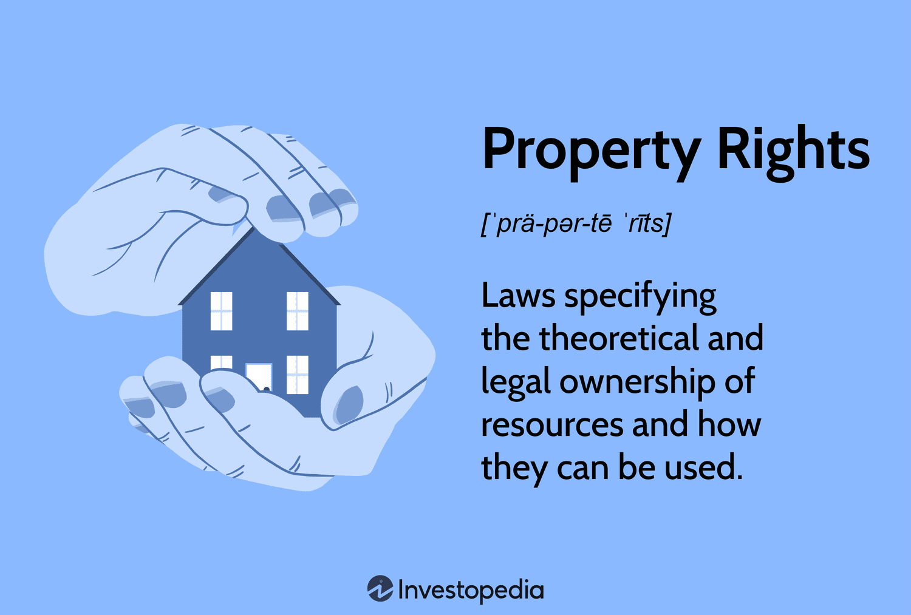

Property rights are a fundamental component of economic systems, providing the legal framework that governs the ownership and control of resources. These rights define the parameters within which individuals or entities can own, use, and transfer property, both tangible and intangible. Historically, property rights have evolved alongside economic and social developments, adapting to changing needs and technologies. Their economic relevance lies in their ability to create a stable environment for transactions, fostering market efficiency and facilitating resource allocation.

The interaction between property rights and ownership laws significantly influences economic dynamics. Ownership laws establish the legal basis for asserting and defending property rights, affecting personal and business financial decisions. These laws ensure that property transactions occur within a structured legal framework, reducing uncertainties and disputes. Consequently, they play a crucial role in promoting economic growth by encouraging investment and innovation through the protection of property rights.

Algorithmic trading, a modern financial innovation, intersects with property rights and ownership laws in intriguing ways. This technology-driven approach to trading involves the use of computer algorithms to execute orders in financial markets at speeds and frequencies that are impossible for human traders. The relationship between algorithmic trading and ownership laws is shaped by issues of intellectual property, proprietary trading strategies, and access to trading data. As financial markets become increasingly automated, the legal frameworks governing property rights must evolve to address these new challenges and opportunities.

The purpose of this article is to explore the connections between property rights, ownership laws, and their economic impact, with a specific focus on algorithmic trading. By examining these relationships, the article aims to shed light on the broader implications of property rights in financial and legal contexts and to discuss potential future developments in this dynamic area.

## Table of Contents

## Understanding Property Rights

Property rights are fundamental legal and economic constructs that determine how resources are owned, used, and transferred among individuals or entities. Historically, these rights have evolved in tandem with societal developments, shaping economic systems and influencing the distribution and use of resources. The concept of property rights can be traced back to early human societies, where they emerged as an essential mechanism for maintaining order and ensuring the fair allocation of resources.

In economic systems, property rights play a crucial role by providing individuals and businesses with the legal framework to own and control resources. This ownership framework is vital for market efficiency, enabling resource holders to capitalize on their assets through trade, investment, or development. The assurance of property rights incentivizes investment by reducing uncertainty, thereby fostering economic growth and innovation. Secured ownership rights encourage stakeholders to allocate resources more efficiently, ultimately contributing to the overall prosperity of an economy.

Property rights can encompass both tangible and intangible assets. Tangible property includes physical assets such as land, buildings, and machinery, while intangible property pertains to non-physical assets like intellectual property (i.e., patents, trademarks, copyrights), stocks, and bonds. These categories of property are governed by ownership laws that specify the extent of control and protection provided to the owner. For instance, intellectual property laws enable creators to exclusively profit from their inventions, thus incentivizing innovation.

Different jurisdictions exhibit diverse frameworks and interpretations of property rights, reflecting cultural, legal, and historical contexts. In some countries, such as the United States, property rights are strongly protected by the legal system, offering comprehensive safeguards to property owners. Conversely, in jurisdictions with less robust legal frameworks, property rights might be weaker, leading to inefficiencies and disputes. Countries with evolving legal systems may experience transitional phases where reforms aim to strengthen or clarify property rights to bolster economic performance and investment climate.

Key takeaways about property rights across jurisdictions include the criticality of a reliable legal system for enforcing and protecting property rights, acknowledging both tangible and intangible assets in ownership laws, and understanding the impact of socio-economic and legal reforms on property right structures. A robust legal framework that clearly defines and protects property rights is essential for the sustained economic development of any nation.

## Economic Impact of Property Rights

Property rights serve as a cornerstone for market efficiency and resource allocation by providing clear guidelines for ownership and control over resources. They establish a legal framework that delineates who can use a resource, how it can be used, and under what conditions. This clarity is crucial for the efficient functioning of markets, as it minimizes disputes and reduces transaction costs. When property rights are well-defined and enforced, resources are allocated to their most valued uses, thereby optimizing economic output.

The role of property rights extends to fostering investment and economic growth. With secure property rights, individuals and businesses are more likely to invest in assets since they can expect to reap the benefits of their investments without fear of arbitrary confiscation or redistribution. This security encourages the accumulation of capital, drives innovation, and supports long-term economic planning. For instance, Hernando de Soto, in his seminal work "The Mystery of Capital," argues that secure property rights are instrumental in unlocking dead capital and facilitating economic development, particularly in emerging economies.

There are numerous examples illustrating the impacts of property rights on economic systems. Positive impacts can be observed in countries with strong property rights frameworks, such as the United States and many European nations, where robust property laws have correlated with higher levels of investment and economic stability. Conversely, countries with weak or unclear property rights often experience negative economic outcomes. In such areas, like certain parts of Africa and Latin America, the absence of clear legal frameworks can lead to land disputes, hinder investment, and perpetuate poverty.

Unclear property rights can result in significant externalities, which are costs or benefits incurred by third parties who did not choose to incur those costs or benefits. For example, consider a scenario where ownership of a piece of land is disputed. The uncertainty may discourage any party from investing in infrastructure or improvements, leading to the underutilization of the resource. Additionally, the lack of clarity can cause conflicts, which may deter neighboring economic activity and development. Governments often intervene in these situations to clarify rights and mitigate externalities through legislative reforms or judicial rulings.

In addressing externalities, the Coase Theorem provides an insightful theoretical perspective. It suggests that if property rights are clearly defined and transaction costs are negligible, parties will negotiate to correct externalities on their own. However, in practice, achieving these conditions can be challenging, particularly in the presence of significant transaction costs or power imbalances.

In conclusion, well-defined property rights are essential for market efficiency, as they guide resource allocation and stimulate economic growth by fostering a secure environment for investment. Unclear property rights, on the other hand, can lead to significant economic inefficiencies and externalities, highlighting the importance of clear and enforceable property laws in supporting a stable economic ecosystem.

## Ownership Laws and Their Influence

## Ownership Laws and Their Influence

Ownership laws, also known as property laws, vary significantly across different countries, impacting both personal and business finance decisions. These laws determine how property is acquired, used, transferred, and disposed of, thereby influencing the economic behaviors associated with ownership and investment.

### Overview of Ownership Laws Across Different Countries

Ownership laws are designed to protect the rights of property owners while balancing the interests of the public. In common law countries, property laws are often rooted in historical legal precedents, while civil law countries rely on comprehensive statutory codes. For instance, in the United States, property laws can differ by state, though they generally allow for a high degree of freedom in property transactions. In contrast, countries like France, where the civil law system prevails, have codified laws that provide detailed regulations on property ownership and transfer.

In many jurisdictions, ownership laws cover both tangible and intangible assets. Tangible assets include real estate, vehicles, and other physical goods, whereas intangible assets cover intellectual property, stocks, and bonds. As digital assets like cryptocurrencies gain prominence, countries are continually updating their legal frameworks to address new ownership challenges.

### Impact of Ownership Laws on Personal and Business Finance Decisions

Ownership laws significantly influence personal financial decisions, particularly in terms of investment and asset management. For individuals, these laws affect the ability to buy, sell, or lease property. For instance, stringent property transfer regulations in some countries can discourage real estate investments, influencing individuals to seek alternative investment vehicles.

For businesses, ownership laws play a crucial role in corporate financing decisions. Companies rely on ownership rights to secure loans, with property often used as collateral. Clear and enforceable property rights can facilitate business expansion and encourage foreign investment, whereas ambiguous or restrictive property laws can deter business activities and stunt economic growth.

### Legal Protections and Disputes Associated with Property Ownership

Legal protections and disputes are inherent aspects of property ownership. Effective ownership laws provide a framework for resolving disputes, protecting the interests of both owners and other stakeholders. In cases of property rights violations, legal remedies such as compensation or injunctions are typically available.

Disputes over property can arise due to unclear boundaries, fraudulent claims, or differing interpretations of ownership laws. Intellectual property disputes, in particular, can involve complex issues regarding patents, trademarks, and copyrights. The resolution of these disputes often relies on clear legal protections enshrined in the ownership laws of a given jurisdiction.

### Case Studies on Ownership Law Reforms and Their Impact

Ownership law reforms can have significant economic and social impacts. In the early 2000s, China reformed its property rights framework to provide stronger protection for private ownership. These changes helped boost foreign investment and contributed to rapid economic growth.

In India, the implementation of the Real Estate (Regulation and Development) Act in 2016 aimed to protect homebuyers by enhancing transparency and accountability in the real estate sector. This reform has helped increase consumer confidence, though challenges in enforcement remain.

Another example is the reform of intellectual property laws in several European countries, which aimed to balance innovation incentives with public access. These reforms have sparked debates over the rights of creators versus the benefits to society.

Ownership laws are an essential component of legal and economic systems globally. Their influence on personal and business finance decisions underscores the necessity for well-defined and adaptable legal frameworks, particularly as digital and intangible assets become more prevalent.

## Algorithmic Trading and Ownership Laws

Algorithmic trading, a subset of electronic trading, refers to the use of algorithms to execute financial transactions at speeds and frequencies unimaginable to the human trader. This form of trading has grown exponentially with the advancements in technology and computing power. The algorithms, often designed to exploit very small price discrepancies in milliseconds, are built on complex mathematical models that automate the trading process, minimizing human intervention. This application of technology in finance aims for improved market efficiency, [liquidity](/wiki/liquidity-risk-premium), and reduced transaction costs.

While [algorithmic trading](/wiki/algorithmic-trading) offers numerous opportunities, it presents unique challenges, particularly concerning property rights. The algorithms themselves are intellectual property, protected under various ownership laws. The creation and utilization of these algorithms require a robust understanding of both proprietary rights and legal frameworks to ensure developers retain control and profit from their creations. Furthermore, issues concerning data ownership arise, as algorithmic trading heavily relies on vast amounts of real-time and historical market data. The question of who owns the data and how it can be legally utilized is crucial in this context.

Ownership laws greatly influence the development and deployment of these financial algorithms. For instance, patent laws can protect proprietary algorithms, granting exclusive use rights, while copyright laws offer protection for the software code itself. However, these laws can complicate the market if they discourage innovation due to restrictive licensing or costly litigation. The balance between protecting intellectual property and fostering a competitive market is delicate.

From a regulatory standpoint, algorithmic trading poses significant concerns. Regulatory bodies such as the U.S. Securities and Exchange Commission (SEC) and the European Securities and Markets Authority (ESMA) are focused on ensuring that the deployment of algorithms does not create unfair trading environments or contribute to systemic risks. High-frequency trading ([HFT](/wiki/high-frequency-trading-strategies)), for example, a subset of algorithmic trading, has been associated with market events like the Flash Crash of 2010, demonstrating the potential for substantial market disruption.

Going forward, the future of algorithmic trading in the context of ownership laws will likely involve stricter regulations and increased scrutiny. As the technology evolves, regulatory frameworks must adapt to address challenges such as market manipulation, transparency, and the ethical use of data. The emergence of fintech innovations like blockchain technology presents new paradigms for ownership and transferability of digital assets, potentially transforming traditional models of property rights.

In summary, while algorithmic trading significantly advances the efficiency and functionality of financial markets, it simultaneously necessitates a reevaluation of existing ownership laws to accommodate new technological realities. Ensuring robust legal structures are in place is essential for maintaining market integrity, promoting innovation, and protecting the interests of all market participants.

## Interactions and Synergies

Property rights and ownership laws form the backbone of economic frameworks, dictating how resources are utilized, distributed, and transferred among individuals and entities. These legal constructs ensure that ownership is recognized and protected, fostering a predictable environment for both personal and commercial transactions. However, with the advent of advanced technologies and novel trading strategies, particularly algorithmic trading, these traditional models face significant challenges and opportunities for evolution.

### Technology and Algorithmic Trading Impact on Ownership Models

Algorithmic trading, which involves using computer programs to execute financial trades at high speed and frequency, has revolutionized the financial markets by enhancing liquidity and efficiency. This technology, however, prompts a reevaluation of traditional ownership concepts. Traditional models of ownership are largely based on clear, singular possession or rights to tangible goods or well-defined financial assets. Algorithmic trading, on the other hand, deals with assets in a way that is less about outright ownership and more about momentary control and rapid transfer of rights.

The influence of algorithmic trading on ownership models can be seen in several areas:

1. **High Frequency Trading (HFT):** In HFT, ownership of financial assets may only exist for fractions of a second. This transient nature of ownership challenges traditional legal and regulatory systems which are not designed to handle such rapid transactions.

2. **Smart Contracts:** These are self-executing contracts with the terms of the agreement directly written into code. They redefine ownership by making it conditional upon specific parameters being met, bypassing the need for traditional legal intermediaries.

3. **Cryptocurrencies:** Digital currencies, underpinned by blockchain technology, introduce a form of ownership that is decentralized and autonomous, posing new challenges for regulation and protection under traditional ownership laws.

### Future Synergies between Digital Property and Regulatory Systems

As digital property, including assets like cryptocurrencies and intellectual property, becomes more prevalent, regulatory systems must evolve to accommodate these new forms of ownership. This might involve:

1. **Regulatory Frameworks:** Development of global regulatory frameworks that can seamlessly adapt to the borderless nature of digital transactions and assets. This includes protecting investors and ensuring fair market practices while fostering innovation.

2. **Intellectual Property Rights:** As digital goods proliferate, ensuring robust intellectual property laws that protect digital creations while respecting the open nature of the internet is paramount.

3. **Legal Recognition of AI and Blockchain Transactions:** Ensuring that transactions conducted via AI and blockchain have the same legal recognition and protection as those conducted through traditional means.

### Global Trends and their Potential to Alter Existing Models

Globalization and technological advancements continue to reshape how property rights and ownership laws are perceived and enforced across the world. Trends such as:

- **Digital Transformation:** As businesses and economies emphasize digitization, property ownership is shifting toward virtual landscapes requiring modern legal interpretations and agreements.

- **International Cooperation:** Cross-border transactions are becoming more common, necessitating international cooperation in creating harmonious legal standards that respect sovereign laws while enabling global commerce.

- **Environmental Sustainability:** Trends toward sustainable ownership, particularly in environmental assets and resources, are introducing new legal structures for communal and shared ownership models.

In conclusion, the interplay between property rights, ownership laws, and emerging technologies is leading to a reimagining of existing economic frameworks. The integration of algorithmic trading, digital assets, and new technology-driven ownership models requires adaptive legal systems that can safeguard these paradigms while ensuring economic dynamism and innovation.

## Conclusion

Throughout this article, the intricate relationship between property rights, ownership laws, and their extensive economic ramifications were examined. By understanding property rights as foundational to economic systems, these legal constructs were shown to enhance market efficiency by ensuring clear resource allocation and incentivizing investments, thereby fostering economic growth. Ownership laws, varying across jurisdictions, further shape personal and business finance decisions, exhibiting their influence through legal protections and disputes. Algorithmic trading was introduced as a significant intersection of technology and finance, presenting both challenges and opportunities regarding property rights in digital contexts.

As economies transition to more digital landscapes, the concept of property ownership continues to evolve. With algorithmic trading and digital assets gaining prevalence, there is a need to reconsider traditional ownership models and adapt regulatory frameworks. This transformation presents opportunities for symbiotic interactions between technology and law, pointing towards a future where digital property aligns with legal standards.

The ongoing changes in property rights and ownership laws underscore a broader trend of integrating digital innovations into established legal frameworks. As these fields dynamically interplay, they offer valuable avenues for deeper research and exploration. Understanding these interactions remains vital as global trends shape emerging economic and regulatory paradigms.

## References & Further Reading

[1]: De Soto, H. (2000). ["The Mystery of Capital: Why Capitalism Triumphs in the West and Fails Everywhere Else."](https://archive.org/details/TheMysteryOfCapital) Basic Books.

[2]: Mancur Olson (1965). ["The Logic of Collective Action: Public Goods and the Theory of Groups."](https://www.jstor.org/stable/j.ctvjsf3ts) Harvard University Press.

[3]: Demsetz, H. (1967). ["Toward a Theory of Property Rights."](https://www.semanticscholar.org/paper/Toward-a-Theory-of-Property-Rights-Demsetz/1941d38d916bcd58f04f1ba88d6b255c0e30479d) The American Economic Review, 57(2), 347–359.

[4]: [Coase, R. H. (1960). "The Problem of Social Cost."](https://www.semanticscholar.org/paper/The-Problem-of-Social-Cost-Coase/f7fb852e822caa2edb1784d57edc6c9a72c1ddad) Journal of Law and Economics, 3, 1-44.

[5]: ["Principles of Corporate Finance"](https://www.mheducation.com/highered/product/Principles-of-Corporate-Finance-Brealey.html) by Richard A. Brealey, Stewart C. Myers, and Franklin Allen.

[6]: [CIA World Factbook](https://www.cia.gov/the-world-factbook/), specific sections on economic policies and property rights frameworks in various countries.

[7]: Lopez de Prado, M. (2018). ["Advances in Financial Machine Learning."](https://www.amazon.com/Advances-Financial-Machine-Learning-Marcos/dp/1119482089) Wiley.

[8]: [U.S. Securities and Exchange Commission (SEC) Reports](https://www.sec.gov/search-filings), especially those related to algorithmic trading regulations and market operations.

[9]: European Securities and Markets Authority (ESMA) [supervisory briefings and reports](https://www.esma.europa.eu/press-news/esma-news/esma-provides-supervisors-guidance-integration-sustainability-risks-and), particularly on high-frequency trading. 

[10]: Claessens, S., & Laeven, L. (2003). ["Financial Development, Property Rights, and Growth."](https://onlinelibrary.wiley.com/doi/abs/10.1046/j.1540-6261.2003.00610.x) Journal of Financial Studies, 16(3), 733-766.