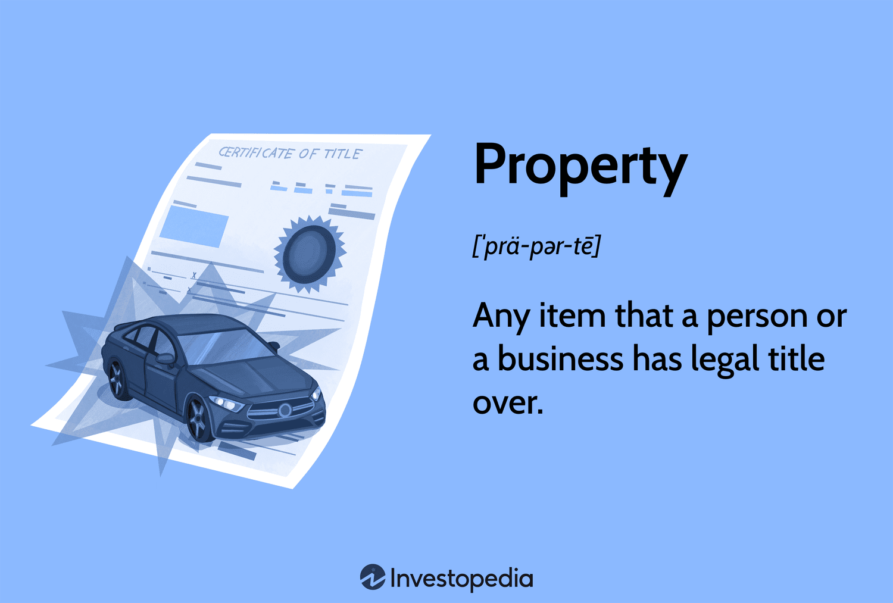

## Table of Contents

## What is property and what are the basic types?

Property is anything that a person or a business owns and has the right to use or sell. It can be something you can touch, like a house or a car, or something you can't touch, like a patent or a stock. People often buy property to use it or to make money from it.

There are two basic types of property: real property and personal property. Real property is land and anything attached to it, like buildings and trees. Personal property is everything else that is not real property. This includes things like furniture, clothes, and money. Both types of property are important and can be bought, sold, or given away.

## How do residential properties differ from commercial properties?

Residential properties are places where people live. These can be houses, apartments, or condos. The main purpose of a residential property is to provide a home for people and their families. They usually have bedrooms, kitchens, and living areas. People often choose residential properties based on things like location, size, and how much it costs.

Commercial properties are used for business activities. These can include offices, stores, restaurants, or warehouses. The main goal of commercial properties is to help businesses make money. They are often located in busy areas where many people can easily visit. The cost of a commercial property can depend on its location, how big it is, and what it can be used for.

Both types of properties are important, but they serve different needs. Residential properties focus on living comfortably, while commercial properties focus on running a business successfully. Understanding the difference can help people decide what kind of property they need.

## What are the key factors that influence property valuation?

Several things can affect how much a property is worth. One big factor is where the property is located. If it's in a popular area with good schools, shops, and transport, it will usually be worth more. The size and condition of the property also matter. A bigger house in good shape will be valued higher than a smaller, run-down one. Another important thing is what similar properties in the area have sold for recently. This helps set a fair price for the property.

The economy can also play a role in property valuation. When the economy is doing well, people have more money to spend on homes, which can drive up prices. On the other hand, if the economy is struggling, property values might go down because fewer people can afford to buy. Interest rates are another economic factor. Lower interest rates can make it easier for people to borrow money to buy a home, which can increase demand and push up property values. All these factors together help determine how much a property is worth.

## How is the market value of a property determined?

The market value of a property is what someone would pay for it if it was for sale. To find this out, people look at what similar properties in the same area have sold for recently. This is called the "comparable sales" method. They also consider things like the property's size, how old it is, and what shape it's in. If a house is bigger and in better condition than others nearby, it might be worth more.

Another way to figure out market value is by looking at how much money the property could make if it was rented out. This is called the "income approach." It's often used for commercial properties like office buildings or stores. People calculate how much rent the property could bring in each year and then use that to decide its value. Both methods help give a good idea of what a property might be worth in the current market.

## What methods are commonly used to appraise property values?

One common way to appraise property values is by using the "comparable sales" method. This means looking at what similar properties in the same area have sold for recently. Appraisers consider things like the size of the property, how old it is, and what shape it's in. If a house is bigger and in better condition than others nearby, it might be worth more. This method helps give a good idea of what someone might pay for the property if it were for sale.

Another method is the "income approach," which is often used for commercial properties like office buildings or stores. This method looks at how much money the property could make if it were rented out. Appraisers calculate how much rent the property could bring in each year and then use that to decide its value. This approach is useful because it shows how much income the property can generate, which can help determine its market value.

A third method is the "cost approach," which is used less often but can be helpful for new or unique properties. This method estimates how much it would cost to build the same property from scratch, including the price of the land. Appraisers then subtract any wear and tear or depreciation from this cost to find the property's value. This approach is good for properties where there are no recent sales of similar properties to compare.

## What are the differences between assessed value and market value?

Assessed value and market value are two different ways to measure how much a property is worth. Assessed value is what the local government says a property is worth for the purpose of taxing it. This value is used to figure out how much property tax the owner has to pay. The assessed value is usually decided by a government assessor who looks at the property and compares it to others in the area. It might not always match what someone would actually pay for the property.

Market value, on the other hand, is what someone would pay for the property if it were for sale. This value is found by looking at what similar properties in the same area have sold for recently. It's what buyers and sellers agree on in the open market. Market value can change a lot depending on things like the economy, interest rates, and how much people want to buy homes in that area. So, the market value can be very different from the assessed value at any given time.

## How do local and state governments use property taxes?

Local and state governments use property taxes to pay for things that help the community. They use the money to build and fix roads, run schools, and keep parks and libraries open. Property taxes are a big part of how these governments get the money they need to do these important jobs. They collect this money from people who own homes, land, and businesses in their area.

The amount of property tax someone has to pay is based on the assessed value of their property. This is the value that the government says the property is worth for tax purposes. The government decides this value by looking at the property and comparing it to others nearby. They then use a tax rate to figure out how much tax the owner has to pay. This way, the government can make sure they have enough money to keep services running for everyone in the community.

## What are the different types of property tax exemptions available?

There are different types of property tax exemptions that help people pay less or no property tax at all. One common type is the homestead exemption, which is for people who live in their own home. This exemption lowers the taxable value of the home, so the owner pays less in property taxes. Another type is for seniors or people with disabilities. These exemptions are meant to help people who might have a hard time paying their taxes because of their age or health.

There are also exemptions for veterans, which can help those who have served in the military. Some places give exemptions to people who have made improvements to their property that help the environment, like adding solar panels. These are called green energy exemptions. Each state and local government can have different rules about who can get these exemptions and how much they help.

Understanding these exemptions can make a big difference in how much property tax someone has to pay. It's a good idea for property owners to check with their local tax office to see if they qualify for any exemptions. This can help them save money and make paying property taxes easier.

## How can property tax rates vary within the same area?

Property tax rates can vary within the same area because different parts of a city or county might have different needs for services like schools, roads, and parks. For example, one neighborhood might need more money for a new school, so the tax rate there could be higher. Another part of the area might already have good services and doesn't need as much money, so the tax rate could be lower. This means that even if two homes are close to each other, they might have different tax rates based on what the local government needs.

Also, special districts can affect property tax rates. These are areas set up to pay for specific services, like a fire district or a library district. If a home is in one of these districts, the owner might have to pay extra taxes for those services. This can make the total tax rate different from homes just outside the district, even if they are in the same general area. So, the tax rate can change a lot depending on where exactly the property is located and what services are needed there.

## What advanced techniques can be used to forecast property value trends?

One advanced technique to forecast property value trends is using data analytics and [machine learning](/wiki/machine-learning). These tools look at a lot of information, like past property sales, economic indicators, and even social media trends. By finding patterns in this data, they can predict how property values might change in the future. For example, if a lot of people are talking about moving to a certain area on social media, it might mean that property values there will go up soon. This helps people make better decisions about buying or selling property.

Another technique is using geographic information systems (GIS). GIS can map out property values across different areas and show how they change over time. By looking at these maps, experts can see trends and patterns that might not be obvious otherwise. For instance, they might notice that properties near new public transport lines are increasing in value faster than others. This information can help predict where property values might rise or fall in the future, giving a clearer picture of what to expect in the real estate market.

## How do international property valuation standards differ from local standards?

International property valuation standards, like those set by the International Valuation Standards Council (IVSC), are meant to be used all over the world. They give rules and guidelines that help make sure property valuations are done the same way everywhere. These standards focus on things like being open about how the valuation is done, making sure the people doing the valuation are skilled, and using methods that are fair and can be checked by others. This helps people trust property valuations no matter where they are.

Local standards, on the other hand, can be different in each country or even in different parts of a country. They might have their own rules that fit the local laws, customs, and needs. For example, in one country, the government might have special ways of figuring out property values for tax reasons that aren't used anywhere else. Local standards can also change more often than international ones because they need to keep up with local changes in the economy or laws. So, while international standards aim for consistency across borders, local standards focus on what works best in a specific place.

## What are the legal considerations and disputes related to property taxation?

Legal considerations and disputes related to property taxation often come up when people think their property has been valued too high or when they believe they should get a tax exemption but don't. For example, if someone thinks the assessed value of their home is too high compared to similar homes nearby, they might challenge it. They can appeal to a local tax board or go to court to try to get the value lowered. Another common issue is when people think they qualify for an exemption, like a homestead exemption for their main home, but the government says they don't. They might have to go through a legal process to prove they should get the exemption.

Disputes can also happen when new laws or changes in tax rates are made. If a new law raises property taxes a lot, people might challenge it in court, saying it's not fair or it breaks other laws. Sometimes, different parts of a city or county might have different tax rates, and people might argue that this is not equal. These kinds of disputes can take a long time to solve and might need lawyers and judges to decide what's fair. Understanding the local laws and having good records can help people deal with these issues better.

## What is the impact of taxation on property valuation?

Property taxes play a significant role in the valuation of real estate, influencing both the market value of properties and investment decisions. Property taxes are typically assessed by local tax authorities, which evaluate the value of properties and levy taxes based on these valuations. The assessment process often involves property assessors who determine the market value of properties through various methodologies, such as comparative market analysis and income analyses. These assessments form the basis for calculating tax obligations, ensuring that there is a consistent and equitable approach to taxation within a jurisdiction.

The impact of property taxes on property values can be seen in several ways. High property taxes can reduce the attractiveness of a location to potential buyers, thus lowering demand and negatively affecting market value. Conversely, areas with moderate or lower taxes can be more attractive to buyers, potentially increasing property values. The equation for calculating property tax is straightforward:

$$
\text{Property Tax} = \text{Assessed Value} \times \text{Tax Rate}
$$

Where:
- $\text{Assessed Value}$ is the value determined by the tax authority,
- $\text{Tax Rate}$ is the percentage rate that applies to the assessed value for taxation purposes.

The implications of tax policies on real estate investments are substantial. Investors often consider the tax environment as a critical [factor](/wiki/factor-investing) in their investment decisions. Favorable tax policies, such as deductions or credits, can incentivize investment in certain areas or types of properties. Conversely, high tax burdens can deter investment, especially in areas with less potential for appreciation or return on investment. This dynamic plays an essential role in shaping real estate markets, as it can guide both domestic and international investment flows.

Additionally, property taxation affects housing market stability. Stable and predictable tax policies contribute to a predictable investment environment, which promotes market stability. However, abrupt changes in tax policies can introduce uncertainty, leading to fluctuations in property values as stakeholders adjust their expectations and valuations. Such [volatility](/wiki/volatility-trading-strategies) can have a broader impact on the economy, influencing consumer spending, real estate development, and urban planning.

In conclusion, property taxes are a critical component of property valuation, affecting both individual property values and broader market dynamics. The role of local tax authorities and property assessors is crucial in establishing fair valuations which serve as the basis for taxation. Tax policies and their implications significantly influence real estate investments and the overall stability of the housing market, making the understanding of property tax mechanisms vital for stakeholders in the real estate sector.

## References & Further Reading

[1]: Crosby, M., Pattanayak, P., Verma, S., & Kalyanaraman, V. (2016). ["Blockchain technology: Beyond bitcoin."](https://scet.berkeley.edu/reports/blockchain/) Applied Innovation Review.

[2]: McKinsey & Company. (2017). ["Blockchain and commercial real estate: The future is here."](https://www.mckinsey.com/capabilities/mckinsey-digital/our-insights/blockchain-beyond-the-hype-what-is-the-strategic-business-value)

[3]: Ng, I., & Schurr, P. (2019). ["AI and AVM transformation in real estate valuation: Challenges and opportunities."](https://www.researchgate.net/publication/333831089_Plant_Phenotyping_Past_Present_and_Future) RICS.

[4]: Lopez de Prado, M. (2018). ["Advances in Financial Machine Learning."](https://www.amazon.com/Advances-Financial-Machine-Learning-Marcos/dp/1119482089) John Wiley & Sons.

[5]: Aronson, D. R. (2007). ["Evidence-Based Technical Analysis: Applying the Scientific Method and Statistical Inference to Trading Signals."](https://www.amazon.com/Evidence-Based-Technical-Analysis-Scientific-Statistical/dp/0470008741) John Wiley & Sons. 

[6]: Chan, E. P. (2009). ["Quantitative Trading: How to Build Your Own Algorithmic Trading Business."](https://github.com/ftvision/quant_trading_echan_book) John Wiley & Sons. 

[7]: Yoon, H., & Peschiera, G. (2020). ["Adoption of artificial intelligence in real estate valuation."](https://www.researchgate.net/publication/378484087_Unleashing_the_Power_of_Artificial_Intelligence_in_Real_Estate_Valuation_Opportunities_and_Challenges_Ahead) Journal of Real Estate Finance and Economics.

[8]: Varma, A. (2018). ["Real estate taxation: Policy considerations and impact on market."](https://www.forbes.com/councils/forbesbusinesscouncil/2023/02/06/the-influence-of-politics-and-policy-in-the-real-estate-market/) Property Management.