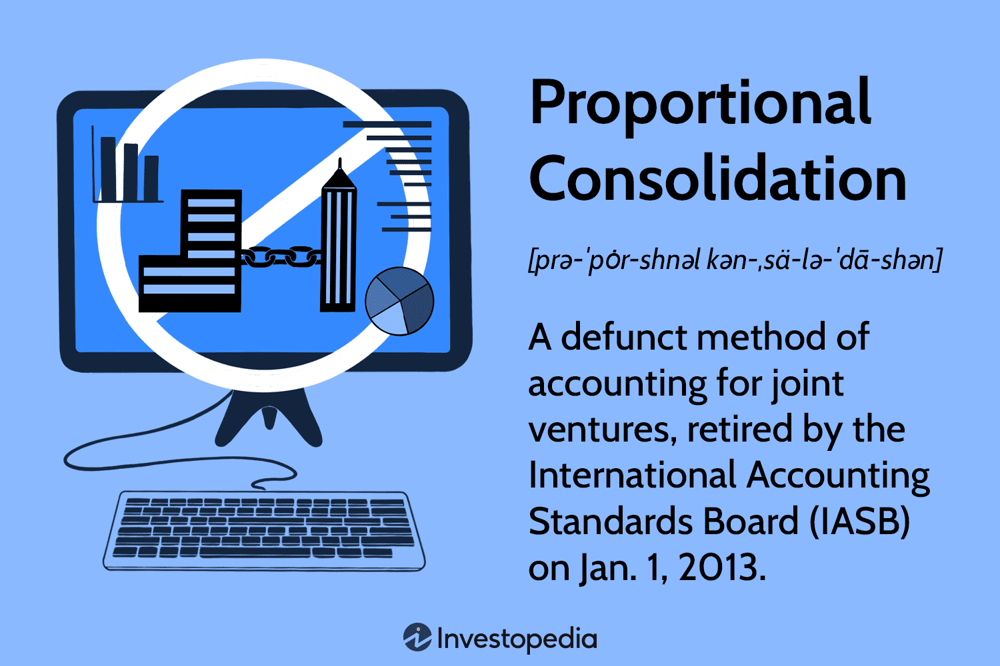

## Table of Contents

## What is proportional consolidation in accounting?

Proportional consolidation is a method used in accounting when a company owns a part of another company, but not all of it. When this happens, the owning company includes a portion of the other company's assets, liabilities, revenues, and expenses in its own financial statements. The portion included is based on the percentage of ownership. For example, if a company owns 40% of another company, it will include 40% of that company's financial figures in its own statements.

This method is different from full consolidation, where a company owns more than 50% of another company and includes all of its financials. Proportional consolidation is often used in joint ventures or when companies have significant influence but not control over another company. It gives a clearer picture of the owning company's financial situation by showing the impact of its investments in other companies.

## How does proportional consolidation differ from full consolidation?

Proportional consolidation and full consolidation are two ways companies can show their ownership of other companies in their financial statements. With proportional consolidation, a company only includes a part of another company's financials in its own statements. This part is based on the percentage of the company it owns. For example, if a company owns 30% of another company, it will show 30% of that company's assets, liabilities, revenues, and expenses in its own financial statements. This method is used when a company has a significant influence but not control over another company, like in joint ventures.

On the other hand, full consolidation is used when a company owns more than 50% of another company. In this case, the owning company includes all of the other company's financials in its own statements. This means 100% of the other company's assets, liabilities, revenues, and expenses are shown as if they were part of the owning company. Full consolidation is used when a company has control over another company, treating it as a part of itself in financial reporting. The main difference between the two methods is the level of ownership and control, which affects how much of the other company's financials are included in the owning company's statements.

## In what types of business structures is proportional consolidation commonly used?

Proportional consolidation is commonly used in business structures where companies share ownership but do not have full control over each other. This often happens in joint ventures, where two or more companies come together to work on a specific project or business activity. In a joint venture, each company might own a part of the new business, say 50% each, and they use proportional consolidation to show their share of the joint venture's financials in their own financial statements.

Another situation where proportional consolidation is used is when a company has significant influence over another company but does not own it completely. This can happen when a company owns between 20% and 50% of another company's shares. In such cases, the owning company cannot fully control the other company, but it can still affect its financial and operating policies. Proportional consolidation helps show the financial impact of this investment in the owning company's financial statements, reflecting the level of influence and ownership accurately.

## Can you explain the process of applying proportional consolidation to financial statements?

When a company uses proportional consolidation, it takes a part of another company's financial numbers and adds them to its own financial statements. This part is based on the percentage of the other company that it owns. For example, if a company owns 40% of another business, it will take 40% of that business's assets, liabilities, revenues, and expenses and add them to its own financial statements. This way, the company shows how its investment in the other business affects its own financial situation.

To do this, the company first looks at the financial statements of the business it partly owns. It then calculates the percentage of each financial item it needs to include. For example, if the partly owned business has total assets of $100 million and the owning company owns 30%, it will add $30 million to its own assets. The same process is done for liabilities, revenues, and expenses. This helps give a clearer picture of the owning company's financial health by showing the impact of its investment in the other business.

## What are the advantages of using proportional consolidation for joint ventures?

Using proportional consolidation for joint ventures helps show a clearer picture of a company's financial situation. When two or more companies work together on a project, they might own different parts of the joint venture. By using proportional consolidation, each company can show their share of the joint venture's money in their own financial statements. This means if a company owns 40% of the joint venture, it will show 40% of the joint venture's assets, liabilities, revenues, and expenses in its own financials. This gives investors and others a better idea of how the joint venture is affecting the company's overall financial health.

Another advantage is that proportional consolidation makes it easier to understand the financial impact of the joint venture. Since the company only includes its share of the joint venture's financials, it can be clearer about what part of its financial performance comes from the joint venture and what part comes from its other operations. This helps in making better decisions about the joint venture, like whether to invest more or change the way it's run. It also helps in comparing the company's financial performance with other companies that might have different ways of showing their joint ventures.

## What are the potential disadvantages or limitations of proportional consolidation?

One disadvantage of proportional consolidation is that it can make financial statements more complicated. When a company uses this method, it has to break down the financials of the joint venture or partly owned company and include only a part of them in its own statements. This can make it harder for people reading the financial statements to understand where all the numbers come from. It can also take more time and effort to prepare these statements, because the company has to calculate the right percentages for each financial item.

Another limitation is that proportional consolidation might not show the full risk that a company has from its investment. If a company owns part of another business, it can still be affected by all the risks that business faces, even if it only shows a part of that business's financials. For example, if the partly owned business gets into financial trouble, the owning company could lose money, but this might not be clear from looking at the financial statements alone. This means that investors and others might not get a complete picture of the owning company's financial health and risks.

## How does proportional consolidation affect the reporting of assets, liabilities, income, and expenses?

When a company uses proportional consolidation, it shows only a part of another company's assets, liabilities, income, and expenses in its own financial statements. This part is based on the percentage of the other company that it owns. For example, if a company owns 30% of another business, it will add 30% of that business's assets to its own assets, 30% of the liabilities to its own liabilities, 30% of the income to its own income, and 30% of the expenses to its own expenses. This way, the company can show how its investment in the other business affects its own financial situation.

Proportional consolidation helps give a clearer picture of the owning company's financial health by showing the impact of its investment in the other business. However, it can also make financial statements more complicated because the company has to break down the financials of the other business and include only a part of them. This can make it harder for people reading the financial statements to understand where all the numbers come from. Also, it might not show the full risk that the owning company has from its investment, because even though it only shows a part of the other business's financials, it can still be affected by all the risks that business faces.

## What are the key accounting standards that govern the use of proportional consolidation?

Proportional consolidation is guided by different accounting standards around the world. In the past, the International Accounting Standards (IAS) allowed the use of proportional consolidation for joint ventures under IAS 31, which was called "Interests in Joint Ventures." This standard let companies show their share of a joint venture's assets, liabilities, income, and expenses in their own financial statements. However, this standard was replaced by IFRS 11, "Joint Arrangements," in 2013. IFRS 11 does not allow proportional consolidation for joint ventures anymore. Instead, it requires companies to use the equity method or full consolidation, depending on the type of joint arrangement.

In the United States, the Financial Accounting Standards Board (FASB) sets the rules for accounting. The FASB's Accounting Standards Codification (ASC) Topic 810, "Consolidation," and ASC Topic 323, "Investments—Equity Method and Joint Ventures," are important for understanding how to report investments in other companies. These standards do not allow proportional consolidation for joint ventures either. Instead, they require the use of the equity method for joint ventures, where a company shows its share of the joint venture's net income or loss on its income statement, and its investment in the joint venture on its balance sheet. This means that companies in the U.S. and those following IFRS have to use different methods to show their investments in joint ventures, and proportional consolidation is no longer an option under these standards.

## How has the use of proportional consolidation evolved with changes in international accounting standards?

The use of proportional consolidation has changed a lot because of new international accounting rules. Before 2013, companies could use proportional consolidation for joint ventures under the International Accounting Standard (IAS) 31. This meant they could show a part of a joint venture's money in their own financial statements, based on how much of the joint venture they owned. But in 2013, a new rule called IFRS 11, "Joint Arrangements," came into place. This new rule said that companies can't use proportional consolidation for joint ventures anymore. Instead, they have to use the equity method or full consolidation, depending on the type of joint arrangement they have.

In the United States, the rules from the Financial Accounting Standards Board (FASB) have also never allowed proportional consolidation for joint ventures. The FASB's rules, found in the Accounting Standards Codification (ASC) Topic 810 and ASC Topic 323, say that companies should use the equity method for joint ventures. This means a company shows its share of the joint venture's profit or loss on its income statement, and its investment in the joint venture on its balance sheet. So, because of these changes in international and U.S. accounting standards, companies can't use proportional consolidation for joint ventures anymore. They have to use other methods to show their investments in their financial statements.

## Can you provide an example of how proportional consolidation is calculated in a real-world scenario?

Let's say Company A owns 40% of a joint venture called JV1. JV1 has total assets of $1 million, total liabilities of $600,000, revenues of $500,000, and expenses of $400,000. To use proportional consolidation, Company A would take 40% of these numbers and add them to its own financial statements. So, Company A would add $400,000 (40% of $1 million) to its own assets, $240,000 (40% of $600,000) to its own liabilities, $200,000 (40% of $500,000) to its own revenues, and $160,000 (40% of $400,000) to its own expenses.

This way, Company A can show how its investment in JV1 affects its own financial situation. But remember, since the accounting rules changed in 2013, companies can't use proportional consolidation for joint ventures anymore. They have to use the equity method or full consolidation instead. So, this example is just to explain how proportional consolidation worked before the rules changed.

## What are the implications of proportional consolidation on financial ratios and analysis?

Proportional consolidation can change the way financial ratios and analysis look for a company. When a company uses this method, it adds a part of another company's money to its own financial statements. This can make the company's assets, liabilities, revenues, and expenses look bigger than if it didn't show the other company's money. For example, if a company owns 30% of another business, it will add 30% of that business's assets to its own assets. This can make the company's debt-to-equity ratio or return on assets look different. Analysts and investors need to understand that these ratios might not show the whole picture of the company's financial health, because they include only a part of another business's money.

However, since the accounting rules changed in 2013, companies can't use proportional consolidation for joint ventures anymore. This means that the impact on financial ratios and analysis is less common now. Companies have to use other methods, like the equity method, which can also affect financial ratios but in different ways. With the equity method, a company shows its share of the joint venture's profit or loss on its income statement and its investment in the joint venture on its balance sheet. This can make the company's financial statements look different and affect ratios like earnings per share or return on equity. So, it's important for people looking at financial statements to know which method a company is using to understand the numbers correctly.

## How do auditors assess the appropriateness of using proportional consolidation in financial reporting?

Auditors look at many things to see if a company is using proportional consolidation the right way in its financial reports. They check if the company really owns a part of another business, like a joint venture, and if the percentage they use to add that business's money to their own statements is correct. They also make sure the company is following the right accounting rules, like the ones from the International Accounting Standards or the Financial Accounting Standards Board. Since the rules changed in 2013, auditors need to make sure companies aren't using proportional consolidation for joint ventures anymore, because it's not allowed.

If a company is still using proportional consolidation where it shouldn't, auditors will point this out and ask the company to change its financial statements. They also look at how the company's use of proportional consolidation affects important numbers like assets, liabilities, and profits, and if it makes the company's financial health look different than it really is. This helps make sure the financial statements are fair and clear for people who read them, like investors and other businesses.

## References & Further Reading

"International Financial Reporting Standards (IFRS)." This essential resource provides comprehensive guidelines on financial reporting, influencing accounting practices worldwide, particularly in joint ventures.

- **"Advances in Financial Machine Learning" by Marcos Lopez de Prado.** This book is pivotal for understanding the intersection of machine learning and finance. It provides insights into how advanced computational techniques can optimize trading strategies and improve financial decision-making.

- **"Algorithmic Trading: Winning Strategies and Their Rationale" by Ernie Chan.** A valuable resource for grasping the mechanics and rationale behind algorithmic trading strategies. Ernie Chan outlines tested strategies and discusses the statistical methods and technology pivotal for successful implementation.

- **"Quantitative Investment Analysis" by Richard A. DeFusco, Dennis W. McLeavey, Jerald E. Pinto, and David E. Runkle.** This text offers a thorough examination of the quantitative tools and techniques used in investment analysis. It is crucial for understanding the quantitative aspects that impact financial reporting and decision-making.

- **"Intermediate Accounting" by Donald E. Kieso, Jerry J. Weygandt, and Terry D. Warfield.** This authoritative text is beneficial for understanding the principles of accounting, particularly in relation to consolidation methods and financial statement preparation.

