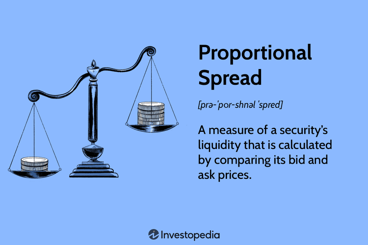

Financial markets operate through complex mechanisms, governed by various factors that influence trading decisions and strategies. Among these, spread trading and algorithmic trading strategies hold significant importance due to their potential for profit optimization and efficiency. Spread trading, a vital component of financial markets, involves the simultaneous purchase and sale of related securities, commodities, or financial instruments to capture price differences. This approach aims to exploit the relative movement or spread between the prices of these instruments.

Algorithmic trading, on the other hand, represents the use of automated and algorithm-driven strategies in the execution of trades. It leverages technology to not only enhance the speed and precision of trading but also to identify optimal trading opportunities. By automating complex calculations and repetitive tasks, algorithmic trading minimizes human intervention and improves execution efficiency.



A critical concept within these trading strategies is that of proportional spreads. Proportional spreads refer to the difference between the bid and ask prices of a financial instrument, expressed as a percentage of the instrument's mid-price. This measure provides a relative perspective on the spread, offering insights into the liquidity and transaction costs inherent to a particular market. Proportional spreads are especially relevant in trading as they serve as indicators of market efficiency and liquidity, thus informing traders' decisions.

This article is structured to provide comprehensive insights into the importance of financial mechanisms, particularly focusing on the role of spreads in spread trading and algorithmic approaches. Readers will gain an understanding of financial spreads, with specific emphasis on bid-ask and yield spreads, and their significance in market dynamics. The concept of proportional spreads will be explored in detail, highlighting their calculation and impact on trading strategies. Furthermore, the integration of algorithmic trading in spread trading will be discussed, showcasing how technology aids in the detection and exploitation of spread opportunities. Concrete examples of proportional spread trading strategies will be provided, along with an analysis of associated risks and challenges. Ultimately, this article aims to equip readers with a nuanced understanding of how proportional spreads and algorithmic trading strategies can enhance trading outcomes in contemporary financial markets.

## Table of Contents

## Understanding Financial Mechanisms: Spreads

In financial markets, spreads are fundamental elements reflecting the costs associated with trading and the liquidity of securities. Spreads are defined as the difference between two prices or interest rates and can vary significantly depending on market conditions and the specific instruments involved.

### Bid-Ask Spreads

The bid-ask spread is one of the most recognized types of spread, consisting of the difference between the highest price a buyer (the bid) is willing to pay for an asset and the lowest price a seller (the ask) is prepared to accept. The spread essentially represents the transaction cost for traders; narrower spreads indicate lower costs and greater [liquidity](/wiki/liquidity-risk-premium). Mathematically, this can be represented as:

$$
\text{Bid-Ask Spread} = \text{Ask Price} - \text{Bid Price}
$$

Tight bid-ask spreads are typically observed in liquid markets where there is a high trading [volume](/wiki/volume-trading-strategy), such as major stock exchanges. Conversely, wider spreads may indicate less liquidity, as seen in smaller or more volatile markets. Bid-ask spreads can be influenced by various factors, including market microstructure, available information, and trader behavior.

### Yield Spreads

Yield spreads measure the difference between the yields of different debt instruments, typically bonds, and are a critical gauge of credit risk and liquidity. Yield spreads can help investors assess the relative value of bonds, monitor changes in economic conditions, and manage portfolio risk. The calculation is straightforward:

$$
\text{Yield Spread} = \text{Yield of Bond A} - \text{Yield of Bond B}
$$

Common applications of yield spreads include comparing government bonds to corporate bonds to evaluate credit risk, or contrasting bonds of different maturities to speculate on [interest rate](/wiki/interest-rate-trading-strategies) movements.

### Spreads as Liquidity Indicators and Transaction Costs

Spreads are pivotal indicators of market liquidity—an essential attribute allowing assets to be bought or sold quickly without causing significant price changes. In markets with high liquidity, assets display narrow spreads, reflecting ease of transaction and reduced costs for traders. Liquid markets are beneficial for all participants as they ensure smoother price adjustments and less price manipulation.

In contrast, wider spreads often indicate reduced liquidity, as fewer transactions lead to higher transaction costs and increased difficulty in executing trades at desired prices. These conditions can be particularly pronounced in markets experiencing high [volatility](/wiki/volatility-trading-strategies) or when trading less mainstream securities.

In conclusion, understanding spreads is crucial for traders and investors as they provide direct insight into market conditions such as liquidity and transaction costs. Spreads, whether they be bid-ask or yield, serve as vital metrics for evaluating trading opportunities and portfolio management strategies.

## Proportional Spread: Definition and Significance

A proportional spread is a financial metric that reflects the relative difference between the bid and ask prices of a security in proportion to its mid-price. It is used as an indicator of liquidity and transaction costs in financial markets. The proportional spread can be calculated using the formula:

$$
\text{Proportional Spread} = \frac{\text{Ask Price} - \text{Bid Price}}{\text{Mid Price}}
$$

where the mid-price is defined as:

$$
\text{Mid Price} = \frac{\text{Ask Price} + \text{Bid Price}}{2}
$$

This calculation allows traders to quantitatively assess how much the cost of executing a trade (the spread) deviates in relation to the price of the asset.

Proportional spreads are crucial in assessing liquidity because they provide a normalized view of the spread size relative to the asset's price. A narrower proportional spread generally implies higher liquidity, meaning the asset can be bought or sold quickly with minimal price impact. Conversely, a wider proportional spread indicates lower liquidity, suggesting potential difficulties in transaction execution without affecting the price.

In trading strategies, proportional spreads influence decision-making by affecting the cost and timing of transactions. Traders use proportional spread metrics to evaluate market conditions, choosing to enter or [exit](/wiki/exit-strategy) positions based on spread width. Narrow spreads might encourage high-frequency trading and market-making activities, while wider spreads may deter such strategies.

In terms of market efficiencies, proportional spreads play a role by indicating the ease with which information is incorporated into prices. Efficient markets are typically characterized by small proportional spreads due to the rapid assimilation of new information through trading activities. When spreads widen, it may signal inefficiencies or increased uncertainty, prompting market participants to adjust their strategies accordingly.

## Algorithmic Trading and Its Role in Spread Trading

Algorithmic trading, often known as algo trading, refers to the use of computer algorithms to manage trading activities, including executing orders, timing trades, and determining the optimum price strategies. This form of trading leverages mathematical models and statistical analyses to make decisions in financial markets without human intervention. The primary advantage of [algorithmic trading](/wiki/algorithmic-trading) lies in its ability to process vast amounts of data and execute trades at speeds and frequencies that are unattainable for human traders, contributing to increased market efficiency and liquidity.

In spread trading, algorithms are pivotal for automating strategies that involve taking opposite positions in different financial instruments. This typically involves buying one security while selling another related security to capitalize on the spread, or price difference, between them. For instance, the strategy could involve trading equity pairs, commodities, or a combination of various financial instruments to exploit discrepancies in pricing.

The automation of spread trading strategies through algorithmic trading is facilitated by algorithms that continuously monitor markets for favorable spread opportunities. These algorithms execute trades when pre-defined conditions are met, thereby eliminating the psychological and emotional biases that often accompany human trading.

A simple Python example to demonstrate the automation of spread trading could involve an algorithm monitoring the price spread between two correlated stocks, A and B. The algorithm would execute a buy order for stock A and a sell order for stock B when the spread deviates from its historical average by a certain threshold.

```python
import numpy as np
import pandas as pd

# Hypothetical price data for stocks A and B
price_data = pd.DataFrame({
    'Stock_A': [100, 102, 101, 105, 108],
    'Stock_B': [98, 99, 95, 97, 100]
})

# Calculate the spread
price_data['Spread'] = price_data['Stock_A'] - price_data['Stock_B']
average_spread = np.mean(price_data['Spread'])

# Identify spread opportunities
threshold = 2  # Example threshold for deviation from average

def identify_opportunity(current_spread, avg_spread, threshold):
    if abs(current_spread - avg_spread) > threshold:
        return 'Trade Opportunity'
    return 'Hold'

# Check trading signals
price_data['Signal'] = price_data['Spread'].apply(lambda x: identify_opportunity(x, average_spread, threshold))

print(price_data)
```

In this example, the code calculates the spread between Stock A and Stock B for a given dataset and checks if the current spread deviates significantly from the historical average. If so, it signals a potential trade opportunity.

Algorithmic trading provides several key benefits in spread trading. It ensures precision and timing, which are critical when arbitraging small discrepancies between related instruments. Algorithms can also operate continuously without fatigue, optimizing trading performance by capturing fleeting opportunities. Additionally, algorithms minimize transaction costs and enhance trading efficiencies by executing high-frequency trades with superior accuracy.

Overall, the integration of algorithmic trading in spread trading strategies holds promise for improved liquidity management and greater market efficiency. As financial markets continue evolving, the reliance on sophisticated algorithms to enhance trading outcomes is expected to increase, offering traders robust tools to navigate complex market dynamics effectively.

## Proportional Spread in Algorithmic Trading

Proportional spread metrics play an essential role in algorithmic trading models, enabling traders to make informed decisions by quantifying the relative difference between buying and selling prices. These metrics are expressed as a percentage of the instrument's mid-price, enhancing the trader's ability to assess liquidity and identify market inefficiencies. 

The formula for calculating the proportional spread is:

$$
\text{Proportional Spread} = \left( \frac{\text{Ask Price} - \text{Bid Price}}{\text{Mid Price}} \right) \times 100
$$

Where the mid-price is calculated as:

$$
\text{Mid Price} = \frac{\text{Ask Price} + \text{Bid Price}}{2}
$$

Algorithmic trading systems use these metrics to automate spread trading strategies, capitalizing on minute pricing discrepancies with high precision. For instance, algorithms can be programmed to execute orders when the proportional spread reaches a specified threshold, indicating an opportune moment to trade. This is achieved by continuously monitoring the market data and recalculating the spread in real-time, thus enabling quick response to market changes.

Python, a widely-used language in algorithmic trading, provides libraries such as NumPy and Pandas for efficient data manipulation and analysis. A basic example of leveraging Python to manage proportional spreads might include the following script:

```python
import numpy as np
import pandas as pd

# Example market data
data = {'ask': [100.5, 101.0, 100.8], 'bid': [100.0, 100.5, 100.3]}
df = pd.DataFrame(data)

# Calculating mid prices
df['mid'] = (df['ask'] + df['bid']) / 2

# Calculating proportional spreads
df['proportional_spread'] = ((df['ask'] - df['bid']) / df['mid']) * 100

# Setting a threshold for trading signal
threshold = 0.5
signal = df['proportional_spread'] > threshold

# Display result
df['trading_signal'] = signal
print(df)
```

In this script, the program calculates the mid-prices and proportional spreads from input market data. It sets a threshold and generates trading signals accordingly, demonstrating a basic automated response based on spread analysis.

Technology advancements such as [machine learning](/wiki/machine-learning) bring further innovation, allowing the integration of historical data and predictive analytics into these models. This enhances the ability of algorithmic traders to forecast spread variations and adjust strategies preemptively, thus increasing potential profitability. By automating the process of monitoring and responding to proportional spreads, traders can effectively manage their portfolios, reduce human error, and optimize trading performance.

## Example of Proportional Spread Trading Strategy

Proportional spread trading strategies involve analyzing the ratios of spreads to market prices, enabling traders to assess the true cost of transactions and liquidity conditions effectively. A real-world application of a proportional spread trading strategy involves the interrelationship between two closely related financial securities or markets. For instance, considering two highly correlated stocks or commodities, traders can construct a strategy that capitalizes on the divergence and convergence of their price spreads.

### Implementation of a Proportional Spread Strategy

To implement such a strategy, traders typically track the proportional spread, defined as the difference between the prices of two securities relative to their value. Mathematically, the proportional spread $S_p$ between two assets $A$ and $B$ can be expressed as:

$$
S_p = \frac{|P_A - P_B|}{(P_A + P_B)/2}
$$

where $P_A$ and $P_B$ are the prices of the two securities.

Traders monitor this spread for deviations beyond a certain threshold, indicating potential entry or exit points. The core idea is to buy the relatively undervalued asset and sell the overvalued one, anticipating the spread's mean reversion to a historical average.

#### Implementing in Python

Below is a simplistic representation of how this strategy could be coded in Python using historical price data:

```python
import numpy as np
import pandas as pd

def calculate_proportional_spread(prices_a, prices_b):
    return np.abs(prices_a - prices_b) / ((prices_a + prices_b) / 2)

def trading_strategy(prices_a, prices_b, threshold):
    spread = calculate_proportional_spread(prices_a, prices_b)
    # Generating buy/sell signals
    buy_signal = spread > threshold
    sell_signal = spread < threshold
    return buy_signal, sell_signal

# Example data
prices_a = np.array([100, 102, 104, 103, 101])
prices_b = np.array([99, 103, 105, 104, 102])

# Define a threshold for decision making
spread_threshold = 0.02

buy, sell = trading_strategy(prices_a, prices_b, spread_threshold)
print("Buy signals:", buy)
print("Sell signals:", sell)
```

### Success Stories and Potential Pitfalls

Success in trading proportional spreads can be seen in quantitative hedge funds and proprietary trading desks that have developed sophisticated models to estimate fair value spreads and predict price movements. These strategies, emphasizing statistical [arbitrage](/wiki/arbitrage), yield consistent profits by reducing risk exposure across diversified portfolios.

However, traders face significant pitfalls, such as the risk of sustained divergence where linked securities no longer correlate, often due to market shocks or fundamental changes. Another common challenge is transaction costs, which can erode profits, especially in high-frequency trading environments where small spreads and tight margins are prevalent.

### Profitability and Risk Analysis

Profitability can be attractive when spreads conform to historical patterns and mean reversion is achieved. Although, exposure to systemic risk or unexpected market events can lead to significant losses if the spread continues to widen instead of narrowing.

To manage these risks, traders set stop-loss limits and dynamically adjust exposure based on volatility measures and liquidity conditions. Moreover, continuous back-testing and adaption of algorithms to cater to shifting market dynamics are crucial.

In conclusion, while proportional spread trading strategies can offer lucrative opportunities, success requires careful risk management and technological investment to navigate complexities and unpredictabilities inherent in financial markets.

## Challenges and Risks in Spread Trading

Spread trading, a popular strategy among traders, involves navigating several challenges and risks that stem from the inherent dynamics of financial markets. One of the most conspicuous risks is market volatility. Volatility can lead to rapid price fluctuations, affecting both the entry and exit points of spread positions. This can result in unanticipated losses if spreads widen or contract unpredictably.

Another significant challenge in spread trading is liquidity risk. In less liquid markets, the bid-ask spread can widen substantially, impacting the trader’s ability to execute trades at favorable prices. This could be problematic for traders employing proportional spreads, which are critical for assessing adequate liquidity and ensuring efficient trade executions.

To manage these risks, traders often employ several strategies. Diversification remains a fundamental risk mitigation technique. By engaging in spread trades across various asset classes or markets, traders can distribute risk and reduce the impact of adverse price movements in any single market. Additionally, diversification can help in managing liquidity risk by including more liquid instruments in the portfolio.

Algorithmic trading plays a pivotal role in mitigating risks and maximizing profitability. Algorithms can quickly adapt to changing market conditions, offering traders the ability to swiftly react to volatility. For example, an algorithm could be programmed to execute trades when the proportional spread meets pre-defined thresholds, thus ensuring trades occur only under favorable liquidity conditions. Such pre-emptive measures help in minimizing exposure to volatile and illiquid trading conditions.

Python, a popular language in the trading industry, can be used to develop these algorithmic trading strategies. An example script might monitor the current bid-ask spread of an asset and compare it to a historical average:

```python
import numpy as np

def monitor_spreads(current_bid, current_ask, historical_spreads):
    current_spread = abs(current_ask - current_bid)
    avg_historical_spread = np.mean(historical_spreads)

    # Trade only if current spread is narrower than historical average
    if current_spread < avg_historical_spread:
        print("Favorable conditions for spread trade!")
    else:
        print("Conditions not favorable.")

historical_spreads = [0.02, 0.015, 0.01, 0.03]  # Example historical spread data
monitor_spreads(1.15, 1.18, historical_spreads)
```

Risk management tools such as stop-loss orders and limit orders are also vital for controlling unintended exposure. Stop-loss orders automatically close a trade if the market moves against the position by a predetermined amount, thereby limiting potential losses. Limit orders can ensure trades are executed only at a specified price.

Lastly, traders must continuously assess market conditions and adjust their strategies accordingly. Keeping abreast of macroeconomic indicators, geopolitical events, and other market-moving factors is crucial in anticipating shifts in volatility and liquidity. By employing a combination of strategic planning, automation, and constant vigilance, traders can navigate the challenges of spread trading more effectively, aiming to enhance profitability while managing inherent risks.

## Conclusion

Trading spreads and the financial mechanisms surrounding them play a critical role in modern financial markets, providing insights into liquidity and serving as transaction cost indicators. This article has explored the intricate dynamics of spread trading, particularly through the lens of proportional spreads, and how these mechanisms are augmented by algorithmic trading strategies.

Proportional spreads offer a nuanced analysis of liquidity by highlighting how the spread relates to the asset's price. This is calculated as the difference between the bid and ask prices relative to the mid-price, offering a percentage-based measure. By focusing on proportional spreads, traders gain a deeper understanding of market conditions and can make more informed decisions regarding asset valuation and risk management.

The integration of algorithmic trading further enhances the functionality of spread trading strategies. Algorithms facilitate the automation of trading processes, allowing for the seamless execution of trades at optimal times based on pre-defined criteria. This technological advancement minimizes human error, increases trading efficiency, and enables the exploitation of spread opportunities in real-time.

In today's fast-paced financial environment, coupling algorithmic strategies with proportional spread analysis presents a substantial advantage. By leveraging programming languages like Python, traders can develop robust systems that continuously analyze market data, adjusting strategies to capitalize on fluctuations in spreads with precision.

To conclude, understanding the implications of proportional spreads, and effectively integrating algorithmic strategies into trading frameworks, is paramount for modern traders seeking to enhance market efficiency and profitability. The synergy between these elements is not only pivotal for navigating current market complexities but also for staying ahead in a competitive trading landscape.

## References & Further Reading

[1]: Aldridge, I. (2013). ["High-Frequency Trading: A Practical Guide to Algorithmic Strategies and Trading Systems."](https://www.amazon.com/High-Frequency-Trading-Practical-Algorithmic-Strategies/dp/1118343506) Wiley.

[2]: Narang, R. K. (2009). ["Inside the Black Box: A Simple Guide to Quantitative and High-Frequency Trading."](https://onlinelibrary.wiley.com/doi/book/10.1002/9781118267738) Wiley Finance.

[3]: Dacorogna, M. M., Gençay, R., Müller, U. A., Olsen, R. B., & Pictet, O. V. (2001). ["An Introduction to High-Frequency Finance."](https://archive.org/details/an-introduction-to-high-frequency-finance) Academic Press.

[4]: Kissell, R. (2013). ["The Science of Algorithmic Trading and Portfolio Management."](https://www.sciencedirect.com/book/9780124016897/the-science-of-algorithmic-trading-and-portfolio-management) Academic Press.

[5]: Vázquez, J., & Li, S. (2020). ["Algorithmic and High-Frequency Trading: Selected Papers of the New Quantitative Finance Conference."](https://dl.acm.org/doi/10.1145/3700599) Springer.