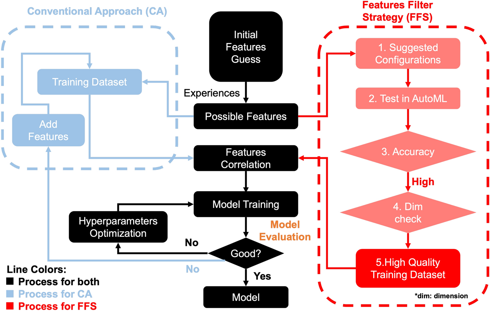

## Table of Contents

## What is Proposal Filtering in the context of Machine Learning?

Proposal filtering is a technique used in machine learning, particularly in object detection and image segmentation tasks. It involves generating a large set of potential object locations, or "proposals," and then filtering these proposals to keep only the most promising ones. This helps to reduce the computational load by focusing the model's attention on areas of the image that are more likely to contain objects of interest. By doing so, proposal filtering improves the efficiency and accuracy of the detection process.

In practice, proposal filtering often uses a scoring mechanism to rank the proposals. For example, a model might use a convolutional neural network (CNN) to assign a score to each proposal based on how likely it is to contain an object. Proposals with scores above a certain threshold are kept, while those below the threshold are discarded. This method allows the model to quickly narrow down the search space, making it more feasible to process complex images in real-time applications.

## Why is Proposal Filtering important in object detection tasks?

Proposal filtering is important in object detection tasks because it helps to make the process faster and more accurate. In object detection, the computer needs to look at many parts of an image to find objects. By using proposal filtering, the computer can quickly decide which parts of the image are most likely to have objects. This means the computer doesn't have to check every single part of the image, which saves time and makes the detection process more efficient.

Another reason proposal filtering is important is that it helps to improve the accuracy of object detection. When the computer generates many proposals, some might be good guesses, but many might not be. By filtering out the bad guesses, the computer can focus on the good ones. This makes it more likely that the computer will correctly identify and locate objects in the image. Overall, proposal filtering helps to balance speed and accuracy, making it a crucial step in object detection tasks.

## What is Non Maximum Suppression (NMS) and how does it work?

Non Maximum Suppression (NMS) is a technique used in object detection to clean up the results. When a computer looks for objects in a picture, it might find the same object more than once. NMS helps to keep only the best guess and remove the others, so the final result is more accurate and easier to understand.

Here's how NMS works: After the computer finds all possible objects, it sorts them by how sure it is about each one, usually using a score. It then picks the object with the highest score and removes any other objects that are too close to it. This is done by calculating how much the areas of the objects overlap. If the overlap, called Intersection over Union (IoU), is more than a certain amount, the other object is removed. This process continues until all objects have been checked, leaving only the best and most separate guesses.

## How does Soft-NMS improve upon traditional NMS?

Soft-NMS improves upon traditional NMS by being more gentle when it decides which object detections to keep or remove. In traditional NMS, if two detections are too close, the one with the lower score is completely removed. This can sometimes throw away good guesses. Soft-NMS, on the other hand, doesn't completely remove the lower-scoring detections. Instead, it lowers their scores a bit if they are close to a higher-scoring detection. This way, if the higher-scoring detection turns out to be wrong, the lower-scoring one still has a chance to be correct.

The way Soft-NMS works is by using a formula to adjust the scores of detections. If a detection is close to a higher-scoring one, its score is reduced based on how much they overlap. The formula for this is $$s_i = s_i \cdot e^{- \frac{{IoU(i, j)}^2}{\sigma}}$$, where $$s_i$$ is the score of the detection, $$IoU(i, j)$$ is how much it overlaps with the higher-scoring detection, and $$\sigma$$ is a number that controls how much the score is lowered. This approach helps keep more detections in the final result, making the object detection more accurate and robust.

## What are the key differences between Matrix NMS and standard NMS?

Matrix NMS and standard NMS both aim to clean up object detection results, but they do it in different ways. Standard NMS looks at detections one by one, starting with the highest-scoring one. It then removes or lowers the scores of other detections that overlap too much with it. This can be good but might miss some correct detections if the first ones chosen are wrong. Matrix NMS, on the other hand, looks at all detections at the same time. It uses a matrix to figure out how much each detection overlaps with all others, and then adjusts scores based on this overall view.

The key advantage of Matrix NMS is that it considers the whole picture at once. This means it can keep more good detections and remove fewer correct ones than standard NMS. Matrix NMS uses a formula to decide how to change the scores of detections. The formula is $$s_i = s_i \cdot \prod_{j \neq i} (1 - IoU(i, j))$$, where $$s_i$$ is the score of a detection, and $$IoU(i, j)$$ is how much it overlaps with another detection. This approach helps to make object detection more accurate by keeping more of the right guesses.

## Can you explain the concept of Adaptive NMS and its benefits?

Adaptive NMS is a way to make object detection even better by changing how it decides which guesses to keep or throw away. Unlike standard NMS, which uses the same rule for all pictures, Adaptive NMS looks at each picture and changes its rules to fit. It does this by figuring out how crowded the picture is. If there are a lot of objects close together, it will be more gentle and keep more guesses. If the objects are spread out, it can be stricter and throw away more guesses that overlap.

The main benefit of Adaptive NMS is that it can work well with different kinds of pictures. It doesn't use the same rule for every picture, so it can be more accurate. For example, if you have a picture of a busy street with lots of cars and people, Adaptive NMS will keep more guesses to make sure it finds all the objects. If you have a picture of a single tree in a field, it can be more strict and still find the tree without keeping extra guesses. This makes object detection more reliable and useful in real life.

## How does DIoU-NMS enhance the performance of object detection?

DIoU-NMS, or Distance-IoU Non Maximum Suppression, makes object detection better by thinking about how far apart objects are, not just how much they overlap. In regular NMS, if two guesses about where an object is overlap a lot, the guess with the lower score gets thrown away. But DIoU-NMS also looks at the distance between the centers of the guesses. This helps keep more correct guesses, especially when objects are close together but not exactly overlapping.

The way DIoU-NMS works is by using a special formula to decide how to change the scores of guesses. The formula is $$IoU = \frac{|B \cap B^{gt}|}{|B \cup B^{gt}|} - \frac{||center(B) - center(B^{gt})||^2}{c^2}$$, where $$B$$ and $$B^{gt}$$ are the guessed and real boxes, and $$c$$ is the diagonal length of the smallest box that can fit both. By using this formula, DIoU-NMS can tell the difference between guesses that are close but not the same, making object detection more accurate and useful in real life.

## What is FeatureNMS and how does it incorporate feature information?

FeatureNMS is a smart way to make object detection better by using not just where objects might be, but also what they look like. When a computer tries to find objects in a picture, it makes guesses about where the objects are. FeatureNMS looks at these guesses and also checks the features, or details, of the objects in those guesses. By doing this, it can tell if two guesses are really looking at the same object or different ones, even if they are close together.

The way FeatureNMS works is by using a special formula to decide how to change the scores of guesses. The formula is $$s_i = s_i \cdot (1 - \text{FIoU}(i, j))$$, where $$s_i$$ is the score of a guess, and $$\text{FIoU}(i, j)$$ is how much the features of two guesses overlap. By looking at both where the guesses are and what they look like, FeatureNMS can keep more correct guesses and throw away fewer good ones. This makes object detection more accurate and useful, especially when objects in a picture are close together or look similar.

## How does IoU-guided NMS differ from other NMS techniques?

IoU-guided NMS is different from other NMS techniques because it uses a special way to decide which guesses to keep or throw away. It looks at how much two guesses overlap, called Intersection over Union (IoU), but it also thinks about how good the guesses are. If two guesses overlap a lot but one is much better than the other, IoU-guided NMS will keep the better one and throw away the worse one. This helps to keep the best guesses and makes object detection more accurate.

The way IoU-guided NMS works is by using a formula to change the scores of guesses. The formula is $$s_i = s_i \cdot (1 - IoU(i, j))$$ if $$IoU(i, j) > \theta$$, where $$s_i$$ is the score of a guess, $$IoU(i, j)$$ is how much it overlaps with another guess, and $$\theta$$ is a number that decides when to start changing the score. By using this formula, IoU-guided NMS can be more careful about which guesses to keep, making sure it doesn't throw away good guesses just because they overlap a bit. This makes object detection better, especially in crowded pictures where objects are close together.

## What are the challenges faced when implementing advanced NMS techniques like FeatureNMS?

Implementing advanced NMS techniques like FeatureNMS can be tricky because it needs more information than just where objects might be. FeatureNMS looks at the details, or features, of the objects too. This means the computer has to work harder to find and compare these features. It also needs more memory to store all this extra information. If the computer doesn't have enough power or memory, using FeatureNMS can make the object detection slower or even crash the program.

Another challenge is figuring out the right way to use the feature information. FeatureNMS uses a special formula, $$s_i = s_i \cdot (1 - \text{FIoU}(i, j))$$, to decide how to change the scores of guesses. But choosing the best way to calculate the feature overlap, or FIoU, can be hard. Different pictures and objects might need different ways to compare features. If the method is not right, FeatureNMS might not work well and could make the object detection less accurate.

## How can one evaluate the effectiveness of different NMS methods in a practical setting?

To evaluate the effectiveness of different NMS methods in a practical setting, you can use a set of pictures that have objects already marked in them. These are called ground truth labels. You run your object detection program with different NMS methods on these pictures and see how well each method finds the objects. You can measure this by looking at things like how many objects were found correctly (precision), how many of the real objects were found (recall), and how well the guesses match the real objects (IoU). For example, you might use the formula $$IoU = \frac{|B \cap B^{gt}|}{|B \cup B^{gt}|}$$ to see how well a guess matches a real object.

Another way to evaluate NMS methods is by looking at how fast they work. Some methods might be more accurate but take longer to run, which can be a problem if you need quick results. You can time how long each method takes to process a picture and compare this with how accurate it is. This helps you find a good balance between speed and accuracy. By testing different NMS methods on the same set of pictures and comparing their results, you can choose the best one for your needs.

## What future developments can we expect in the field of Proposal Filtering?

In the future, we might see more smart ways to filter proposals in object detection. Right now, computers use methods like NMS to decide which guesses about where objects are in a picture to keep or throw away. But future methods might look at even more details, like the shape and color of objects, to make better guesses. This could help the computer find objects more accurately, especially in crowded pictures where objects are close together. For example, a new method might use a formula like $$s_i = s_i \cdot (1 - \text{FIoU}(i, j))$$ to decide how to change the scores of guesses based on how much their features overlap.

Another thing we might see is computers getting faster and better at filtering proposals. Right now, some methods can take a long time to work because they need a lot of power and memory. In the future, new ways might be found to make these methods quicker and use less memory. This would be really helpful for things like self-driving cars or security cameras, where the computer needs to find objects quickly and accurately. By making proposal filtering faster and more accurate, we can use object detection in more places and make it more useful in our everyday lives.

## References & Further Reading

[1]: Ren, S., He, K., Girshick, R., & Sun, J. (2015). ["Faster R-CNN: Towards Real-Time Object Detection with Region Proposal Networks."](https://ieeexplore.ieee.org/document/7485869) IEEE Transactions on Pattern Analysis and Machine Intelligence.

[2]: Neubeck, A., & Van Gool, L. (2006). ["Efficient Non-Maximum Suppression."](https://ieeexplore.ieee.org/abstract/document/1699659) 18th International Conference on Pattern Recognition (ICPR).

[3]: Bodla, N., Singh, B., Chellappa, R., & Davis, L. S. (2017). ["Soft-NMS - Improving Object Detection With One Line of Code."](https://arxiv.org/abs/1704.04503) Proceedings of the IEEE International Conference on Computer Vision (ICCV).

[4]: Cai, Z., & Vasconcelos, N. (2016). ["Cascaded Convolutional Neural Networks for Direct MR Image Reconstruction."](https://arxiv.org/abs/1607.07155) 29th IEEE Conference on Computer Vision and Pattern Recognition (CVPR).

[5]: Zhu, X., Hu, H., Lin, S., & Dai, J. (2018). ["Deformable ConvNets v2: More Deformable, Better Results."](https://arxiv.org/abs/1811.11168) European Conference on Computer Vision (ECCV). 

[6]: Liu, W., Anguelov, D., Erhan, D., Szegedy, C., Reed, S., Fu, C. Y., & Berg, A. C. (2016). ["SSD: Single Shot MultiBox Detector."](https://arxiv.org/abs/1512.02325) European Conference on Computer Vision (ECCV).

[7]: Mahapatra, D., Antony, B., Sedai, S., & Garnavi, R. (2017). ["Image Super-Resolution Generative Adversarial Networks with Self-Attention Mechanism."](https://ieeexplore.ieee.org/document/8363845) arXiv preprint.

[8]: Zhang, S., Chi, C., Yao, Y., Lei, Z., & Li, S. Z. (2020). ["Bridging the Gap Between Anchor-based and Anchor-free Detection via Adaptive Training Sample Selection."](https://arxiv.org/abs/1912.02424) Proceedings of the IEEE/CVF Conference on Computer Vision and Pattern Recognition (CVPR).