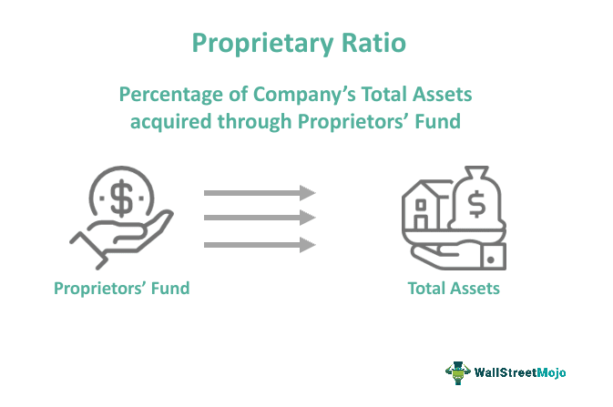

Algorithmic trading, commonly known as algo trading, is a sophisticated trading strategy that employs computers to execute trades at lightning speed and precision. At the core of algo trading is the utilization of market data, which traders leverage to make prompt and informed decisions. Market data is primarily sourced from two main types of feeds: proprietary feeds and Securities Information Processors (SIPs). These feeds serve distinct roles within the trading environment, and discerning their differences is instrumental for traders looking to refine their strategies.

The landscape of algorithmic trading is ever-evolving, driven by rapid advancements in technology and the increasing need for efficiency. This article aims to elucidate the contrasts between proprietary feeds and SIP data within the framework of algorithmic trading. It provides a clear definition of each data source, highlights their advantages and drawbacks, and offers guidance to traders in selecting the type of feed that aligns best with their trading objectives.

Proprietary feeds are direct data streams offered by individual exchanges, delivering comprehensive and detailed market information. These feeds are particularly valuable for high-frequency traders who require depth of data and minimal latency. On the other hand, SIPs aggregate data from multiple exchanges to provide a consolidated view of the market. While they ensure a standardized and accessible flow of information, their latency and restricted data granularity may not meet the needs of traders involved in time-critical strategies.

The choice between proprietary and SIP feeds can be pivotal to maintaining a competitive advantage in algo trading. Fast and accurate market data is increasingly becoming the backbone of successful trading strategies. Therefore, understanding the nuances of each data type and selecting the appropriate feed is crucial for traders aiming to excel in this domain.

## Table of Contents

## Understanding SIP Data

Securities Information Processors (SIPs) are integral to the functioning of the U.S. financial markets. They aggregate data from multiple exchanges to deliver a unified stream of information, which prominently includes the National Best Bid and Offer (NBBO). The NBBO represents the highest bid price and the lowest ask price available for a security across all exchanges, providing a crucial benchmark for traders and investors.

SIPs play a pivotal role in ensuring that all market participants have equal access to essential market data. By disseminating a standardized set of data, SIPs enhance market transparency and fairness, enabling participants to make informed trading decisions. This uniform data delivery is particularly beneficial for individual or non-professional traders who might not have the resources to handle more complex datasets.

Despite these advantages, SIP data has its limitations. Primarily, it provides what is known as 'Level 1' data, which includes only top-of-book information—essentially the best bid and ask prices. This level of detail is often insufficient for high-frequency trading ([HFT](/wiki/high-frequency-trading-strategies)) strategies, which thrive on detailed and rapid data to execute trades profitably. High-frequency traders typically require 'Level 2' or even 'Level 3' data, which offer deeper insights into market depth and individual order [books](/wiki/algo-trading-books). These insights facilitate more precise trading decisions and are not available through SIPs, compelling traders to seek additional data sources when aiming for speed and detail.

In summary, while SIPs are fundamental for ensuring a fair and transparent trading environment by providing essential market data, their limitations in data granularity make them less suitable for strategies that demand quick and detailed market visibility.

## Understanding Proprietary Feeds

Proprietary feeds are direct data distributions offered by individual exchanges, designed to provide more comprehensive and detailed information compared to Securities Information Processors (SIPs). These feeds encompass 'Level 2' and 'Level 3' data, which include information on the depth of the market, illustrating not just the best bid and ask but also revealing the full [order book](/wiki/order-book-trading-strategies) encompassing various price levels. This complete view allows traders to observe the market dynamics more finely, including the presence of large buy or sell orders that might not be apparent with the more limited data provided by SIPs.

A significant advantage of proprietary feeds is the inclusion of data points that are unavailable in SIPs. These comprise odd lot quotes, which are orders that involve a quantity of shares less than what is usually considered a standard trading unit. Odd lots can be crucial for understanding trading anomalies or smaller investor behaviors that could signal broader market shifts. Additionally, these feeds offer full order histories, enabling traders to analyze past trades for potential patterns or insights into market behavior over time.

One of the most compelling benefits of using proprietary feeds is their reduced latency. Latency refers to the delay between the generation of market data and the time it is received by a trader's systems. Low latency is essential in high-frequency trading (HFT) strategies, where the speed of execution can significantly impact profitability. Traders leveraging proprietary feeds can execute trades more swiftly and with greater precision, providing a competitive edge in markets where milliseconds can determine the success or failure of a trade.

By offering enhanced data detail and reducing latency, proprietary feeds serve as a pivotal resource for traders who require an intricate understanding of market movements and who wish to exploit temporal market inefficiencies. While SIPs offer a consolidated and standardized view, proprietary feeds empower traders with the granularity and speed necessary for today's fast-paced trading environment.

## Pros and Cons of SIP Data

SIP data, often referred to as consolidated tape data, is a cornerstone for many traders due to its widespread availability and cost-effectiveness. Its standardized and consolidated nature plays a pivotal role in providing a uniform view of market prices, which is particularly advantageous for general trading and broad investment analysis. By aggregating data from multiple exchanges, SIPs furnish a single stream encompassing essential metrics, such as the National Best Bid and Offer (NBBO), ensuring that all market participants have access to the same foundational market information.

A primary benefit of SIP data lies in its accessibility to individual and non-professional traders. Since these feeds aggregate and disseminate essential trading information at a lower cost, they make market participation feasible for a broader audience without the financial burden of subscribing to costly, proprietary feeds. This democratization of data allows a wider spectrum of market participants to engage in trading activities without the need for complex data management infrastructure.

However, SIP data presents limitations that are critical for traders with advanced or latency-sensitive strategies to consider. The time it takes for data to travel and be processed, known as latency, is inherently higher in SIP feeds compared to proprietary feeds. This delay can be a significant drawback for traders engaged in high-frequency trading or other strategies that rely on near-instantaneous market reactions. Furthermore, SIP data typically offers 'Level 1' information, which includes top-of-book data such as the best bid and ask prices but lacks the depth and granularity of 'Level 2' data, where information about order book depth and individual orders is available. Consequently, traders requiring detailed insights into market dynamics may find SIP data insufficient for their decision-making processes.

In summary, while SIP data is cost-effective and provides a standardized view of the market beneficial for general analysis and less complex trading strategies, its higher latency and limited detail reduce its suitability for traders who require precise and rapid execution capabilities. These limitations highlight the importance of assessing one's trading needs and strategies before selecting a data feed.

## Pros and Cons of Proprietary Feeds

Proprietary feeds offer several distinct advantages for traders engaging in high-frequency and [algorithmic trading](/wiki/algorithmic-trading) operations. Chief among these benefits is the superior data granularity they provide. Unlike SIP data, which generally offers only top-of-book information, proprietary feeds deliver in-depth insights into the order book, encompassing 'Level 2' and 'Level 3' data. This extensive data reveals market depth and individual orders, presenting traders with a comprehensive picture of market dynamics. Such detailed information is invaluable for crafting sophisticated trading algorithms, which can capitalize on nuances in order flow and market sentiment.

Additionally, proprietary feeds are characterized by their lower latency. In high-frequency trading (HFT), even microseconds can translate into significant financial impacts, therefore, the reduced latency of proprietary feeds is crucial. This low latency allows for faster data analysis and quicker execution of trading strategies, potentially leading to better market positioning and increased profitability.

However, the primary drawback of proprietary feeds is their cost. Accessing these feeds typically requires a subscription fee, and if a trader needs data from multiple exchanges, these costs can accumulate rapidly. The financial burden can be a significant consideration for trading firms, especially those with limited budgets.

Moreover, handling the vast amount of data provided by proprietary feeds introduces additional challenges. The sheer [volume](/wiki/volume-trading-strategy) and complexity of data necessitate robust data management systems and significant computational resources. Ensuring that trading systems can efficiently process and analyze such extensive datasets is essential, but it can add to the operational complexity and overhead. Consequently, the cost and complexity associated with proprietary feeds can pose substantial barriers, particularly for smaller trading operations or individual traders with constrained resources.

## Choosing the Right Data Feed for Algo Trading

Choosing the right data feed for algorithmic trading is a vital decision influenced by several factors, primarily the trading strategy and the trader's specific needs. Understanding the differences between Securities Information Processors (SIPs) and proprietary feeds can significantly impact the efficacy of trading strategies, especially those that rely on speed and data precision.

For latency-sensitive strategies and those requiring detailed market visibility, proprietary feeds are typically the preferred option. These direct data feeds from exchanges provide real-time information, which can be crucial for making split-second trading decisions. Proprietary feeds offer comprehensive insights, including depth-of-market and full order book details. This level of granularity is essential for developing sophisticated algorithms that can react swiftly to market changes.

Traders who do not require the advanced features offered by proprietary feeds and are more concerned with cost-efficiency might find SIP data sufficient. SIPs provide consolidated market data, ensuring transparency and a consistent market view for all participants. Although they come with inherent latency and provide less detailed information compared to proprietary feeds, SIPs remain a reliable and affordable choice for traders with less demanding requirements.

Ultimately, choosing the appropriate data feed involves a careful evaluation of the pros and cons of each type, considering the trader's budget and trading objectives. It's important to align the data feed choice with the specific needs of the algorithmic strategy to optimize performance. Making informed decisions about market data sources can greatly enhance trading results, ensuring that the chosen data feed complements the trader's approach and supports their trading goals effectively.

## Conclusion

Both SIP data and proprietary feeds present distinct advantages and limitations that directly influence the choice of data source for algorithmic traders. An understanding of these differences is essential for aligning trading strategies effectively. On the one hand, SIP data offers a cost-effective and standardized view of the market, making it suitable for traders who do not require granular data inputs. Its universal accessibility helps ensure that market transparency and fairness are maintained, but latency and data depth shortcomings can restrict its utility in high-frequency trading environments.

In contrast, proprietary feeds are distinguished by their comprehensive data granularity and low latency. These qualities make them invaluable to traders pursuing sophisticated, latency-sensitive strategies. The feeds provide detailed insights into market movements, enhancing traders' ability to make informed decisions and maintain a competitive edge. However, the associated costs and complexity of managing such rich datasets may pose challenges, particularly for smaller trading operations.

As algorithmic trading evolves and the demands for high-quality market data intensify, the reliance on precise and low-latency data becomes increasingly pronounced. Therefore, proprietary feeds emerge as a preferred choice for many professional traders. Nonetheless, selecting the appropriate data feed is a critical decision that can significantly impact algorithmic trading performance. It necessitates a thorough evaluation considering budget constraints, trading goals, and the specific requirements of the trading strategies employed. This careful consideration can drive successful trading outcomes and optimize the performance of algorithmic systems.

## About Databento

Databento provides a comprehensive suite of market data services specifically designed for algorithmic traders. By utilizing direct proprietary feeds, Databento ensures that traders receive detailed and low-latency data, which is particularly advantageous for high-frequency trading strategies. These feeds offer enhanced granularity by incorporating a broader range of data points, enabling traders to develop and implement sophisticated algorithms with greater market insight.

Databento's services cover a variety of asset classes and market venues, allowing traders to access an extensive and versatile dataset. This level of data diversity supports advanced trading strategies across different financial instruments and markets, ensuring that traders have the necessary resources to optimize their performance.

For more information about Databento's market data solutions, traders and developers can visit Databento's official website. Additionally, Databento provides comprehensive documentation intended to assist developers in integrating and utilizing their data services effectively, facilitating a seamless trading experience.

## References & Further Reading

[1]: Hasbrouck, J., & Saar, G. (2013). ["Low-latency trading."](https://www.sciencedirect.com/science/article/abs/pii/S1386418113000165) The Review of Financial Studies, 26(9), 1590-1624.

[2]: Hendershott, T., Jones, C. M., & Menkveld, A. J. (2011). ["Does Algorithmic Trading Improve Liquidity?"](https://onlinelibrary.wiley.com/doi/full/10.1111/j.1540-6261.2010.01624.x) The Journal of Finance, 66(1), 1-33.

[3]: O'Hara, M. (2015). ["High-frequency Market Microstructure."](https://www.sciencedirect.com/science/article/pii/S0304405X15000045) Journal of Financial Economics, 116(2), 257-270.

[4]: ["Machine Learning for Algorithmic Trading"](https://github.com/stefan-jansen/machine-learning-for-trading) by Stefan Jansen

[5]: Fabozzi, F. J., & Chincarini, L. B. (2010). ["Quantitative Equity Portfolio Management: An Active Approach to Portfolio Construction and Management"](https://www.amazon.com/Quantitative-Equity-Portfolio-Management-Second-ebook/dp/B09KF52TKD). Wiley.

[6]: Aldridge, I. (2013). ["High-Frequency Trading: A Practical Guide to Algorithmic Strategies and Trading Systems"](https://books.google.com/books/about/High_Frequency_Trading.html?id=8QpIsVUMhmEC). Wiley.