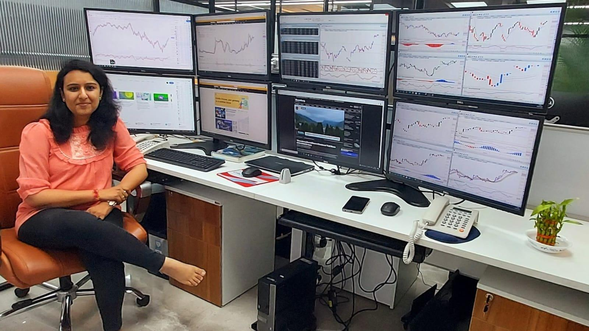

## Table of Contents

## What is a proprietary trading desk?

A proprietary trading desk, often called a prop desk, is a part of a financial firm where traders use the company's own money to buy and sell stocks, bonds, or other financial products. The goal is to make a profit for the firm, not for outside clients. This is different from other parts of the firm where traders might be managing money for clients or investors.

Proprietary trading can be risky because the firm is using its own money. If the trades don't go well, the firm could lose a lot of money. But if the trades are successful, the firm can make a lot of profit. Because of this, firms that have prop desks often hire very skilled traders and use advanced technology and strategies to try to make the best trades possible.

## How does a proprietary trading desk differ from other types of trading?

A proprietary trading desk is different from other types of trading because it uses the firm's own money to make trades. This is called trading with "house money." In other types of trading, like client trading, the money belongs to clients or investors, and the firm earns money by charging fees or commissions for managing those funds. With prop trading, the firm keeps all the profits if the trades are successful, but it also bears all the losses if the trades go wrong.

Another key difference is the focus and risk level. Proprietary trading desks often take bigger risks because they are trying to make big profits for the firm. They might use complex strategies and trade in large volumes. In contrast, trading for clients often involves following specific investment goals set by the clients, which might be more conservative and less risky. This means prop traders have more freedom to try different trading strategies, but they also have to be very skilled and use advanced tools to manage the higher risk.

## What are the main goals of a proprietary trading desk?

The main goal of a proprietary trading desk is to make money for the firm by using its own money to trade. They buy and sell stocks, bonds, and other financial products, trying to make a profit from the price changes. Unlike other parts of the firm where they manage money for clients, prop desks keep all the profits they make. This means they have a big incentive to do well, because their success directly helps the firm's bottom line.

Another goal is to take advantage of market opportunities quickly. Prop desks often use advanced technology and trading strategies to spot and act on these opportunities faster than others. This can mean taking bigger risks, but it's worth it if they can make big profits. The freedom to try different strategies and the ability to act fast are what set prop desks apart and help them achieve their main goal of making money for the firm.

## What types of financial instruments are typically traded on a proprietary trading desk?

Proprietary trading desks usually trade a wide variety of financial instruments. Common ones include stocks, which are shares in companies, and bonds, which are loans to governments or corporations. They also trade options and futures, which are contracts that give the right to buy or sell assets at a set price in the future. These instruments can be used to make money from small changes in price or to bet on big market moves.

In addition to these, prop desks often trade currencies in the foreign exchange market, where they can make profits from changes in exchange rates. They might also deal in commodities like oil, gold, or agricultural products, trying to predict and profit from changes in supply and demand. All these financial instruments give prop traders a lot of flexibility to find and take advantage of different trading opportunities.

## What skills and qualifications are required to work on a proprietary trading desk?

To work on a proprietary trading desk, you need to be really good at understanding and predicting how markets work. You should have a strong background in finance or economics, often with a degree in one of these areas. It's also important to be good at math and have strong analytical skills because you'll be looking at a lot of data and making quick decisions based on it. Many prop traders also have experience in trading or financial analysis, which helps them understand the risks and opportunities in the market.

Besides the technical skills, you need to be able to handle stress and make fast decisions. Trading can be high-pressure, and you need to stay calm even when things are going up and down quickly. Good communication skills are also important because you'll be working with other traders and sometimes with other parts of the firm. Being able to work well in a team and learn from others can make a big difference in how successful you are on a prop desk.

## How is risk managed on a proprietary trading desk?

Risk management on a proprietary trading desk is very important because the firm is using its own money to trade. They use different ways to keep risks under control. One way is by setting limits on how much money can be used for trading. This helps stop traders from losing too much if things go wrong. They also use something called stop-loss orders, which automatically sell a stock or other financial product if its price drops too much. This helps limit losses and protect the firm's money.

Another way prop desks manage risk is by spreading out their investments. Instead of putting all their money into one thing, they invest in different types of financial products like stocks, bonds, and commodities. This way, if one type of investment goes down, the others might still do well and balance things out. They also use advanced computer programs and models to predict how risky different trades might be. These tools help traders make smarter decisions and avoid big losses.

## What are the typical daily activities of a trader on a proprietary trading desk?

A trader on a proprietary trading desk starts their day early, usually before the markets open. They begin by checking the news and market reports to see what's happening around the world. This helps them understand what might affect the prices of stocks, bonds, and other things they trade. They also look at how their current trades are doing and decide if they need to make any changes. Once the markets open, they start buying and selling based on their plans and the new information they've gathered. They use special computer programs to help them make quick decisions and keep track of everything.

Throughout the day, traders keep a close eye on the markets and their trades. They might adjust their strategies if something unexpected happens or if they see a new opportunity. They talk with other traders and sometimes with the firm's risk managers to make sure they're not taking too many risks. As the trading day winds down, they review their trades to see what worked and what didn't. They might start planning for the next day, thinking about what they want to do differently or what new ideas they want to try. At the end of the day, they report their results to their bosses and get ready to do it all over again the next day.

## How do proprietary trading desks use technology and algorithms in their operations?

Proprietary trading desks use technology and algorithms a lot to help them make money. They use special computer programs to look at lots of data really fast. These programs can find patterns and opportunities in the market that people might miss. For example, they can see if a stock's price is going up or down and decide to buy or sell it quickly. This helps traders make decisions faster and more accurately than they could on their own.

Algorithms are like sets of rules that the computer follows to make trades. They can be set up to do things like buy a stock when its price hits a certain level or sell it if it starts to drop too much. This helps manage risk and can make trading more efficient. Traders can also use algorithms to test different trading strategies without risking real money. This way, they can see what works best before they start trading for real.

## What are the regulatory considerations for proprietary trading desks?

Proprietary trading desks have to follow a lot of rules set by government agencies like the Securities and Exchange Commission (SEC) in the United States. These rules are there to make sure that trading is fair and that firms don't take too many risks with their money. For example, there are rules about how much money a firm can use for trading and what kinds of financial products they can trade. There are also rules to stop insider trading, which is when someone uses secret information to make money.

Another important thing is the Volcker Rule, which is part of a big law called the Dodd-Frank Act. This rule says that banks can't use their own money to trade for profit in a way that's too risky. It's meant to keep banks safe and stop them from causing big problems in the economy. Proprietary trading desks have to make sure they follow all these rules, or they could get in big trouble and have to pay fines.

## How do proprietary trading desks contribute to market liquidity?

Proprietary trading desks help make the market more liquid. Liquidity means how easy it is to buy or sell something without changing its price too much. When prop desks trade a lot, they add more buyers and sellers to the market. This makes it easier for everyone to trade because there are more people to buy from or sell to. It's like having more people at a market, so you can find someone to trade with more easily.

By trading a lot, prop desks also help keep prices stable. When they buy and sell, they can help balance out big swings in prices. If a stock's price starts to drop a lot, prop traders might see it as a good deal and start buying, which can help stop the price from falling too far. This makes the market smoother and more predictable for everyone. So, prop desks play a big role in making sure the market works well for all traders.

## What are the common strategies employed by proprietary trading desks?

Proprietary trading desks use different strategies to make money. One common strategy is called [scalping](/wiki/gamma-scalping). This means they buy and sell things really fast, trying to make small profits from tiny changes in price. They might do this many times a day, and all those small profits can add up to a lot of money. Another strategy is called [market making](/wiki/market-making). Here, they buy and sell things to help keep the market moving smoothly. They make money from the difference between the price they buy at and the price they sell at.

Another strategy they use is called statistical [arbitrage](/wiki/arbitrage). This means they use math and computer programs to find patterns in the market. They look for times when prices might be wrong and try to make money from fixing those mistakes. They also use a strategy called event-driven trading. This is when they trade based on big news or events, like a company announcing good or bad news. They try to guess how the market will react and make trades before everyone else catches on. All these strategies help prop desks make money and keep the market working well.

## How do proprietary trading desks adapt to market changes and economic cycles?

Proprietary trading desks have to be really good at changing their strategies when the market or the economy changes. They watch the news and market trends all the time. If they see something big happening, like a new law or a big company going bankrupt, they quickly figure out how it might affect prices. They might start trading in different things or use different strategies to take advantage of the new situation. For example, if they think the economy is going to slow down, they might buy things that do well when times are tough, like gold or government bonds.

They also use special computer programs and math to help them adapt. These programs can look at a lot of data really fast and find patterns that people might miss. If the market starts acting differently, the programs can help the traders see it and change their plans quickly. This way, they can keep making money even when things are changing a lot. It's all about staying flexible and being ready to try new things when the market or the economy shifts.

## References & Further Reading

[1]: ["The Volcker Rule and its Impacts on Financial Markets"](https://journals.law.harvard.edu/hblr/wp-content/uploads/sites/87/2014/09/Volcker-Rule.pdf), a paper published by the Journal of Applied Corporate Finance.

[2]: Lel, U., & Shirai, S. (2009). ["Foreign Ownership, Governance, and Bank Performance: Evidence from a Transition Economy."](https://www.sciencedirect.com/science/article/pii/S0378426613002276) RIETI Discussion Paper.

[3]: Khandani, A. E., & Lo, A. W. (2007). ["What Happened to the Quants in August 2007?"](https://web.mit.edu/Alo/www/Papers/august07.pdf) National Bureau of Economic Research Working Paper No. 14465.

[4]: Lopez de Prado, M. (2018). ["Advances in Financial Machine Learning"](https://www.amazon.com/Advances-Financial-Machine-Learning-Marcos/dp/1119482089) Wiley.

[5]: Chan, E. P. (2008). ["Quantitative Trading: How to Build Your Own Algorithmic Trading Business"](https://github.com/ftvision/quant_trading_echan_book) Wiley Trading.

[6]: Aronson, D. R. (2007). ["Evidence-Based Technical Analysis: Applying the Scientific Method and Statistical Inference to Trading Signals"](https://onlinelibrary.wiley.com/doi/book/10.1002/9781118268315) Wiley.