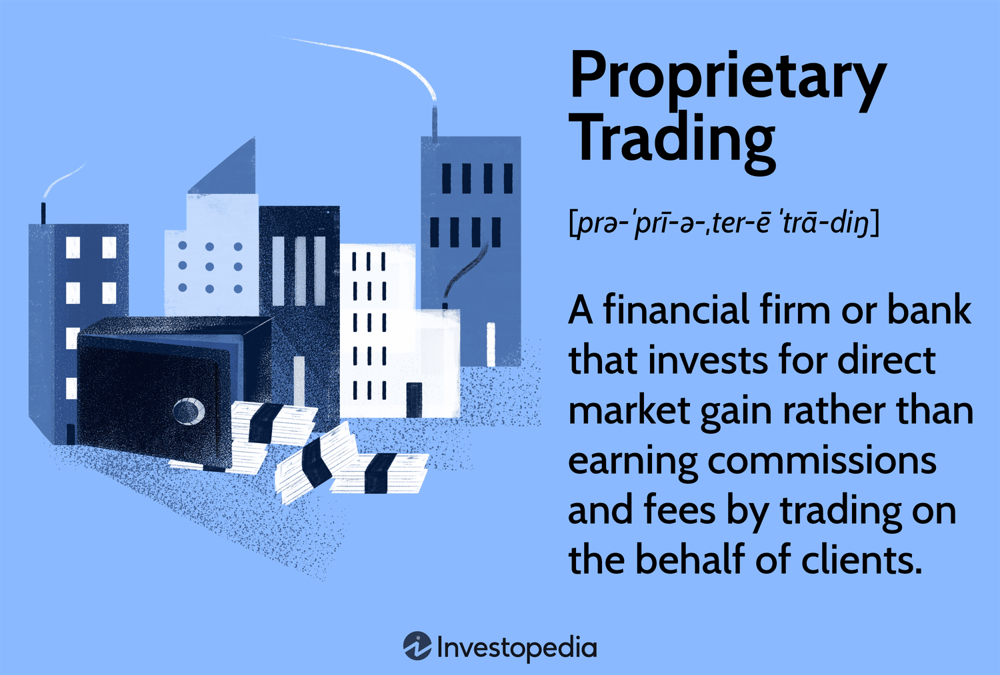

## Table of Contents

## What is a proprietary trading firm?

A proprietary trading firm, often called a prop firm, is a company that uses its own money to trade financial markets. Instead of trading with clients' money, these firms use their own capital to buy and sell stocks, currencies, commodities, and other financial instruments. The goal is to make a profit from these trades, and the firm keeps all the gains or losses.

Proprietary trading firms hire skilled traders who use various strategies to try to make money. These strategies can include using complex computer algorithms, taking advantage of small price differences in different markets, or betting on long-term trends. Because the firm is using its own money, it can take bigger risks than a traditional investment firm that manages clients' money. This can lead to higher profits, but also higher losses.

## How does a proprietary trading firm make money?

A proprietary trading firm makes money by using its own money to trade in financial markets. They buy and sell things like stocks, currencies, and commodities. The goal is to buy low and sell high, or sell high and buy back low, to make a profit. If they do this successfully, the firm keeps all the money they make from these trades.

The firm hires traders who are good at figuring out when to buy and sell. These traders use different strategies to try to make money. Some use computers to find the best times to trade, while others look at long-term trends or small price differences between markets. If the traders are successful, the firm makes money. But if they are not, the firm loses money. It's a risky business, but the potential for big profits is what drives proprietary trading firms.

## What are the main differences between proprietary trading and other types of trading?

Proprietary trading is different from other types of trading because it uses the firm's own money instead of clients' money. In other types of trading, like those done by investment firms or brokerages, the money being traded belongs to clients. The firm earns money by charging fees or commissions for managing the clients' money. But in proprietary trading, the firm keeps all the profits or losses from the trades because it's their own money they're using.

Another big difference is the level of risk and potential reward. Proprietary trading can be riskier because the firm can take bigger risks with its own money. They might use more aggressive strategies to try to make more money. Other types of trading, like those with clients' money, have to be more careful because they are responsible for their clients' investments. This means they might not be able to take the same big risks that a proprietary trading firm can.

## What are the typical requirements to join a proprietary trading firm?

To join a proprietary trading firm, you usually need to have a strong background in trading or finance. Many firms look for people who have experience trading on their own or working at other financial companies. They also want to see that you understand how markets work and can make smart trading decisions. Some firms might ask you to show them your past trading results to prove you can make money.

Besides experience, you often need to pass some tests or go through a training program. These tests check if you know enough about trading and if you can handle the fast-paced environment of a prop firm. The training program helps you learn the firm's specific trading strategies and tools. It's important to do well in these tests and training because the firm wants to make sure you can help them make money without losing too much of their own.

## What kind of training do proprietary trading firms offer to new traders?

Proprietary trading firms usually offer a training program to help new traders learn the ropes. The training often starts with the basics of trading, like how to use the firm's trading platforms and tools. They teach you about different financial markets, like stocks, currencies, and commodities, and how to analyze them. You'll also learn about the firm's specific trading strategies, which might include using computer algorithms or looking for small price differences in markets.

After the basics, the training gets more hands-on. New traders often get to practice trading with simulated money, so they can make mistakes without losing real money. This part of the training helps you get used to the fast-paced environment of a prop firm and learn how to make quick decisions. The firm wants to make sure you can handle the pressure and make smart trades before they let you trade with their real money.

## What are the common strategies used by traders in proprietary trading firms?

Traders in proprietary trading firms use many different strategies to make money. One common strategy is using computer algorithms. These are special computer programs that can look at lots of information very quickly and decide when to buy or sell. Traders set up these algorithms to find the best times to trade, often looking for small price differences between markets. This is called [arbitrage](/wiki/arbitrage), and it can make money if done right.

Another strategy is [trend following](/wiki/trend-following). This means traders watch the market to see if prices are going up or down over time. If they see a trend, they might buy when prices are low and sell when they go up, or sell when prices are high and buy back when they go down. This can be a good way to make money if the trend keeps going the same way. But if the trend changes, it can lead to losses.

Some traders also use a strategy called [market making](/wiki/market-making). This means they buy and sell the same thing at the same time, but at slightly different prices. They make money from the difference between the buying and selling prices. This can be a steady way to make money, but it needs a lot of trades to work well. Each of these strategies has its own risks and rewards, and traders often use a mix of them to try to make the most money.

## How do proprietary trading firms manage risk?

Proprietary trading firms manage risk by setting strict rules for their traders. They might limit how much money a trader can use for each trade, or how much they can lose in a day. This helps stop big losses from happening. They also use something called stop-loss orders. These are automatic orders that sell a trade if the price goes down too much, to stop losing more money.

Another way they manage risk is by using different trading strategies at the same time. By spreading their money across many trades, they can balance out the wins and losses. If one trade loses money, another might make money, and it all evens out. They also watch the market closely and change their strategies if they see big changes coming. This helps them stay safe even when the market is moving a lot.

## What technology and tools are essential for traders in a proprietary trading firm?

Traders in a proprietary trading firm need a lot of technology and tools to do their job well. The most important tool is a trading platform. This is a special computer program that lets traders buy and sell things like stocks and currencies. The platform shows them all the important information they need, like prices and how much people are buying or selling. It also lets them set up automatic trades, which can be really helpful for using strategies like algorithms.

Another essential tool is a good computer with fast internet. Trading happens very quickly, so traders need a computer that can keep up. They also need fast internet to make sure they can buy or sell at the right time. Many traders use special software for analyzing the market, too. This software can look at lots of data and help traders find the best times to trade. It's like having a smart helper that makes their job easier and helps them make better decisions.

## How do proprietary trading firms evaluate the performance of their traders?

Proprietary trading firms evaluate the performance of their traders mainly by looking at how much money they make. They keep track of each trader's profits and losses over time. If a trader makes a lot of money, that's a good sign. But if they lose a lot, that's not good. The firm also looks at how well the trader follows the rules. They want to make sure traders are not taking too many risks or breaking any rules.

Besides looking at money and rules, firms also use other ways to judge performance. They might watch how traders make decisions and how they handle stress. Some firms use special computer programs to analyze a trader's performance in detail. These programs can show if a trader is good at certain strategies or if they need to improve in some areas. By using all these methods, the firm can get a full picture of how well their traders are doing.

## What are the regulatory considerations for proprietary trading firms?

Proprietary trading firms have to follow rules set by government agencies. These rules are there to make sure the firms do not do anything that could harm the markets or the economy. In the United States, the main agency that watches over these firms is the Securities and Exchange Commission (SEC). The SEC makes sure that firms follow laws like the Dodd-Frank Act, which was made to stop risky trading that could cause big problems. Firms also have to follow rules from other agencies, like the Commodity Futures Trading Commission (CFTC), if they trade things like commodities.

These rules can be different in different countries. For example, in the European Union, firms have to follow the Markets in Financial Instruments Directive (MiFID). This set of rules is meant to make trading safer and more fair. Proprietary trading firms need to keep up with all these rules and make sure they are always following them. If they break the rules, they can get in big trouble, like paying big fines or even having to stop trading. So, it's very important for these firms to understand and follow all the regulations that apply to them.

## How has the role of proprietary trading firms evolved in the financial markets?

The role of proprietary trading firms in financial markets has changed a lot over the years. At first, these firms were mainly about using their own money to trade and make profits. They did this by finding small price differences between markets or betting on long-term trends. But as time went on, rules and laws changed, and banks were told they could not do as much proprietary trading. This opened up more space for independent prop firms to grow and become more important in the markets.

Now, proprietary trading firms use a lot of technology and computer programs to trade. They have become really good at using these tools to find the best times to buy and sell. This has made them very important in the markets because they can move a lot of money around quickly. They also help keep the markets working well by buying and selling things all the time. But they still have to follow strict rules to make sure they do not cause any big problems in the markets.

## What are the future trends and challenges facing proprietary trading firms?

The future of proprietary trading firms looks like it will be shaped a lot by technology. More and more, these firms are using computers and special programs to trade. This means they can make decisions very quickly and handle a lot of trades at once. In the future, we might see even more advanced technology, like [artificial intelligence](/wiki/ai-artificial-intelligence), being used to find the best times to buy and sell. This could help firms make more money, but it also means they need to keep up with new tech to stay competitive.

There are also some big challenges that proprietary trading firms will face. One big challenge is keeping up with all the rules and laws that are always changing. Governments want to make sure the markets are safe and fair, so they keep making new rules that firms have to follow. Another challenge is dealing with more competition. As more firms use the same technology, it can be harder to make money. Firms will need to find new ways to stand out and make profits, even as the markets get more crowded and complex.

## References & Further Reading

[1]: Bergstra, J., Bardenet, R., Bengio, Y., & Kégl, B. (2011). ["Algorithms for Hyper-Parameter Optimization."](https://dl.acm.org/doi/10.5555/2986459.2986743) Advances in Neural Information Processing Systems 24.

[2]: ["Advances in Financial Machine Learning"](https://www.amazon.com/Advances-Financial-Machine-Learning-Marcos/dp/1119482089) by Marcos Lopez de Prado

[3]: ["Evidence-Based Technical Analysis: Applying the Scientific Method and Statistical Inference to Trading Signals"](https://www.amazon.com/Evidence-Based-Technical-Analysis-Scientific-Statistical/dp/0470008741) by David Aronson

[4]: ["Machine Learning for Algorithmic Trading"](https://books.google.com/books/about/Machine_Learning_for_Algorithmic_Trading.html?id=cki6zQEACAAJ) by Stefan Jansen

[5]: ["Quantitative Trading: How to Build Your Own Algorithmic Trading Business"](https://www.amazon.com/Quantitative-Trading-Build-Algorithmic-Business/dp/1119800064) by Ernest P. Chan