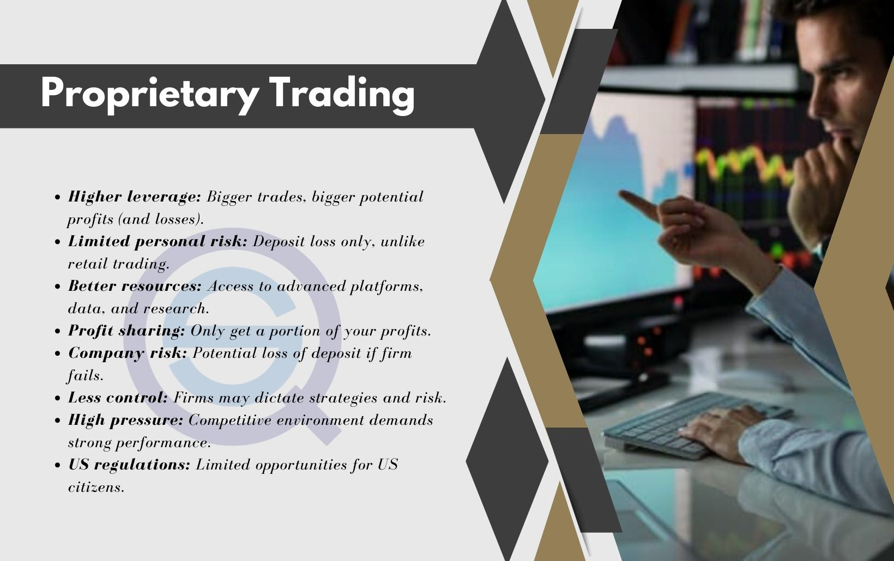

In an era where financial markets are being transformed by technology, proprietary trading firms, or prop firms, are spearheading this evolution. These entities employ their own capital to engage in trading various financial instruments with the primary objective of generating profits. Unlike traditional trading entities that may derive revenue from client transactions or advisory fees, prop firms focus on maximizing returns from their own trading activities. This focus provides them with greater flexibility in choosing trading strategies and tools.

A crucial component of these firms' operations is algorithmic trading, commonly referred to as algo trading. This method involves the use of sophisticated computer algorithms to automate trade executions at high speed and with exceptional precision. The automation not only facilitates rapid responses to market movements but also reduces the potential for human error, making the trading process more efficient.



Algo trading has revolutionized the trading landscape by allowing for the processing and analysis of massive data sets in milliseconds, enabling traders to capitalize on even minor market inefficiencies. Key benefits of algo trading include its speed, accuracy, and the capability to backtest trading strategies on historical data, ensuring robustness and effectiveness before live deployment.

This article explores the key roles played by proprietary trading firms and the strategies they employ, particularly focusing on algo trading. It also examines the broader impacts of these methods on today’s financial markets, highlighting both opportunities and potential challenges. As technology continues to drive financial market evolution, understanding these components becomes crucial for comprehending the current and future landscape of trading.

## Table of Contents

## Understanding Proprietary Trading Firms

Proprietary trading firms, often referred to as prop firms, engage in trading activities using their own capital rather than managing client funds. This self-financing model distinguishes them from traditional financial advisors or brokers who primarily earn through commissions or fees by handling client investments. By utilizing their own resources, proprietary trading firms focus on maximizing profits through strategic market participation.

A crucial advantage for these firms lies in their ability to develop and implement advanced trading strategies and technologies. By doing so, they gain a competitive edge over other market participants. This includes the use of algorithmic trading systems, which analyze market data and execute trades with precision and speed that surpass human capabilities.

Historically, proprietary trading has deep roots in early financial markets. The concept gained significant traction in the 1980s, spurred by deregulation policies that opened up markets for more diverse trading strategies and participants. These changes, coupled with advancements in electronic trading systems, revolutionized how prop firms operated, allowing for rapid trade execution and improved market access.

The strategic framework of proprietary trading firms often involves the development of sophisticated trading models that can analyze market trends and predict price movements. This enables these firms to capitalize on market inefficiencies and generate substantial returns. Their operational focus is typically on high-frequency trading, statistical [arbitrage](/wiki/arbitrage), and trend-following strategies, which require both technical expertise and technological infrastructure.

In summary, proprietary trading firms leverage their own capital, cutting-edge technology, and strategic ingenuity to excel in financial markets, distinguishing themselves from traditional financial service providers. Their evolution parallels key changes in the trading landscape, underscoring their integral role in the modern financial ecosystem.

## Algorithmic Trading: A Game Changer

Algorithmic trading, often referred to as algo trading, revolutionizes the way trades are executed in financial markets by using automated computer algorithms to perform trading decisions. This technological advancement allows for the rapid processing of vast amounts of market data, leading to the execution of trades at speeds that far exceed human capabilities. By leveraging these algorithms, traders can capitalize on market opportunities that arise in fractions of a second.

Within proprietary trading firms, algo trading is a pivotal tool for optimizing performance. It minimizes human error by strictly adhering to data-driven strategies, ensuring that decisions are made purely on the basis of quantitative analysis rather than emotional or subjective factors. This reliance on data enhances the consistency and reliability of trading outcomes, aligning them with the firm's strategic objectives.

One of the primary advantages of [algorithmic trading](/wiki/algorithmic-trading) is speed. Automated systems can execute trades instantaneously upon satisfying predefined criteria, offering a significant competitive advantage over traditional manual trading methods. This rapid execution is essential in today's markets, where price movements can be both swift and significant.

Accuracy is another key benefit. Algo trading systems execute trades with precise timing and prices, reducing the risk associated with delays or slippage, which commonly occurs in manual trading. This precision ensures that trades are conducted at optimal prices, which can result in better overall performance.

Moreover, algorithmic trading facilitates the ability to backtest strategies with historical data. By simulating trades on past market conditions, traders can evaluate the effectiveness of their algorithms before deploying them in live markets. This process enables the identification of potential issues and optimizes strategies for maximum profitability.

In summary, algorithmic trading is undeniably a game changer in the financial markets. Its ability to process data rapidly, execute trades with exceptional speed and accuracy, and offer [backtesting](/wiki/backtesting) capabilities makes it an indispensable component of modern trading operations, particularly for proprietary trading firms aiming to maintain an edge over their competitors.

## Types of Algorithmic Trading Strategies in Prop Firms

Proprietary trading firms utilize various algorithmic trading strategies, each designed to exploit specific market conditions and inefficiencies. These strategies are pivotal for firms to maximize profits while managing risks effectively.

**High-Frequency Trading (HFT)** is a prominent strategy that involves executing a large volume of trades at exceptionally high speeds. The primary objective is to capitalize on minute price discrepancies in highly liquid markets. HFT relies heavily on advanced technology and co-location services to minimize latency and maximize execution efficiency. By operating on exceedingly short timeframes, such as milliseconds or microseconds, HFT algorithms can arbitrage slight pricing differences before these discrepancies disappear. This method requires substantial computational power and robust infrastructure to effectively manage the rapid pace and sheer volume of transactions.

**Statistical Arbitrage** encompasses a range of strategies that use mathematical models to identify and exploit pricing inefficiencies between related financial instruments. These strategies are grounded in statistical analysis and rely on historical data to forecast price movements and correlations. For example, a stat-arb model might identify two correlated stocks that temporarily diverge in price. By going long on the underpriced asset and shorting the overpriced one, the algorithm aims to profit when the prices eventually converge. Central to this method is the continuous adjustment of positions based on new data inputs and model recalibrations, which demands robust algorithmic flexibility.

**Trend-Following Algorithms** focus on capturing and riding longer-term market trends. These strategies involve identifying upward or downward trends in price movements and opening positions that align with the observed trend direction. Trend-following relies on technical indicators such as moving averages, momentum oscillators, and other trend-based metrics to determine entry and exit points. Unlike HFT, trend-following strategies typically operate over longer time horizons, from days to weeks or even months, allowing traders to leverage sustained market momentum. The effectiveness of these algorithms is contingent upon accurate trend identification and the ability to withstand market volatility and noise.

These algorithmic strategies underscore the dynamic and technologically-driven nature of proprietary trading. The continuous evolution of these strategies reflects the necessity for firms to adapt to rapidly changing market conditions and maintain a competitive edge through innovation and systematic analysis.

## Challenges and Risks of Algorithmic Trading

Algorithmic trading, while advantageous in its speed and efficiency, presents several challenges and risks that must be carefully managed. One significant risk is the possibility of technical failures. These can result from hardware malfunctions, network connectivity issues, or software bugs. For instance, a sudden loss of connectivity could prevent an algorithm from executing trades at crucial moments, potentially leading to substantial financial losses. Moreover, coding errors within the algorithms could result in incorrect trading decisions, further exacerbating potential damages.

Market risks present another formidable challenge for algorithmic trading. Events like flash crashes, characterized by rapid and severe declines in market prices within a very short time frame, highlight the vulnerability of automated strategies to sudden market movements. An example is the infamous Flash Crash of May 6, 2010, where the Dow Jones Industrial Average plummeted nearly 1,000 points in minutes, only to recover rapidly. Algorithms must be equipped with sophisticated risk management protocols to mitigate such occurrences, ensuring that protective measures, such as circuit breakers or stop-loss orders, are in place to temper the impact of sudden swings. Additionally, [liquidity](/wiki/liquidity-risk-premium) shortages, which occur when there aren't enough market participants to absorb trades, can lead to increased [volatility](/wiki/volatility-trading-strategies) and execution uncertainty for high-frequency orders.

Overfitting is a further critical risk associated with algo trading. This occurs when a trading algorithm is excessively tuned to historical data, capturing noise rather than the underlying market pattern. Consequently, the model may perform exceptionally well during backtesting but fail to replicate such results in live markets. Overfitting is often addressed by employing techniques such as cross-validation and regularization during the model development process to ensure better generalization to new, unseen data.

To mitigate these risks, traders and firms often implement robust testing and validation frameworks. For example, a typical approach to detect overfitting involves splitting historical data into training and testing sets. Python’s `sklearn` library provides tools like `train_test_split` and various validation functions to facilitate this process:

```python
from sklearn.model_selection import train_test_split

# Example: Splitting data into training and testing sets
X_train, X_test, y_train, y_test = train_test_split(data, targets, test_size=0.2, random_state=42)
```

By employing such strategies, proprietary trading firms can enhance the resilience of their trading algorithms against various technical and market-related challenges, thereby safeguarding their operations and optimizing performance in live markets.

## Regulatory Environment and Compliance

The growing prevalence of algorithmic trading has heightened the focus of regulatory bodies on maintaining the integrity and stability of financial markets. In the United States, the Securities and Exchange Commission (SEC) and the Commodity Futures Trading Commission (CFTC) are the primary agencies responsible for monitoring and enforcing regulations related to algorithmic trading activities. These regulatory bodies ensure that trading practices do not compromise market integrity or expose investors to undue risks.

The Volcker Rule, a component of the Dodd-Frank Wall Street Reform and Consumer Protection Act, plays a crucial role in this regulatory landscape. This rule limits proprietary trading by restricting banks from making certain kinds of speculative investments that do not benefit their customers. Prop trading firms, while often independent of such banking restrictions, must still comply with various regulations intended to promote transparency and prevent market manipulation.

In addition to these regulations, firms engaged in algorithmic trading are required to implement robust compliance mechanisms to monitor their activities. This includes ensuring that algorithms are designed to avoid disruptive trading and that trading systems are resilient to technical failures or malicious attacks. The emphasis on accountability necessitates detailed record-keeping and audit trails to demonstrate compliance with regulatory requirements.

Authorities also mandate the use of pre-trade risk controls and post-trade surveillance to detect suspicious activities and mitigate risks associated with high-frequency trading and other algorithmic strategies. As algorithmic trading technologies evolve, regulatory frameworks must adapt to address emerging challenges, such as automated decision-making and the use of [artificial intelligence](/wiki/ai-artificial-intelligence) in trading systems.

In this dynamic regulatory environment, proprietary trading firms must stay agile, continuously updating their compliance strategies to meet evolving regulations and maintain their competitive advantage while ensuring fair and orderly markets.

## The Future of Algorithmic Trading in Proprietary Firms

Advancements in technology continue to shape the future of algorithmic trading within proprietary firms. A significant development is the integration of [machine learning](/wiki/machine-learning) and artificial intelligence (AI), which is expected to produce algorithms that can adapt dynamically to market conditions in real-time. These technologies enable the creation of predictive models that learn from historical data patterns and refine strategies automatically, offering improved decision-making capabilities. For example, [reinforcement learning](/wiki/reinforcement-learning), a subset of machine learning, can be utilized to train trading bots to optimize portfolios by balancing risk and return through continuous feedback.

Quantum computing is poised to transform trading landscapes by tackling computational challenges beyond the reach of classical computers. Quantum algorithms have the potential to solve optimization problems, such as portfolio optimization or arbitrage opportunities, at significantly faster rates. Quantum bits (qubits) allow simultaneous processing of multiple states, offering remarkable speed-ups in complex calculations. While quantum computers are still in early development stages, their potential influence on trading strategy is considerable.

As algorithmic trading evolves, proprietary firms must remain vigilant in updating their strategies and ensuring regulatory compliance. The rapid pace of technological change necessitates strong frameworks for risk management and ethical considerations in AI deployment. Adapting to new regulations, such as those concerning data privacy and market fairness, will be critical. Firms that successfully integrate cutting-edge technologies while navigating the regulatory landscape are likely to secure a strong competitive position in financial markets.

## Conclusion

Proprietary trading firms have strategically integrated algorithmic trading into their operations, significantly boosting both performance and profitability. This adoption offers clear advantages, including improved market liquidity and enhanced risk management capabilities. By automating trade executions, algorithmic trading allows firms to swiftly respond to market fluctuations, thereby optimizing their trading efficiency.

However, the sophisticated nature of algorithmic trading necessitates careful risk oversight and strict adherence to regulatory frameworks. The landscape is fraught with challenges such as technical glitches and market anomalies, which require robust risk management protocols. Compliance with regulatory standards is equally critical, as these measures are designed to uphold market integrity and protect investor interests.

Firms that incorporate emerging technologies, particularly artificial intelligence and quantum computing, are positioned to gain a substantial competitive advantage in the fast-paced financial markets. AI-driven algorithms offer adaptive capabilities, learning from market patterns to refine strategies in real-time. Meanwhile, quantum computing holds the potential to process vast datasets at unprecedented speeds, paving the way for more intricate and informed trading decisions.

As technology continues to advance and regulatory landscapes evolve, proprietary and algorithmic trading will undergo continuous transformation. Firms must remain agile, updating their strategies and systems to align with technological innovations and regulatory changes, thereby sustaining their edge in rapidly changing financial markets.

## References & Further Reading

[1]: Bergstra, J., Bardenet, R., Bengio, Y., & Kégl, B. (2011). ["Algorithms for Hyper-Parameter Optimization."](https://dl.acm.org/doi/10.5555/2986459.2986743) Advances in Neural Information Processing Systems 24.

[2]: ["Advances in Financial Machine Learning"](https://www.amazon.com/Advances-Financial-Machine-Learning-Marcos/dp/1119482089) by Marcos Lopez de Prado

[3]: ["Evidence-Based Technical Analysis: Applying the Scientific Method and Statistical Inference to Trading Signals"](https://www.amazon.com/Evidence-Based-Technical-Analysis-Scientific-Statistical/dp/0470008741) by David Aronson

[4]: ["Machine Learning for Algorithmic Trading"](https://books.google.com/books/about/Machine_Learning_for_Algorithmic_Trading.html?id=cki6zQEACAAJ) by Stefan Jansen

[5]: ["Quantitative Trading: How to Build Your Own Algorithmic Trading Business"](https://www.amazon.com/Quantitative-Trading-Build-Algorithmic-Business/dp/1119800064) by Ernest P. Chan