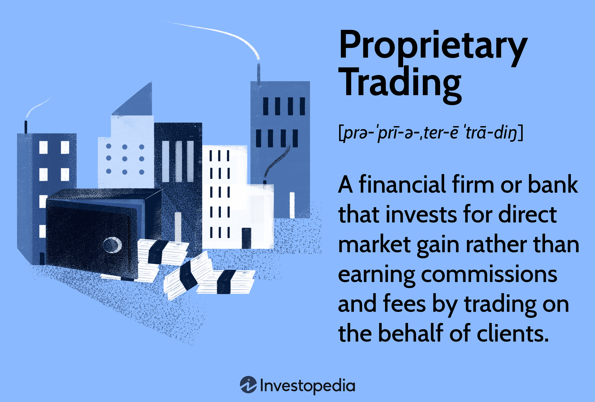

In the ever-evolving landscape of financial markets, trading firms have increasingly adopted sophisticated strategies to stay competitive and maximize their returns. Two such strategies, proprietary trading and algorithmic trading, have established themselves as key components in modern trading operations. Proprietary trading involves firms trading securities, currencies, or other financial instruments using their own capital in order to generate profit. By leveraging their own resources, proprietary trading desks aim to execute trades swiftly and exploit market inefficiencies for substantial returns.

On the other hand, algorithmic trading employs advanced computer algorithms to automatically execute trades based on pre-defined criteria. These algorithms analyze vast datasets to predict price movements and identify trading opportunities, executing trades with high speed and precision. The major benefit of algorithmic trading lies in its ability to minimize human intervention, thereby reducing emotional biases and enhancing decision-making.



This article investigates how these trading strategies operate and the benefits they bring to financial markets. By understanding these elements, traders and investors can effectively navigate the complexities of modern financial markets, leading to more informed and strategic decisions. Through proprietary and algorithmic trading, financial markets experience increased liquidity and efficiency, thereby supporting not only trading firms but also contributing to a robust and dynamic economic ecosystem.

## Table of Contents

## Overview of Financial Markets Trading Firms

Trading firms are integral components of the financial markets, conducting transactions to take advantage of the various opportunities these markets offer. They function as key market makers and liquidity providers, bridging the gap between buyers and sellers, ensuring that trade flows smoothly even in fluctuating conditions. By doing so, trading firms play a crucial part in maintaining market stability and efficiency.

The core strategies employed by trading firms include proprietary trading and algorithmic trading. Proprietary trading refers to firms using their own capital to invest in various assets, such as stocks, bonds, currencies, and commodities, aiming to earn substantial returns. This type of trading often involves advanced strategies like arbitrage—exploiting price differentials across markets—and long/short equity, where firms take long positions in undervalued stocks and short positions in overvalued ones.

Algorithmic trading, in contrast, capitalizes on complex algorithms and automated systems to execute trades at high speed and accuracy, based on predetermined criteria. These algorithms can analyze vast amounts of market data in real time, identifying patterns and executing trades faster than human traders ever could. The reduction in human intervention means that trades are less subject to emotional bias, often resulting in more rational decision-making processes.

The influence of trading firms on market [liquidity](/wiki/liquidity-risk-premium) and efficiency cannot be overstated. By constantly buying and selling, they contribute to smoother price discovery—the process of determining the appropriate price of an asset based on supply and demand dynamics. This action ensures that assets are accurately priced, which benefits investors by providing them with fair market conditions.

Additionally, trading firms are pivotal in enhancing market efficiency by arbitraging away discrepancies in asset prices between different markets. This action—often executed by both proprietary and [algorithmic trading](/wiki/algorithmic-trading) desks—helps in aligning prices across markets, minimizing mispricings and enabling a more streamlined market operation. Consequently, investors benefit from more consistent pricing and improved market conditions, facilitating better investment decisions.

In summary, financial markets trading firms are not only profit-generating entities but also vital contributors to the overall health and functionality of global financial markets. Their trading activities ensure liquidity, accuracy in price discovery, and market efficiency, crucial for the robust functioning of these markets.

## Proprietary Trading: Definition and Importance

Proprietary trading, often referred to as "prop trading," is a critical component of many financial firms' operations, where the firm trades securities, derivatives, and other financial instruments using its own capital resources, rather than executing trades on behalf of its clients. The primary objective of proprietary trading is to generate substantial profits through the firm's own trading strategies and expertise.

In proprietary trading, firms employ a diverse array of strategies to maximize returns and manage risk. One common strategy is [arbitrage](/wiki/arbitrage), which involves exploiting price discrepancies between different markets or instruments. For instance, if a security is priced differently in two separate markets, a trader could simultaneously buy at the lower price and sell at the higher price, locking in the difference as profit. This requires sophisticated technology and rapid transaction capabilities to successfully execute the trades before the market corrects the discrepancies.

Another prevalent strategy is long/short equity, where traders take long positions in stocks they expect to appreciate and short positions in those they anticipate will decline. This approach allows traders to capitalize on both upward and downward market movements, potentially enhancing returns while also providing a mechanism to hedge against broader market risks.

The significance of proprietary trading desks within financial firms lies in their agility and capacity to capitalize on market inefficiencies. These desks are typically staffed by highly skilled traders who possess a deep understanding of financial markets and utilize advanced analytical tools to identify opportunities. The ability to quickly react to market changes and implement innovative strategies sets proprietary trading apart from traditional trading practices.

Moreover, proprietary trading can influence market liquidity and efficiency. By actively participating in buying and selling activities, proprietary trading firms contribute to smoother market functioning and price discovery. They can absorb excess supply or demand, thereby stabilizing prices and providing liquidity, which benefits the overall market ecosystem.

However, proprietary trading is not without its challenges and risks. It involves substantial capital investment and carries the potential for significant losses, especially in volatile markets. Therefore, firms must implement robust risk management systems and continuously adapt their strategies to changing market conditions to maintain profitability.

Overall, proprietary trading remains an integral aspect of the financial markets, offering the potential for high returns and contributing to market dynamics through liquidity provision and price efficiency. As markets evolve and technology advances, proprietary trading strategies are likely to become even more sophisticated, necessitating ongoing innovation and adaptation by trading firms.

## Algorithmic Trading: Revolutionizing the Markets

Algorithmic trading utilizes computer algorithms to execute trades with high speed and precision based on pre-defined criteria. These algorithms monitor market data continuously to predict price movements and identify trading opportunities in real-time. By eliminating the need for human intervention, algorithmic trading reduces emotional biases that could affect trading decisions, ensuring a more systematic approach to buying or selling assets.

At the core of algorithmic trading is the ability to analyze large volumes of market data efficiently. Algorithms are programmed to follow specific instructions which can include conditions based on price, [volume](/wiki/volume-trading-strategy), timing, or any other quantitative [factor](/wiki/factor-investing). For example, a simple algorithm may be programmed to buy a stock when its 50-day moving average goes above the 200-day moving average, a common technical indicator known as the "Golden Cross."

```python
# Example code for moving average crossover strategy
import pandas as pd

def moving_average_strategy(prices, short_window, long_window):
    signals = pd.DataFrame(index=prices.index)
    signals['price'] = prices
    signals['short_mavg'] = prices.rolling(window=short_window, min_periods=1).mean()
    signals['long_mavg'] = prices.rolling(window=long_window, min_periods=1).mean()

    signals['signal'] = 0  # Default to 'no position'
    signals['signal'][short_window:] = np.where(
        signals['short_mavg'][short_window:] > signals['long_mavg'][short_window:], 1.0, 0.0
    )

    signals['positions'] = signals['signal'].diff()
    return signals

# Assume prices is a pandas Series with stock prices
# Example usage:
# signals = moving_average_strategy(prices, short_window=50, long_window=200)
```

Algorithmic trading strategies range from simple conditions like the moving average crossover to highly complex models involving [machine learning](/wiki/machine-learning) and statistical analysis. Machine learning allows for adaptive algorithms that improve over time by learning patterns from data, thus making more accurate predictions.

One of the significant benefits of algorithmic trading is its ability to process and react to market conditions faster than a human could, executing trades at speeds measured in milliseconds or even microseconds. This high-frequency trading ([HFT](/wiki/high-frequency-trading-strategies)) capability allows for arbitrage opportunities and other short-term strategies that would be impossible for manual traders.

Additionally, algorithmic trading enhances market liquidity and contributes to more efficient price discovery. By executing large numbers of small trades, algorithms help prevent significant price swings from single, large transactions. However, this landscape is not without challenges; algorithmic trading can contribute to increased market [volatility](/wiki/volatility-trading-strategies), as seen in events like the "Flash Crash" of 2010.

Despite these challenges, the continued development and refinement of algorithms, particularly through advancements such as [artificial intelligence](/wiki/ai-artificial-intelligence) and machine learning, promise to further revolutionize financial markets by enabling more sophisticated trading strategies and effective risk management.

## Comparing Proprietary Trading and Algorithmic Trading

In comparing proprietary trading and algorithmic trading, both strategies share a common objective of achieving high rewards, yet they diverge significantly in their approach and execution. Proprietary trading primarily depends on the expertise and intuitive judgment of traders who leverage their understanding of market dynamics and patterns. These traders employ creative strategies such as arbitrage, long/short equity, and other bespoke trade setups, providing them the flexibility to adapt to rapidly changing market conditions. This flexibility allows proprietary trading to explore unique opportunities and tailor trades to specific insights that a skilled trader might observe.

Conversely, algorithmic trading capitalizes on advancements in technology and data processing. It involves the use of computer algorithms designed to execute trades at speeds and frequencies beyond human capability. These algorithms follow pre-defined criteria, making decisions based on historical data analysis and real-time market information. This systematic approach is inherently replicable, allowing for consistency and the execution of trading strategies that are free from human emotion or fatigue.

The key differentiator between these two forms of trading lies in their execution and adaptability. Proprietary trading can quickly shift strategies based on a trader’s interpretation of market signals, while algorithmic trading offers precision and the ability to handle vast volumes of trades with minimal error. The reliance on technology in algorithmic trading allows for the [backtesting](/wiki/backtesting) of strategies over extensive data sets, optimizing the performance before live deployment. Python code, for instance, is frequently used to write these algorithms due to its robust libraries like `pandas` and `numpy` for data analysis and `scikit-learn` for predictive modeling.

Both strategies have their own set of advantages and challenges, and the choice between them often depends on the firm’s resources, risk appetite, and long-term strategic goals. While hedge funds and some financial institutions may prefer the strategic depth of proprietary trading, high-frequency trading firms and asset managers may opt for the consistent, data-driven approach of algorithmic trading. 

## Beneficial Impacts on the Market

Trading strategies such as proprietary trading and algorithmic trading play crucial roles in enhancing market liquidity and contributing to the efficient functioning of financial markets. These strategies are essential for price discovery, providing a foundation that benefits not only trading firms but also investors and the broader economic ecosystem.

Liquidity, a fundamental component of well-functioning markets, is significantly bolstered by the activities of trading firms. By engaging in proprietary trading, these firms buy and sell securities for their own accounts rather than on behalf of clients. This activity increases the number of transactions occurring in the market, leading to tighter bid-ask spreads and higher trading volumes. Such increased liquidity ensures that assets can be bought or sold with minimal impact on their price, reducing transaction costs for all market participants.

Algorithmic trading further enhances liquidity by enabling swift execution of trades. Algorithms operate based on pre-defined rules and criteria, executing trades at high speed and with precision. For instance, a simple algorithm might be programmed to buy a stock when its price falls below a certain threshold and sell when it exceeds a set price. This systematic approach not only injects liquidity into the market but also aids in stabilizing price movements, acting as a counterbalance to volatility.

Moreover, these trading strategies facilitate accurate price discovery, a crucial aspect of efficient market operation. Price discovery is the process by which markets determine the value of an asset based on supply and demand dynamics. Proprietary trading can uncover discrepancies in asset pricing due to market inefficiencies, while algorithmic trading can quickly assimilate and react to new information, adjusting prices to reflect the latest data. Both methods ensure that prices more accurately reflect the underlying value of securities, aiding investors in making informed decisions.

Efficient market operations are further enhanced as these trading strategies lead to more dynamic and adaptable financial systems. The increased liquidity and improved price discovery fostered by trading firms create a more resilient market infrastructure. This environment encourages greater participation by reducing risks associated with illiquid markets and unreliable pricing, benefiting individual investors, institutional players, and the global economy.

In summary, proprietary and algorithmic trading techniques provide substantial benefits to financial markets. They enhance liquidity, facilitate effective price discovery, and contribute to the efficiency of market operations. These elements are fundamental not only for the profitability of trading firms but also for maintaining the stability and robustness of financial markets, ultimately supporting economic growth and investor confidence.

## Challenges and Risks

Proprietary trading and algorithmic trading are integral to financial markets, but they come with their own set of challenges and risks. One of the primary risks is market volatility. Both trading strategies often involve high leverage and rapid trading execution, which can lead to considerable losses during volatile market conditions. During sudden market shifts, proprietary trading desks might struggle to liquidate positions without incurring losses, while algorithms might execute trades based on outdated data, leading to suboptimal results.

Moreover, regulatory challenges pose significant risks to trading firms. Regulatory bodies around the world are continually updating their frameworks to keep pace with the complexities of modern trading strategies. Compliance with regulations such as the Dodd-Frank Act in the United States or the Markets in Financial Instruments Directive (MiFID II) in the European Union requires firms to maintain transparency and adhere to stringent reporting standards. Non-compliance can lead to substantial penalties, impacting a firm’s profitability.

In addition to regulatory compliance, the fast-paced evolution of technology presents both a challenge and an opportunity. Firms need to innovate rapidly to maintain a competitive edge, which often involves significant investment in technology and talent. This constant pressure to innovate can strain resources and necessitate a strategic balance between innovation and risk management. Moreover, as algorithmic trading becomes more sophisticated, the importance of robust cybersecurity measures also increases, given the potential threat of cyber-attacks on trading algorithms and systems.

To manage these risks effectively, trading firms must implement comprehensive risk management frameworks. These frameworks often include stress testing for portfolio risks under various market scenarios, backtesting of trading algorithms to ensure robustness, and rigorous compliance checks to align with regulatory requirements. By focusing on innovation and managing these risks proactively, firms can navigate the complexities of proprietary and algorithmic trading to achieve sustainable success.

## Future Trends and Developments

Advancements in technology continue to reshape the landscape of financial trading, with artificial intelligence (AI) and machine learning (ML) standing at the forefront. These technologies are set to revolutionize trading strategies and risk management techniques in unprecedented ways.

AI and ML algorithms can process vast amounts of data with remarkable speed and precision, identifying patterns and trends that might elude human traders. For instance, machine learning models can predict asset price movements by analyzing historical data, market sentiment, economic indicators, and even geopolitical events. This predictive capability enhances decision-making and enables traders to exploit market opportunities more effectively.

The integration of AI into trading strategies allows for the development of autonomous trading systems that can execute trades with minimal human intervention. These systems continuously learn from new data, improving their accuracy and efficiency over time. An example of a simple machine learning model for predicting stock prices is the use of linear regression:

```python
from sklearn.linear_model import LinearRegression
import numpy as np

# Sample data: hypothetical historical stock prices
X = np.array([[1], [2], [3], [4], [5]])  # Time in days
y = np.array([10, 11, 12, 13, 14])  # Stock price

# Creating and training the model
model = LinearRegression().fit(X, y)

# Predicting future stock prices
future_time = np.array([[6]])  # Predicting for day 6
predicted_price = model.predict(future_time)
```

Beyond prediction, AI and ML are enhancing risk management practices. By analyzing real-time data and recognizing anomalies, these technologies can identify potential risks swiftly, allowing trading firms to mitigate losses. Techniques such as anomaly detection, using statistical methods or unsupervised learning algorithms, help in monitoring market conditions and alerting traders to irregular activities.

The future also holds promise for the use of neural networks, a subset of AI, which mimic the human brain's structure and workings. Deep learning, through neural networks, is particularly adept at handling non-linear and unstructured data, making it suitable for complex financial markets. For instance, recurrent neural networks (RNNs) and [long short](/wiki/equity-long-short)-term memory networks (LSTMs) are effective in processing sequential data and time series, which are common in financial analysis.

Furthermore, AI's ability to process natural language data, such as news articles, social media, and financial reports, amplifies its application scope. Natural language processing (NLP) techniques help traders gauge market sentiment and inform trading decisions. Sentiment analysis, an NLP application, allows for the assessment of public mood regarding a particular stock or market trend.

In conclusion, the integration of AI and ML in financial trading promises not only to refine existing strategies but also to introduce novel methodologies for market analysis and risk assessment. As these technologies continue to develop, they are expected to provide trading firms with powerful tools to maintain competitiveness and adapt to the ever-changing dynamics of global financial markets.

## Conclusion

Financial markets trading firms hold a crucial role in the contemporary economic landscape, predominantly through proprietary and algorithmic trading strategies. These strategies have been at the forefront of financial innovation, allowing firms to capitalize on market opportunities with efficiency and precision. Proprietary trading, with its reliance on in-depth market knowledge and human expertise, enables firms to leverage their capital to generate substantial returns. On the other hand, algorithmic trading employs sophisticated algorithms to execute trades, optimizing speed and accuracy while minimizing human error.

As technology and financial markets continue to advance, the evolution of these trading strategies is inevitable. Emerging technologies such as artificial intelligence (AI) and machine learning are set to further enhance the capabilities of trading algorithms, enabling the development of more nuanced strategies that can adapt to dynamic market conditions. Moreover, increased access to big data and advanced analytics will empower trading firms to improve risk management and decision-making processes.

However, with these advancements come significant challenges. Trading firms must navigate an increasingly intricate regulatory environment, ensuring compliance while maintaining competitive advantage. Additionally, the reliance on technology presents cybersecurity risks that firms must address proactively. The balance between innovation and risk management will determine the future success of these firms.

In conclusion, financial markets trading firms, leveraging proprietary and algorithmic trading methods, remain vital to market efficiency and liquidity. As they advance alongside technology, they will continue to play an essential role in shaping the financial ecosystem, offering both opportunities for profit and challenges that must be skillfully managed.

## References & Further Reading

[1]: Bergstra, J., Bardenet, R., Bengio, Y., & Kégl, B. (2011). ["Algorithms for Hyper-Parameter Optimization."](https://dl.acm.org/doi/10.5555/2986459.2986743) Advances in Neural Information Processing Systems 24.

[2]: ["Advances in Financial Machine Learning"](https://www.amazon.com/Advances-Financial-Machine-Learning-Marcos/dp/1119482089) by Marcos Lopez de Prado

[3]: ["Evidence-Based Technical Analysis: Applying the Scientific Method and Statistical Inference to Trading Signals"](https://www.amazon.com/Evidence-Based-Technical-Analysis-Scientific-Statistical/dp/0470008741) by David Aronson

[4]: ["Machine Learning for Algorithmic Trading"](https://github.com/stefan-jansen/machine-learning-for-trading) by Stefan Jansen

[5]: ["Quantitative Trading: How to Build Your Own Algorithmic Trading Business"](https://www.amazon.com/Quantitative-Trading-Build-Algorithmic-Business/dp/1119800064) by Ernest P. Chan